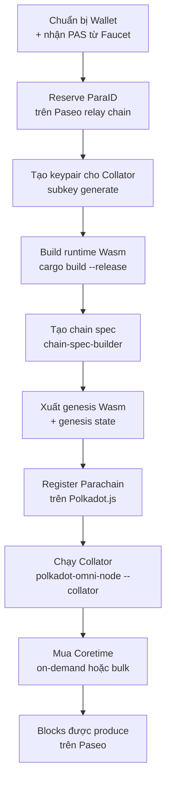

> **Prerequisites**: [[07-build-and-deploy-local|07. Build & Deploy Local]]
> **Objectives**:
> - Hiểu sự khác nhau giữa solochain và parachain, và giữa local dev và public testnet
> - Thực hiện đầy đủ quy trình deploy parachain lên Paseo testnet
> - Hiểu Coretime — cơ chế cấp phát tài nguyên của Polkadot
> - Thực hiện forkless runtime upgrade on-chain

---

## Paseo là gì?

**Paseo** là testnet công khai, ổn định của Polkadot — thay thế Rococo từ năm 2024. Đây là môi trường để kiểm tra parachain trước khi lên mainnet Polkadot/Kusama.

> [!definition] Definition 8.1 — Paseo vs local dev
>
> | | Local `--dev` | Paseo Testnet |
> |--|--------------|--------------|
> | Validators | Không có (manual seal) | Validators thực của Paseo |
> | Tokens | Không giá trị, tự sinh | PAS token (faucet) |
> | Coretime | Không cần | Cần mua/xin |
> | Uptime yêu cầu | Không | Collator phải online |
> | Mục đích | Phát triển nhanh | Kiểm thử gần production |

---

## Tổng quan quy trình Deploy



---

## Bước 1: Chuẩn bị Wallet và nhận PAS

### 1a. Cài Polkadot.js Extension

Truy cập https://polkadot.js.org/extension/ và cài extension cho trình duyệt.

### 1b. Tạo Account

Trong extension:
1. Click `+` → **Create new account**
2. Lưu mnemonic phrase an toàn
3. Đặt tên: `Paseo Deploy Account`

### 1c. Nhận PAS từ Faucet

Truy cập **https://faucet.polkadot.io/**:
1. Chọn network: **Paseo**
2. Paste địa chỉ account của bạn
3. Click **Get some PASs** → nhận 100 PAS/ngày

> [!warning] Giới hạn faucet
> Faucet cấp tối đa 100 PAS/ngày/địa chỉ. Để triển khai đầy đủ, bạn có thể cần nhiều ngày hoặc nhiều account. Nếu cần nhiều hơn, liên hệ kênh `#paseo-testnet-support` trên Matrix.

---

## Bước 2: Reserve ParaID

Mỗi parachain cần một định danh duy nhất (ParaID) trên relay chain.

1. Mở **https://polkadot.js.org/apps**
2. Kết nối đến **Paseo**: `wss://rpc.ibp.network/paseo`
3. Vào **Network** → **Parachains** → tab **Parathreads**
4. Click **+ ParaId**
5. Xác nhận transaction (tốn một ít PAS làm deposit)
6. Ghi lại ParaID được cấp (ví dụ: `4508`)

Kiểm tra event `registrar.Reserved` trong Explorer để xác nhận.

---

## Bước 3: Tạo Keypairs cho Collator

Collator cần hai loại key:

```bash
# Stash account — giữ stake
subkey generate --scheme sr25519
# Lưu lại: Secret phrase và SS58 Address

# Session key — ký block
subkey generate --scheme sr25519
# Lưu lại: Secret phrase và SS58 Address
```

> [!warning] Bảo mật key
> **Không bao giờ** dùng development keys (`//Alice`, `//Bob`) trên testnet/mainnet. Key bị lộ → mất quyền kiểm soát collator.

---

## Bước 4: Build Runtime Wasm

Đảm bảo pallet và runtime đã được cập nhật, sau đó build:

```bash
cargo build --release
```

File cần dùng:

```
target/release/wbuild/parachain-template-runtime/
    parachain_template_runtime.compact.compressed.wasm
```

---

## Bước 5: Tạo Chain Spec cho Paseo

```bash
# Tạo chain spec với ParaID đã reserve
chain-spec-builder create \
    -t development \
    --relay-chain paseo \
    --para-id YOUR_PARA_ID \
    --runtime ./target/release/wbuild/parachain-template-runtime/parachain_template_runtime.compact.compressed.wasm \
    named-preset development
```

Mở `chain_spec.json` và chỉnh sửa:

```json
{
  "name": "My Chain",
  "id": "my_chain",
  "protocolId": "my_chain_unique_protocol",
  "para_id": 4508,
  "relay_chain": "paseo",
  "genesis": {
    "runtimeGenesis": {
      "collatorSelection": {
        "invulnerables": ["SS58_ADDRESS_OF_YOUR_COLLATOR_SESSION_KEY"]
      },
      "session": {
        "keys": [
          ["STASH_SS58", "STASH_SS58", {"aura": "SESSION_KEY_SS58"}]
        ]
      },
      "sudo": {
        "key": "YOUR_ACCOUNT_SS58"
      },
      "balances": {
        "balances": [
          ["YOUR_ACCOUNT_SS58", 1000000000000000]
        ]
      }
    }
  }
}
```

Tạo raw chain spec (format nhị phân compact):

```bash
chain-spec-builder convert-to-raw chain_spec.json > raw_chain_spec.json
```

---

## Bước 6: Xuất Genesis Wasm và State

Paseo relay chain cần hai file để đăng ký parachain:

```bash
# Genesis Wasm — runtime bytecode tại block 0
polkadot-omni-node export-genesis-wasm \
    --chain raw_chain_spec.json \
    para-wasm

# Genesis State — state trie tại block 0
polkadot-omni-node export-genesis-head \
    --chain raw_chain_spec.json \
    para-state
```

---

## Bước 7: Đăng ký Parachain lên Paseo

Trong Polkadot.js Apps (kết nối Paseo):
1. **Developer** → **Extrinsics**
2. Chọn account của bạn
3. Pallet: `registrar` → Call: `register`
4. Nhập:
   - `id`: ParaID của bạn (ví dụ: `4508`)
   - `genesisHead`: Upload file `para-state`
   - `validationCode`: Upload file `para-wasm`
5. Submit và sign

Đợi ~2 giờ để parachain hoàn thành onboarding. Kiểm tra trạng thái ở **Network** → **Parachains**.

---

## Bước 8: Chạy Collator

### Tạo Node Key

```bash
polkadot-omni-node key generate-node-key \
    --base-path data \
    --chain raw_chain_spec.json
# Ghi lại peer ID được sinh ra
```

### Khởi động Collator

```bash
polkadot-omni-node --collator \
    --chain raw_chain_spec.json \
    --base-path data \
    --port 40333 \
    --rpc-port 8845 \
    --force-authoring \
    --node-key-file ./data/chains/custom/network/secret_ed25519 \
    -- \
    --sync warp \
    --chain paseo \
    --port 50343 \
    --rpc-port 9988
```

Giải thích flags:
- `--collator` → chạy ở mode collator (tạo block)
- `--force-authoring` → tạo block ngay cả khi không có transaction
- `-- --chain paseo` → phần sau `--` là config cho embedded relay chain node
- `--sync warp` → đồng bộ relay chain nhanh hơn qua warp sync

### Insert Session Key

```bash
curl -H "Content-Type: application/json" \
    -d '{"id":1, "jsonrpc":"2.0", "method":"author_insertKey", "params":["aura","YOUR_SESSION_KEY_MNEMONIC","YOUR_SESSION_KEY_PUBLIC"]}' \
    http://localhost:8845
```

---

## Bước 9: Lấy Coretime

Parachain cần **Coretime** — tài nguyên thực thi từ relay chain — để produce blocks.

> [!definition] Definition 8.2 — Coretime
> Coretime là "slot thời gian" mà relay chain validators dành để validate blocks của parachain. Không có coretime → parachain không produce được block dù collator đang chạy.
>
> Có hai loại:
> - **On-demand coretime**: trả tiền từng block một — phù hợp testing và low-volume
> - **Bulk coretime**: mua một "core" cho 28 ngày — phù hợp production

### On-demand Coretime (đơn giản nhất cho testing)

Trong Polkadot.js Apps (Paseo):
1. **Developer** → **Extrinsics**
2. Pallet: `onDemandAssignmentProvider` → Call: `placeOrderAllowDeath`
3. `maxAmount`: tối thiểu `1000000000000` (1 PAS)
4. `paraId`: ParaID của bạn
5. Submit

Sau vài giây, bạn sẽ thấy block đầu tiên của parachain được produce!

```
INFO tokio-runtime-worker substrate: [Parachain] ✨ Imported #1 (0xa075…10d6)
```

### Bulk Coretime (cho testing dài hạn)

Dùng **RegionX** marketplace: https://app.regionx.tech/?network=paseo

1. Kết nối wallet
2. Fund account trên Coretime Chain (dùng faucet chọn "Coretime (Paseo)")
3. Click **Purchase New Core**
4. Sau khi mua, assign core vào ParaID của bạn

---

## Bước 10: Forkless Runtime Upgrade

Đây là tính năng đặc biệt của Substrate — nâng cấp runtime mà không cần hard fork.

### Tại sao "forkless"?

Runtime là Wasm được lưu on-chain. Khi bạn muốn nâng cấp logic, bạn submit Wasm mới lên chain thông qua một extrinsic. Mọi node tự động load Wasm mới từ block tiếp theo — không có split chain, không cần restart.

**So sánh với Ethereum**: Để thay đổi logic Ethereum, bạn phải hard fork (toàn bộ node update software). Với Substrate, bạn chỉ cần một transaction.

### Thực hiện Runtime Upgrade

```bash
# Build runtime mới sau khi thay đổi code
cargo build --release

# Increment spec_version trong runtime/src/lib.rs trước:
# spec_version: 2,  // ← tăng lên từ 1
```

Trong Polkadot.js Apps:
1. **Developer** → **Extrinsics**
2. Account: Alice (sudo)
3. Pallet: `sudo` → Call: `sudoUncheckedWeight`
4. Bên trong: Pallet `system` → Call: `setCode`
5. `code`: Upload file `.compact.compressed.wasm` mới
6. Submit

Sau khi được include vào block, runtime mới có hiệu lực ngay lập tức.

---

## Solochain vs Parachain — Khi nào dùng gì?

Bài này dùng parachain template. Nhưng cũng có option dùng solochain:

| | Solochain | Parachain |
|--|-----------|----------|
| Kết nối Polkadot | Không | Có |
| Bảo mật | Tự lo validators | Mượn từ relay chain |
| Coretime | Không cần | Cần |
| XCM cross-chain | Không | Có |
| Phức tạp deploy | Đơn giản hơn | Phức tạp hơn |
| Dùng cho | Chain độc lập | Polkadot ecosystem |

Cho mục đích học tập và demo nhỏ, solochain template đơn giản hơn. Cho production Polkadot ecosystem, dùng parachain template.

---

## Summary / Key Takeaways

- **Paseo** = public testnet ổn định của Polkadot, dùng trước khi lên mainnet
- Quy trình 10 bước: faucet → reserve ParaID → build → chain spec → genesis export → register → collator → coretime
- **Coretime** = tài nguyên relay chain validator dành cho parachain — không có thì không produce block
- On-demand coretime = trả từng block (testing), bulk coretime = mua 28 ngày (production-like)
- **Forkless runtime upgrade**: submit Wasm mới qua sudo/governance → hiệu lực ngay, không cần hard fork
- Collator cần port công khai và session key được insert trước khi produce block
- Paseo parachain onboarding mất ~2 giờ sau khi register

---

## Resources Nhanh

| Resource | URL |
|---------|-----|
| Paseo Faucet | https://faucet.polkadot.io/ |
| Polkadot.js Apps (Paseo) | https://polkadot.js.org/apps/?rpc=wss://rpc.ibp.network/paseo |
| RegionX Coretime (Paseo) | https://app.regionx.tech/?network=paseo |
| Paseo Support (Matrix) | `#paseo-testnet-support:parity.io` |
| Deploy Tutorial | https://docs.polkadot.com/tutorials/polkadot-sdk/parachains/zero-to-hero/deploy-to-testnet/ |

---

## References

- Deploy on Paseo TestNet — https://docs.polkadot.com/tutorials/polkadot-sdk/parachains/zero-to-hero/deploy-to-testnet/
- Obtain Coretime — https://docs.polkadot.com/parachains/launch-a-parachain/obtain-coretime/
- Runtime Upgrades — https://docs.polkadot.com/tutorials/polkadot-sdk/parachains/zero-to-hero/runtime-upgrade/
- Paseo Network GitHub — https://github.com/paseo-network
- Parachain DevOps Guide — https://paritytech.github.io/devops-guide/guides/parachain_deployment.html
