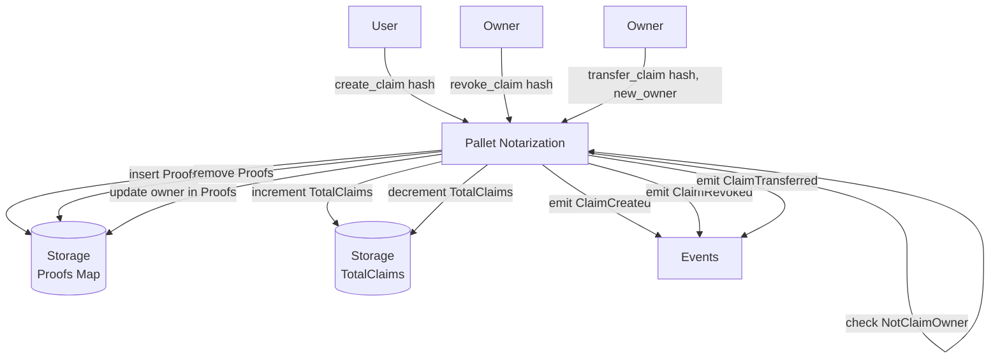

> **Prerequisites**: Tất cả lesson 01–08
> **Objectives**:
> - Xây pallet hoàn chỉnh từ đầu theo đúng quy trình học
> - Implement đủ 3 dispatchables: `create_claim`, `revoke_claim`, `transfer_claim`
> - Viết bộ test đầy đủ: happy path, error cases, events
> - Tích hợp vào parachain template và chạy local
> - Thực hành tương tác qua Polkadot.js Apps

---

## Mô tả Dự án

**Pallet Notarization** (công chứng số) cho phép người dùng:
1. **Tạo claim** — gửi hash của tài liệu lên chain, kèm timestamp + owner
2. **Revoke claim** — chủ sở hữu xóa claim của mình
3. **Transfer claim** — chuyển quyền sở hữu sang account khác

Đây là pattern **Proof of Existence** — chứng minh một tài liệu tồn tại tại một thời điểm cụ thể mà không cần upload toàn bộ nội dung. Ứng dụng thực tế: công chứng hợp đồng, bằng chứng IP, audit trail.

**So sánh với Ethereum**: Tương đương deploy một Solidity contract `ProofOfExistence`, nhưng logic của chúng ta nằm ở tầng runtime — không tốn gas EVM, weight rẻ hơn, type-safe hơn.

---

## Cấu trúc File Project

```
pallets/notarization/
├── Cargo.toml
└── src/
    ├── lib.rs        ← pallet chính
    ├── mock.rs       ← mock runtime cho test
    └── tests.rs      ← test cases
```

---

## Phần 1: `Cargo.toml`

```toml
[package]
name = "pallet-notarization"
version = "0.1.0"
edition = "2021"
description = "A simple proof-of-existence notarization pallet"

[dependencies]
codec = { package = "parity-scale-codec", version = "3", default-features = false, features = ["derive"] }
scale-info = { version = "2", default-features = false, features = ["derive"] }
frame-support = { default-features = false, workspace = true }
frame-system = { default-features = false, workspace = true }

[dev-dependencies]
sp-io = { workspace = true }
sp-runtime = { workspace = true }

[features]
default = ["std"]
std = [
    "codec/std",
    "scale-info/std",
    "frame-support/std",
    "frame-system/std",
]
```

---

## Phần 2: `lib.rs` — Pallet Hoàn chỉnh

```rust
#![cfg_attr(not(feature = "std"), no_std)]

pub use pallet::*;

#[cfg(test)]
mod mock;

#[cfg(test)]
mod tests;

#[frame_support::pallet]
pub mod pallet {
    use frame_support::pallet_prelude::*;
    use frame_system::pallet_prelude::*;

    // -------------------------------------------------------------------------
    // Pallet struct
    // -------------------------------------------------------------------------

    #[pallet::pallet]
    pub struct Pallet<T>(_);

    // -------------------------------------------------------------------------
    // Config trait
    // -------------------------------------------------------------------------

    #[pallet::config]
    pub trait Config: frame_system::Config {
        /// Kiểu event chung của runtime.
        type RuntimeEvent: From<Event<Self>>
            + IsType<<Self as frame_system::Config>::RuntimeEvent>;

        /// Kích thước tối đa của hash tài liệu (bytes).
        #[pallet::constant]
        type MaxClaimSize: Get<u32>;
    }

    // -------------------------------------------------------------------------
    // Storage
    // -------------------------------------------------------------------------

    /// Map: hash tài liệu -> (owner, block_number tạo).
    #[pallet::storage]
    pub type Proofs<T: Config> = StorageMap<
        _,
        Blake2_128Concat,
        BoundedVec<u8, T::MaxClaimSize>,
        (T::AccountId, BlockNumberFor<T>),
        OptionQuery,
    >;

    /// Tổng số claims đang tồn tại trên chain.
    #[pallet::storage]
    pub type TotalClaims<T> = StorageValue<_, u64, ValueQuery>;

    // -------------------------------------------------------------------------
    // Events
    // -------------------------------------------------------------------------

    #[pallet::event]
    #[pallet::generate_deposit(pub(super) fn deposit_event)]
    pub enum Event<T: Config> {
        /// Claim mới được tạo.
        ClaimCreated {
            owner: T::AccountId,
            claim: BoundedVec<u8, T::MaxClaimSize>,
            block_number: BlockNumberFor<T>,
        },
        /// Claim bị thu hồi.
        ClaimRevoked {
            owner: T::AccountId,
            claim: BoundedVec<u8, T::MaxClaimSize>,
        },
        /// Quyền sở hữu claim được chuyển.
        ClaimTransferred {
            from: T::AccountId,
            to: T::AccountId,
            claim: BoundedVec<u8, T::MaxClaimSize>,
        },
    }

    // -------------------------------------------------------------------------
    // Errors
    // -------------------------------------------------------------------------

    #[pallet::error]
    pub enum Error<T> {
        /// Claim đã tồn tại trên chain.
        ClaimAlreadyExists,
        /// Claim không tồn tại.
        ClaimNotFound,
        /// Người gọi không phải chủ sở hữu claim.
        NotClaimOwner,
        /// Không thể chuyển claim cho chính mình.
        TransferToSelf,
    }

    // -------------------------------------------------------------------------
    // Dispatchables
    // -------------------------------------------------------------------------

    #[pallet::call]
    impl<T: Config> Pallet<T> {
        /// Tạo một claim mới cho hash tài liệu.
        ///
        /// Emits `ClaimCreated` khi thành công.
        #[pallet::call_index(0)]
        #[pallet::weight(Weight::from_parts(10_000, 64) + T::DbWeight::get().writes(2))]
        pub fn create_claim(
            origin: OriginFor<T>,
            claim: BoundedVec<u8, T::MaxClaimSize>,
        ) -> DispatchResult {
            // 1. Origin
            let sender = ensure_signed(origin)?;

            // 2. Validate
            ensure!(!Proofs::<T>::contains_key(&claim), Error::<T>::ClaimAlreadyExists);

            // 3. Compute
            let block_number = frame_system::Pallet::<T>::block_number();

            // 4. Mutate state
            Proofs::<T>::insert(&claim, (sender.clone(), block_number));
            TotalClaims::<T>::mutate(|n| *n = n.saturating_add(1));

            // 5. Event
            Self::deposit_event(Event::ClaimCreated {
                owner: sender,
                claim,
                block_number,
            });

            Ok(())
        }

        /// Thu hồi một claim. Chỉ chủ sở hữu mới có thể thực hiện.
        ///
        /// Emits `ClaimRevoked` khi thành công.
        #[pallet::call_index(1)]
        #[pallet::weight(Weight::from_parts(10_000, 64) + T::DbWeight::get().reads_writes(1, 2))]
        pub fn revoke_claim(
            origin: OriginFor<T>,
            claim: BoundedVec<u8, T::MaxClaimSize>,
        ) -> DispatchResult {
            // 1. Origin
            let sender = ensure_signed(origin)?;

            // 2. Validate: claim phải tồn tại và sender phải là owner
            let (owner, _) = Proofs::<T>::get(&claim).ok_or(Error::<T>::ClaimNotFound)?;
            ensure!(owner == sender, Error::<T>::NotClaimOwner);

            // 4. Mutate state
            Proofs::<T>::remove(&claim);
            TotalClaims::<T>::mutate(|n| *n = n.saturating_sub(1));

            // 5. Event
            Self::deposit_event(Event::ClaimRevoked { owner: sender, claim });

            Ok(())
        }

        /// Chuyển quyền sở hữu claim sang account khác.
        ///
        /// Emits `ClaimTransferred` khi thành công.
        #[pallet::call_index(2)]
        #[pallet::weight(Weight::from_parts(10_000, 64) + T::DbWeight::get().reads_writes(1, 1))]
        pub fn transfer_claim(
            origin: OriginFor<T>,
            claim: BoundedVec<u8, T::MaxClaimSize>,
            new_owner: T::AccountId,
        ) -> DispatchResult {
            // 1. Origin
            let sender = ensure_signed(origin)?;

            // 2. Validate
            ensure!(sender != new_owner, Error::<T>::TransferToSelf);
            let (owner, block_number) =
                Proofs::<T>::get(&claim).ok_or(Error::<T>::ClaimNotFound)?;
            ensure!(owner == sender, Error::<T>::NotClaimOwner);

            // 4. Mutate — giữ nguyên block_number gốc, chỉ đổi owner
            Proofs::<T>::insert(&claim, (new_owner.clone(), block_number));

            // 5. Event
            Self::deposit_event(Event::ClaimTransferred {
                from: sender,
                to: new_owner,
                claim,
            });

            Ok(())
        }
    }

    // -------------------------------------------------------------------------
    // Helper: query tiện lợi (có thể gọi từ RPC hoặc pallet khác)
    // -------------------------------------------------------------------------

    impl<T: Config> Pallet<T> {
        /// Trả về thông tin claim nếu tồn tại.
        pub fn get_claim(
            claim: &BoundedVec<u8, T::MaxClaimSize>,
        ) -> Option<(T::AccountId, BlockNumberFor<T>)> {
            Proofs::<T>::get(claim)
        }

        /// Kiểm tra hash có được claim bởi một owner cụ thể không.
        pub fn is_owned_by(
            claim: &BoundedVec<u8, T::MaxClaimSize>,
            owner: &T::AccountId,
        ) -> bool {
            Proofs::<T>::get(claim)
                .map(|(o, _)| o == *owner)
                .unwrap_or(false)
        }
    }
}
```

---

## Phần 3: `mock.rs` — Mock Runtime

```rust
use crate as pallet_notarization;
use frame_support::{derive_impl, traits::ConstU32};
use sp_runtime::BuildStorage;

type Block = frame_system::mocking::MockBlock<Test>;

frame_support::construct_runtime!(
    pub enum Test {
        System: frame_system,
        Notarization: pallet_notarization,
    }
);

#[derive_impl(frame_system::config_preludes::TestDefaultConfig)]
impl frame_system::Config for Test {
    type Block = Block;
}

impl pallet_notarization::Config for Test {
    type RuntimeEvent = RuntimeEvent;
    type MaxClaimSize = ConstU32<64>;
}

pub fn new_test_ext() -> sp_io::TestExternalities {
    let t = frame_system::GenesisConfig::<Test>::default()
        .build_storage()
        .unwrap();
    let mut ext = sp_io::TestExternalities::new(t);
    ext.execute_with(|| System::set_block_number(1));
    ext
}
```

---

## Phần 4: `tests.rs` — Bộ Test Đầy Đủ

```rust
use super::*;
use crate::mock::*;
use frame_support::{assert_noop, assert_ok};

// Helper tạo BoundedVec từ bytes
fn make_claim(data: &[u8]) -> BoundedVec<u8, <Test as Config>::MaxClaimSize> {
    BoundedVec::try_from(data.to_vec()).expect("claim quá dài")
}

// =============================================================================
// create_claim
// =============================================================================

#[test]
fn create_claim_works() {
    new_test_ext().execute_with(|| {
        let claim = make_claim(b"sha256:abcdef1234567890");

        // N: claim chưa tồn tại → revoke phải fail
        assert_noop!(
            Notarization::revoke_claim(RuntimeOrigin::signed(1), claim.clone()),
            Error::<Test>::ClaimNotFound
        );

        // O: tạo claim thành công
        assert_ok!(Notarization::create_claim(RuntimeOrigin::signed(1), claim.clone()));

        // E: storage đúng
        let block = System::block_number();
        assert_eq!(Proofs::<Test>::get(&claim), Some((1u64, block)));
        assert_eq!(TotalClaims::<Test>::get(), 1u64);
    });
}

#[test]
fn create_claim_duplicate_fails() {
    new_test_ext().execute_with(|| {
        let claim = make_claim(b"sha256:duplicate");
        assert_ok!(Notarization::create_claim(RuntimeOrigin::signed(1), claim.clone()));
        assert_noop!(
            Notarization::create_claim(RuntimeOrigin::signed(2), claim),
            Error::<Test>::ClaimAlreadyExists
        );
    });
}

#[test]
fn create_claim_emits_event() {
    new_test_ext().execute_with(|| {
        let claim = make_claim(b"sha256:event_test");
        assert_ok!(Notarization::create_claim(RuntimeOrigin::signed(1), claim.clone()));
        System::assert_last_event(
            Event::ClaimCreated {
                owner: 1u64,
                claim,
                block_number: 1u64,
            }
            .into(),
        );
    });
}

#[test]
fn create_claim_unsigned_fails() {
    new_test_ext().execute_with(|| {
        let claim = make_claim(b"sha256:unsigned");
        assert_noop!(
            Notarization::create_claim(RuntimeOrigin::none(), claim),
            DispatchError::BadOrigin
        );
    });
}

// =============================================================================
// revoke_claim
// =============================================================================

#[test]
fn revoke_claim_works() {
    new_test_ext().execute_with(|| {
        let claim = make_claim(b"sha256:revoke_test");
        assert_ok!(Notarization::create_claim(RuntimeOrigin::signed(1), claim.clone()));
        assert_ok!(Notarization::revoke_claim(RuntimeOrigin::signed(1), claim.clone()));

        // Storage đã xóa
        assert_eq!(Proofs::<Test>::get(&claim), None);
        assert_eq!(TotalClaims::<Test>::get(), 0u64);
    });
}

#[test]
fn revoke_claim_not_owner_fails() {
    new_test_ext().execute_with(|| {
        let claim = make_claim(b"sha256:not_owner");
        assert_ok!(Notarization::create_claim(RuntimeOrigin::signed(1), claim.clone()));
        assert_noop!(
            Notarization::revoke_claim(RuntimeOrigin::signed(2), claim),
            Error::<Test>::NotClaimOwner
        );
    });
}

#[test]
fn revoke_nonexistent_claim_fails() {
    new_test_ext().execute_with(|| {
        let claim = make_claim(b"sha256:nonexistent");
        assert_noop!(
            Notarization::revoke_claim(RuntimeOrigin::signed(1), claim),
            Error::<Test>::ClaimNotFound
        );
    });
}

#[test]
fn revoke_claim_emits_event() {
    new_test_ext().execute_with(|| {
        let claim = make_claim(b"sha256:revoke_event");
        assert_ok!(Notarization::create_claim(RuntimeOrigin::signed(1), claim.clone()));
        assert_ok!(Notarization::revoke_claim(RuntimeOrigin::signed(1), claim.clone()));
        System::assert_last_event(
            Event::ClaimRevoked { owner: 1u64, claim }.into()
        );
    });
}

// =============================================================================
// transfer_claim
// =============================================================================

#[test]
fn transfer_claim_works() {
    new_test_ext().execute_with(|| {
        let claim = make_claim(b"sha256:transfer_test");
        assert_ok!(Notarization::create_claim(RuntimeOrigin::signed(1), claim.clone()));

        // Transfer từ account 1 sang account 2
        assert_ok!(Notarization::transfer_claim(
            RuntimeOrigin::signed(1),
            claim.clone(),
            2u64
        ));

        // Account 2 bây giờ là owner, block_number không đổi
        assert_eq!(Proofs::<Test>::get(&claim), Some((2u64, 1u64)));
    });
}

#[test]
fn transfer_to_self_fails() {
    new_test_ext().execute_with(|| {
        let claim = make_claim(b"sha256:self_transfer");
        assert_ok!(Notarization::create_claim(RuntimeOrigin::signed(1), claim.clone()));
        assert_noop!(
            Notarization::transfer_claim(RuntimeOrigin::signed(1), claim, 1u64),
            Error::<Test>::TransferToSelf
        );
    });
}

#[test]
fn transfer_not_owner_fails() {
    new_test_ext().execute_with(|| {
        let claim = make_claim(b"sha256:transfer_noauth");
        assert_ok!(Notarization::create_claim(RuntimeOrigin::signed(1), claim.clone()));
        assert_noop!(
            Notarization::transfer_claim(RuntimeOrigin::signed(2), claim, 3u64),
            Error::<Test>::NotClaimOwner
        );
    });
}

#[test]
fn transfer_claim_emits_event() {
    new_test_ext().execute_with(|| {
        let claim = make_claim(b"sha256:transfer_event");
        assert_ok!(Notarization::create_claim(RuntimeOrigin::signed(1), claim.clone()));
        assert_ok!(Notarization::transfer_claim(
            RuntimeOrigin::signed(1),
            claim.clone(),
            2u64
        ));
        System::assert_last_event(
            Event::ClaimTransferred { from: 1u64, to: 2u64, claim }.into()
        );
    });
}

// =============================================================================
// Helper functions
// =============================================================================

#[test]
fn get_claim_helper_works() {
    new_test_ext().execute_with(|| {
        let claim = make_claim(b"sha256:helper_test");
        assert_eq!(Notarization::get_claim(&claim), None);
        assert_ok!(Notarization::create_claim(RuntimeOrigin::signed(1), claim.clone()));
        assert!(Notarization::get_claim(&claim).is_some());
        assert!(Notarization::is_owned_by(&claim, &1u64));
        assert!(!Notarization::is_owned_by(&claim, &2u64));
    });
}

// =============================================================================
// Counter integration
// =============================================================================

#[test]
fn total_claims_counter_accurate() {
    new_test_ext().execute_with(|| {
        let c1 = make_claim(b"sha256:c1");
        let c2 = make_claim(b"sha256:c2");
        let c3 = make_claim(b"sha256:c3");

        assert_eq!(TotalClaims::<Test>::get(), 0);
        assert_ok!(Notarization::create_claim(RuntimeOrigin::signed(1), c1.clone()));
        assert_eq!(TotalClaims::<Test>::get(), 1);
        assert_ok!(Notarization::create_claim(RuntimeOrigin::signed(1), c2));
        assert_eq!(TotalClaims::<Test>::get(), 2);
        assert_ok!(Notarization::create_claim(RuntimeOrigin::signed(2), c3.clone()));
        assert_eq!(TotalClaims::<Test>::get(), 3);

        assert_ok!(Notarization::revoke_claim(RuntimeOrigin::signed(1), c1));
        assert_eq!(TotalClaims::<Test>::get(), 2);
        assert_ok!(Notarization::revoke_claim(RuntimeOrigin::signed(2), c3));
        assert_eq!(TotalClaims::<Test>::get(), 1);
    });
}
```

---

## Phần 5: Chạy Tests

```bash
cargo test -p pallet-notarization

# Output mong đợi:
# running 14 tests
# test tests::create_claim_works ... ok
# test tests::create_claim_duplicate_fails ... ok
# test tests::create_claim_emits_event ... ok
# test tests::create_claim_unsigned_fails ... ok
# test tests::revoke_claim_works ... ok
# test tests::revoke_claim_not_owner_fails ... ok
# test tests::revoke_nonexistent_claim_fails ... ok
# test tests::revoke_claim_emits_event ... ok
# test tests::transfer_claim_works ... ok
# test tests::transfer_to_self_fails ... ok
# test tests::transfer_not_owner_fails ... ok
# test tests::transfer_claim_emits_event ... ok
# test tests::get_claim_helper_works ... ok
# test tests::total_claims_counter_accurate ... ok
# test result: ok. 14 passed; 0 failed
```

---

## Phần 6: Tích hợp vào Parachain Template

### Workspace `Cargo.toml`

```toml
[workspace]
members = [
    "pallets/template",
    "pallets/notarization",  # ← thêm
    "runtime",
]
```

### `runtime/Cargo.toml`

```toml
[dependencies]
pallet-notarization = { path = "../pallets/notarization", default-features = false }

[features]
std = [
    "pallet-notarization/std",
]
```

### `runtime/src/lib.rs`

```rust
#[runtime::pallet_index(10)]
pub type Notarization = pallet_notarization;
```

### `runtime/src/configs/mod.rs`

```rust
impl pallet_notarization::Config for Runtime {
    type RuntimeEvent = RuntimeEvent;
    type MaxClaimSize = ConstU32<256>;
}
```

---

## Phần 7: Build và Chạy Local

```bash
# Build
cargo build --release

# Tạo chain spec
chain-spec-builder create \
    -t development \
    --relay-chain paseo \
    --para-id 1000 \
    --runtime ./target/release/wbuild/parachain-template-runtime/parachain_template_runtime.compact.compressed.wasm \
    named-preset development

# Chạy node
polkadot-omni-node --chain ./chain_spec.json --dev
```

---

## Phần 8: Tương tác qua Polkadot.js Apps

Mở `https://polkadot.js.org/apps` → Local Node (`ws://127.0.0.1:9944`)

### Tạo một Claim

1. **Developer** → **Extrinsics**
2. Account: **Alice**
3. Pallet: `notarization` → Call: `createClaim`
4. Nhập `claim`: `0x736861323536 3a 6162636465663132333435363738` (hex của `sha256:abcdef12345678`)
5. Click **Submit Transaction**

Sau khi submit, kiểm tra event `notarization.ClaimCreated` trong Explorer.

### Đọc thông tin Claim

1. **Developer** → **Chain state**
2. Pallet: `notarization` → Storage: `proofs`
3. Nhập key (BoundedVec bytes của claim)
4. Click `+` → kết quả: `(AccountId, BlockNumber)`

### Revoke Claim

1. **Developer** → **Extrinsics**
2. Account: **Alice** (phải là owner)
3. Pallet: `notarization` → Call: `revokeClaim`
4. Nhập claim hash như trên
5. Submit

---

## Sơ đồ luồng đầy đủ



---

## Mở rộng có thể thêm sau

Sau khi nắm vững pallet cơ bản, có thể extend thêm các tính năng:

- **Expiry**: claim tự động expire sau N block — dùng `on_initialize` hook
- **Fee**: yêu cầu lock token khi tạo claim — dùng `T::Currency` trait
- **Metadata**: lưu thêm tên file, MIME type — dùng thêm `StorageDoubleMap` hoặc struct
- **Batch**: tạo nhiều claim trong một extrinsic — dùng `Vec<BoundedVec<...>>`
- **Governance**: chỉ Root có thể xóa claim của bất kỳ ai — thêm `ensure_root` variant

---

## Summary / Key Takeaways

Pallet Notarization này tổng hợp toàn bộ kiến thức trong khóa học:

| Concept | Áp dụng ở đâu |
|---------|--------------|
| `#[pallet::config]` + `BoundedVec` | `MaxClaimSize` constant, kiểu claim |
| `StorageMap` + `StorageValue` | `Proofs` map và `TotalClaims` counter |
| `OptionQuery` + `ok_or` | `get(&claim).ok_or(Error::ClaimNotFound)` |
| `ensure_signed` + `ensure!` | Origin check + owner validation |
| `checked` / `saturating` arithmetic | `saturating_add/sub` cho counter |
| `#[pallet::event]` + `deposit_event` | 3 events với named fields |
| `#[pallet::error]` | 4 error variants rõ ràng |
| `#[pallet::weight]` | Weight estimate per-call |
| Mock runtime + NOE-Rule | 14 tests coverage đầy đủ |
| `construct_runtime!` + impl Config | Tích hợp vào parachain template |

---

## References

- Proof of Existence Tutorial — https://docs.substrate.io/tutorials/build-application-logic/
- Make a Custom Pallet — https://docs.polkadot.com/develop/parachains/customize-parachain/make-custom-pallet/
- Build a Custom Pallet (Zero to Hero) — https://docs.polkadot.com/tutorials/polkadot-sdk/parachains/zero-to-hero/build-custom-pallet/
