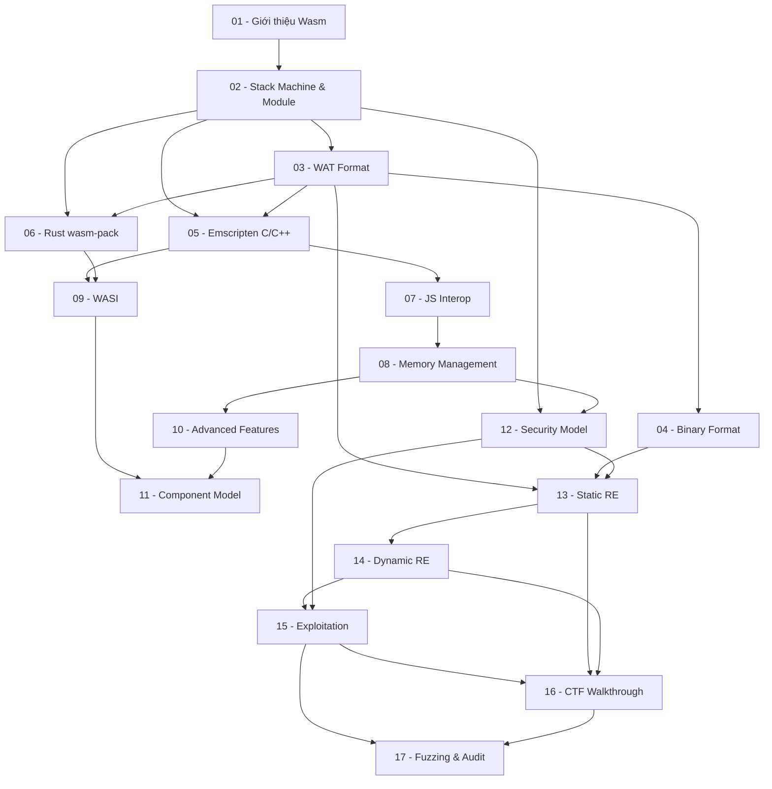

> **Topic**: WebAssembly (Wasm)
> **Domain**: IT / Coding + Security (Hybrid)
> **Level**: Beginner → Advanced + Security/CTF
> **Background**: JavaScript/TypeScript, C/C++, Rust, Python
> **Tools / Code**: Emscripten, wasm-pack, WABT, wasmtime, Chrome DevTools
> **Sources**: WebAssembly spec (webassembly.github.io), MDN Web Docs, Lin Clark's blog, FuzzingLabs, WABT docs

---

## Lessons

| # | Title | Key Concepts | Prerequisites | Difficulty |
|---|-------|-------------|---------------|------------|
| 01 | Giới thiệu WebAssembly | Lịch sử web, vì sao Wasm ra đời, so sánh vs JS, use cases | — | ★ |
| 02 | Kiến trúc Wasm — Stack Machine & Module | Stack machine model, cấu trúc module, các section, execution model | 01 | ★★ |
| 03 | WebAssembly Text Format (WAT) | Syntax WAT, viết hàm tay, kiểu dữ liệu, control flow, import/export | 02 | ★★ |
| 04 | Binary Format & Encoding | Magic bytes, cấu trúc binary, LEB128, đọc hex dump .wasm | 03 | ★★★ |
| 05 | Emscripten — Biên dịch C/C++ → Wasm | Cài Emscripten, compile workflow, Module object, glue code JS | 02, 03 | ★★ |
| 06 | Rust + wasm-pack | wasm-bindgen, `#[wasm_bindgen]`, publish npm package từ Rust | 02, 03 | ★★ |
| 07 | JavaScript ↔ Wasm Interop | WebAssembly JS API, truyền dữ liệu qua shared memory, string encoding | 05 | ★★★ |
| 08 | Memory Management trong Wasm | Linear memory, heap vs stack layout, `memory.grow`, con trỏ | 07 | ★★★ |
| 09 | WASI — Wasm ngoài Trình duyệt | WebAssembly System Interface, wasmtime/wasmer, syscall abstraction | 05, 06 | ★★ |
| 10 | Advanced Wasm Features | Threads & Atomics, SIMD, Reference Types, Multi-value returns | 08 | ★★★★ |
| 11 | Wasm Component Model & Cloud Native | Component Model spec, WASI Preview 2, Wasm trong Kubernetes | 09, 10 | ★★★★ |
| 12 | Wasm Security Model | Sandbox model, CFI, isolation guarantees, so sánh vs native | 02, 08 | ★★★ |
| 13 | Reverse Engineering Wasm — Static Analysis | WABT toolkit, Ghidra Wasm plugin, JEB decompiler, đọc WAT từ binary | 03, 04, 12 | ★★★ |
| 14 | Reverse Engineering Wasm — Dynamic Analysis | Chrome DevTools debugger, breakpoints trong Wasm, đọc/ghi linear memory | 13 | ★★★ |
| 15 | Wasm Exploitation | Buffer overflow trong linear memory, code reuse qua `call_indirect`, timing attacks | 12, 13, 14 | ★★★★★ |
| 16 | CTF Walkthrough — Wasm Reverse | 2–3 CTF thực tế (HackPack 2023, b01lersCTF, Chang'an Cup), full giải step-by-step | 13, 14, 15 | ★★★★ |
| 17 | Kiểm thử bảo mật & Fuzzing Wasm | Audit Wasm module, mutation fuzzing, tìm lỗi trong Wasm VM, checklist audit | 15, 16 | ★★★★★ |

## Appendix Candidates

| ID | Content | Related Lesson | Notes |
|----|---------|----------------|-------|
| A0 | WABT Toolkit Reference | 13 | Cheat sheet tất cả lệnh WABT: `wasm2wat`, `wat2wasm`, `wasm2c`, `wasm-objdump`, `wasm-strip` |
| A1 | WAT Instruction Reference | 03, 04 | Bảng tra cứu toàn bộ instruction: numeric, memory, control, parametric |
| A2 | Binary Format Reference | 04 | Chi tiết section-by-section binary encoding, LEB128 examples, hex walkthrough |
| A3 | CTF Solve Scripts | 16 | Tổng hợp Python/JS scripts giải CTF Wasm |

---

## Dependency Graph

---

## Progress Tracker

- [ ] [[00-roadmap|00. Roadmap]]
- [ ] [[01-gioi-thieu-webassembly|01. Giới thiệu WebAssembly]]
- [ ] [[02-kien-truc-wasm-stack-machine|02. Kiến trúc Wasm — Stack Machine & Module]]
- [ ] [[03-webassembly-text-format|03. WebAssembly Text Format (WAT)]]
- [ ] [[04-binary-format-va-encoding|04. Binary Format & Encoding]]
- [ ] [[05-emscripten-bien-dich-c-cpp|05. Emscripten — Biên dịch C/C++ → Wasm]]
- [ ] [[06-rust-wasm-pack|06. Rust + wasm-pack]]
- [ ] [[07-javascript-wasm-interop|07. JavaScript ↔ Wasm Interop]]
- [ ] [[08-memory-management|08. Memory Management trong Wasm]]
- [ ] [[09-wasi-wasm-ngoai-trinh-duyet|09. WASI — Wasm ngoài Trình duyệt]]
- [ ] [[10-advanced-wasm-features|10. Advanced Wasm Features]]
- [ ] [[11-component-model-cloud-native|11. Wasm Component Model & Cloud Native]]
- [ ] [[12-wasm-security-model|12. Wasm Security Model]]
- [ ] [[13-reverse-engineering-static|13. Reverse Engineering Wasm — Static Analysis]]
- [ ] [[14-reverse-engineering-dynamic|14. Reverse Engineering Wasm — Dynamic Analysis]]
- [ ] [[15-wasm-exploitation|15. Wasm Exploitation]]
- [ ] [[16-ctf-walkthrough|16. CTF Walkthrough — Wasm Reverse]]
- [ ] [[17-fuzzing-va-kiem-thu-bao-mat|17. Kiểm thử bảo mật & Fuzzing Wasm]]
- [ ] [[a0-wabt-toolkit-reference|A0. WABT Toolkit Reference]]
- [ ] [[a1-wat-instruction-reference|A1. WAT Instruction Reference]]
- [ ] [[a2-binary-format-reference|A2. Binary Format Reference]]
- [ ] [[a3-ctf-solve-scripts|A3. CTF Solve Scripts]]
