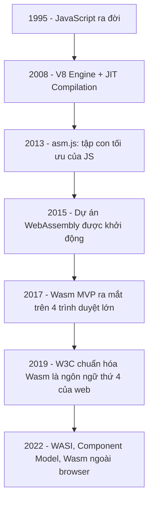
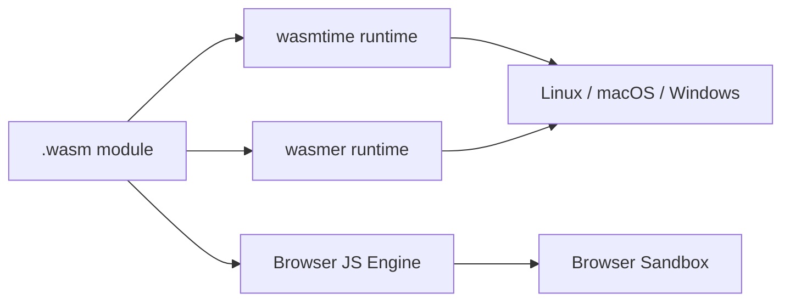
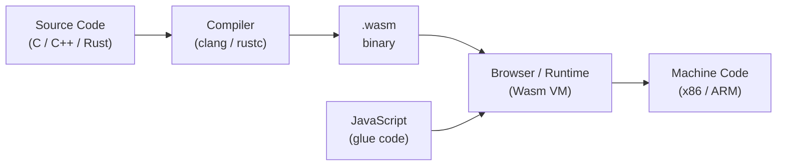
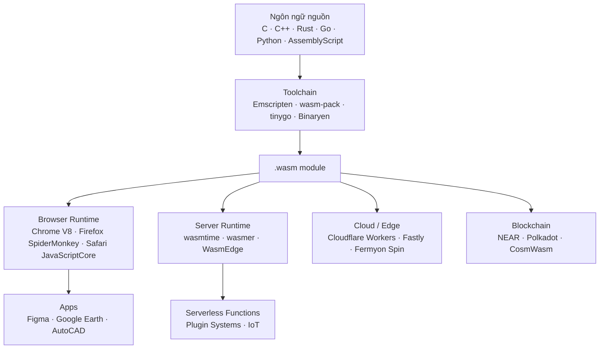

> **Prerequisites**: Không yêu cầu — bài học này bắt đầu từ đầu. Có kiến thức cơ bản về lập trình web (HTML, JavaScript) sẽ giúp ích.
> **Objectives**:
> - Hiểu WebAssembly (Wasm) là gì và vì sao nó ra đời
> - Phân biệt vai trò của Wasm so với JavaScript trên trình duyệt
> - Nhận biết các use case thực tế: browser, server, blockchain, IoT, cloud-native
> - Nắm được workflow cơ bản: viết code → biên dịch → chạy trên browser

---

## Motivation — Vì sao Web cần thêm một ngôn ngữ nữa?

### Lịch sử ngắn gọn của Web

Khi Tim Berners-Lee phát minh ra World Wide Web năm 1989, web chỉ là các trang văn bản tĩnh với liên kết. Không có animation, không có tương tác, không có logic phía client.

Năm 1995, Netscape giới thiệu **JavaScript** — ngôn ngữ script nhúng trực tiếp vào trình duyệt. JavaScript giải quyết được bài toán tương tác, nhưng có một giới hạn cơ bản: nó là **interpreted language** được thiết kế để chạy nhanh trong vài giây, không phải để thực hiện hàng triệu phép tính mỗi giây.

Khi web application trở nên phức tạp hơn — game 3D, chỉnh sửa video, nhận dạng giọng nói, mô phỏng vật lý — JavaScript bắt đầu bộc lộ giới hạn về hiệu năng (performance). Nhiều nỗ lực đã được thực hiện để giải quyết vấn đề này:



### Giới hạn của JavaScript

> [!warning] Vấn đề cốt lõi
> JavaScript là **dynamically typed** và **garbage collected**. Hai đặc điểm này tiện cho lập trình viên nhưng gây ra overhead không thể tránh khỏi khi thực hiện các phép tính nặng:
>
> - **Type checking** xảy ra lúc runtime, không phải compile time
> - **Garbage collector** có thể tạm dừng execution để dọn dẹp bộ nhớ (GC pause)
> - **JIT compiler** phải đoán kiểu dữ liệu, nếu đoán sai phải deoptimize và biên dịch lại
>
> Kết quả: JavaScript chạy nhanh hơn rất nhiều so với thời đầu nhờ V8/SpiderMonkey, nhưng vẫn chậm hơn native code khoảng 2–10 lần tùy workload.

---

## WebAssembly là gì?

> [!note] Định nghĩa
> **WebAssembly (Wasm)** là một định dạng bytecode nhị phân (binary instruction format) được thiết kế như **compilation target** — tức là ngôn ngữ đích để các ngôn ngữ khác (C, C++, Rust...) biên dịch vào, không phải ngôn ngữ để lập trình viên viết tay.
>
> Wasm thực thi trên một **stack-based virtual machine** được nhúng trong trình duyệt (hoặc runtime standalone). Nó không phải là assembly của một CPU cụ thể, mà là assembly của một máy ảo trừu tượng.

Bốn mục tiêu thiết kế chính của WebAssembly:

**1. Fast** — Wasm được biên dịch tĩnh, có kiểu dữ liệu rõ ràng, không có garbage collector. Tốc độ thực thi tiệm cận native code (thường chỉ chậm hơn 10–20%).

**2. Safe** — Mỗi Wasm module chạy trong một sandbox hoàn toàn cô lập. Module không thể truy cập bộ nhớ ngoài vùng được cấp phép, không thể gọi hàm tùy ý của host.

**3. Portable** — Một file `.wasm` biên dịch một lần chạy được trên mọi trình duyệt, mọi hệ điều hành, mọi kiến trúc CPU (x86, ARM, RISC-V...).

**4. Open** — Wasm là chuẩn mở, được chuẩn hóa bởi W3C. Không thuộc về bất kỳ công ty nào.

### Wasm KHÔNG phải là...

> [!info] Làm rõ những hiểu lầm phổ biến
>
> - **Không phải** ngôn ngữ lập trình — lập trình viên không viết `.wasm` trực tiếp (trừ khi học về internals)
> - **Không phải** thay thế JavaScript — Wasm và JS bổ trợ nhau, không cạnh tranh
> - **Không phải** chỉ dành cho trình duyệt — Wasm ngày càng phổ biến ngoài browser (WASI, cloud-native)
> - **Không phải** nguy hiểm hơn JavaScript — Wasm bị giới hạn bởi cùng security model của trình duyệt

---

## WebAssembly vs JavaScript — So sánh trực tiếp

| Tiêu chí | JavaScript | WebAssembly |
|----------|-----------|-------------|
| **Kiểu dữ liệu** | Dynamic (runtime) | Static (compile time) |
| **Quản lý bộ nhớ** | Garbage collected | Manual (linear memory) |
| **Tốc độ khởi động** | Nhanh (parse + JIT) | Nhanh hơn (AOT/JIT) |
| **Tốc độ thực thi** | Tốt, nhưng unpredictable | Predictable, gần native |
| **Kích thước file** | Text (có thể minify) | Binary (compact hơn) |
| **Debugging** | DevTools tốt | Đang cải thiện (DWARF) |
| **Truy cập DOM** | Trực tiếp | Không — phải qua JS glue |
| **Ngôn ngữ nguồn** | Chỉ JavaScript | C, C++, Rust, Go, Python... |
| **Garbage collector** | Có | Không (cho đến GC proposal) |

> [!tip] Khi nào dùng Wasm thay vì JS?
> Dùng Wasm khi bạn có **CPU-intensive workload**: xử lý ảnh/video, mã hóa, mô phỏng vật lý, game engine, machine learning inference, biên dịch code trong browser.
>
> Giữ JavaScript cho: thao tác DOM, event handling, giao tiếp network, business logic đơn giản.

---

## Use Cases thực tế

### 1. Trình duyệt (Browser)

**Figma** — Ứng dụng thiết kế chạy hoàn toàn trên web. Figma biên dịch rendering engine C++ sang Wasm để đạt tốc độ xử lý vector graphics tương đương native app.

**Google Earth** — Phiên bản web của Google Earth dùng Wasm để render 3D terrain nhanh chóng.

**AutoCAD Web** — Toàn bộ CAD kernel (hàng triệu dòng C++) được biên dịch sang Wasm với Emscripten.

**In-browser code editors** (như Replit, StackBlitz) — Chạy compiler/interpreter (Python, Ruby, C...) ngay trong trình duyệt.

### 2. Server-side / Cloud-native

Với sự ra đời của **WASI (WebAssembly System Interface)**, Wasm có thể chạy ngoài trình duyệt như một standalone process:



- **Serverless functions**: Khởi động nhanh hơn Docker container (microseconds vs milliseconds)
- **Edge computing**: Cloudflare Workers hỗ trợ Wasm
- **Plugin systems**: Wasm được dùng làm plugin sandbox trong nhiều ứng dụng (Envoy proxy, wasmCloud)

### 3. Blockchain / Smart Contracts

Nhiều blockchain thế hệ mới dùng Wasm làm VM cho smart contracts:
- **NEAR Protocol** — Smart contracts viết bằng Rust/AssemblyScript, biên dịch sang Wasm
- **Polkadot/Substrate** — Wasm runtime cho on-chain logic
- **CosmWasm** — Smart contracts Wasm cho Cosmos ecosystem
- **Ethereum 2.0 (eWASM)** — Đề xuất dùng Wasm thay EVM (đang nghiên cứu)

### 4. Embedded / IoT

Wasm ngày càng được triển khai trên microcontroller và thiết bị nhúng nhờ kích thước nhỏ và khả năng sandbox tốt.

---

## Workflow cơ bản: Từ code nguồn đến trình duyệt

Để hiểu Wasm là gì, hãy nhìn toàn bộ pipeline:



**Bước 1**: Lập trình viên viết code bằng C, C++, Rust, hoặc ngôn ngữ hỗ trợ khác.

**Bước 2**: Compiler đặc biệt (Emscripten cho C/C++, wasm-pack cho Rust) biên dịch code nguồn thành file `.wasm`.

**Bước 3**: File `.wasm` được tải vào trình duyệt qua JavaScript. Browser engine (V8, SpiderMonkey...) JIT-compile bytecode Wasm thành machine code native.

**Bước 4**: Wasm module chạy trong sandbox. Mọi tương tác với browser API (DOM, network...) phải thông qua JavaScript.

### Ví dụ minh họa — Hello World hoàn chỉnh

Đây là cách một hàm C đơn giản trở thành Wasm và được gọi từ JavaScript:

```c
// add.c — hàm C muốn chạy trong browser
int add(int a, int b) {
    return a + b;
}
```

Sau khi biên dịch với Emscripten (`emcc add.c -o add.js -s EXPORTED_FUNCTIONS='["_add"]'`), JavaScript có thể gọi:

```javascript
// Gọi hàm Wasm từ JavaScript
const { instance } = await WebAssembly.instantiateStreaming(fetch('add.wasm'));
const result = instance.exports.add(3, 4);
console.log(result); // 7
```

Cùng logic đó, nhưng hiệu năng tiệm cận native C — không có overhead của JS dynamic typing.

---

## WebAssembly Text Format (WAT) — Cái nhìn đầu tiên

Wasm binary không thể đọc được bằng mắt thường. Nhưng có một dạng văn bản tương đương gọi là **WAT (WebAssembly Text Format)** — đây là assembly của Wasm:

```wat
;; Đây là WAT — dạng text đọc được của Wasm binary
(module
  (func $add (param $a i32) (param $b i32) (result i32)
    local.get $a
    local.get $b
    i32.add)
  (export "add" (func $add))
)
```

> [!note] Lưu ý
> Bạn sẽ học WAT chi tiết trong [[03-webassembly-text-format|03. WebAssembly Text Format (WAT)]]. Hiện tại chỉ cần biết rằng WAT tồn tại như một cách để con người đọc và viết Wasm mà không dùng hex editor.

---

## Hệ sinh thái Wasm năm 2026



---

## Summary / Key Takeaways

- **WebAssembly là compilation target**, không phải ngôn ngữ lập trình cho người dùng cuối. Code C/C++/Rust được biên dịch sang `.wasm`.
- Wasm ra đời để giải quyết **giới hạn hiệu năng của JavaScript** trong các tác vụ CPU-intensive.
- Bốn mục tiêu thiết kế: **Fast** (gần native), **Safe** (sandbox), **Portable** (cross-platform), **Open** (W3C standard).
- Wasm và JavaScript **bổ trợ nhau**: JS xử lý DOM/event/network, Wasm xử lý tính toán nặng.
- Wasm không chỉ dành cho browser — với **WASI**, Wasm chạy được trên server, IoT, và cloud-native.
- Năm 2019, W3C chính thức coi Wasm là **ngôn ngữ thứ 4 của web** cùng với HTML, CSS, JavaScript.

---

## References

- WebAssembly official site — https://webassembly.org
- Lin Clark — *A cartoon intro to WebAssembly* (hacks.mozilla.org)
- MDN Web Docs — WebAssembly — https://developer.mozilla.org/en-US/docs/WebAssembly
- W3C WebAssembly Working Group — https://www.w3.org/wasm/
- *WebAssembly: The Definitive Guide* — Brian Sletten, O'Reilly 2021
