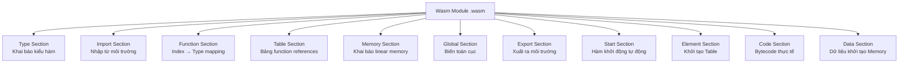
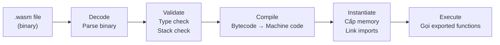

> **Prerequisites**: [[01-gioi-thieu-webassembly|01. Giới thiệu WebAssembly]] — biết Wasm là gì, compilation target concept.
> **Objectives**:
> - Hiểu mô hình tính toán stack machine: cách Wasm thực thi instruction
> - Nắm cấu trúc của một Wasm module và vai trò từng section
> - Hiểu execution model: instantiation, imports, exports, memory
> - Phân biệt module (tĩnh) vs instance (động)

---

## Concept — Mô hình thực thi của Wasm

Trước khi đọc bytecode Wasm, cần hiểu Wasm sử dụng kiến trúc gì để thực thi lệnh. Đây là câu hỏi: *Wasm tính toán như thế nào?*

### Hai trường phái kiến trúc máy tính

Hầu hết CPU thực (x86, ARM) là **register machine** — có các ô nhớ tốc độ cao gọi là register (rax, rbx, r0, r1...), instruction thao tác trực tiếp trên register:

```asm
; x86 assembly — register machine
mov eax, 3       ; đưa 3 vào register eax
mov ebx, 4       ; đưa 4 vào register ebx
add eax, ebx     ; eax = eax + ebx = 7
```

WebAssembly dùng **stack machine** — không có register. Thay vào đó, mọi giá trị được đẩy lên (push) và lấy ra (pop) từ một stack trừu tượng:

```wat
;; Wasm WAT — stack machine
i32.const 3   ;; push 3 lên stack        → stack: [3]
i32.const 4   ;; push 4 lên stack        → stack: [3, 4]
i32.add       ;; pop 2 giá trị, push tổng → stack: [7]
```

> [!note] Tại sao dùng stack machine?
> Stack machine đơn giản hơn để verify (kiểm tra tính đúng đắn) và dễ JIT-compile sang register machine thực. Compiler backend tự lo việc phân bổ register, giúp Wasm spec đơn giản và portable.

---

## Stack Machine — Cơ chế hoạt động

### Stack và kiểu dữ liệu

Wasm stack chỉ chứa **4 kiểu dữ liệu nguyên thủy** (value types):

| Kiểu | Mô tả | Ví dụ |
|------|-------|-------|
| `i32` | Integer 32-bit (có dấu hoặc không dấu) | `42`, `-1`, `0xDEADBEEF` |
| `i64` | Integer 64-bit | `9999999999999` |
| `f32` | Floating-point 32-bit (IEEE 754) | `3.14f` |
| `f64` | Floating-point 64-bit (IEEE 754) | `3.141592653589793` |

> [!info] Lưu ý về số nguyên
> Wasm không phân biệt signed/unsigned ở kiểu dữ liệu — `i32` chứa 32 bit, việc interpret là có dấu hay không phụ thuộc vào instruction được dùng. Ví dụ: `i32.div_s` (signed division) vs `i32.div_u` (unsigned division).

### Minh họa thực thi từng bước

Hãy trace qua hàm tính `(a + b) * 2` trong Wasm:

```wat
(func $calc (param $a i32) (param $b i32) (result i32)
  local.get $a    ;; đẩy giá trị của $a lên stack
  local.get $b    ;; đẩy giá trị của $b lên stack
  i32.add         ;; pop $a và $b, push ($a + $b)
  i32.const 2     ;; đẩy hằng số 2 lên stack
  i32.mul         ;; pop ($a+$b) và 2, push tích
)
```

Giả sử gọi `$calc(3, 4)`:

```text
Instruction       Stack (top bên phải)
──────────────────────────────────────
[bắt đầu]         []
local.get $a      [3]
local.get $b      [3, 4]
i32.add           [7]
i32.const 2       [7, 2]
i32.mul           [14]
[kết thúc]        → return 14
```

> [!tip] Type safety tại compile time
> Wasm VM xác nhận (validate) mỗi instruction trước khi chạy. Nếu một instruction cần 2 giá trị `i32` trên stack nhưng stack chỉ có 1 phần tử, module bị từ chối ngay khi load — không có runtime type error kiểu JavaScript.

---

## Cấu trúc Wasm Module

Một **module** là đơn vị biên dịch và triển khai cơ bản trong Wasm — tương đương với một file `.wasm`. Module được tổ chức thành nhiều **section** (phần), mỗi section chứa một loại khai báo cụ thể.

> [!note] Module vs Instance
> - **Module**: Bản thiết kế tĩnh — là file `.wasm` trên đĩa. Giống class trong OOP.
> - **Instance**: Bản thực thi động — được tạo khi "instantiate" module, có bộ nhớ riêng, trạng thái riêng. Giống object.
> Có thể tạo nhiều instance từ cùng một module.

### Tổng quan các Section



### Chi tiết từng Section quan trọng

#### Type Section

Khai báo tất cả **function signature** (kiểu tham số đầu vào và đầu ra) được dùng trong module. Mỗi signature được gán một index.

```wat
(type $fn_add (func (param i32 i32) (result i32)))
(type $fn_print (func (param i32)))
```

> [!info] Tại sao tách Type Section riêng?
> Nhiều hàm có thể dùng chung một kiểu. Thay vì lặp lại signature mỗi lần, module chỉ lưu danh sách kiểu một lần và dùng index để tham chiếu. Điều này giúp binary compact hơn và validation nhanh hơn.

#### Import Section

Wasm module là **sandboxed** — nó không thể tự mình làm bất cứ điều gì với thế giới bên ngoài (đọc file, in ra màn hình, gọi HTTP). Mọi tương tác với môi trường phải được **import** tường minh:

```wat
(import "env" "print_int" (func $print_int (param i32)))
(import "js" "mem" (memory 1))
```

Cú pháp import: `(import "module_name" "field_name" ...)`. Khi instantiate, host (JavaScript/wasmtime) phải cung cấp đủ các giá trị này.

> [!warning] Nguyên tắc Least Privilege
> Module chỉ có thể dùng những gì nó import. Nếu không import `print`, module không thể in gì. Đây là cơ chế bảo mật quan trọng — host kiểm soát hoàn toàn những gì module được phép làm.

#### Function Section + Code Section

Function Section chỉ lưu danh sách index trỏ vào Type Section (để biết signature của mỗi hàm). Bytecode thực tế được lưu trong Code Section — hai section này luôn đi cặp với nhau.

```text
Function Section:   [type_index_0, type_index_1, ...]
Code Section:       [function_body_0, function_body_1, ...]
```

#### Memory Section — Linear Memory

Wasm cấp cho mỗi module một vùng nhớ liên tục gọi là **linear memory** — về cơ bản là một mảng byte khổng lồ:

```wat
(memory 1)        ;; cấp 1 page = 64KB
(memory 1 10)     ;; cấp 1 page, tối đa 10 pages = 640KB
```

Mỗi "page" (trang) trong Wasm = **64 KB** (65536 bytes). Module có thể tăng thêm trang lúc runtime bằng instruction `memory.grow`.

> [!info] Linear Memory là gì?
> Linear memory là một byte array duy nhất, liên tục trong địa chỉ ảo của process host. Wasm code truy cập nó bằng địa chỉ nguyên (offset). Không có pointer arithmetic phức tạp, không có segmentation.
>
> Đây cũng là nơi heap của C/C++ được đặt khi biên dịch sang Wasm — `malloc()` cấp phát trong linear memory, không phải trên OS heap.

#### Global Section

Khai báo biến global với kiểu dữ liệu và có thể thay đổi được (mutable) hay không:

```wat
(global $counter (mut i32) (i32.const 0))
(global $max_val i32 (i32.const 1000))
```

#### Export Section

Khai báo những gì module cho phép bên ngoài truy cập. Không export thì ngoài không thể gọi:

```wat
(export "add" (func $add))
(export "memory" (memory 0))
(export "counter" (global $counter))
```

#### Table Section — Indirect Calls

Table là mảng chứa **function references** — được dùng để thực hiện gọi hàm gián tiếp (indirect call), tương đương function pointer trong C.

```wat
(table 3 funcref)   ;; table chứa tối đa 3 function references
```

> [!note] Tại sao cần Table?
> Wasm CFI (Control Flow Integrity) ngăn chặn việc nhảy đến địa chỉ tùy ý. Thay vào đó, `call_indirect` chỉ được phép gọi các hàm đã được khai báo trong Table. Đây là cơ chế bảo vệ quan trọng — bạn sẽ thấy vai trò của nó trong bài [[12-wasm-security-model|12. Wasm Security Model]].

---

## Execution Model — Instantiation & Lifecycle

### Module Lifecycle



**Decode**: Đọc binary, kiểm tra magic bytes (`\0asm`), parse từng section.

**Validate**: Kiểm tra type safety — mỗi instruction đúng kiểu, stack luôn đủ phần tử, không có code không thể tới được (unreachable).

**Compile**: JIT hoặc AOT compile bytecode thành machine code native của CPU hiện tại.

**Instantiate**: Tạo một instance — cấp phát linear memory, khởi tạo globals, link imports với giá trị được cung cấp bởi host.

**Execute**: Gọi exported functions từ host (JavaScript/wasmtime).

### Validation — Đảm bảo an toàn

> [!abstract] Module Validation
> Trước khi bất kỳ instruction nào được thực thi, Wasm runtime phải validate toàn bộ module. Validation đảm bảo:
>
> 1. **Type safety**: Mọi instruction nhận đúng kiểu operand từ stack
> 2. **Stack discipline**: Stack không bao giờ underflow trong một hàm
> 3. **Memory safety**: Mọi `memory.load/store` có bounds check tại runtime
> 4. **Control flow**: Tất cả branch targets đều hợp lệ
> 5. **Import completeness**: Mọi import đều được cung cấp khi instantiate
>
> Nếu validation thất bại, module không được load — không có undefined behavior theo kiểu C.

### Ví dụ instantiation từ JavaScript

```javascript
async function loadWasm() {
  // Fetch và instantiate module
  const response = await fetch('module.wasm');
  
  // Cung cấp imports (môi trường cho module)
  const importObject = {
    env: {
      print_int: (n) => console.log('Wasm says:', n),
    },
    js: {
      mem: new WebAssembly.Memory({ initial: 1 }),
    }
  };
  
  // Instantiate: decode + validate + compile + link imports
  const { instance } = await WebAssembly.instantiate(
    await response.arrayBuffer(),
    importObject
  );
  
  // Gọi exported function
  const result = instance.exports.add(10, 20);
  console.log(result); // 30
  
  // Truy cập exported memory
  const mem = new Uint8Array(instance.exports.memory.buffer);
  console.log(mem[0]); // đọc byte đầu tiên của linear memory
}
```

---

## Wasm Module trong thực tế — Quan sát binary

Mỗi file `.wasm` bắt đầu bằng **magic bytes** cố định:

```text
00 61 73 6D  →  \0asm
01 00 00 00  →  version 1
```

Tiếp theo là các section, mỗi section có dạng:
```text
[section_id: 1 byte] [size: LEB128] [content: N bytes]
```

> [!example] Ví dụ nhỏ nhất: module rỗng
> Module hợp lệ nhỏ nhất chỉ cần magic bytes và version — 8 bytes:
> ```text
> 00 61 73 6D 01 00 00 00
> ```
> Không có hàm, không có memory, không có gì. Hợp lệ nhưng không làm được gì.

Bạn sẽ học cách đọc chi tiết binary format trong [[04-binary-format-va-encoding|04. Binary Format & Encoding]].

---

## Summary / Key Takeaways

- Wasm dùng **stack machine model**: không có register, mọi phép tính đẩy/lấy giá trị từ stack.
- Chỉ có **4 kiểu dữ liệu nguyên thủy**: `i32`, `i64`, `f32`, `f64`. Type safety được đảm bảo lúc compile time.
- Wasm module gồm nhiều **section** chuyên biệt: Type, Import, Function, Memory, Global, Export, Table, Code, Data.
- **Linear memory** là byte array liên tục — toàn bộ heap của C/C++ sống ở đây. Module chỉ có một linear memory (hiện tại).
- **Import/Export** là cơ chế giao tiếp duy nhất giữa Wasm và môi trường bên ngoài — bảo đảm isolation.
- **Table** chứa function references cho indirect calls — đây là cơ sở của CFI trong Wasm.
- Lifecycle: Decode → Validate → Compile → Instantiate → Execute. Validation phải pass trước khi bất kỳ code nào chạy.
- **Module** là bản thiết kế tĩnh; **instance** là bản thực thi với bộ nhớ và trạng thái riêng.

---

## References

- WebAssembly Specification (W3C) — https://webassembly.github.io/spec/core/
- MDN — WebAssembly Concepts — https://developer.mozilla.org/en-US/docs/WebAssembly/Concepts
- Lin Clark — *A cartoon intro to WebAssembly modules* (hacks.mozilla.org)
- *WebAssembly: The Definitive Guide* — Brian Sletten, O'Reilly 2021, Ch. 3–4
- Wasm binary encoding reference — https://webassembly.github.io/spec/core/binary/
