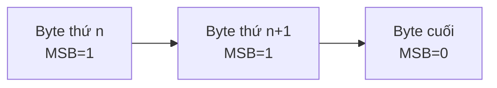

> **Prerequisites**: [[03-webassembly-text-format|03. WebAssembly Text Format (WAT)]] — biết viết WAT, hiểu cấu trúc module và sections.
> **Objectives**:
> - Hiểu cấu trúc byte-level của file `.wasm`
> - Nắm vững LEB128 encoding — cách Wasm nén integers
> - Đọc được hex dump của một module đơn giản từng byte một
> - Dùng `wasm-objdump` để phân tích module thực tế
> - Hiểu tại sao binary format quan trọng cho security và reverse engineering

---

## Concept — Tại sao cần hiểu Binary Format?

Khi học WAT, bạn làm việc với lớp text đọc được. Nhưng thứ thực sự chạy trong VM là **binary** — chuỗi bytes thô không có khoảng trắng, không có tên biến, không có comment.

Ba lý do cần hiểu binary format:

**Security / RE**: Khi audit một Wasm module không có source, bạn bắt đầu từ binary. Hiểu encoding giúp bạn nhận ra dấu hiệu bất thường — function index bị tamper, data segment ẩn, custom section chứa payload.

**Tooling**: Viết parser, encoder, hoặc fuzzer cho Wasm yêu cầu hiểu từng byte có nghĩa gì.

**Debugging**: Khi `wasm2wat` thất bại hoặc output sai, bạn cần đọc trực tiếp hex dump để tìm lỗi.

---

## Magic Bytes và Version

Mỗi file `.wasm` hợp lệ bắt đầu bằng **8 bytes cố định**:

```text
00 61 73 6D   →   \0asm   (magic number)
01 00 00 00   →   version 1 (little-endian u32)
```

Magic bytes `\0asm` là dấu hiệu nhận dạng format. Version luôn là `1` trong WebAssembly 1.0 (MVP). Version được encode là **fixed-width 32-bit little-endian integer** — không phải LEB128.

> [!info] Tại sao magic bắt đầu bằng `\0` (null byte)?
> Byte `0x00` ở đầu ngăn chặn việc file `.wasm` bị nhận nhầm là text file (các text editor thường từ chối file bắt đầu bằng null byte). Đây là convention từ ELF (`\x7fELF`) và PNG (`\x89PNG`).

---

## Section Layout

Sau magic header, module gồm một chuỗi section liên tiếp. Mỗi section có cấu trúc:

```text
[section_id: 1 byte] [content_size: uLEB128] [content: N bytes]
```

Section IDs đã chuẩn hóa:

| ID | Section | Nội dung |
|----|---------|---------|
| 0 | Custom | Dữ liệu tùy ý (debug info, name section...) |
| 1 | Type | Danh sách function signatures |
| 2 | Import | Danh sách imports |
| 3 | Function | Mapping function → type index |
| 4 | Table | Khai báo tables |
| 5 | Memory | Khai báo linear memory |
| 6 | Global | Khai báo global variables |
| 7 | Export | Danh sách exports |
| 8 | Start | Index hàm chạy tự động khi instantiate |
| 9 | Element | Khởi tạo table (function references) |
| 10 | Code | Bytecode thực tế của các hàm |
| 11 | Data | Khởi tạo linear memory |
| 12 | Data Count | (Bulk memory proposal) Số data segments |

> [!warning] Thứ tự section là BẮT BUỘC
> Các section phải xuất hiện theo thứ tự ID tăng dần (trừ Custom section có thể ở bất kỳ đâu). Validator sẽ từ chối module có section sai thứ tự.

---

## LEB128 — Variable-Length Integer Encoding

Phần lớn integers trong Wasm binary không được encode theo fixed-width mà dùng **LEB128 (Little Endian Base 128)** — một cách nén biến độ dài.

### Ý tưởng cốt lõi

LEB128 encode số nguyên dưới dạng chuỗi bytes 7-bit. Bit cao nhất (MSB) của mỗi byte là **continuation bit**:
- `1` → còn bytes nữa
- `0` → đây là byte cuối



7 bit thấp của mỗi byte chứa dữ liệu thực sự. Bytes được sắp xếp **little-endian** (byte thấp trước).

### Unsigned LEB128 (uLEB128) — Decode bằng tay

> [!example] Ví dụ: Decode `E5 8E 26`
>
> Byte 1: `E5` = `1110 0101` → continuation=1, data=`110 0101`
> Byte 2: `8E` = `1000 1110` → continuation=1, data=`000 1110`
> Byte 3: `26` = `0010 0110` → continuation=0, data=`010 0110`
>
> Ghép lại (little-endian, byte thấp trước):
>
> ```text
> data: 010 0110 | 000 1110 | 110 0101
>                              ↑byte 1  ↑byte 2  ↑byte 3
> ```
>
> Kết quả (đọc từ phải sang trái theo significant bit):
>
> `010 0110 000 1110 110 0101` = `0001 0011 0000 0111 0110 0101` = **624485**

Thuật toán encode uLEB128:

```python
def encode_uleb128(value: int) -> bytes:
    result = []
    while True:
        byte = value & 0x7F          # lấy 7 bit thấp
        value >>= 7
        if value != 0:
            byte |= 0x80             # set continuation bit
        result.append(byte)
        if value == 0:
            break
    return bytes(result)

def decode_uleb128(data: bytes, offset: int = 0):
    result = 0
    shift = 0
    while True:
        byte = data[offset]
        offset += 1
        result |= (byte & 0x7F) << shift
        shift += 7
        if not (byte & 0x80):        # continuation bit = 0 → kết thúc
            break
    return result, offset

# Ví dụ
print(encode_uleb128(624485).hex())  # e58e26
print(encode_uleb128(1).hex())       # 01 (1 byte)
print(encode_uleb128(128).hex())     # 8001 (2 bytes vì 128 >= 2^7)
print(encode_uleb128(300).hex())     # ac02
```

### Signed LEB128 (sLEB128)

Dùng cho số nguyên có dấu (signed integers). Tương tự uLEB128 nhưng bit dấu được mở rộng từ bit thứ 6 của byte cuối:

```python
def encode_sleb128(value: int) -> bytes:
    result = []
    more = True
    while more:
        byte = value & 0x7F
        value >>= 7
        if (value == 0 and not (byte & 0x40)) or \
           (value == -1 and (byte & 0x40)):
            more = False
        else:
            byte |= 0x80
        result.append(byte)
    return bytes(result)

print(encode_sleb128(-1).hex())    # 7f   (1 byte: 0111 1111)
print(encode_sleb128(-128).hex())  # 807f (2 bytes: -128 cần sign extension)
print(encode_sleb128(63).hex())    # 3f   (1 byte)
print(encode_sleb128(64).hex())    # c000 (2 bytes: 64 >= 2^6 nên cần byte tiếp theo)
```

> [!info] Khi nào dùng uLEB128 vs sLEB128?
> - **uLEB128**: section sizes, function counts, memory sizes, most indices
> - **sLEB128**: numeric constants trong code (`i32.const`, `i64.const`), global initializers
> - **Fixed i32 LE**: magic number, version — không phải LEB128

---

## Phân tích Binary Thực tế — Byte bằng Byte

Hãy phân tích file `.wasm` cho module đơn giản nhất: hàm `add(a, b) = a + b`.

WAT tương ứng:

```wat
(module
  (func $add (param i32 i32) (result i32)
    local.get 0
    local.get 1
    i32.add)
  (export "add" (func 0))
)
```

Sau khi chạy `wat2wasm add.wat -o add.wasm`, hexdump cho ra:

```text
Offset  Hex                                  Giải thích
──────  ─────────────────────────────────────────────────────────────
0000:   00 61 73 6D                          magic: \0asm
0004:   01 00 00 00                          version: 1

;; === TYPE SECTION ===
0008:   01                                   section ID: 1 (Type)
0009:   07                                   section size: 7 bytes
000A:   01                                   số type entries: 1
000B:   60                                   func type marker: 0x60
000C:   02                                   số params: 2
000D:   7F                                   param[0]: i32 (0x7F)
000E:   7F                                   param[1]: i32 (0x7F)
000F:   01                                   số results: 1
0010:   7F                                   result[0]: i32 (0x7F)

;; === FUNCTION SECTION ===
0011:   03                                   section ID: 3 (Function)
0012:   02                                   section size: 2 bytes
0013:   01                                   số functions: 1
0014:   00                                   func[0] dùng type[0]

;; === EXPORT SECTION ===
0015:   07                                   section ID: 7 (Export)
0016:   07                                   section size: 7 bytes
0017:   01                                   số exports: 1
0018:   03                                   độ dài tên: 3 bytes
0019:   61 64 64                             tên: "add" (ASCII)
001C:   00                                   loại export: function (0x00)
001D:   00                                   function index: 0

;; === CODE SECTION ===
001E:   0A                                   section ID: 10 (Code)
001F:   09                                   section size: 9 bytes
0020:   01                                   số function bodies: 1
0021:   07                                   body size: 7 bytes
0022:   00                                   số locals: 0 (không có biến local)
0023:   20 00                                local.get 0  (opcode 0x20, index 0)
0025:   20 01                                local.get 1  (opcode 0x20, index 1)
0027:   6A                                   i32.add      (opcode 0x6A)
0028:   0B                                   end          (opcode 0x0B)
```

> [!note] Value Type Encoding
> Các kiểu dữ liệu được encode bằng 1 byte:
>
> | Byte | Kiểu |
> |------|------|
> | `0x7F` | `i32` |
> | `0x7E` | `i64` |
> | `0x7D` | `f32` |
> | `0x7C` | `f64` |
>
> Lưu ý đây là giá trị **âm** trong sLEB128 — `0x7F` = -1, `0x7E` = -2... Spec dùng số âm để phân biệt value types với type indices.

### Một số Opcode thường gặp

| Opcode | Instruction |
|--------|------------|
| `0x00` | `unreachable` |
| `0x01` | `nop` |
| `0x0B` | `end` |
| `0x0F` | `return` |
| `0x10` | `call` |
| `0x20` | `local.get` |
| `0x21` | `local.set` |
| `0x22` | `local.tee` |
| `0x23` | `global.get` |
| `0x28` | `i32.load` |
| `0x36` | `i32.store` |
| `0x41` | `i32.const` |
| `0x45` | `i32.eqz` |
| `0x46` | `i32.eq` |
| `0x6A` | `i32.add` |
| `0x6B` | `i32.sub` |
| `0x6C` | `i32.mul` |

Bảng đầy đủ xem tại [[a1-wat-instruction-reference|A1. WAT Instruction Reference]].

---

## Tool — wasm-objdump

`wasm-objdump` (từ WABT) là công cụ hàng đầu để phân tích binary:

```bash
# Xem tổng quan sections
wasm-objdump -x add.wasm

# Xem disassembly (WAT-like output với offsets)
wasm-objdump -d add.wasm

# Xem raw hex
wasm-objdump -s add.wasm

# Kết hợp tất cả
wasm-objdump -xds add.wasm
```

Output của `wasm-objdump -x add.wasm`:

```text
add.wasm:       file format wasm 0x1

Section Details:

Type[1]:
 - type[0] (i32, i32) -> i32

Function[1]:
 - func[0] sig=0

Export[1]:
 - func[0] <add> -> "add"

Code[1]:
 - func[0] size=7 <add>
```

---

## Custom Section — Dữ liệu ẩn trong Wasm

Custom section (ID = 0) có thể chứa bất kỳ dữ liệu gì. Validator bỏ qua nó. Các dùng hợp lệ:

- **Name section**: Lưu tên hàm và local variables để DevTools hiển thị đẹp hơn
- **DWARF debug info**: Debug symbols khi biên dịch với `-g`
- **Source maps**: Mapping từ Wasm offset sang source code gốc

> [!warning] Bảo mật: Custom Section là "blind spot"
> Custom section không được validate. Attacker có thể nhúng **payload ẩn** vào custom section của module và host đọc nó qua JavaScript. Đây là attack vector thực tế đã được ghi nhận.
>
> Khi audit Wasm module, **luôn kiểm tra custom sections** bằng `wasm-objdump -x` hoặc `wasm-objdump -s` để xem raw bytes.

---

## Đọc Binary bằng Python

Khi cần phân tích binary programmatically (viết tool, fuzzer, PoC):

```python
import struct

def parse_wasm_header(data: bytes) -> dict:
    if len(data) < 8:
        raise ValueError("File quá nhỏ — không phải Wasm module")

    magic = data[:4]
    if magic != b'\x00asm':
        raise ValueError(f"Magic sai: {magic.hex()}")

    version = struct.unpack_from('<I', data, 4)[0]
    return {"magic": magic, "version": version}

def read_uleb128(data: bytes, offset: int):
    result = 0
    shift = 0
    while True:
        if offset >= len(data):
            raise ValueError("LEB128 bị cắt giữa chừng")
        byte = data[offset]
        offset += 1
        result |= (byte & 0x7F) << shift
        shift += 7
        if not (byte & 0x80):
            break
    return result, offset

def parse_sections(data: bytes):
    offset = 8  # bỏ qua header
    sections = []
    while offset < len(data):
        section_id = data[offset]
        offset += 1
        size, offset = read_uleb128(data, offset)
        content = data[offset:offset + size]
        sections.append({
            "id": section_id,
            "size": size,
            "content": content,
            "offset": offset - 1 - len(encode_uleb128_for_size(size)),
        })
        offset += size
    return sections

def encode_uleb128_for_size(value: int) -> bytes:
    result = []
    while True:
        byte = value & 0x7F
        value >>= 7
        if value != 0:
            byte |= 0x80
        result.append(byte)
        if value == 0:
            break
    return bytes(result)

SECTION_NAMES = {
    0: "Custom", 1: "Type", 2: "Import", 3: "Function",
    4: "Table", 5: "Memory", 6: "Global", 7: "Export",
    8: "Start", 9: "Element", 10: "Code", 11: "Data"
}

with open("add.wasm", "rb") as f:
    wasm = f.read()

header = parse_wasm_header(wasm)
print(f"Magic: {header['magic']}, Version: {header['version']}")

for sec in parse_sections(wasm):
    name = SECTION_NAMES.get(sec["id"], f"Unknown({sec['id']})")
    print(f"Section {sec['id']} ({name}): {sec['size']} bytes")
    if sec["id"] == 0:
        print("  ⚠ Custom section detected — kiểm tra nội dung!")
        print(f"  Content hex: {sec['content'].hex()}")
```

---

## Summary / Key Takeaways

- File `.wasm` bắt đầu bằng magic `\0asm` + version `01 00 00 00` (8 bytes cố định).
- Sau header là chuỗi section: `[id][size_LEB128][content]`. Thứ tự ID phải tăng dần.
- **LEB128** là variable-length encoding: 7 bit dữ liệu/byte, MSB là continuation bit. Số nhỏ tốn ít byte hơn.
- **uLEB128** cho unsigned integers; **sLEB128** cho signed (dùng two's complement + sign extension).
- Value types encode là 1 byte: `i32=0x7F`, `i64=0x7E`, `f32=0x7D`, `f64=0x7C`.
- **Custom section (ID=0)** không được validate — có thể chứa dữ liệu ẩn, là attack surface cần audit.
- **`wasm-objdump`** là công cụ thiết yếu: `-x` xem sections, `-d` xem disassembly, `-s` xem raw hex.
- Hiểu binary format là nền tảng cho [[13-reverse-engineering-static|13. Reverse Engineering Wasm — Static Analysis]].

---

## References

- WebAssembly Binary Encoding Spec — https://webassembly.github.io/spec/core/binary/
- LEB128 — Wikipedia — https://en.wikipedia.org/wiki/LEB128
- *Learning WebAssembly #2: Wasm Binary Format* — Tomas Tulka — https://blog.ttulka.com/learning-webassembly-2-wasm-binary-format/
- *A Mere Mortal's Guide to WebAssembly* — https://uptointerpretation.com/posts/a-mere-mortals-guide-to-webassembly/
- Binary Format Reference chi tiết — [[a2-binary-format-reference|A2. Binary Format Reference]]
