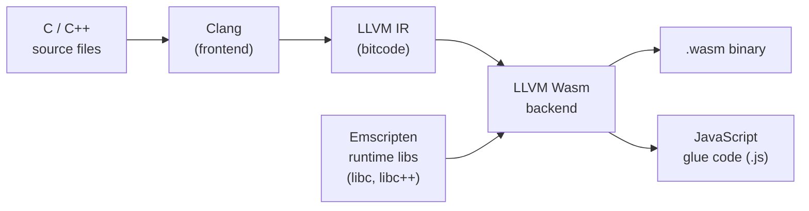

> **Prerequisites**: [[02-kien-truc-wasm-stack-machine|02. Kiến trúc Wasm — Stack Machine & Module]] — hiểu module structure, import/export, linear memory. Biết C/C++ cơ bản.
> **Objectives**:
> - Cài đặt và kích hoạt Emscripten SDK (emsdk)
> - Nắm vững ba chế độ output: HTML+JS+Wasm, JS+Wasm, Wasm standalone
> - Hiểu và sử dụng các `emcc` flag quan trọng nhất
> - Gọi C/C++ function từ JavaScript và ngược lại
> - Hiểu Module object và glue code lifecycle
> - Dùng Embind để export class và struct C++

---

## Concept — Emscripten là gì?

**Emscripten** là một toolchain hoàn chỉnh chuyển đổi code C/C++ thành WebAssembly. Về bản chất, nó là một **compiler frontend** xây dựng trên LLVM/Clang, với backend target là `wasm32-unknown-emscripten`.



Ngoài việc compile, Emscripten còn cung cấp:

- **JavaScript glue code**: Tự động xử lý loading module, memory initialization, import/export wiring
- **System libraries**: Implement `libc`, `libc++`, `POSIX` trên nền Wasm — cho phép port code C++ cũ mà không cần sửa nhiều
- **Emscripten-specific APIs**: `EM_ASM` (chạy JS từ C), `emscripten_fetch`, SDL binding...

> [!tip] `emcc` là gì?
> `emcc` (Emscripten Compiler Collection) là lệnh compile chính — nó là **drop-in replacement** cho `gcc`/`clang`. Gần như mọi flag của `gcc` đều hoạt động với `emcc`.

---

## Tool & Setup — Cài đặt emsdk

```bash
# Bước 1: Clone Emscripten SDK
git clone https://github.com/emscripten-core/emsdk.git
cd emsdk

# Bước 2: Cài và kích hoạt phiên bản mới nhất
./emsdk install latest
./emsdk activate latest

# Bước 3: Cấu hình environment variables (chạy mỗi lần mở terminal mới)
source ./emsdk_env.sh          # Linux/macOS
# hoặc
emsdk_env.bat                  # Windows

# Kiểm tra cài đặt
emcc --version
# emcc (Emscripten gcc/clang-like replacement) 3.x.x
```

> [!info] Hoặc dùng package manager
> ```bash
> # macOS
> brew install emscripten
>
> # Ubuntu (phiên bản cũ hơn, không phải latest)
> sudo apt install emscripten
> ```
> Khuyến nghị dùng emsdk để có phiên bản mới nhất.

---

## Ba chế độ Output của Emscripten

Emscripten có ba chế độ output khác nhau tùy theo đuôi file `-o`:

### Chế độ 1: HTML + JS + Wasm (để test nhanh)

```bash
emcc hello.c -o hello.html
```

Tạo ra 3 file: `hello.html`, `hello.js`, `hello.wasm`. File HTML đã có sẵn canvas, console output. Dùng kèm Emscripten's built-in server:

```bash
emrun --port 8080 hello.html
```

### Chế độ 2: JS + Wasm (tích hợp vào app của bạn)

```bash
emcc hello.c -o hello.js
```

Tạo ra `hello.js` (glue code) và `hello.wasm`. Import vào project của bạn. Đây là chế độ phổ biến nhất cho production.

### Chế độ 3: Wasm standalone (không có JS glue)

```bash
emcc hello.c -o hello.wasm --no-entry
```

Chỉ tạo `hello.wasm` thuần túy. Dùng khi muốn load Wasm bằng JS API thủ công, hoặc chạy với runtime khác (wasmtime).

---

## API / Syntax — Các emcc Flag Quan Trọng

### Flags cơ bản

```bash
emcc source.c -o output.js          # compile đơn giản
emcc source.c -o output.js -O2      # tối ưu hóa (O0, O1, O2, O3, Os, Oz)
emcc source.c -o output.js -g       # giữ debug info (source maps)
emcc source.c -o output.js -v       # verbose — in ra toàn bộ sub-commands
emcc a.c b.c c.c -o out.js          # compile nhiều file
```

### Flags export functions

```bash
# Export một hoặc nhiều hàm C
emcc calc.c -o calc.js \
  -s EXPORTED_FUNCTIONS='["_add", "_multiply"]' \
  -s EXPORTED_RUNTIME_METHODS='["ccall", "cwrap"]'
```

> [!warning] Underscore prefix cho tên hàm
> Khi export C function bằng `EXPORTED_FUNCTIONS`, tên phải có **prefix `_`** (ví dụ: hàm `add` trong C → export là `"_add"`). Đây là convention từ C ABI — Emscripten giữ lại tên đó trong namespace JS.

### Flags memory

```bash
-s INITIAL_MEMORY=16MB       # kích thước memory ban đầu
-s MAXIMUM_MEMORY=256MB      # kích thước tối đa
-s ALLOW_MEMORY_GROWTH=1     # cho phép tự động tăng memory (quan trọng!)
-s STACK_SIZE=5MB            # kích thước call stack
```

### Flags output style

```bash
-s MODULARIZE=1              # wrap module trong factory function (tránh global pollution)
-s EXPORT_NAME='MyModule'    # tên module khi MODULARIZE=1
-s ENVIRONMENT='web'         # target: web | node | worker | shell
-s SINGLE_FILE=1             # nhúng .wasm vào trong .js (1 file duy nhất, base64)
```

---

## Worked Project — Từng bước: C++ → Wasm → Browser

### Bước 1: Viết code C++

```cpp
// math_utils.cpp
#include <cmath>
#include <vector>
#include <algorithm>

extern "C" {

int add(int a, int b) {
    return a + b;
}

double euclidean_distance(double x1, double y1, double x2, double y2) {
    double dx = x2 - x1;
    double dy = y2 - y1;
    return std::sqrt(dx*dx + dy*dy);
}

int find_max(int* arr, int len) {
    if (len <= 0) return -1;
    return *std::max_element(arr, arr + len);
}

}
```

> [!note] `extern "C"` là gì?
> C++ có **name mangling** — compiler tự thêm type information vào tên hàm (ví dụ `add(int,int)` trở thành `_Z3addii`). `extern "C"` tắt name mangling, đảm bảo tên hàm trong Wasm giữ nguyên như trong source — cần thiết để Emscripten export đúng tên.

### Bước 2: Compile với Emscripten

```bash
emcc math_utils.cpp -o math_utils.js \
  -s EXPORTED_FUNCTIONS='["_add", "_euclidean_distance", "_find_max"]' \
  -s EXPORTED_RUNTIME_METHODS='["ccall", "cwrap", "setValue", "getValue"]' \
  -s MODULARIZE=1 \
  -s EXPORT_NAME='MathUtils' \
  -s ALLOW_MEMORY_GROWTH=1 \
  -O2
```

### Bước 3: Gọi từ JavaScript — ba cách

```javascript
const MathUtils = require('./math_utils.js');

MathUtils().then(module => {

  // Cách 1: Gọi trực tiếp qua _funcname (raw, cần biết C ABI)
  const result1 = module._add(3, 4);
  console.log('Direct call:', result1); // 7

  // Cách 2: Dùng ccall (tiện, tự handle type conversion)
  const result2 = module.ccall(
    'euclidean_distance',   // tên hàm (không cần _)
    'number',               // return type
    ['number', 'number', 'number', 'number'],  // param types
    [0, 0, 3, 4]            // giá trị
  );
  console.log('ccall:', result2); // 5.0

  // Cách 3: Dùng cwrap (tạo JS wrapper function có thể dùng lại)
  const add = module.cwrap('add', 'number', ['number', 'number']);
  const distance = module.cwrap('euclidean_distance', 'number',
                                ['number', 'number', 'number', 'number']);
  console.log('cwrap add:', add(10, 20));          // 30
  console.log('cwrap distance:', distance(0,0,3,4)); // 5.0

});
```

### Bước 4: Truyền Array qua Linear Memory

Array không thể truyền trực tiếp như số — phải cấp phát trong Wasm memory:

```javascript
MathUtils().then(module => {
  const arr = [5, 3, 8, 1, 9, 2];
  const len = arr.length;

  // Cấp phát bộ nhớ trong Wasm heap
  const ptr = module._malloc(len * 4);   // 4 bytes per int32

  // Ghi giá trị vào Wasm memory
  for (let i = 0; i < len; i++) {
    module.setValue(ptr + i * 4, arr[i], 'i32');
  }

  // Gọi hàm C với pointer
  const max = module._find_max(ptr, len);
  console.log('Max:', max); // 9

  // QUAN TRỌNG: giải phóng memory sau khi dùng
  module._free(ptr);
});
```

> [!warning] Memory leak trong Wasm
> Wasm không có garbage collector. `_malloc` cấp phát trong linear memory, phải gọi `_free` tương ứng. Quên `_free` = memory leak tích lũy dần.

---

## Emscripten Module Object & Lifecycle

Khi load Wasm qua glue code, bạn nhận được một **Module object** — đây là trung tâm của mọi tương tác:

```javascript
const module = await MathUtils({
  // Callback trước khi runtime khởi động
  preRun: [function() {
    console.log('Module sắp được load...');
  }],

  // Callback khi runtime đã sẵn sàng
  onRuntimeInitialized: function() {
    console.log('Module đã sẵn sàng!');
  },

  // Redirect stdout C về JS
  print: function(text) {
    console.log('[C stdout]', text);
  },

  // Redirect stderr C về JS
  printErr: function(text) {
    console.error('[C stderr]', text);
  },

  // Cấu hình memory
  INITIAL_MEMORY: 16 * 1024 * 1024,  // 16MB
});
```

> [!info] Tại sao khởi động là async?
> WebAssembly module phải được **compile và instantiate** trước khi dùng. Đây là quá trình bất đồng bộ — trình duyệt streaming-compile `.wasm` trong khi tải về. Module object chưa có exported functions cho đến khi Promise resolve.

---

## Embind — Export C++ Classes và Structs

Với code C thuần, `EXPORTED_FUNCTIONS` đủ dùng. Nhưng với C++ (class, std::string, std::vector), cần **Embind**:

```cpp
// geometry.cpp
#include <emscripten/bind.h>
#include <cmath>
#include <string>

class Vec2 {
public:
    double x, y;

    Vec2(double x, double y) : x(x), y(y) {}

    double length() const {
        return std::sqrt(x*x + y*y);
    }

    Vec2 add(const Vec2& other) const {
        return Vec2(x + other.x, y + other.y);
    }

    std::string to_string() const {
        return "(" + std::to_string(x) + ", " + std::to_string(y) + ")";
    }
};

double dot_product(const Vec2& a, const Vec2& b) {
    return a.x * b.x + a.y * b.y;
}

EMSCRIPTEN_BINDINGS(geometry_module) {
    emscripten::class_<Vec2>("Vec2")
        .constructor<double, double>()
        .property("x", &Vec2::x)
        .property("y", &Vec2::y)
        .function("length", &Vec2::length)
        .function("add", &Vec2::add)
        .function("to_string", &Vec2::to_string)
        ;

    emscripten::function("dot_product", &dot_product);
}
```

```bash
# Compile với Embind: dùng flag -lembind
emcc geometry.cpp -o geometry.js \
  -lembind \
  -s MODULARIZE=1 \
  -s EXPORT_NAME='Geometry' \
  -O2
```

```javascript
const Geometry = require('./geometry.js');
Geometry().then(module => {
  const v1 = new module.Vec2(3, 0);
  const v2 = new module.Vec2(0, 4);

  console.log(v1.length());              // 3.0
  console.log(v2.length());              // 4.0

  const sum = v1.add(v2);
  console.log(sum.to_string());          // "(3, 4)"
  console.log(sum.length());             // 5.0

  console.log(module.dot_product(v1, v2)); // 0.0

  // Quan trọng: delete objects được tạo từ class
  v1.delete();
  v2.delete();
  sum.delete();
});
```

> [!warning] Gọi `.delete()` trên Embind objects
> Objects C++ tạo qua Embind được đặt trong Wasm heap. JavaScript GC không biết về chúng — bạn phải gọi `.delete()` thủ công để giải phóng, hoặc dùng pattern `try/finally`.

---

## Design Pattern / Idiom — Sử dụng Emscripten đúng cách

### Pattern: Tách biệt logic C++ và glue JS

```text
project/
├── src/
│   ├── core.cpp          ← thuần C++, không import Emscripten
│   └── bindings.cpp      ← chỉ chứa EMSCRIPTEN_BINDINGS / extern "C"
├── build/
│   ├── core.wasm
│   └── core.js
└── web/
    └── index.html
```

Giữ Emscripten-specific code trong file riêng (`bindings.cpp`) để dễ test C++ native và port sang nền tảng khác.

### Pattern: Sử dụng `EMSCRIPTEN_KEEPALIVE` thay vì flags

```cpp
#include <emscripten.h>

EMSCRIPTEN_KEEPALIVE
int add(int a, int b) {
    return a + b;
}
```

`EMSCRIPTEN_KEEPALIVE` tương đương với việc thêm hàm vào `EXPORTED_FUNCTIONS` — nhưng inline trong code, dễ maintain hơn khi có nhiều hàm.

---

## Common Pitfalls

> [!warning] Lỗi "function not found" sau khi compile
> Nếu `module._add` là `undefined`, kiểm tra:
> 1. Tên trong `EXPORTED_FUNCTIONS` có đúng không (nhớ prefix `_`)
> 2. Hàm có được wrap bằng `extern "C"` không (C++ name mangling)
> 3. Optimizer không dead-code-eliminate hàm (thêm `EMSCRIPTEN_KEEPALIVE` hoặc `-s EXPORTED_FUNCTIONS`)

> [!warning] Module chưa ready khi gọi hàm
> Wasm khởi động async. Nếu gọi `module._add` trước khi Promise resolve → crash.
> Luôn dùng `.then()` hoặc `async/await` và chờ Module object sẵn sàng.

> [!warning] `-O0` khi debug, `-O2`/`-O3` khi production
> `-O3` với `--closure 1` cho file size nhỏ nhất nhưng compile lâu và debug khó hơn. Luôn dùng `-O0 -g` trong quá trình phát triển.

---

## Summary / Key Takeaways

- Emscripten là LLVM-based toolchain compile C/C++ → Wasm + JavaScript glue code.
- Ba chế độ output: **HTML+JS+Wasm** (test nhanh), **JS+Wasm** (tích hợp), **Wasm standalone** (tự manage).
- `EXPORTED_FUNCTIONS` export C functions (với prefix `_`); **Embind** (`-lembind`) export C++ classes/methods.
- **`ccall`** và **`cwrap`** là hai cách tiện lợi gọi C từ JS mà không cần biết ABI thấp cấp.
- Truyền array/struct: cấp phát qua `_malloc`, ghi dữ liệu vào memory, truyền pointer, gọi `_free`.
- Module object khởi động **async** — không gọi exported functions trước khi Promise resolve.
- `EMSCRIPTEN_KEEPALIVE` là cách inline mark hàm cần export, thay thế cho `-s EXPORTED_FUNCTIONS`.

---

## References

- Emscripten Documentation — https://emscripten.org/docs/
- MDN — Compiling C/C++ to Wasm — https://developer.mozilla.org/en-US/docs/WebAssembly/Guides/C_to_Wasm
- Emscripten Embind Guide — https://emscripten.org/docs/porting/connecting_cpp_and_javascript/embind.html
- emcc flags reference — https://emscripten.org/docs/tools_reference/emcc.html
