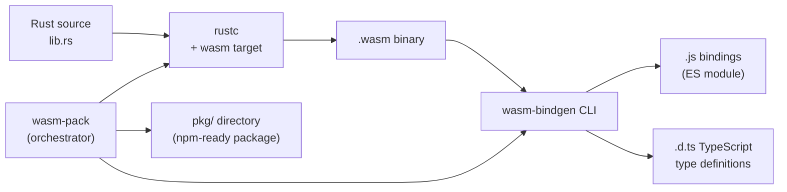

> **Prerequisites**: [[02-kien-truc-wasm-stack-machine|02. Kiến trúc Wasm — Stack Machine & Module]] — hiểu module, import/export. Biết Rust cơ bản (ownership, traits, crate system).
> **Objectives**:
> - Cài đặt và dùng `wasm-pack` để build Rust → Wasm
> - Hiểu macro `#[wasm_bindgen]` và cách nó sinh ra JS bindings
> - Export Rust functions, structs, và methods sang JavaScript
> - Import JavaScript functions (Web APIs) vào Rust
> - Dùng `js-sys` và `web-sys` để gọi browser APIs từ Rust
> - So sánh Rust/wasm-pack vs C++/Emscripten

---

## Concept — Tại sao Rust + Wasm là combo lý tưởng?

Rust và WebAssembly có nhiều điểm chung:

- **Không có garbage collector**: Cả Rust lẫn Wasm đều quản lý memory thủ công — Rust qua ownership system, Wasm qua linear memory. Không có GC pause, không có overhead.
- **Zero-cost abstractions**: Rust compile thành code rất compact và hiệu quả, phù hợp với Wasm binary size budget.
- **Safety by design**: Rust đảm bảo memory safety tại compile time → Wasm module từ Rust ít có buffer overflow hay use-after-free hơn so với C/C++.



**wasm-pack** là công cụ orchestrator — nó chạy `cargo build`, `wasm-bindgen`, tạo `package.json`, và đóng gói thành một npm package sẵn sàng publish.

---

## Tool & Setup

```bash
# Bước 1: Cài Rust (nếu chưa có)
curl --proto '=https' --tlsv1.2 -sSf https://sh.rustup.rs | sh

# Bước 2: Thêm Wasm compilation target
rustup target add wasm32-unknown-unknown

# Bước 3: Cài wasm-pack
cargo install wasm-pack
# hoặc
curl https://rustwasm.github.io/wasm-pack/installer/init.sh -sSf | sh

# Kiểm tra
wasm-pack --version
```

---

## API / Syntax — Cấu trúc project Rust Wasm

### Khởi tạo project

```bash
# Tạo project library mới
cargo new --lib my-wasm-lib
cd my-wasm-lib
```

### Cấu hình `Cargo.toml`

```toml
[package]
name = "my-wasm-lib"
version = "0.1.0"
edition = "2021"

[lib]
crate-type = ["cdylib"]

[dependencies]
wasm-bindgen = "0.2"
js-sys = "0.3"

[dependencies.web-sys]
version = "0.3"
features = [
  "console",
  "Window",
  "Document",
  "Element",
  "HtmlElement",
]

[profile.release]
opt-level = "s"
lto = true
```

> [!note] `crate-type = ["cdylib"]`
> Rust có nhiều kiểu crate output. `cdylib` (C dynamic library) tạo ra shared library — đây là kiểu bắt buộc khi muốn compile thành Wasm module. Nếu thiếu dòng này, `wasm-pack` sẽ báo lỗi.

### Macro `#[wasm_bindgen]` — Trái tim của wasm-bindgen

```rust
use wasm_bindgen::prelude::*;

// Export hàm đơn giản sang JavaScript
#[wasm_bindgen]
pub fn add(a: i32, b: i32) -> i32 {
    a + b
}

// Export hàm nhận và trả String
#[wasm_bindgen]
pub fn greet(name: &str) -> String {
    format!("Hello, {}!", name)
}

// Export struct và methods
#[wasm_bindgen]
pub struct Counter {
    value: i32,
}

#[wasm_bindgen]
impl Counter {
    #[wasm_bindgen(constructor)]
    pub fn new(initial: i32) -> Counter {
        Counter { value: initial }
    }

    pub fn increment(&mut self) {
        self.value += 1;
    }

    pub fn decrement(&mut self) {
        self.value -= 1;
    }

    pub fn get(&self) -> i32 {
        self.value
    }

    pub fn reset(&mut self) {
        self.value = 0;
    }
}
```

> [!info] `pub` là bắt buộc
> Chỉ những hàm và methods được đánh dấu `pub` mới có thể được `#[wasm_bindgen]` export. Private items bị ignored kể cả khi có macro.

---

## Import JavaScript vào Rust

`#[wasm_bindgen]` không chỉ export — còn có thể **import** JavaScript functions vào Rust:

```rust
use wasm_bindgen::prelude::*;

// Import hàm từ JavaScript
#[wasm_bindgen]
extern "C" {
    // Import window.alert
    fn alert(s: &str);

    // Import console.log (với namespace)
    #[wasm_bindgen(js_namespace = console)]
    fn log(s: &str);

    // Import với tên khác trong Rust
    #[wasm_bindgen(js_namespace = console, js_name = log)]
    fn console_log_u32(n: u32);

    // Import từ module JS (nếu dùng bundler)
    #[wasm_bindgen(module = "/js/utils.js")]
    fn get_timestamp() -> f64;
}

#[wasm_bindgen]
pub fn notify_user(msg: &str) {
    log(&format!("[Rust] {}", msg));
    alert(msg);
}
```

---

## js-sys và web-sys — Truy cập Browser APIs

Thay vì tự khai báo `extern "C"` cho từng browser API, dùng hai crate chính thức:

**`js-sys`**: Binding cho JavaScript built-in types (`Array`, `Object`, `Date`, `Math`, `Promise`...)

**`web-sys`**: Binding cho Web APIs (`console`, `Window`, `Document`, `fetch`, `Canvas`...)

```rust
use wasm_bindgen::prelude::*;
use web_sys::console;
use js_sys::Date;

#[wasm_bindgen]
pub fn log_current_time() {
    let now = Date::new_0();
    let time_str = now.to_iso_string();
    console::log_1(&format!("Current time: {}", time_str.as_string().unwrap()).into());
}

#[wasm_bindgen]
pub fn get_array_sum(arr: &js_sys::Array) -> f64 {
    let mut sum = 0.0_f64;
    for i in 0..arr.length() {
        if let Some(val) = arr.get(i).as_f64() {
            sum += val;
        }
    }
    sum
}
```

> [!tip] web-sys dùng feature flags
> `web-sys` có hơn 2000 binding khác nhau — mỗi API phải opt-in qua Cargo.toml `features`. Ví dụ, để dùng `console::log_1`, cần feature `"console"`.

---

## Worked Project — Image Processing Library

Ví dụ thực tế: Viết thư viện xử lý ảnh với Rust + Wasm.

```rust
use wasm_bindgen::prelude::*;

#[wasm_bindgen]
pub fn grayscale(pixels: &mut [u8]) {
    for chunk in pixels.chunks_mut(4) {
        if chunk.len() < 4 { break; }
        let r = chunk[0] as f32;
        let g = chunk[1] as f32;
        let b = chunk[2] as f32;
        let gray = (0.299 * r + 0.587 * g + 0.114 * b) as u8;
        chunk[0] = gray;
        chunk[1] = gray;
        chunk[2] = gray;
    }
}

#[wasm_bindgen]
pub fn invert(pixels: &mut [u8]) {
    for chunk in pixels.chunks_mut(4) {
        if chunk.len() < 4 { break; }
        chunk[0] = 255 - chunk[0];
        chunk[1] = 255 - chunk[1];
        chunk[2] = 255 - chunk[2];
    }
}

#[wasm_bindgen]
pub fn brightness(pixels: &mut [u8], delta: i32) {
    for chunk in pixels.chunks_mut(4) {
        if chunk.len() < 4 { break; }
        for i in 0..3 {
            let val = chunk[i] as i32 + delta;
            chunk[i] = val.clamp(0, 255) as u8;
        }
    }
}
```

```bash
# Build cho web (ES module, không cần bundler)
wasm-pack build --target web

# Build cho bundler (Webpack, Vite...)
wasm-pack build --target bundler

# Build cho Node.js
wasm-pack build --target nodejs

# Build release (nhỏ hơn, nhanh hơn)
wasm-pack build --release --target web
```

Sau khi build, `pkg/` directory chứa:

```text
pkg/
├── my_wasm_lib.js        ← JS glue (ES module)
├── my_wasm_lib.d.ts      ← TypeScript type definitions
├── my_wasm_lib_bg.wasm   ← Wasm binary
├── my_wasm_lib_bg.wasm.d.ts
└── package.json          ← npm package metadata
```

Dùng trong HTML:

```html
<!DOCTYPE html>
<html>
<body>
  <canvas id="canvas" width="400" height="300"></canvas>
  <button id="gray">Grayscale</button>
  <button id="invert">Invert</button>
  <script type="module">
    import init, { grayscale, invert, brightness } from './pkg/my_wasm_lib.js';

    async function main() {
      await init();  // Load và instantiate wasm module

      const canvas = document.getElementById('canvas');
      const ctx = canvas.getContext('2d');

      // Vẽ test image
      ctx.fillStyle = 'red';
      ctx.fillRect(0, 0, 200, 300);
      ctx.fillStyle = 'blue';
      ctx.fillRect(200, 0, 200, 300);

      document.getElementById('gray').onclick = () => {
        const imageData = ctx.getImageData(0, 0, canvas.width, canvas.height);
        grayscale(imageData.data);   // trực tiếp truyền Uint8ClampedArray
        ctx.putImageData(imageData, 0, 0);
      };

      document.getElementById('invert').onclick = () => {
        const imageData = ctx.getImageData(0, 0, canvas.width, canvas.height);
        invert(imageData.data);
        ctx.putImageData(imageData, 0, 0);
      };
    }

    main();
  </script>
</body>
</html>
```

> [!tip] Truyền trực tiếp `Uint8ClampedArray` vào Rust
> wasm-bindgen tự động convert `Uint8ClampedArray` (Canvas pixel data) thành `&mut [u8]` trong Rust — **zero-copy** khi data nằm trong Wasm memory. Đây là lợi thế lớn của Rust/wasm-bindgen so với tự build thủ công.

---

## Debugging — `console_error_panic_hook`

Mặc định, khi Rust panic trong Wasm, browser chỉ hiện thông báo mờ nhạt. Dùng `console_error_panic_hook` để có stack trace đầy đủ:

```toml
[dependencies]
console_error_panic_hook = "0.1"
```

```rust
use wasm_bindgen::prelude::*;

#[wasm_bindgen(start)]
pub fn start() {
    std::panic::set_hook(Box::new(console_error_panic_hook::hook));
}
```

`#[wasm_bindgen(start)]` đánh dấu hàm này chạy tự động khi module được instantiate.

---

## So sánh: Rust/wasm-pack vs C++/Emscripten

| Tiêu chí | Rust + wasm-pack | C++ + Emscripten |
|----------|-----------------|------------------|
| **Memory safety** | ✅ Compile-time (ownership) | ⚠️ Tự quản lý |
| **Binary size** | Rất nhỏ (không có runtime) | Lớn hơn (Emscripten runtime) |
| **Thời gian compile** | Nhanh (incremental) | Chậm hơn với -O2/-O3 |
| **Port code cũ** | ❌ Phải viết lại bằng Rust | ✅ Port C/C++ codebase trực tiếp |
| **String handling** | UTF-8 native, an toàn | Cần xử lý pointer thủ công |
| **TypeScript types** | ✅ Tự động generate .d.ts | ❌ Phải viết tay |
| **npm packaging** | ✅ wasm-pack tạo package.json | ❌ Phải tự cấu hình |
| **Async/Future** | ✅ `wasm-bindgen-futures` | ⚠️ Phức tạp hơn |
| **Ecosystem** | crates.io, Rust community | Rất rộng, nhiều libraries C++ |

> [!tip] Khi nào dùng cái nào?
> Chọn **Rust** khi: viết mới hoàn toàn, cần memory safety, muốn TypeScript types tự động, build npm package.
>
> Chọn **Emscripten/C++** khi: port code C++ cũ lên web, dùng thư viện C++ (OpenCV, SDL, Bullet...), cần POSIX compatibility.

---

## Summary / Key Takeaways

- **wasm-pack** là all-in-one tool: compile Rust → Wasm → tạo npm package hoàn chỉnh với TypeScript definitions.
- Macro `#[wasm_bindgen]` là cốt lõi: mark functions/structs để export sang JS, và import JS functions vào Rust.
- `crate-type = ["cdylib"]` trong `Cargo.toml` là **bắt buộc** khi build Wasm.
- `js-sys` và `web-sys` là binding sẵn có cho JS built-ins và browser Web APIs — không cần viết `extern "C"` thủ công.
- wasm-pack có nhiều **target**: `web` (ES module), `bundler` (Webpack/Vite), `nodejs` (Node.js).
- `console_error_panic_hook` là must-have trong development để xem Rust panic messages trong DevTools.
- Rust Wasm có lợi thế về **binary size** và **memory safety** so với C++/Emscripten; Emscripten thắng về khả năng **port code cũ**.

---

## References

- wasm-bindgen Book — https://rustwasm.github.io/docs/wasm-bindgen/
- wasm-pack Book — https://rustwasm.github.io/docs/wasm-pack/
- MDN — Rust to Wasm — https://developer.mozilla.org/en-US/docs/WebAssembly/Guides/Rust_to_Wasm
- web-sys docs — https://rustwasm.github.io/wasm-bindgen/api/web_sys/
- js-sys docs — https://rustwasm.github.io/wasm-bindgen/api/js_sys/
- *Rust and WebAssembly* book — https://rustwasm.github.io/docs/book/
