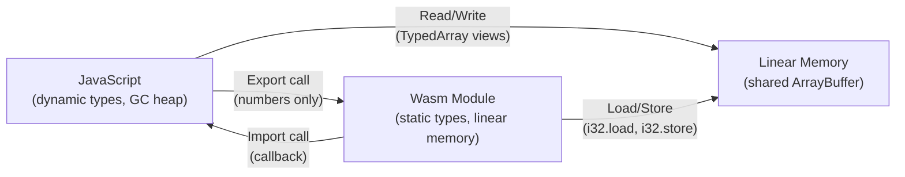

> **Prerequisites**: [[05-emscripten-bien-dich-c-cpp|05. Emscripten]] — biết cách biên dịch và load Wasm. [[02-kien-truc-wasm-stack-machine|02. Kiến trúc Wasm]] — hiểu import/export, linear memory, Table.
> **Objectives**:
> - Nắm vững toàn bộ WebAssembly JavaScript API: `instantiate`, `compile`, `Module`, `Instance`, `Memory`, `Table`
> - Hiểu các TypedArray views và cách đọc/ghi linear memory từ JS
> - Truyền strings, arrays, structs giữa JS và Wasm đúng cách
> - Gọi JS callback từ trong Wasm
> - Dùng `instantiateStreaming` cho performance tốt nhất

---

## Concept — Hai chiều của Interop

Wasm và JavaScript sống trong cùng một process nhưng có "ngôn ngữ" khác nhau. JavaScript dùng heap objects với GC; Wasm dùng linear memory thủ công. Giao tiếp giữa hai bên có hai chiều:



> [!note] Giới hạn cơ bản của Wasm/JS boundary
> Wasm function chỉ nhận và trả về **numbers** (`i32`, `i64`, `f32`, `f64`). Không thể trực tiếp truyền string, array, hay object qua function call. Mọi dữ liệu phức tạp phải được **serialize vào linear memory** trước, rồi truyền **pointer (i32)** tới vùng nhớ đó.

---

## API / Syntax — WebAssembly JavaScript API

### 1. `WebAssembly.instantiateStreaming` — Cách khuyến nghị

```javascript
// Cách tốt nhất — streaming compile (song song tải và compile)
const { module, instance } = await WebAssembly.instantiateStreaming(
  fetch('module.wasm'),
  importObject          // cung cấp imports cho module
);
```

`instantiateStreaming` cho phép trình duyệt **bắt đầu compile bytecode trong khi file đang tải** — không cần chờ tải xong toàn bộ. Nhanh hơn đáng kể so với `instantiate` cho file lớn.

> [!warning] Yêu cầu MIME type đúng
> Server phải trả về header `Content-Type: application/wasm`. Nếu dùng file server tự xây, cần cấu hình thêm. Dùng `fetch` + `ArrayBuffer` nếu không kiểm soát được server.

### 2. `WebAssembly.instantiate` — Từ ArrayBuffer

```javascript
// Load từ ArrayBuffer (dùng khi server không set đúng MIME type)
const response = await fetch('module.wasm');
const bytes = await response.arrayBuffer();
const { module, instance } = await WebAssembly.instantiate(bytes, importObject);
```

### 3. `WebAssembly.compile` — Tách compile và instantiate

```javascript
// Compile một lần, instantiate nhiều lần (nhiều instance)
const module = await WebAssembly.compile(bytes);

const instance1 = await WebAssembly.instantiate(module, importObject1);
const instance2 = await WebAssembly.instantiate(module, importObject2);
// instance1 và instance2 dùng chung code nhưng có memory và state riêng
```

### 4. Import Object — Cung cấp môi trường cho Module

```javascript
const importObject = {
  // Namespace "env" — thường dùng cho C/C++ runtime
  env: {
    // Import function
    log_number: (n) => console.log('Wasm:', n),

    // Import memory (thay vì để Wasm tự tạo)
    memory: new WebAssembly.Memory({ initial: 1, maximum: 10 }),

    // Import global
    PI: new WebAssembly.Global({ value: 'f64', mutable: false }, Math.PI),
  },

  // Namespace tùy ý
  math: {
    sin: Math.sin,
    cos: Math.cos,
    sqrt: Math.sqrt,
  }
};
```

> [!warning] Namespace phải khớp với `import` trong WAT
> Nếu WAT có `(import "env" "log_number" ...)`, importObject phải có `env.log_number`. Sai namespace → `LinkError: import object field not found`.

### 5. Truy cập exports

```javascript
const { instance } = await WebAssembly.instantiateStreaming(fetch('mod.wasm'));
const exports = instance.exports;

// Gọi exported function
const result = exports.add(3, 4);          // trả về number

// Truy cập exported memory
const memory = exports.memory;             // WebAssembly.Memory object
const buffer = memory.buffer;             // ArrayBuffer

// Truy cập exported global
const counter = exports.counter;          // WebAssembly.Global object
console.log(counter.value);              // đọc giá trị
counter.value = 42;                      // ghi (nếu mutable)

// Truy cập exported table
const table = exports.table;             // WebAssembly.Table object
```

---

## Linear Memory — Đọc/Ghi từ JavaScript

Linear memory là cầu nối thực sự giữa JS và Wasm. JavaScript truy cập nó qua **TypedArray views**:

### TypedArray Views

```javascript
const memory = new WebAssembly.Memory({ initial: 1 });
const buf = memory.buffer;  // ArrayBuffer — raw bytes

// Các view khác nhau lên cùng một vùng nhớ
const view8   = new Uint8Array(buf);    // byte-by-byte (u8)
const view16  = new Uint16Array(buf);   // 2-byte words
const view32  = new Int32Array(buf);    // 4-byte signed int
const viewU32 = new Uint32Array(buf);   // 4-byte unsigned int
const viewF32 = new Float32Array(buf);  // 4-byte float
const viewF64 = new Float64Array(buf);  // 8-byte double
```

> [!info] Endianness
> Wasm memory luôn là **little-endian** bất kể nền tảng. `Int32Array` và `DataView` đọc/ghi theo little-endian — phù hợp với Wasm.

### Đọc và Ghi dữ liệu cơ bản

```javascript
const mem = new WebAssembly.Memory({ initial: 1 });
const i32 = new Int32Array(mem.buffer);
const f64 = new Float64Array(mem.buffer);
const u8  = new Uint8Array(mem.buffer);

// Ghi i32 vào địa chỉ 0 (index 0 của Int32Array = byte 0)
i32[0] = 42;
i32[1] = -7;         // byte 4..7

// Ghi f64 vào địa chỉ 16 (index 2 của Float64Array = byte 16)
f64[2] = 3.14159;

// Đọc byte thô
console.log(u8[0]);  // byte 0 (thấp nhất của i32[0] = 42)
console.log(u8[3]);  // byte 3 (cao nhất của i32[0] = 0)
```

### Truyền String từ JS → Wasm

Wasm không hiểu JS string natively. Phải encode thành bytes trong linear memory:

```javascript
async function callWasmWithString(instance, strPtr, str) {
  const memory = instance.exports.memory;
  const view = new Uint8Array(memory.buffer);

  // Encode string thành UTF-8 bytes
  const encoder = new TextEncoder();
  const bytes = encoder.encode(str);

  // Ghi bytes vào linear memory tại địa chỉ strPtr
  view.set(bytes, strPtr);
  view[strPtr + bytes.length] = 0;  // null terminator (C convention)

  return bytes.length;
}

async function readStringFromWasm(instance, ptr, maxLen = 256) {
  const view = new Uint8Array(instance.exports.memory.buffer);

  // Đọc cho đến null terminator
  let end = ptr;
  while (end < ptr + maxLen && view[end] !== 0) end++;

  const bytes = view.slice(ptr, end);
  return new TextDecoder('utf-8').decode(bytes);
}

// Ví dụ sử dụng
const { instance } = await WebAssembly.instantiateStreaming(fetch('str.wasm'));
const PTR = 1024;   // địa chỉ trong linear memory để đặt string

await callWasmWithString(instance, PTR, 'Hello, Wasm!');
const result = instance.exports.reverse_string(PTR);  // Wasm xử lý string
const reversed = await readStringFromWasm(instance, result);
console.log(reversed);  // !masW ,olleH
```

### Truyền Array từ JS → Wasm

```javascript
function writeArray(memory, ptr, typedArray) {
  const view = new Uint8Array(memory.buffer);
  view.set(new Uint8Array(typedArray.buffer), ptr);
}

function readArray(memory, ptr, length, TypedArrayClass) {
  const buf = memory.buffer.slice(ptr, ptr + length * TypedArrayClass.BYTES_PER_ELEMENT);
  return new TypedArrayClass(buf);
}

const { instance } = await WebAssembly.instantiateStreaming(fetch('sort.wasm'));
const memory = instance.exports.memory;

// Đặt mảng tại địa chỉ 0 trong linear memory
const inputArr = new Int32Array([5, 3, 8, 1, 9, 2, 7]);
writeArray(memory, 0, inputArr);

// Gọi hàm Wasm sort với pointer và độ dài
instance.exports.sort_array(0, inputArr.length);

// Đọc kết quả đã sắp xếp
const sorted = readArray(memory, 0, inputArr.length, Int32Array);
console.log([...sorted]);  // [1, 2, 3, 5, 7, 8, 9]
```

---

## WebAssembly.Table — Gọi hàm Gián tiếp

`WebAssembly.Table` là mảng chứa function references. Dùng để:
- Implement function pointers (C/C++)
- Callbacks — JS cung cấp function, Wasm gọi qua `call_indirect`

```javascript
// Tạo table với 3 slot, kiểu funcref
const table = new WebAssembly.Table({ initial: 3, element: 'anyfunc' });

// Đặt JS functions vào table
table.set(0, (a, b) => a + b);
table.set(1, (a, b) => a * b);
table.set(2, (a, b) => Math.max(a, b));

// Import table vào Wasm
const { instance } = await WebAssembly.instantiateStreaming(fetch('callbacks.wasm'), {
  env: { table }
});

// Wasm có thể gọi bất kỳ slot nào qua call_indirect
const result = instance.exports.apply_op(0, 3, 4);  // gọi table[0](3,4) = 7
```

---

## Design Pattern — Patterns Interop Hiệu Quả

### Pattern 1: Pre-allocated scratch buffer

Thay vì `malloc/free` cho mỗi lần gọi, cấp phát một buffer cố định khi khởi động:

```javascript
const SCRATCH_SIZE = 4096;  // 4KB scratch buffer
let scratchPtr;

const { instance } = await WebAssembly.instantiateStreaming(fetch('mod.wasm'));
scratchPtr = instance.exports.get_scratch_buffer();  // Wasm trả về fixed ptr

function callWasmWithData(data) {
  const view = new Uint8Array(instance.exports.memory.buffer);
  view.set(data, scratchPtr);
  return instance.exports.process(scratchPtr, data.length);
}
```

### Pattern 2: Invalidated view sau memory.grow

> [!danger] TypedArray bị invalidate khi memory grow
> Khi Wasm gọi `memory.grow` hoặc JavaScript gọi `memory.grow(n)`, **ArrayBuffer cũ bị detach** (trở thành 0-byte). Mọi TypedArray view tạo từ buffer cũ đều không còn hợp lệ.
>
> ```javascript
> const mem = new WebAssembly.Memory({ initial: 1 });
> let view = new Uint8Array(mem.buffer);  // view hợp lệ
>
> mem.grow(1);   // grow thêm 1 page
>
> // BUG: view.buffer đã bị detach!
> view[0] = 42;  // lỗi hoặc silently ignored
>
> // Phải tạo view mới sau khi grow:
> view = new Uint8Array(mem.buffer);  // view mới từ buffer mới
> ```
>
> Emscripten xử lý điều này bằng cách gọi `updateMemoryViews()` sau mỗi `memory.grow`.

### Pattern 3: DataView cho mixed-type structs

Khi đọc struct C có nhiều kiểu dữ liệu, dùng `DataView` thay vì TypedArray để kiểm soát offset chính xác:

```javascript
// C struct: { int32_t x; float y; uint8_t flags; }
// Size: 4 + 4 + 1 = 9 bytes (nhưng thường được pad thành 12)
function readStruct(memory, ptr) {
  const dv = new DataView(memory.buffer, ptr);
  return {
    x:     dv.getInt32(0, true),   // true = little-endian
    y:     dv.getFloat32(4, true),
    flags: dv.getUint8(8)
  };
}
```

---

## Worked Project — Calculator với Callbacks

Một module Wasm tính biểu thức, gọi JS callback mỗi khi có kết quả trung gian:

```wat
;; calculator.wat
(module
  (import "callbacks" "on_step" (func $on_step (param i32 i32)))

  (func $add_and_report (param $a i32) (param $b i32) (result i32)
    local.get $a
    local.get $b
    i32.add
    ;; gọi callback với (step=1, result=a+b)
    i32.const 1
    local.get $a
    local.get $b
    i32.add
    call $on_step
    ;; trả về kết quả
    local.get $a
    local.get $b
    i32.add
  )

  (export "add_and_report" (func $add_and_report))
)
```

```javascript
const steps = [];

const importObject = {
  callbacks: {
    on_step: (stepId, value) => {
      steps.push({ stepId, value });
      console.log(`Step ${stepId}: ${value}`);
    }
  }
};

const { instance } = await WebAssembly.instantiateStreaming(
  fetch('calculator.wasm'), importObject
);

const result = instance.exports.add_and_report(10, 32);
console.log('Final result:', result);  // 42
console.log('Steps:', steps);          // [{stepId: 1, value: 42}]
```

---

## Common Pitfalls

> [!warning] `i64` không truyền trực tiếp qua JS/Wasm boundary
> JavaScript `Number` chỉ chính xác đến 53-bit (double precision float). Wasm `i64` là 64-bit integer — nếu gọi hàm Wasm có param/return `i64` từ JS, sẽ nhận về `BigInt`, không phải `Number`. Phải dùng BigInt literals: `instance.exports.u64_func(100n)`.

> [!warning] `fetch` cần server — không dùng được với `file://`
> `instantiateStreaming(fetch(...))` yêu cầu HTTP server. Mở `index.html` trực tiếp qua `file://` → CORS error. Dùng `python3 -m http.server 8080` để test local.

> [!warning] Import object phải đầy đủ
> Mọi `import` trong WAT/Wasm đều phải được cung cấp trong `importObject` khi instantiate. Thiếu một import → `WebAssembly.LinkError`. Không thể instantiate partial.

---

## Summary / Key Takeaways

- **`instantiateStreaming`** là cách tốt nhất — streaming compile song song với tải file.
- Wasm function chỉ nhận/trả **numbers**. Dữ liệu phức tạp (string, array, struct) phải đi qua **linear memory** với pointer.
- JavaScript truy cập linear memory qua **TypedArray views** (`Uint8Array`, `Int32Array`, `Float64Array`...) trên `memory.buffer`.
- **TypedArray bị invalidate** sau `memory.grow` — phải tạo view mới từ `memory.buffer` mới.
- **`WebAssembly.Table`** cho phép import JS functions vào Wasm làm callbacks — thực thi qua `call_indirect`.
- Truyền string: encode UTF-8 → ghi vào memory → truyền `(ptr, len)`. Đọc string: đọc bytes từ memory → decode UTF-8.
- `i64` ↔ JS cần `BigInt` — không dùng `Number` thông thường.

---

## References

- MDN — Using the WebAssembly JavaScript API — https://developer.mozilla.org/en-US/docs/WebAssembly/Guides/Using_the_JavaScript_API
- MDN — WebAssembly.Memory — https://developer.mozilla.org/en-US/docs/WebAssembly/Reference/JavaScript_interface/Memory
- MDN — WebAssembly.Table — https://developer.mozilla.org/en-US/docs/WebAssembly/Reference/JavaScript_interface/Table
- WebAssembly JS API Spec — https://webassembly.github.io/spec/js-api/
