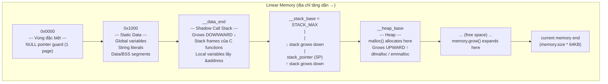
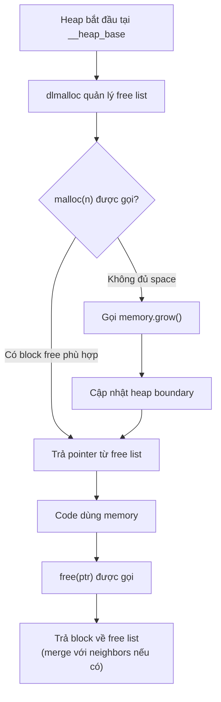

> **Prerequisites**: [[07-javascript-wasm-interop|07. JavaScript ↔ Wasm Interop]] — biết TypedArray views, linear memory là gì. [[02-kien-truc-wasm-stack-machine|02. Kiến trúc Wasm]] — hiểu stack machine, linear memory section.
> **Objectives**:
> - Hiểu layout đầy đủ của linear memory: static data, stack, heap
> - Phân biệt Wasm value stack (thực thi) vs call stack (linear memory)
> - Nắm cơ chế `memory.grow` và hệ quả khi gọi nó
> - Hiểu cách `malloc`/`free` hoạt động trong Wasm context
> - Nhận biết và tránh các lỗi memory phổ biến: leak, use-after-free, buffer overflow
> - Hiểu tại sao memory management trong Wasm quan trọng cho security

---

## Concept — Hai loại "Stack" trong Wasm

Trước khi đi sâu vào memory layout, cần phân biệt hai thứ hay gây nhầm lẫn:

> [!note] Phân biệt hai loại stack
> **1. Value Stack (execution stack)**: Stack ảo của máy tính Wasm — nơi instructions push/pop operands khi tính toán. Stack này **nằm ngoài linear memory**, được VM quản lý nội bộ, JavaScript và Wasm code không truy cập trực tiếp được.
>
> **2. Call Stack (shadow stack)**: Stack lưu trữ stack frame của function calls khi code C/C++ compiled sang Wasm — local variables, return addresses, saved registers. Stack này **nằm trong linear memory**, ở vùng địa chỉ thấp ngay sau static data.

Lý do cần shadow call stack: C/C++ cho phép lấy địa chỉ của biến local (`int* p = &x`). Địa chỉ đó phải có giá trị cụ thể trong linear memory — Wasm value stack không có địa chỉ như vậy.

---

## Linear Memory Layout

Khi code C/C++ được biên dịch sang Wasm qua Emscripten, linear memory được tổ chức theo layout cố định:



Các địa chỉ ranh giới quan trọng (Emscripten exports chúng):

| Symbol | Ý nghĩa |
|--------|---------|
| `__data_end` | Kết thúc vùng static data |
| `__stack_base` | Đỉnh call stack (địa chỉ cao nhất) |
| `__heap_base` | Bắt đầu heap |
| `__stack_pointer` (global) | Con trỏ stack hiện tại |

> [!info] Stack grows DOWN, Heap grows UP
> Shadow call stack của C **mở rộng về phía địa chỉ thấp** (giống x86 native). Khi function được gọi, `__stack_pointer` giảm xuống. Khi function return, `__stack_pointer` tăng lại.
>
> Heap `malloc` **mở rộng về phía địa chỉ cao**. Nếu heap và stack "chạm nhau" → stack overflow / heap corruption.

---

## `memory.grow` — Mở rộng Linear Memory

Wasm memory có thể tăng kích thước lúc runtime bằng instruction `memory.grow`:

```wat
;; Trong WAT — tăng thêm 1 page (64KB)
memory.size          ;; push số page hiện tại lên stack
i32.const 1
memory.grow          ;; pop 1, tăng thêm 1 page, push số page cũ (hoặc -1 nếu fail)
i32.const -1
i32.eq
if
  unreachable        ;; fail: không đủ memory
end
```

Tương đương trong JavaScript:

```javascript
const memory = instance.exports.memory;

const oldSize = memory.grow(2);   // tăng thêm 2 pages = 128KB
if (oldSize === -1) {
  throw new Error('memory.grow failed');
}
console.log(`Old: ${oldSize} pages → New: ${memory.buffer.byteLength / 65536} pages`);
```

> [!danger] Sau `memory.grow` — ArrayBuffer cũ bị detach
> Khi `memory.grow` được gọi (từ Wasm hoặc JS), engine WebAssembly phải tạo một `ArrayBuffer` mới lớn hơn. **Buffer cũ bị detach ngay lập tức** — `byteLength` trở thành 0.
>
> ```javascript
> const mem = new WebAssembly.Memory({ initial: 1 });
> const old_view = new Uint8Array(mem.buffer);  // view từ page 1
>
> mem.grow(1);  // thêm 1 page
>
> console.log(old_view.buffer.byteLength);  // 0 — đã bị detach!
>
> // Phải lấy buffer mới:
> const new_view = new Uint8Array(mem.buffer);
> console.log(new_view.byteLength);  // 131072 (2 pages)
> ```

---

## Heap Allocator — malloc/free trong Wasm

Wasm không có heap allocator built-in. Emscripten tích hợp sẵn **dlmalloc** (Doug Lea malloc) hoặc **emmalloc** (Emscripten's minimal malloc).

### Cơ chế hoạt động đơn giản



### Không có GC — Hệ quả quan trọng

> [!warning] Wasm không có Garbage Collector (mặc định)
> Memory cấp phát qua `malloc` **không tự giải phóng**. Lập trình viên phải gọi `free` tương ứng. Khi code C/C++ được port sang Wasm, mọi bug memory của code gốc đều được mang theo.
>
> **WasmGC** là proposal (đã ship trong Chrome 119, Firefox 120) cho phép ngôn ngữ GC-based (Java, Kotlin, C#) compile sang Wasm với GC tích hợp. Nhưng với C/C++ và Rust, memory vẫn là thủ công.

### Ví dụ: Observe heap layout từ JavaScript

```javascript
const mod = await MathModule();

console.log('Heap base:', mod.HEAPU8.byteLength);

const ptr1 = mod._malloc(100);   // cấp 100 bytes
const ptr2 = mod._malloc(200);   // cấp 200 bytes
const ptr3 = mod._malloc(50);    // cấp 50 bytes

console.log(`ptr1: 0x${ptr1.toString(16)}`);
console.log(`ptr2: 0x${ptr2.toString(16)}`);
console.log(`ptr3: 0x${ptr3.toString(16)}`);

mod._free(ptr2);   // giải phóng block giữa
const ptr4 = mod._malloc(150);  // có thể tái dùng vùng của ptr2

console.log(`ptr4: 0x${ptr4.toString(16)}`);  // ~= ptr2 nếu block được reuse

mod._free(ptr1);
mod._free(ptr3);
mod._free(ptr4);
```

---

## Các Lỗi Memory Phổ Biến trong Wasm

### 1. Memory Leak

```c
void process(int n) {
    int* buffer = malloc(n * sizeof(int));
    // ... xử lý ...
    // BUG: quên gọi free(buffer)
    // buffer leak mỗi lần gọi hàm này
}
```

Trong Wasm, heap bị fill dần. Khi heap đầy, `memory.grow` được gọi liên tục → file `.wasm` tiêu thụ ngày càng nhiều RAM trình duyệt.

### 2. Use-After-Free

```c
int* ptr = malloc(sizeof(int));
*ptr = 42;
free(ptr);
*ptr = 99;   // BUG: dùng sau khi free — undefined behavior
```

Trong Wasm: **không có segfault** vì memory access không bị restrict bởi OS. Sau `free`, vùng nhớ đó có thể được `malloc` lại. Ghi vào `ptr` sau `free` có thể **corrupt heap metadata** hoặc **overwrite dữ liệu của allocation khác** → security vulnerability.

### 3. Buffer Overflow — Security Critical

```c
void copy_input(char* dest, const char* src) {
    strcpy(dest, src);   // BUG: không kiểm tra độ dài
}

// Caller:
char buf[16];
copy_input(buf, "AAAAAAAAAAAAAAAAAAAAAAAAAAAAAAAAA");
// ghi 33 bytes vào buffer 16 bytes → overflow
```

Trong **native code** (x86), buffer overflow trên stack thường overwrite **return address** → code execution. Trong **Wasm**, call stack không ở trong linear memory theo cách thông thường — direct return address overwrite khó hơn.

Nhưng vẫn có attack vectors:

> [!danger] Buffer Overflow Attack Surface trong Wasm
> Dù không overwrite return address trực tiếp, buffer overflow trong Wasm vẫn có thể:
>
> 1. **Overwrite adjacent heap objects**: Nếu hai allocations liền kề, overflow A có thể ghi lên B — thay đổi dữ liệu của B
> 2. **Corrupt heap metadata**: dlmalloc lưu metadata (size, flags) ngay cạnh data. Corrupt metadata → `free()` crash hoặc arbitrary write khi realloc
> 3. **Overwrite global variables**: Nếu overflow đủ lớn để vượt qua heap, có thể overwrite global variables trong data segment
> 4. **Table poisoning**: Nếu function pointer (Table index) nằm gần overflow target → control flow hijack qua `call_indirect`
>
> Bạn sẽ học exploit techniques chi tiết trong [[15-wasm-exploitation|15. Wasm Exploitation]].

### 4. Stack Overflow (Shadow Call Stack)

```c
int infinite_recursion(int n) {
    return infinite_recursion(n + 1);  // không có base case
}
```

Call stack C/C++ nằm trong linear memory. Khi stack overflow (stack pointer vượt qua `__heap_base`), stack bắt đầu ghi đè lên heap — **stack-heap collision** → silent data corruption.

---

## Strategies Quản lý Memory Tốt trong Wasm

### 1. Sử dụng RAII trong C++ (luôn free trong destructor)

```cpp
class WasmBuffer {
    void* ptr;
    size_t size;
public:
    WasmBuffer(size_t n) : size(n) {
        ptr = malloc(n);
    }
    ~WasmBuffer() {
        free(ptr);     // tự động free khi object ra khỏi scope
    }
    void* get() { return ptr; }
};

void process(int n) {
    WasmBuffer buf(n * sizeof(int));
    // ... dùng buf.get() ...
}   // ~WasmBuffer() tự động gọi khi hàm kết thúc
```

### 2. Sử dụng `ALLOW_MEMORY_GROWTH` kèm giám sát

```bash
emcc code.cpp -o out.js \
  -s ALLOW_MEMORY_GROWTH=1 \
  -s MAXIMUM_MEMORY=256MB \
  -s ABORTING_MALLOC=0        # malloc trả 0 thay vì abort khi fail
```

### 3. Rust — ownership system phòng ngừa tại compile time

```rust
fn process() {
    let buffer: Vec<i32> = vec![1, 2, 3, 4, 5];
    // buffer được drop tự động khi hàm kết thúc
    // KHÔNG thể use-after-free trong safe Rust
}   // drop(buffer) tự động
```

Đây là lý do **Rust là ngôn ngữ an toàn nhất** để viết Wasm modules.

---

## Monitoring Memory trong DevTools

Chrome DevTools cho phép inspect linear memory của Wasm module đang chạy:

```javascript
// In Chrome DevTools Console — khi đang debug Wasm
const instance = /* lấy từ somewhere */;
const memory = instance.exports.memory;

// Xem memory size
console.log(`Memory: ${memory.buffer.byteLength / 1024 / 1024} MB`);

// Kiểm tra vùng cụ thể
const view = new Uint8Array(memory.buffer);
console.log('Byte tại địa chỉ 1024:', view[1024]);

// Tìm pattern trong memory (để debug)
function findBytes(memory, pattern) {
  const buf = new Uint8Array(memory.buffer);
  for (let i = 0; i <= buf.length - pattern.length; i++) {
    let match = true;
    for (let j = 0; j < pattern.length; j++) {
      if (buf[i + j] !== pattern[j]) { match = false; break; }
    }
    if (match) return i;
  }
  return -1;
}

const ptr = findBytes(memory, [72, 101, 108, 108, 111]);  // "Hello"
console.log('Found "Hello" at:', ptr);
```

---

## Summary / Key Takeaways

- Linear memory có **hai vùng stack**: Wasm value stack (ngoài memory, cho VM) và shadow call stack C/C++ (trong memory, grows down).
- **Layout**: Static Data → Shadow Stack (↓) → Heap (↑) → free space.
- `memory.grow` tạo `ArrayBuffer` mới — mọi TypedArray view cũ bị **invalidate ngay lập tức**.
- Wasm không có GC (trừ WasmGC proposal) — mọi `malloc` phải có `free` tương ứng.
- **Buffer overflow** trong Wasm không thể overwrite return address trực tiếp, nhưng vẫn nguy hiểm: corrupt heap metadata, overwrite adjacent allocations, Table poisoning.
- **Rust** ngăn chặn use-after-free và buffer overflow tại compile time nhờ ownership system — lý do Rust là lựa chọn an toàn nhất cho Wasm.
- Dùng **Chrome DevTools** hoặc TypedArray từ JS để inspect và debug linear memory runtime.

---

## References

- walloc — WebAssembly malloc implementation — https://github.com/wingo/walloc
- MDN — WebAssembly.Memory — https://developer.mozilla.org/en-US/docs/WebAssembly/Reference/JavaScript_interface/Memory
- *A practical guide to WebAssembly memory* — Radu Matei — https://radu-matei.com/blog/practical-guide-to-wasm-memory/
- Emscripten Memory Settings — https://emscripten.org/docs/tools_reference/settings_reference.html
- Wasm Linear Memory Security — [[12-wasm-security-model|12. Wasm Security Model]]
