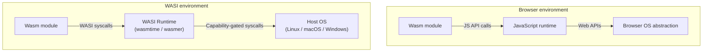
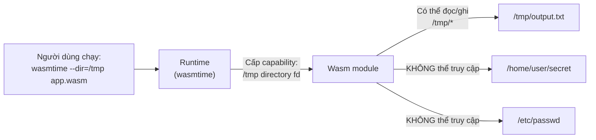
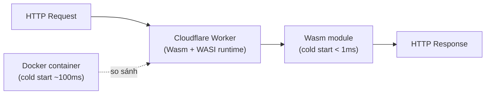

> **Prerequisites**: [[05-emscripten-bien-dich-c-cpp|05. Emscripten]] và [[06-rust-wasm-pack|06. Rust + wasm-pack]] — biết cách compile code sang `.wasm`. [[02-kien-truc-wasm-stack-machine|02. Kiến trúc Wasm]] — hiểu import/export, isolation model.
> **Objectives**:
> - Hiểu vì sao Wasm cần WASI để chạy ngoài trình duyệt
> - Nắm mô hình capability-based security của WASI
> - Cài đặt và dùng wasmtime / wasmer để chạy Wasm standalone
> - Compile Rust → WASI binary và chạy CLI app
> - Biết sự khác biệt giữa WASI 0.1 (Preview 1) và WASI 0.2 (Preview 2)
> - Hiểu vị trí của WASI trong hệ sinh thái cloud-native

---

## Concept — Vấn đề Wasm trong Browser

Wasm trên trình duyệt bị giới hạn nghiêm ngặt: mọi I/O đều phải đi qua JavaScript. Muốn đọc file? Gọi JS. Muốn mở socket? Gọi JS. Muốn lấy thời gian hiện tại? Gọi JS.

Điều này ổn cho browser — nhưng nếu muốn chạy Wasm như một **standalone process** trên server, IoT, hay edge computing thì sao? Không có JavaScript ở đó. Cần một interface khác để Wasm giao tiếp với hệ điều hành.

> [!note] Định nghĩa WASI
> **WASI (WebAssembly System Interface)** là tập hợp các API chuẩn hóa cho phép Wasm module tương tác với tài nguyên hệ thống — file system, network, clock, random, environment variables — một cách **portable** và **sandboxed**, không phụ thuộc vào trình duyệt hay JavaScript.
>
> WASI đóng vai trò tương tự POSIX với Unix: một lớp abstraction chuẩn giữa application và OS.



Câu nói nổi tiếng của Solomon Hykes (đồng sáng lập Docker): *"Nếu WASM+WASI tồn tại từ năm 2008, chúng tôi đã không cần tạo ra Docker."*

---

## Capability-Based Security — Mô hình Bảo mật WASI

WASI không chỉ là syscall interface — nó còn mang theo một mô hình bảo mật hoàn toàn mới: **capability-based security**.

> [!note] Capability-Based Security là gì?
> Trong Unix truyền thống, process có thể truy cập bất kỳ file nào nếu có đủ permissions (dựa trên UID/GID). Capability model khác: **process chỉ có thể truy cập tài nguyên mà nó được cấp handle cụ thể** — không có "ambient authority".
>
> Tương tự như: bạn đưa cho khách chìa khóa phòng 101, không có nghĩa là họ có thể vào phòng 102. Và không ai có thể "escalate" sang phòng khác chỉ vì họ đang ở trong tòa nhà.

Trong WASI:
- Module **không thể mở file** trừ khi runtime cấp cho nó file descriptor của thư mục cụ thể
- Module **không thể tạo socket** trừ khi runtime cho phép networking
- Module **không thể đọc env var** trừ khi runtime expose chúng



---

## Tool & Setup — Cài đặt Runtime

### Wasmtime — Runtime chính thức từ Bytecode Alliance

```bash
# Linux / macOS
curl https://wasmtime.dev/install.sh -sSf | bash

# Hoặc qua cargo
cargo install wasmtime-cli

# Kiểm tra
wasmtime --version
# wasmtime-cli 29.x.x
```

### Wasmer — Runtime đa năng

```bash
curl https://get.wasmer.io -sSfL | sh
wasmer --version
```

### WasmEdge — Runtime cho edge và AI

```bash
curl -sSfL https://raw.githubusercontent.com/WasmEdge/WasmEdge/master/utils/install.sh | bash
```

---

## API / Syntax — Chạy WASI module với Wasmtime

### Chạy cơ bản

```bash
# Chạy một WASI binary đơn giản
wasmtime hello.wasm

# Truyền arguments vào module
wasmtime app.wasm -- arg1 arg2 arg3

# Set environment variables
wasmtime --env KEY=VALUE app.wasm

# Cấp quyền truy cập thư mục
wasmtime --dir /tmp app.wasm                   # truy cập /tmp
wasmtime --dir /data:/mnt/data app.wasm        # map /data của host thành /mnt/data trong wasm

# Cấp quyền network (WASI 0.2+)
wasmtime --allow-ip-name-lookup app.wasm
```

### Chạy với nhiều capabilities

```bash
wasmtime \
  --dir /tmp \
  --dir /var/data:/data \
  --env DATABASE_URL=postgres://localhost/mydb \
  --env LOG_LEVEL=info \
  -- server.wasm --port 8080
```

---

## Worked Project — Viết WASI App bằng Rust

### Bước 1: Tạo Rust CLI app

```rust
use std::env;
use std::fs;
use std::io::{self, BufRead, Write};
use std::path::Path;

fn main() {
    let args: Vec<String> = env::args().collect();

    if args.len() < 2 {
        eprintln!("Cách dùng: {} <file>", args[0]);
        std::process::exit(1);
    }

    let filename = &args[1];
    let path = Path::new(filename);

    match fs::read_to_string(path) {
        Ok(content) => {
            let line_count = content.lines().count();
            let word_count: usize = content.split_whitespace().count();
            let byte_count = content.len();

            println!("File: {}", filename);
            println!("Lines: {}", line_count);
            println!("Words: {}", word_count);
            println!("Bytes: {}", byte_count);
        }
        Err(e) => {
            eprintln!("Lỗi đọc file '{}': {}", filename, e);
            std::process::exit(1);
        }
    }
}
```

### Bước 2: Thêm WASI target và compile

```bash
# Thêm WASI target vào Rust toolchain
rustup target add wasm32-wasip1

# Compile thành WASI binary (WASI 0.1 / Preview 1)
cargo build --target wasm32-wasip1 --release

# Binary ở: target/wasm32-wasip1/release/my_app.wasm
```

### Bước 3: Chạy với wasmtime

```bash
# Tạo file test
echo "Hello WASI world\nThis is a test\nThree lines" > /tmp/test.txt

# Chạy app (cấp quyền đọc /tmp)
wasmtime --dir /tmp \
  target/wasm32-wasip1/release/my_app.wasm \
  -- /tmp/test.txt

# Output:
# File: /tmp/test.txt
# Lines: 3
# Words: 9
# Bytes: 44
```

### Bước 4: Dùng Wasmtime programmatically từ Rust host

```rust
use wasmtime::*;
use wasmtime_wasi::WasiCtxBuilder;

fn main() -> Result<()> {
    let engine = Engine::default();
    let mut linker = Linker::new(&engine);
    wasmtime_wasi::add_to_linker_sync(&mut linker, |s| s)?;

    // Cấu hình WASI capabilities
    let wasi = WasiCtxBuilder::new()
        .inherit_stdio()                     // cho phép print ra stdout
        .inherit_env()?                      // truyền env vars từ host
        .preopened_dir("/tmp", "/tmp")?      // cấp quyền truy cập /tmp
        .args(&["app", "/tmp/test.txt"])?    // command line args
        .build();

    let mut store = Store::new(&engine, wasi);

    // Load và instantiate module
    let module = Module::from_file(&engine, "my_app.wasm")?;
    let instance = linker.instantiate(&mut store, &module)?;

    // Gọi _start (entry point của WASI app)
    let start = instance.get_typed_func::<(), ()>(&mut store, "_start")?;
    start.call(&mut store, ())?;

    Ok(())
}
```

---

## WASI APIs — Các syscall quan trọng

WASI được tổ chức thành các **worlds** (tập hợp interfaces). WASI 0.2 bao gồm:

| World / Interface | Syscalls | Mô tả |
|-------------------|----------|-------|
| `wasi:filesystem` | `open`, `read`, `write`, `seek`, `stat`... | File và directory operations |
| `wasi:clocks` | `now`, `resolution` | Wall clock và monotonic clock |
| `wasi:random` | `get-random-bytes` | Cryptographically secure random |
| `wasi:sockets` | `tcp-socket`, `udp-socket` | Network sockets (WASI 0.2+) |
| `wasi:http` | `outgoing-handler`, `incoming-handler` | HTTP client/server (WASI 0.2+) |
| `wasi:cli` | `stdin`, `stdout`, `stderr`, `environment`, `args` | CLI I/O |

> [!info] WASI 0.1 vs WASI 0.2 — Sự khác biệt lớn
>
> **WASI 0.1 (Preview 1, `wasi_snapshot_preview1`)**: API kiểu C, flat function imports với tên như `fd_write`, `path_open`. Được hỗ trợ rộng rãi bởi mọi runtime và ngôn ngữ (Rust target `wasm32-wasip1`).
>
> **WASI 0.2 (Preview 2, ổn định từ đầu 2024)**: Dựa trên **Component Model** và **WIT (WebAssembly Interface Types)**. APIs được định nghĩa bằng interface language riêng, type-safe hơn, hỗ trợ async (WASI 0.3). Rust target: `wasm32-wasip2`.
>
> Hiện tại (2026): Nên dùng WASI 0.1 nếu cần compatibility rộng nhất; dùng WASI 0.2 nếu muốn Component Model và networking.

---

## WASI trong Hệ sinh thái Cloud-Native

### Serverless Functions



Wasm có **cold start** cực nhanh (dưới 1ms) so với Docker (~100ms) hay Lambda (~1s). Cloudflare Workers, Fastly Compute@Edge đều chạy trên Wasm.

### Plugin System

Wasm + WASI là nền tảng lý tưởng cho **plugin system**:

- **Envoy proxy**: Extension filter viết bằng Rust/C++, compile sang Wasm, load vào Envoy không cần restart
- **OPA (Open Policy Agent)**: Policy engine có thể load policy dưới dạng Wasm module
- **Database UDFs**: CockroachDB, Singlestore cho phép viết User-Defined Functions bằng Wasm
- **wasmCloud**: Platform orchestration, toàn bộ actor/capability là Wasm module

### Startup Time Comparison

| Runtime | Cold start | Memory footprint |
|---------|-----------|-----------------|
| Native binary | ~1ms | Tuỳ ứng dụng |
| WebAssembly (wasmtime) | < 1ms | Rất nhỏ |
| Docker container | ~100–500ms | 50MB+ |
| JVM (.jar) | ~1–3s | 256MB+ |
| Python | ~200ms | 20MB+ |

---

## Design Pattern — Wasm như Plugin Sandbox

Pattern phổ biến nhất của WASI trong production là **plugin system**:

```rust
use wasmtime::*;
use wasmtime_wasi::WasiCtxBuilder;

struct Plugin {
    store: Store<wasmtime_wasi::WasiCtx>,
    instance: Instance,
}

impl Plugin {
    fn load(path: &str) -> Result<Plugin> {
        let engine = Engine::default();
        let mut linker = Linker::new(&engine);
        wasmtime_wasi::add_to_linker_sync(&mut linker, |s| s)?;

        // Plugin CHỈ được phép: stdout, không được file/network
        let wasi = WasiCtxBuilder::new()
            .inherit_stdout()
            .build();

        let mut store = Store::new(&engine, wasi);
        let module = Module::from_file(&engine, path)?;
        let instance = linker.instantiate(&mut store, &module)?;

        Ok(Plugin { store, instance })
    }

    fn call_process(&mut self, input: i32) -> Result<i32> {
        let func = self.instance
            .get_typed_func::<i32, i32>(&mut self.store, "process")?;
        func.call(&mut self.store, input)
    }
}
```

> [!tip] Sandboxing là lý do chính để chọn Wasm làm plugin runtime
> Plugin Wasm không thể: đọc file host, gọi network tùy ý, crash host process, escalate privilege. Mỗi plugin chạy trong sandbox hoàn toàn cô lập — lý tưởng cho untrusted third-party code.

---

## Common Pitfalls

> [!warning] `wasm32-unknown-unknown` vs `wasm32-wasip1`
> Hai target Rust khác nhau hoàn toàn:
> - `wasm32-unknown-unknown`: Không có std library, không có WASI syscalls — dùng cho browser với wasm-bindgen
> - `wasm32-wasip1`: Có std library, có WASI syscalls — dùng để chạy standalone với wasmtime/wasmer
>
> Compile sai target → WASI module thiếu imports, runtime từ chối load.

> [!warning] File paths trong WASI là virtualized
> Trong WASI, paths không ánh xạ trực tiếp sang host OS path. `wasmtime --dir /host/data:/data` nghĩa là `/host/data` trên host → `/data` trong Wasm. Code trong Wasm phải dùng `/data`, không phải `/host/data`.

---

## Summary / Key Takeaways

- **WASI** là syscall interface chuẩn hóa cho Wasm chạy ngoài browser — tương tự POSIX nhưng portable và sandboxed.
- Mô hình bảo mật **capability-based**: module chỉ có thể làm điều mà host cấp phép — không có ambient authority.
- Hai runtime phổ biến: **wasmtime** (Bytecode Alliance, production-grade) và **wasmer** (đa năng, nhiều deployment mode).
- Rust compile sang WASI bằng target `wasm32-wasip1` (WASI 0.1) hoặc `wasm32-wasip2` (WASI 0.2 với Component Model).
- **WASI 0.1**: API flat kiểu C, compatibility rộng. **WASI 0.2**: Component Model, type-safe, có networking/HTTP, async.
- Cold start của Wasm < 1ms — lý do Cloudflare Workers, Fastly Compute@Edge, serverless platforms chọn Wasm.
- Use case quan trọng nhất: **plugin sandbox** — chạy untrusted code với cực ít attack surface.

---

## References

- WASI.dev — https://wasi.dev
- Wasmtime Documentation — https://docs.wasmtime.dev
- Bytecode Alliance — https://bytecodealliance.org
- WASI Overview (wasmtime) — https://github.com/bytecodealliance/wasmtime/blob/main/docs/WASI-overview.md
- The State of WebAssembly 2025–2026 — https://platform.uno/blog/the-state-of-webassembly-2025-2026/
- [[11-component-model-cloud-native|11. Wasm Component Model & Cloud Native]] — chi tiết về WASI 0.2 và Component Model
