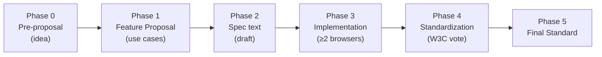
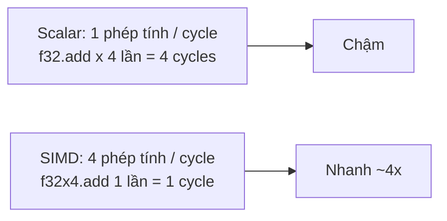
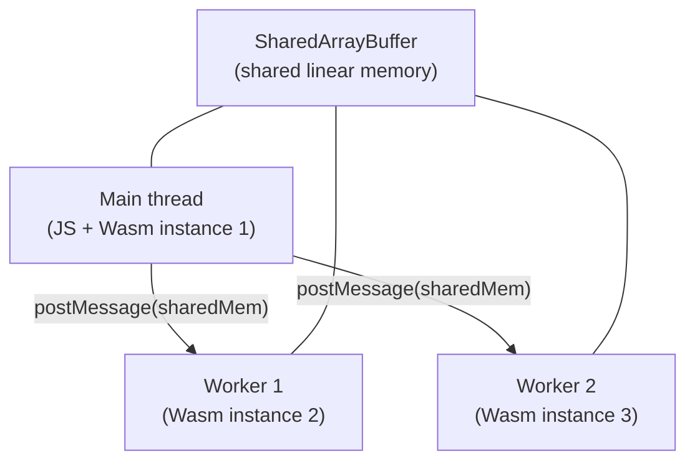
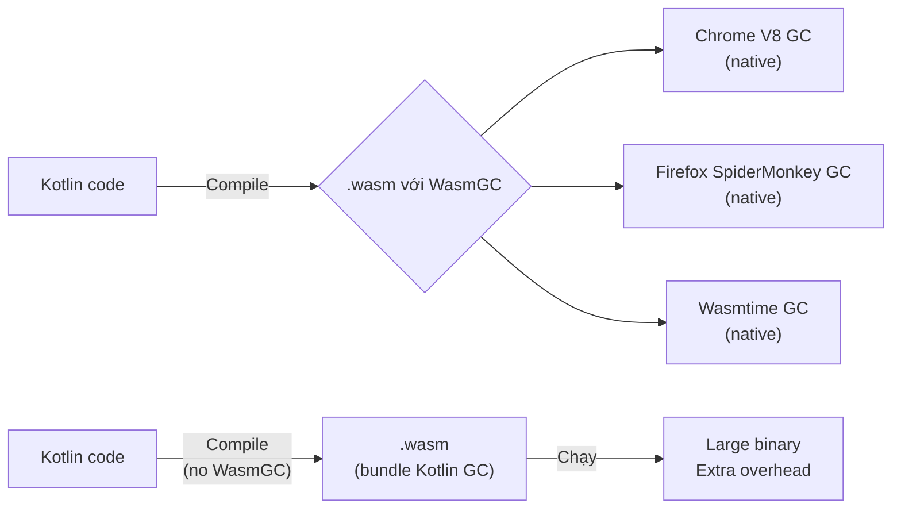

> **Prerequisites**: [[08-memory-management|08. Memory Management]] — hiểu linear memory, SharedArrayBuffer. [[03-webassembly-text-format|03. WAT]] — đọc được WAT. [[02-kien-truc-wasm-stack-machine|02. Kiến trúc Wasm]] — biết stack machine, value types.
> **Objectives**:
> - Hiểu hệ thống proposals của Wasm và cách chúng được chuẩn hóa
> - Nắm vững Fixed-width SIMD (128-bit v128) — cú pháp và use cases
> - Hiểu Threads & Atomics — SharedArrayBuffer, atomic ops, mutex pattern
> - Biết Multi-value returns, Reference Types, Tail Calls
> - Nắm WasmGC — garbage collection tích hợp cho ngôn ngữ managed
> - Phân biệt features đã chuẩn hóa với features còn proposal

---

## Concept — Wasm Proposals Process

WebAssembly không ngừng phát triển qua hệ thống **proposals** — mỗi tính năng mới trải qua 5 phases:



Tính đến 2026, các features **đã phase 5 (chuẩn hóa)**:

| Feature | Chuẩn hóa | Mô tả ngắn |
|---------|-----------|-----------|
| **Fixed-width SIMD** | 2023 | 128-bit vector operations |
| **Threads & Atomics** | 2022 | SharedArrayBuffer + atomic memory ops |
| **Bulk Memory** | 2021 | `memory.copy`, `memory.fill` nhanh hơn |
| **Reference Types** | 2021 | `externref`, `funcref` — type-safe references |
| **Multi-value** | 2020 | Functions trả về nhiều values |
| **Tail Calls** | 2023 | Tối ưu đệ quy đuôi |
| **WasmGC** | 2023 | Garbage collection tích hợp |
| **Multi-memory** | 2024 | Nhiều linear memory trong cùng module |
| **Memory64** | Wasm 3.0 (2025) | 64-bit address space (> 4GB) |

---

## 1. Fixed-width SIMD — Tính Toán Song Song

**SIMD (Single Instruction, Multiple Data)** cho phép một instruction xử lý nhiều data elements cùng lúc. Wasm SIMD thêm type `v128` (128-bit vector) và hơn 200 instructions tương ứng.

### Tại sao SIMD quan trọng?



CPU hiện đại có SIMD units (SSE, AVX trên x86; NEON trên ARM) idle nếu code không dùng — SIMD Wasm khai thác trực tiếp hardware này.

### Kiểu dữ liệu v128

`v128` là 128-bit opaque blob. Có thể interpret như nhiều kiểu khác nhau:

| Interpretation | Lanes | Bits/lane |
|---------------|-------|-----------|
| `i8x16` | 16 lanes | 8-bit integers |
| `i16x8` | 8 lanes | 16-bit integers |
| `i32x4` | 4 lanes | 32-bit integers |
| `i64x2` | 2 lanes | 64-bit integers |
| `f32x4` | 4 lanes | 32-bit floats |
| `f64x2` | 2 lanes | 64-bit floats |

### Ví dụ WAT — vector addition

```wat
(module
  (func $add_f32x4
        (param $a v128) (param $b v128) (result v128)
    local.get $a
    local.get $b
    f32x4.add               ;; cộng 4 float32 cùng lúc
  )

  (func $dot_product_simd (param $ptr_a i32) (param $ptr_b i32) (result f32)
    (local $sum v128)
    ;; Load 4 floats từ memory vào v128
    local.get $ptr_a
    v128.load               ;; load 128-bit từ địa chỉ $ptr_a
    local.get $ptr_b
    v128.load               ;; load 128-bit từ địa chỉ $ptr_b
    f32x4.mul               ;; multiply element-wise: [a0*b0, a1*b1, a2*b2, a3*b3]
    local.tee $sum
    ;; Horizontal sum của 4 elements
    f32x4.extract_lane 0    ;; lấy lane 0
    local.get $sum
    f32x4.extract_lane 1
    f32.add
    local.get $sum
    f32x4.extract_lane 2
    f32.add
    local.get $sum
    f32x4.extract_lane 3
    f32.add
  )

  (export "add_f32x4" (func $add_f32x4))
)
```

### Dùng SIMD từ Rust

```rust
use std::arch::wasm32::*;

#[target_feature(enable = "simd128")]
pub unsafe fn add_arrays_simd(a: &[f32], b: &[f32], out: &mut [f32]) {
    assert_eq!(a.len(), b.len());
    assert_eq!(a.len(), out.len());

    let chunks = a.len() / 4;

    for i in 0..chunks {
        let offset = i * 4;
        // Load 4 f32 từ mảng a và b vào v128 registers
        let va = v128_load(a[offset..].as_ptr() as *const v128);
        let vb = v128_load(b[offset..].as_ptr() as *const v128);
        // SIMD add: 4 phép cộng trong 1 instruction
        let result = f32x4_add(va, vb);
        // Store kết quả
        v128_store(out[offset..].as_mut_ptr() as *mut v128, result);
    }

    // Xử lý phần dư (< 4 elements)
    for i in (chunks * 4)..a.len() {
        out[i] = a[i] + b[i];
    }
}
```

```bash
# Compile với SIMD enabled
RUSTFLAGS="-C target-feature=+simd128" cargo build --target wasm32-unknown-unknown --release
```

> [!warning] Feature detection cho SIMD
> Module Wasm có SIMD **crash ngay khi load** trên browser không support SIMD. Phải ship 2 versions: một có SIMD, một không. Dùng `wasm-feature-detect` library để chọn đúng version.
> ```javascript
> import { simd } from 'wasm-feature-detect';
> const hasSIMD = await simd();
> const module = hasSIMD ? 'app-simd.wasm' : 'app.wasm';
> ```

---

## 2. Threads & Atomics — Đa Luồng trong Wasm

Wasm threads không giống threads OS — không có `pthread_create` hay `std::thread::spawn` trực tiếp. Thay vào đó, Wasm dùng **SharedArrayBuffer + Web Workers** (browser) hoặc OS threads (WASI).

### Mô hình Threads trong Browser



```javascript
// Main thread
const sharedMemory = new WebAssembly.Memory({
  initial: 4,
  maximum: 16,
  shared: true    // SharedArrayBuffer — required for threads
});

const importObject = { env: { memory: sharedMemory } };
const { instance } = await WebAssembly.instantiateStreaming(
  fetch('threaded.wasm'), importObject
);

// Spawn workers và share memory
const worker = new Worker('worker.js');
worker.postMessage({ memory: sharedMemory });
```

```javascript
// worker.js
self.onmessage = async ({ data: { memory } }) => {
  const importObject = { env: { memory } };
  const { instance } = await WebAssembly.instantiateStreaming(
    fetch('threaded.wasm'), importObject
  );
  // Worker và main thread giờ share cùng một vùng memory
  instance.exports.compute_chunk(0, 1000);
};
```

> [!warning] Yêu cầu Cross-Origin Isolation cho SharedArrayBuffer
> Browser yêu cầu server set hai headers để SharedArrayBuffer hoạt động:
> ```
> Cross-Origin-Opener-Policy: same-origin
> Cross-Origin-Embedder-Policy: require-corp
> ```
> Thiếu headers này → `SharedArrayBuffer is not defined`.

### Atomic Operations trong WAT

```wat
(module
  (import "env" "memory" (memory 1 1 shared))  ;; shared memory

  ;; Mutex implementation dùng compare-and-exchange
  (func $try_lock (param $addr i32) (result i32)
    local.get $addr
    i32.const 0          ;; expected: unlocked (0)
    i32.const 1          ;; replacement: locked (1)
    i32.atomic.rmw.cmpxchg   ;; atomic compare-exchange
    i32.eqz              ;; trả về 1 nếu thành công (trước là 0)
  )

  (func $unlock (param $addr i32)
    local.get $addr
    i32.const 0
    i32.atomic.store     ;; atomic store: giải phóng lock
  )

  ;; Atomic counter increment
  (func $increment (param $addr i32) (result i32)
    local.get $addr
    i32.const 1
    i32.atomic.rmw.add   ;; atomic fetch-and-add, trả về giá trị cũ
  )

  (export "try_lock" (func $try_lock))
  (export "unlock" (func $unlock))
  (export "increment" (func $increment))
)
```

### Các Atomic Instructions

| Instruction | Mô tả |
|-------------|-------|
| `i32.atomic.load` | Atomic load |
| `i32.atomic.store` | Atomic store |
| `i32.atomic.rmw.add` | Fetch-and-add |
| `i32.atomic.rmw.sub` | Fetch-and-sub |
| `i32.atomic.rmw.and` | Fetch-and-AND |
| `i32.atomic.rmw.or` | Fetch-and-OR |
| `i32.atomic.rmw.xor` | Fetch-and-XOR |
| `i32.atomic.rmw.xchg` | Atomic swap |
| `i32.atomic.rmw.cmpxchg` | Compare-and-swap |
| `memory.atomic.wait32` | Suspend thread (Futex-like wait) |
| `memory.atomic.notify` | Wake suspended threads |

---

## 3. Multi-value Returns

Trước MVP, Wasm function chỉ có thể trả về tối đa **1 giá trị**. Multi-value proposal gỡ bỏ giới hạn này:

```wat
;; Hàm trả về 2 giá trị: quotient và remainder
(func $div_mod (param $a i32) (param $b i32) (result i32 i32)
  local.get $a
  local.get $b
  i32.div_s   ;; push quotient
  local.get $a
  local.get $b
  i32.rem_s   ;; push remainder
              ;; stack: [quotient, remainder] → trả về cả hai
)
```

```javascript
const { instance } = await WebAssembly.instantiateStreaming(fetch('math.wasm'));
const [quotient, remainder] = instance.exports.div_mod(17, 5);
console.log(`17 / 5 = ${quotient} remainder ${remainder}`);
// 17 / 5 = 3 remainder 2
```

Multi-value cũng cho phép **block types** trả về nhiều giá trị, và là nền tảng cho nhiều optimizations khác.

---

## 4. Reference Types

Reference Types thêm hai value types mới:

- **`funcref`**: Reference đến một function trong module. Có thể lưu trong Table.
- **`externref`**: Opaque reference đến một object bên ngoài (JavaScript object, host resource). **Không cần pointer vào linear memory.**

```wat
;; Trước Reference Types: phải serialize JS object vào linear memory
;; Sau Reference Types: truyền trực tiếp JS object reference

(func $apply (param $fn funcref) (param $x i32) (result i32)
  local.get $x
  local.get $fn
  call_ref (type $fn_type)   ;; gọi function reference trực tiếp
)
```

```javascript
// externref cho phép pass JS objects vào Wasm
const { instance } = await WebAssembly.instantiateStreaming(fetch('mod.wasm'));
const myJsObject = { data: [1, 2, 3] };
instance.exports.store_ref(myJsObject);  // Wasm giữ externref
```

> [!info] Tại sao Reference Types quan trọng?
> Trước đây, để Wasm "giữ" một JS object, phải dùng một trick phức tạp (WeakMap bên JS side, index trong Wasm). Reference Types cho phép Wasm giữ trực tiếp `externref` — engine quản lý lifetime, không cần boilerplate.

---

## 5. WasmGC — Garbage Collection Tích hợp

WasmGC (phase 5 từ cuối 2023, tất cả browser hỗ trợ từ 2024) cho phép Wasm module dùng **garbage collector của host** thay vì tự quản lý memory.

### Tại sao cần?

Ngôn ngữ managed (Java, Kotlin, C#, Python, Dart) có runtime riêng với GC. Khi compile sang Wasm:

- **Không có WasmGC**: Phải bundle cả GC runtime → file `.wasm` rất lớn (vài MB), overhead cao
- **Có WasmGC**: Dùng engine's native GC → file nhỏ, startup nhanh, memory được quản lý đúng cách



### WasmGC Value Types

WasmGC thêm các types mới để định nghĩa GC-managed objects:

```wat
;; Định nghĩa struct type (GC-managed)
(type $Point (struct
  (field $x f64)
  (field $y f64)
))

;; Tạo instance
(func $make_point (param $x f64) (param $y f64) (result (ref $Point))
  local.get $x
  local.get $y
  struct.new $Point    ;; allocate và initialize struct
)

;; Đọc field
(func $get_x (param $p (ref $Point)) (result f64)
  local.get $p
  struct.get $Point $x
)
```

> [!info] Ngôn ngữ nào đã support WasmGC?
> - **Kotlin/Wasm**: Production-ready từ Kotlin 2.0 (2024)
> - **Dart/Flutter Web**: Sử dụng WasmGC từ Flutter 3.22
> - **Java (via TeaVM, JWebAssembly)**: Experimental
> - **C# (.NET)**: Đang nghiên cứu — GC model của .NET không tương thích hoàn toàn với WasmGC spec hiện tại

---

## 6. Tail Calls

Tail call optimization (TCO) biến đệ quy đuôi thành loop, tránh stack overflow:

```wat
;; Không có TCO: factorial(1000000) → stack overflow
(func $factorial_no_tco (param $n i64) (result i64)
  local.get $n
  i64.const 1
  i64.le_s
  if (result i64)
    i64.const 1
  else
    local.get $n
    local.get $n
    i64.const 1
    i64.sub
    call $factorial_no_tco   ;; regular call → tốn stack frame
    i64.mul
  end
)

;; Có TCO: return_call thay thế, không tốn stack
(func $factorial_tco (param $n i64) (param $acc i64) (result i64)
  local.get $n
  i64.const 1
  i64.le_s
  if (result i64)
    local.get $acc
  else
    local.get $n
    i64.const 1
    i64.sub
    local.get $n
    local.get $acc
    i64.mul
    return_call $factorial_tco   ;; TCO: không push stack frame mới
  end
)
```

Tail calls quan trọng đặc biệt cho các ngôn ngữ functional (Scheme, Haskell) khi compile sang Wasm.

---

## Bảng Tổng hợp Feature Support (2026)

| Feature | Chrome | Firefox | Safari | Wasmtime | Wasmer |
|---------|--------|---------|--------|----------|--------|
| Fixed SIMD | ✅ | ✅ | ✅ | ✅ | ✅ |
| Relaxed SIMD | ✅ | ✅ | 🔲 flag | ✅ | ✅ |
| Threads & Atomics | ✅ | ✅ | ✅ | ✅ | ✅ |
| Multi-value | ✅ | ✅ | ✅ | ✅ | ✅ |
| Reference Types | ✅ | ✅ | ✅ | ✅ | ✅ |
| Tail Calls | ✅ | ✅ | ✅ | ✅ | ✅ |
| WasmGC | ✅ | ✅ | ✅ | ✅ | 🔲 |
| Memory64 | ✅ | ✅ | ✅ | ✅ | 🔲 |
| Exception Handling | ✅ | ✅ | ✅ | ✅ | ✅ |

✅ = Stable / 🔲 = Behind flag / ❌ = Not supported

---

## Summary / Key Takeaways

- Wasm phát triển qua **5-phase proposal process**. Features phase 5 = chuẩn hóa W3C, an toàn để dùng production.
- **SIMD (v128)**: 128-bit vector operations, tăng tốc 4–10x cho numeric workloads. Cần ship 2 versions (SIMD/non-SIMD) và dùng `wasm-feature-detect`.
- **Threads & Atomics**: Dùng SharedArrayBuffer + Web Workers trên browser. Cần HTTP headers COOP/COEP. Atomic ops (compare-exchange, fetch-add) tránh race condition.
- **Multi-value**: Functions có thể trả về nhiều giá trị — không cần trick pointer hay out-params.
- **Reference Types** (`funcref`, `externref`): Pass JS objects vào Wasm mà không cần serialize vào linear memory.
- **WasmGC**: Managed languages (Kotlin, Dart, Java) dùng host GC — binary nhỏ hơn, startup nhanh hơn. Baseline support tất cả browsers từ 2024.
- **Tail Calls** (`return_call`): Đệ quy đuôi không tốn stack — quan trọng cho functional languages.

---

## References

- WebAssembly Proposals GitHub — https://github.com/WebAssembly/proposals
- State of WebAssembly 2025–2026 — https://platform.uno/blog/the-state-of-webassembly-2025-2026/
- SIMD proposal — https://github.com/WebAssembly/simd
- Threads proposal — https://github.com/WebAssembly/threads
- WasmGC proposal — https://github.com/WebAssembly/gc
- Rust wasm32 SIMD intrinsics — https://doc.rust-lang.org/stable/core/arch/wasm32/
