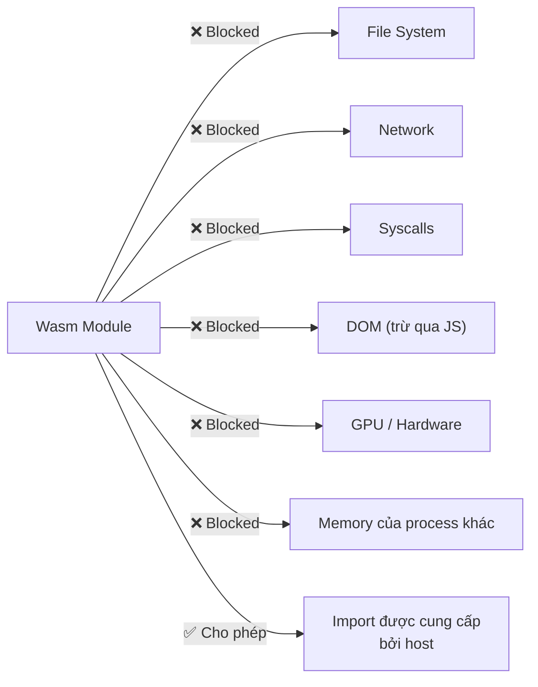
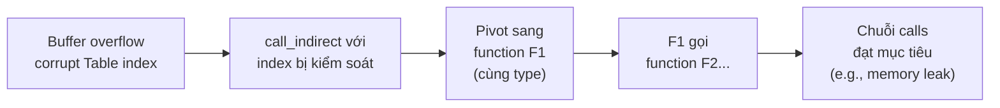

> **Prerequisites**: [[08-memory-management|08. Memory Management]] — buffer overflow, heap layout, attack surfaces. [[02-kien-truc-wasm-stack-machine|02. Kiến trúc Wasm]] — stack machine, module structure, linear memory, Table.
> **Objectives**:
> - Hiểu đầy đủ sandbox model của Wasm và các guarantees nó cung cấp
> - Phân biệt rõ những gì Wasm bảo vệ được và không bảo vệ được
> - Nắm cơ chế CFI (Control Flow Integrity) trong Wasm và điểm yếu của nó
> - Hiểu các attack vectors đặc thù: WASM-oriented programming, timing attacks, side channels
> - So sánh Wasm vs native security: DEP/ASLR/SSP tương đương trong Wasm
> - Hiểu CVEs thực tế liên quan đến Wasm runtime

---

## Concept — Mô hình Bảo mật Wasm

WebAssembly được thiết kế với security là ưu tiên đầu. Tuy nhiên, "thiết kế an toàn" không có nghĩa là "không có lỗ hổng". Để audit Wasm security đúng cách, cần hiểu chính xác những gì model này đảm bảo và không đảm bảo.

> [!abstract] Ba Tầng Bảo mật của Wasm
>
> **Tầng 1 — Sandbox Isolation**: Module không thể truy cập tài nguyên ngoài những gì được import. Không có filesystem, network, syscall tùy tiện.
>
> **Tầng 2 — Memory Safety**: Linear memory có bounds checking. Module không thể đọc/ghi ngoài vùng linear memory của nó.
>
> **Tầng 3 — Control Flow Integrity**: Indirect calls (`call_indirect`) chỉ được phép gọi functions hợp lệ đã khai báo trong Table, kiểm tra type signature.

---

## Tầng 1 — Sandbox Isolation

### Cái Wasm KHÔNG thể làm (mặc định)



Mọi khả năng của Wasm module **đến từ imports**. Không import → không làm được. Đây là **principle of least privilege** được enforce ở cấp độ spec.

### Threat model của Tầng 1

> [!tip] Đây là điểm mạnh nhất của Wasm
> So với shared library (`.so`/`.dll`) — một shared lib có thể gọi bất kỳ system call nào của process chủ. Wasm module không thể làm điều đó mà không có explicit import.
>
> Đây là lý do Wasm lý tưởng cho: browser untrusted code, plugin systems, serverless functions, smart contracts.

---

## Tầng 2 — Memory Safety

### Bounds Checking

Mọi `memory.load` và `memory.store` đều có **implicit bounds check** tại runtime:

```wat
;; Truy cập địa chỉ (ptr + offset) trong linear memory
i32.const 1000000
i32.load   ;; nếu 1000000 >= memory.size * 65536 → TRAP
```

Nếu địa chỉ vượt quá kích thước linear memory → **trap** ngay lập tức. Không có undefined behavior kiểu C, không có segfault âm thầm.

### Cái Wasm BẢO VỆ được (Memory Safety)

| Attack | Native | Wasm |
|--------|--------|------|
| Out-of-bounds read ngoài linear memory | ✅ Possible | ❌ Trap |
| Out-of-bounds write ngoài linear memory | ✅ Possible | ❌ Trap |
| Access memory của process khác | ✅ Possible (với exploit) | ❌ Impossible |
| Ghi vào code segment | ✅ Possible (before DEP) | ❌ Code là immutable |
| Shellcode injection | ✅ Classic technique | ❌ Không có executable memory |

### Cái Wasm KHÔNG bảo vệ được (vẫn trong linear memory)

> [!warning] Bugs vẫn tồn tại BÊN TRONG linear memory
> Bounds checking chỉ kiểm tra biên của toàn bộ linear memory — không kiểm tra biên của từng allocation:
>
> ```c
> char buf[16];
> char secret[32];
> // Cả hai đều trong linear memory, liền kề nhau
>
> strcpy(buf, "AAAA..."); // 100 ký tự → overflow vào secret
> // Wasm KHÔNG trap vì vẫn trong bounds của linear memory
> ```
>
> Buffer overflow **vẫn xảy ra trong linear memory** — chỉ là không thể vượt ra ngoài. Kẻ tấn công vẫn có thể overwrite adjacent data, heap metadata, global variables.

---

## Tầng 3 — Control Flow Integrity (CFI)

### CFI trong Wasm hoạt động như thế nào?

Wasm có hai loại calls:
1. **`call $func`** — direct call, statically determined tại compile time. An toàn tuyệt đối.
2. **`call_indirect`** — indirect call qua Table (function pointer). Có type check tại runtime.

Khi `call_indirect` được thực thi:
1. Pop Table index từ stack
2. Kiểm tra index có nằm trong Table bounds không
3. Kiểm tra function tại index đó có đúng type signature không
4. Nếu sai → **trap**. Nếu đúng → call.

> [!note] Wasm CFI mạnh hơn nhiều so với native
> Native x86 với `call [rax]` — CPU nhảy thẳng đến địa chỉ trong `rax`. Không có type check, không có bounds check.
>
> Wasm `call_indirect` — phải có function trong Table, phải đúng type signature. Không thể nhảy đến giữa một function hoặc đến data.

### Giới hạn của CFI trong Wasm

> [!danger] Granularity của type check còn thô
> Wasm type system chỉ có 4 types: `i32`, `i64`, `f32`, `f64`. Nhiều C++ functions khác nhau về semantic nhưng cùng signature `(i32, i32) -> i32` sẽ nằm trong cùng CFI equivalence class.
>
> Kết quả: nếu attacker kiểm soát Table index, họ có thể redirect sang bất kỳ function nào có cùng Wasm type — không nhất thiết phải là function attacker muốn, nhưng vẫn hữu ích.
>
> Nghiên cứu từ USENIX Security 2020 ("Everything Old is New Again") chỉ ra rằng trong nhiều ứng dụng Wasm thực tế, CFI equivalence classes đủ lớn để thực hiện **Wasm-Oriented Programming (WOP)**.

---

## Attack Vectors Đặc Thù của Wasm

### 1. Wasm-Oriented Programming (WOP)

Tương tự Return-Oriented Programming (ROP) trong native, nhưng thay vì gadgets, dùng **Wasm functions** với signature phù hợp.



**Điều kiện cần**:
- Attacker có thể write arbitrary value vào linear memory (buffer overflow)
- Table index được đọc từ linear memory
- Có đủ functions trong cùng type class để tạo thành chain hữu ích

### 2. Heap Metadata Corruption

Như đã phân tích trong [[08-memory-management|08. Memory Management]], `dlmalloc`/`emmalloc` lưu metadata liền kề với data. Overflow vào metadata có thể:

- Fake free chunk → double-free → use-after-free
- Corrupt chunk size → mislead `malloc` về available space
- Overwrite `next`/`prev` pointers trong free list → arbitrary write khi `free` được gọi

### 3. Timing Attacks và Side Channels

> [!warning] Wasm không bảo vệ khỏi side channels
> Timing attacks là possible trong Wasm vì:
> - Wasm execution time phụ thuộc vào data (non-constant time operations)
> - `memory.atomic.wait` trả về timing information
> - Cache timing attacks vẫn khả thi qua shared memory (SharedArrayBuffer)
>
> CVE-2018-5004 (Spectre) — SharedArrayBuffer bị disabled tạm thời trên browser vì timing attack qua timer resolution. Yêu cầu COOP/COEP headers để re-enable.

### 4. TOCTOU (Time-of-Check to Time-of-Use)

Wasm không có memory ordering guarantees ngoài `atomic` operations. Race conditions giữa nhiều Wasm threads (Web Workers sharing SharedArrayBuffer) là possible:

```javascript
// Thread 1 (Wasm Worker)        // Thread 2 (Wasm Worker)
check_permission(ptr);            // TOCTOU window
// [race condition here]
use_resource(ptr);                revoke_permission(ptr);
```

**Ví dụ thực tế**: CVE-2024-47813 trong Wasmtime — race condition trong type registry dẫn đến CFI violation khi dùng `wasmtime::Engine` từ nhiều threads đồng thời.

### 5. Malicious Custom Sections

```python
import struct

def inject_payload_in_custom_section(wasm_bytes: bytes, payload: bytes) -> bytes:
    # Custom section: ID=0, followed by LEB128 size, then content
    # Payload được nhúng vào custom section — runtime bỏ qua,
    # nhưng JS code có thể đọc qua instance.exports.memory
    section_id = b'\x00'
    # Tên section (optional) + payload
    content = b'\x07payload' + payload  # length-prefixed name "payload"
    size = len(content)

    # Encode size as LEB128
    leb = []
    while True:
        b = size & 0x7F
        size >>= 7
        if size:
            leb.append(b | 0x80)
        else:
            leb.append(b)
            break

    custom_section = section_id + bytes(leb) + content
    # Chèn vào cuối module (sau magic+version+sections)
    return wasm_bytes + custom_section
```

Custom section không được validate → có thể chứa data ẩn. Attack vector: exfiltrate sensitive data qua custom section mà static scanner bỏ qua.

---

## So sánh: Native Mitigations vs Wasm Equivalents

| Native Mitigation | Mục đích | Wasm tương đương | Ghi chú |
|-------------------|---------|-----------------|---------|
| DEP / NX bit | Ngăn code injection | ✅ Built-in (code là immutable) | Mạnh hơn native |
| Stack canary (SSP) | Phát hiện stack overflow | ❌ Không có | Shadow stack trong linear memory không có canary |
| ASLR | Randomize địa chỉ | ❌ Không có (linear memory bắt đầu từ 0) | Các proposal đang nghiên cứu |
| CFI | Bảo vệ control flow | ✅ Type-based CFI cho `call_indirect` | Yếu hơn fine-grained CFI |
| Heap fortification | Phát hiện heap corruption | ⚠️ Tùy allocator (emmalloc có một số checks) | Không chuẩn hóa |
| RELRO | Protect GOT/PLT | N/A | Wasm không có GOT/PLT |
| PIE | Position independent | N/A | Module luôn position independent |

> [!info] Kết luận so sánh
> Wasm mạnh hơn native về code injection và cross-memory-region attacks. Yếu hơn native về trong-heap attacks, stack canary, và ASLR. Đây không phải là thất bại của Wasm — đây là trade-off có chủ đích để đơn giản hóa spec và tối ưu performance.

---

## CVE Thực Tế Liên Quan Wasm

| CVE | Năm | Mô tả | Impact |
|-----|-----|-------|--------|
| CVE-2024-47813 | 2024 | Wasmtime race condition → CFI violation | CFI bypass trong multi-threaded host |
| CVE-2025-5419 | 2025 | V8 out-of-bounds read/write trong Wasm engine | Heap corruption qua crafted HTML |
| CVE-2023-33242 | 2023 | CosmWasm recursive calls → stack overflow | Crash blockchain nodes |
| CWA-2023-004 | 2023/24 | Crafted Wasm binary → runtime panic | DoS Wasm runtime |
| Spectre (2018) | 2018 | Timer via SharedArrayBuffer → cache timing | Side-channel data leak |

---

## Security Hardening Checklist cho Wasm

> [!tip] Khi audit hoặc viết Wasm module
>
> **Cho developer:**
> - [ ] Dùng `-fsanitize=cfi` khi compile C/C++ với Emscripten để có fine-grained CFI
> - [ ] Enable AddressSanitizer (`-fsanitize=address`) trong development để detect buffer overflows
> - [ ] Dùng Rust thay C/C++ nếu có thể — ownership system ngăn UAF và BOF tại compile time
> - [ ] Validate tất cả input tại JS/Wasm boundary trước khi đưa vào linear memory
> - [ ] Không dùng `emscripten_run_script` — cho phép arbitrary JS execution từ Wasm
>
> **Cho security auditor:**
> - [ ] Inspect custom sections bằng `wasm-objdump -x` — tìm payload ẩn
> - [ ] Kiểm tra Table size và function types — Table lớn = CFI class lớn = WOP potential
> - [ ] Tìm allocator functions (`malloc`, `free`, `realloc`) và kiểm tra bounds
> - [ ] Trace JS/Wasm boundary — data nào được truyền vào Wasm mà không validate?
> - [ ] Kiểm tra shared memory usage với `SharedArrayBuffer` — TOCTOU potential

---

## Summary / Key Takeaways

- Wasm sandbox có **3 tầng**: Isolation (không access tài nguyên không import), Memory safety (bounds check tại linear memory boundary), CFI (type check tại `call_indirect`).
- **Điểm mạnh**: Code injection không thể xảy ra (code immutable), cross-module memory access bị chặn tuyệt đối, sandbox rất mạnh.
- **Điểm yếu**: Buffer overflow vẫn xảy ra **bên trong** linear memory, không có ASLR, không có stack canary, CFI granularity thô (chỉ 4 types).
- **WOP (Wasm-Oriented Programming)**: Tương tự ROP, khai thác indirect call + coarse CFI. Yêu cầu write-primitive + Table index control.
- **Timing attacks**: Vẫn possible qua `SharedArrayBuffer` timing — đây là lý do COOP/COEP headers được yêu cầu.
- **Custom section**: Không được validate — attack surface cho hidden payload.
- Rust > C/C++ cho Wasm security: ownership system loại bỏ class bugs lớn nhất.
- CVE-2024-47813 là ví dụ thực tế: race condition trong Wasmtime host, không phải trong Wasm guest — **runtime bugs** quan trọng không kém **guest bugs**.

---

## References

- WebAssembly Security Model — https://webassembly.org/docs/security/
- Wasmtime Security — https://docs.wasmtime.dev/security.html
- "Everything Old is New Again: Binary Security of WebAssembly" (USENIX 2020) — https://www.usenix.org/system/files/sec20-lehmann.pdf
- "Hijacking Control Flow in WebAssembly" — Fastly — https://www.fastly.com/blog/hijacking-control-flow-webassembly
- "Memory Corruption in WebAssembly" — InstaTunnel — https://medium.com/@instatunnel/memory-corruption-in-webassembly-native-exploits-in-your-browser
- CVE-2024-47813 (Wasmtime race condition) — https://advisories.gitlab.com/pkg/cargo/wasmtime/CVE-2024-47813/
- [[15-wasm-exploitation|15. Wasm Exploitation]] — kỹ thuật khai thác chi tiết
