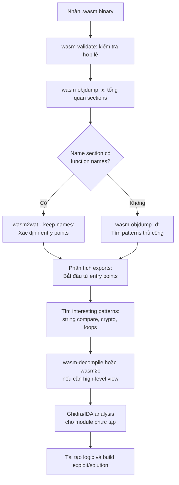

> **Prerequisites**: [[03-webassembly-text-format|03. WAT]] — đọc được WAT. [[04-binary-format-va-encoding|04. Binary Format]] — hiểu section layout, LEB128. [[12-wasm-security-model|12. Wasm Security Model]] — hiểu CFI, linear memory, attack surface.
> **Objectives**:
> - Nắm quy trình static analysis cho một Wasm binary không có source
> - Thành thạo WABT toolkit: `wasm-objdump`, `wasm2wat`, `wasm2c`, `wasm-decompile`
> - Biết cách dùng Ghidra + Wasm plugin để phân tích binary phức tạp
> - Nhận biết các pattern phổ biến trong Wasm disassembly: string comparison, crypto, obfuscation
> - Xây dựng phương pháp luận (methodology) có hệ thống để reverse một Wasm challenge

---

## Concept — Tại sao Static RE Wasm khác Native?

Reverse engineering Wasm có một số điểm đặc biệt so với x86/ARM:

| Khía cạnh | Native (x86) | WebAssembly |
|-----------|-------------|-------------|
| **Disassembly** | Phức tạp (variable length, data/code ambiguity) | Đơn giản — Wasm có cấu trúc rõ ràng |
| **Decompilation** | IDA Pro, Ghidra — khá tốt | Kém hơn — variable names mất, nhiều locals |
| **Symbols** | Thường stripped | Name section (optional) còn sót lại từ debug build |
| **Control flow** | Complex (indirect jumps, ROP) | Structured (if/block/loop, no arbitrary jump) |
| **Calling convention** | Registers (rdi, rsi, rdx...) | Stack-based, không có register |
| **Function pointers** | Địa chỉ tùy ý | Table index — dễ enumerate hơn |

> [!tip] Wasm dễ disassemble hơn native
> Wasm binary format được thiết kế để parse trong một pass — không có ambiguity giữa code và data, không có overlapping instructions. Công cụ `wasm2wat` cho ra disassembly **lossless** (1-to-1 với binary). Đây là lợi thế lớn cho RE.

---

## Tool & Setup — Bộ công cụ Static RE

### WABT Toolkit

```bash
# Cài WABT (đã cài từ Lesson 03)
sudo apt install wabt   # hoặc build từ source

# Kiểm tra các tool có trong WABT
ls $(which wasm2wat | xargs dirname)/wasm*
```

| Lệnh | Tác dụng |
|------|---------|
| `wasm2wat` | Binary → WAT (lossless, đọc được) |
| `wasm-objdump` | In section info, disassembly, hex |
| `wasm2c` | Binary → C source (dễ load vào Ghidra/IDA) |
| `wasm-decompile` | Binary → C-like pseudo-code (nhanh, ít chính xác) |
| `wasm-strip` | Xóa debug sections (name, DWARF) |
| `wasm-validate` | Kiểm tra module hợp lệ |
| `wasm-interp` | Chạy module với stack interpreter |
| `wasm-stats` | Thống kê instruction distribution |

### Ghidra + Wasm Plugin

```bash
# Tải Ghidra từ GitHub releases
wget https://github.com/NationalSecurityAgency/ghidra/releases/download/Ghidra_11.x.x_build/ghidra_11.x.x_PUBLIC.zip
unzip ghidra_11.x.x_PUBLIC.zip

# Tải Ghidra Wasm plugin (nneonneo)
wget https://github.com/nneonneo/ghidra-wasm-plugin/releases/latest/download/ghidra-wasm-plugin.zip

# Cài plugin: Ghidra → File → Install Extensions → chọn zip
# Sau đó restart Ghidra → File → Import File → chọn .wasm
```

---

## API / Syntax — WABT Workflow chi tiết

### Bước 1: Tổng quan module (`wasm-objdump -x`)

Bắt đầu mọi RE session bằng cái nhìn tổng quan:

```bash
wasm-objdump -x target.wasm
```

```text
target.wasm:    file format wasm 0x1

Section Details:

Type[42]:
 - type[0] () -> i32
 - type[1] (i32) -> i32
 - type[2] (i32, i32) -> i32
 ...

Import[3]:
 - func[0] sig=5 <env.memory_copy>
 - func[1] sig=8 <env.abort>
 - memory[0] pages: initial=1 <- env.memory

Function[156]:
 - func[3] sig=0 <check_flag>       ← tên từ Name section (nếu có)
 - func[4] sig=2 <xor_decrypt>
 - func[5] sig=0 <verify>
 ...

Export[5]:
 - func[3] -> "check_flag"
 - func[7] -> "init"
 - memory[0] -> "memory"

Data[2]:
 - segment[0] memory=0 size=24 - init i32=0x400
 - segment[1] memory=0 size=48 - init i32=0x418
```

> [!tip] Những gì cần chú ý ở bước tổng quan
> - **Export list**: Đây là entry points — bắt đầu RE từ đây
> - **Import list**: Wasm module cần gì từ môi trường? `abort`, `memory_copy` là indicators của C runtime
> - **Name section**: Nếu có tên hàm → debug build hoặc DWARF → RE dễ hơn nhiều
> - **Data segments**: Chứa strings, lookup tables, encrypted data

### Bước 2: Disassemble (`wasm-objdump -d`)

```bash
# Xem disassembly của toàn bộ module
wasm-objdump -d target.wasm | head -100

# Xem hex + disassembly
wasm-objdump -ds target.wasm > full_dump.txt

# Filter chỉ một function (theo tên hoặc index)
wasm-objdump -d target.wasm | grep -A 50 "func\[3\]"
```

Output mẫu:

```text
000105 func[3] <check_flag>:
 000106: 41 00                     | i32.const 0
 000108: 21 00                     | local.set 0
 00010a: 02 40                     | block
 00010c:   20 00                   | local.get 0
 00010e:   28 02 98 08             | i32.load offset=0x898
 000112:   41 18                   | i32.const 24
 000114:   46                      | i32.eq
 000115:   45                      | i32.eqz
 000116:   0d 00                   | br_if 0
 000118:   41 01                   | i32.const 1
 00011a:   0f                      | return
 00011b: 0b                        | end
 00011c: 41 00                     | i32.const 0
 00011e: 0f                        | return
```

### Bước 3: WAT đầy đủ (`wasm2wat`)

```bash
# Export toàn bộ WAT
wasm2wat target.wasm -o target.wat

# Với tên auto-generated (nếu Name section bị strip)
wasm2wat --generate-names target.wasm -o target.wat

# Xem function cụ thể
grep -A 30 'func \$check_flag' target.wat
```

### Bước 4: Decompile sang C-like (`wasm-decompile`)

```bash
# Nhanh, đọc dễ hơn WAT nhưng kém chính xác hơn
wasm-decompile target.wasm -o target.dcmp
cat target.dcmp | head -80
```

Output mẫu:

```text
export function check_flag():int {
  var a:int;
  if (load<int>(a) == 24) {
    return 1;
  }
  return 0;
}
```

### Bước 5: Convert sang C (`wasm2c`) để dùng với IDA/Ghidra

Kỹ thuật mạnh nhất khi binary lớn và phức tạp:

```bash
# Generate C source từ Wasm
wasm2c target.wasm -o target.c

# Compile thành native object file
gcc -c target.c -o target.o -I $(wabt --version-files)/wasm2c/

# Load target.o vào IDA Pro hoặc Ghidra
# → có decompiler C đầy đủ, Hex-Rays analysis, ...
```

> [!warning] Hạn chế của wasm2c
> `wasm2c` dịch instruction-by-instruction — kết quả C rất verbose, nhiều locals tên `l0`, `l1`... Không phải C đẹp để đọc, nhưng dùng với Hex-Rays/Ghidra decompiler thì hiệu quả hơn WAT.

---

## Phương pháp luận Static RE — Methodology

Khi nhận một Wasm binary để phân tích, follow quy trình sau:



### Nhận biết Pattern phổ biến trong Wasm RE

#### Pattern 1: String comparison (flag check)

```wat
;; Flag check pattern: so sánh từng byte với expected
(func $check_input
  (local $i i32)
  (block $done
    (loop $loop
      local.get $i
      i32.const 18          ;; độ dài expected string
      i32.ge_u
      br_if $done           ;; thoát nếu đã check hết

      local.get $i
      i32.const 0x1000      ;; địa chỉ input trong memory
      i32.add
      i32.load8_u           ;; đọc byte input[i]

      local.get $i
      i32.const 0x2000      ;; địa chỉ expected trong memory
      i32.add
      i32.load8_u           ;; đọc byte expected[i]

      i32.ne
      br_if $done           ;; thoát nếu không khớp

      ;; i++
      local.get $i
      i32.const 1
      i32.add
      local.set $i
      br $loop
    )
  )
  ;; nếu thoát từ $done do br_if thứ nhất: i >= 18 → pass
  local.get $i
  i32.const 18
  i32.eq                    ;; trả về 1 nếu pass
)
```

> [!tip] Nhận dạng pattern này
> Tìm `loop` + `i32.load8_u` hoặc `i32.load8_s` + `i32.ne` + `br_if` — đây là byte-by-byte comparison. Đọc data segment tại địa chỉ `expected` để tìm flag.

#### Pattern 2: XOR encryption

```wat
;; XOR decrypt pattern
(func $xor_decrypt (param $ptr i32) (param $key i32) (param $len i32)
  (local $i i32)
  (loop $loop
    local.get $i
    local.get $len
    i32.ge_u
    br_if 1           ;; thoát vòng lặp

    local.get $ptr
    local.get $i
    i32.add
    local.tee $tmp    ;; addr = ptr + i

    local.get $ptr
    local.get $i
    i32.add
    i32.load8_u       ;; byte = mem[ptr+i]

    local.get $key
    i32.xor           ;; byte XOR key
    i32.store8        ;; mem[ptr+i] = byte XOR key

    local.get $i
    i32.const 1
    i32.add
    local.set $i
    br $loop
  )
)
```

> [!tip] Nhận dạng XOR pattern
> `i32.load8_u` → `i32.xor` → `i32.store8` trong loop = XOR cipher. Key thường là constant (`i32.const 0x42`). Tìm constant trong loop body.

#### Pattern 3: Data segments chứa flag ẩn

```bash
# Dump raw hex của data segments
wasm-objdump -s target.wasm | grep -A 5 "Contents of section Data"

# Hoặc dùng Python để đọc binary
python3 - << 'EOF'
with open("target.wasm", "rb") as f:
    data = f.read()

# Tìm printable strings trong binary
import re
strings = re.findall(rb'[\x20-\x7e]{4,}', data)
for s in strings:
    print(s.decode())
EOF
```

#### Pattern 4: Lookup table (substitution cipher)

```wat
;; Pattern: array lookup với index từ input
local.get $char
i32.const 0x3000   ;; địa chỉ lookup table
i32.add
i32.load8_u        ;; table[char]
```

Tìm data segment tại `0x3000` — đây là S-box hoặc substitution table.

---

## Worked Project — Phân tích một CTF Wasm Challenge

### Challenge mô phỏng: `check_password.wasm`

Giả sử ta có một web app hỏi password, validate bằng Wasm. Bắt đầu từ browser:

```javascript
// Console browser — kiểm tra instance exports
WebAssembly.instantiateStreaming(fetch('/check_password.wasm')).then(({instance}) => {
  console.log(Object.keys(instance.exports));
  // ["check_password", "memory", "init"]
  window._wasm = instance;
});

// Thử gọi trực tiếp
_wasm.exports.check_password(0, 6);  // ptr=0, len=6
```

```bash
# Tải file và bắt đầu static analysis
curl -O https://target/check_password.wasm

# Bước 1: Tổng quan
wasm-objdump -x check_password.wasm
```

```text
Export[3]:
 - func[2] -> "check_password"
 - func[5] -> "init"
 - memory[0] -> "memory"

Data[1]:
 - segment[0] memory=0 size=12 - init i32=0x100
```

```bash
# Bước 2: Xem data segment tại 0x100 (có thể là flag)
python3 -c "
import struct
with open('check_password.wasm', 'rb') as f:
    data = f.read()
# Tìm Data section (ID=11)
idx = data.find(b'\x0b')
print('Data section raw bytes:', data[idx:idx+50].hex())
"

# Bước 3: Disassemble check_password
wasm2wat check_password.wasm -o cp.wat
grep -A 60 'func \$2' cp.wat
```

```wat
(func $2 (param $ptr i32) (param $len i32) (result i32)
  ;; Check độ dài = 12
  local.get $len
  i32.const 12
  i32.ne
  if
    i32.const 0
    return
  end

  ;; So sánh từng byte với expected tại 0x100
  (block $fail
    (local.set $i (i32.const 0))
    (loop $check
      local.get $i
      i32.const 12
      i32.ge_u
      br_if 1            ;; pass nếu i >= 12

      local.get $ptr
      local.get $i
      i32.add
      i32.load8_u        ;; input[i]

      i32.const 0x100
      local.get $i
      i32.add
      i32.load8_u        ;; expected[i] tại 0x100

      i32.ne
      br_if $fail        ;; fail nếu không khớp

      local.get $i
      i32.const 1
      i32.add
      local.set $i
      br $check
    )
    i32.const 1          ;; success
    return
  )
  i32.const 0
)
```

```python
# Bước 4: Đọc expected string từ data segment
with open("check_password.wasm", "rb") as f:
    raw = f.read()

# Data segment tại offset 0x100 (init i32=0x100), size=12
# Tìm data section content
import re

def read_uleb128(data, pos):
    result, shift = 0, 0
    while True:
        b = data[pos]; pos += 1
        result |= (b & 0x7F) << shift
        shift += 7
        if not (b & 0x80): break
    return result, pos

# Scan qua sections để tìm Data section (ID=11)
pos = 8  # skip header
while pos < len(raw):
    sec_id = raw[pos]; pos += 1
    sec_size, pos = read_uleb128(raw, pos)
    sec_end = pos + sec_size
    if sec_id == 11:  # Data section
        num_segs, pos = read_uleb128(raw, pos)
        for _ in range(num_segs):
            flags, pos = read_uleb128(raw, pos)
            pos += 1   # i32.const opcode
            offset, pos = read_uleb128(raw, pos)
            pos += 1   # end opcode
            seg_size, pos = read_uleb128(raw, pos)
            seg_data = raw[pos:pos+seg_size]
            print(f"Data at 0x{offset:x}: {seg_data} = {seg_data!r}")
            pos += seg_size
    else:
        pos = sec_end

# Output: Data at 0x100: b'W4sm_P@ss0rD' = b'W4sm_P@ss0rD'
# FLAG: W4sm_P@ss0rD
```

---

## Ghidra Wasm Plugin — Khi Binary Phức Tạp

Ghidra hữu ích khi binary có hàng trăm functions, cần cross-reference analysis:

**Workflow trong Ghidra:**

1. **Import**: File → Import File → chọn `.wasm` (plugin tự detect)
2. **Auto-analyze**: Để Ghidra analyze — tìm functions, data refs
3. **Functions list**: Window → Functions → sort by name/size
4. **Decompiler view**: Double-click function → xem decompiled C-like code
5. **Cross-references**: Right-click symbol → References → Find All References

```text
Ghidra address format cho Wasm:
- Functions: 0x80000000 + function_index
- Memory:    0x00000000 + linear_memory_offset
- Code:      0xf0000000 + bytecode_offset

Ví dụ: func[3] ở Ghidra = 0x80000003
       data tại offset 0x100 = 0x00000100
```

> [!warning] Lưu ý Ghidra Wasm addresses
> Ghidra rebase Wasm functions về `0x80000000`. Khi đối chiếu với Chrome DevTools (base 0x0) hoặc `wasm-objdump` output, phải **subtract 0x80000000** để lấy bytecode offset thực.

---

## Common Pitfalls

> [!warning] Wasm stripped binary — không có Name section
> Binary production thường bị strip (`wasm-strip`) — không còn tên hàm. Dùng `wasm2wat --generate-names` để Wasm-WABT tự đặt tên theo kiểu `$f3`, `$f4`... Khi analyze, đặt tên mô tả cho hàm quan trọng ngay khi hiểu ra (bookmark trong Ghidra/IDE).

> [!warning] Emscripten glue functions chiếm phần lớn binary
> Binary biên dịch từ C/C++ qua Emscripten chứa hàng trăm runtime functions (`dlmalloc`, `__stdio_write`, v.v.). Ignore chúng, tập trung vào functions được call từ exports và data comparison logic.

> [!warning] `wasm-decompile` output là C-like, không phải C
> Output của `wasm-decompile` không compile được — chỉ để đọc nhanh. Dùng `wasm2c` nếu cần native object file cho IDA/Ghidra.

---

## Summary / Key Takeaways

- Wasm dễ disassemble hơn native vì format có cấu trúc, không có code/data ambiguity.
- **Workflow chuẩn**: `wasm-objdump -x` (tổng quan) → `wasm2wat` (WAT đầy đủ) → `wasm-decompile` (quick pseudocode) → `wasm2c` + Ghidra (phức tạp).
- **Entry points**: Bắt đầu từ exports, theo call graph vào sâu hơn.
- **Pattern nhận biết**: Byte-by-byte loop với `i32.load8_u`+`i32.ne`+`br_if` = string compare; `i32.xor` trong loop = XOR cipher; data segment access với variable index = lookup table.
- Ghidra Wasm plugin: address base `0x80000000` cho functions, `0x00000000` cho linear memory.
- Python scripting để đọc data segments nhanh hơn tool thủ công.
- Tiếp theo: [[14-reverse-engineering-dynamic|14. Reverse Engineering Wasm — Dynamic Analysis]] — debug live trong Chrome DevTools.

---

## References

- WABT GitHub — https://github.com/WebAssembly/wabt
- Ghidra Wasm Plugin — https://github.com/nneonneo/ghidra-wasm-plugin
- "In-Depth Analysis of WebAssembly RE Based on CTF" — https://www.oreateai.com/blog/indepth-analysis-of-webassembly-reverse-engineering-based-on-ctf-competition-examples/
- b01lersCTF Wasm RE Writeup — https://klatz.co/ctf-blog/boilerctf-alien-tech
- HackPack CTF 2023 WASM-safe Writeup — https://maulvialf.medium.com/reversing-webassembly-write-up-hackpack-2023-wasm-safe-6ca78e3f4ee3
- [[a0-wabt-toolkit-reference|A0. WABT Toolkit Reference]] — cheat sheet đầy đủ các lệnh WABT
