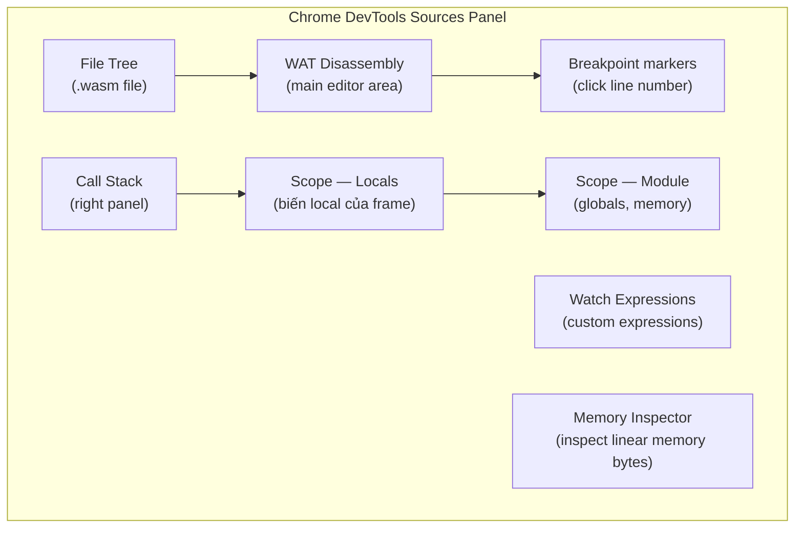
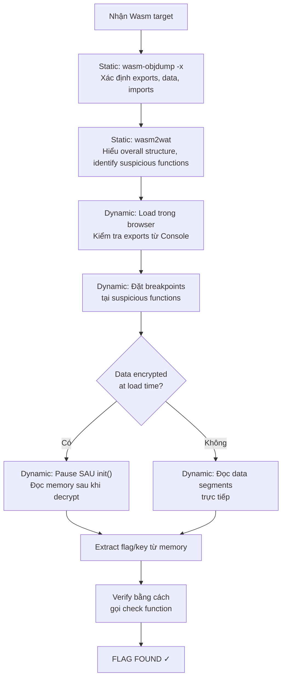

> **Prerequisites**: [[13-reverse-engineering-static|13. Reverse Engineering Wasm — Static Analysis]] — biết dùng WABT, đọc WAT, tìm entry points. [[07-javascript-wasm-interop|07. JS ↔ Wasm Interop]] — hiểu exports, linear memory access từ JS.
> **Objectives**:
> - Thành thạo Chrome DevTools cho Wasm debugging: Sources panel, breakpoints, stepping
> - Đọc và ghi linear memory trực tiếp từ Console DevTools tại runtime
> - Patch Wasm bytecode in-memory để bypass checks hoặc thay đổi behavior
> - Dùng JavaScript hooks để intercept Wasm function calls
> - Biết cách instrument Wasm binary bằng Binaryen/wasm-opt để tự thêm logging
> - Kết hợp static + dynamic RE theo quy trình hoàn chỉnh

---

## Concept — Dynamic RE bổ sung gì cho Static RE?

Static analysis (Lesson 13) cho biết code làm **gì**. Dynamic analysis cho biết code đang làm gì với **dữ liệu cụ thể** tại runtime:

| Vấn đề | Static RE | Dynamic RE |
|--------|-----------|-----------|
| Tìm expected flag string | Khó nếu encrypted at load time | Đặt breakpoint **sau** khi decrypt |
| Hiểu control flow phức tạp | Phải trace thủ công | Step through từng instruction |
| Giá trị biến tại runtime | Không thể | Xem trong Scope panel |
| Memory layout thực tế | Suy luận từ code | Đọc trực tiếp qua Memory Inspector |
| Bypass check nhanh | Phải hiểu toàn bộ logic | Patch một byte trong memory |

Quy tắc vàng: **Dùng static RE để hiểu structure → dùng dynamic RE để xác nhận giả thuyết và extract data**.

---

## Tool & Setup — Chrome DevTools cho Wasm

### Mở DevTools Sources Panel

```text
1. Mở Chrome, load trang web có Wasm
2. F12 hoặc Ctrl+Shift+I → mở DevTools
3. Tab "Sources" → mở file tree bên trái
4. Trong "Page" → tìm file .wasm (hoặc tìm trong "Wasm" group)
5. Click vào .wasm → DevTools hiển thị WAT disassembly
```

> [!info] DevTools tự động disassemble Wasm thành WAT
> Bạn không cần WABT để xem WAT khi debug — Chrome hiển thị WAT trực tiếp trong Sources tab. Function names từ Name section cũng được hiển thị nếu có.

### Bố cục DevTools khi debug Wasm



---

## API / Syntax — Chrome DevTools Techniques

### 1. Đặt Breakpoints

```text
Trong WAT view:
- Click số dòng → đặt line breakpoint
- Khi execution hit breakpoint → execution pause
- Call stack hiện thị stack frames (Wasm + JS interleaved)

Shortcuts:
- F8 (hoặc ▶): Resume
- F10: Step over (qua instruction hiện tại)
- F11: Step into (vào function call)
- Shift+F11: Step out (thoát ra ngoài function)
```

### 2. Đọc Wasm Memory từ Console

Khi execution đang pause hoặc bất kỳ lúc nào sau khi module được instantiate:

```javascript
// Lấy memory object từ exported instance
// (Cách 1: nếu app export memory)
const mem = window._wasm_instance.exports.memory;

// (Cách 2: nếu dùng Emscripten)
const mem = Module.HEAPU8.buffer;  // hay Module.asm.memory

// Đọc bytes từ địa chỉ cụ thể
const view8  = new Uint8Array(mem.buffer);
const view32 = new Int32Array(mem.buffer);
const viewF64 = new Float64Array(mem.buffer);

// Đọc 32 bytes từ địa chỉ 0x100
console.log([...view8.slice(0x100, 0x120)].map(b => b.toString(16).padStart(2,'0')).join(' '));

// Đọc string tại địa chỉ ptr
function readStr(ptr, len) {
  return new TextDecoder().decode(view8.slice(ptr, ptr + len));
}
console.log(readStr(0x100, 12));
```

### 3. Ghi vào Wasm Memory (Patch)

```javascript
// Patch flag comparison: ghi expected value vào input buffer
const view8 = new Uint8Array(mem.buffer);

// Biết expected flag ở 0x100, input buffer ở 0x200
const expected = view8.slice(0x100, 0x100 + 12);
view8.set(expected, 0x200);  // copy expected → input
// Giờ gọi check function → nó sẽ compare input==expected → pass!
instance.exports.check_password(0x200, 12);  // → returns 1
```

### 4. Đọc Stack Values khi Pause

Khi breakpoint được hit, trong **Scope panel** (right side):

```text
Scope > Local:
  $i (i32) = 5
  $ptr (i32) = 0x1000
  $len (i32) = 12
  $result (i32) = 0

Scope > Module:
  $global_counter (i32) = 42
  memory: WebAssembly.Memory (1 page)
```

Click vào `memory` → mở **Memory Inspector** → xem raw bytes.

### 5. Watch Expressions

Trong Watch Expressions panel, gõ JS expressions để theo dõi tại runtime:

```javascript
// Theo dõi giá trị tại địa chỉ 0x100 trong Wasm memory
new Uint8Array(instance.exports.memory.buffer).slice(0x100, 0x110)

// Decode như string
new TextDecoder().decode(new Uint8Array(instance.exports.memory.buffer).slice(0x100, 0x10c))

// Đọc i32 tại offset
new DataView(instance.exports.memory.buffer).getInt32(0x200, true)
```

---

## Technique — JavaScript Hooks để Intercept Wasm

Thay vì patch binary, có thể **wrap** exports/imports bằng JS proxy:

### Hook exported function

```javascript
// Sau khi module được instantiate
const originalCheck = instance.exports.check_password;

instance.exports.check_password = function(ptr, len) {
  const view = new Uint8Array(instance.exports.memory.buffer);
  const input = new TextDecoder().decode(view.slice(ptr, ptr + len));
  console.log(`check_password called with: "${input}" (ptr=0x${ptr.toString(16)}, len=${len})`);

  const result = originalCheck(ptr, len);
  console.log(`check_password returned: ${result}`);
  return result;
};

// Bây giờ gọi app bình thường → mọi call đều được log
```

### Hook import functions để intercept Wasm→Host calls

```javascript
// Intercept trước khi instantiate
const importObject = {
  env: {
    // Wrap abort để biết khi nào Wasm gọi abort
    abort: function(msg, file, line, col) {
      console.trace(`Wasm abort called: msg=${msg}, ${file}:${line}:${col}`);
      throw new Error('Wasm aborted');
    },

    // Wrap memory_copy để trace data movement
    memory_copy: function(dst, src, len) {
      const view = new Uint8Array(memory.buffer);
      const data = view.slice(src, src + Math.min(len, 32));
      console.log(`memory_copy(${dst}, ${src}, ${len}): [${[...data].map(b=>b.toString(16)).join(',')}]`);
      // Thực thi copy thực sự
      view.copyWithin(dst, src, src + len);
    },
  }
};

const { instance } = await WebAssembly.instantiateStreaming(fetch('target.wasm'), importObject);
```

---

## Technique — Instrumenting Wasm với Wasm Transform

Khi muốn thêm logging vào binary mà không có source:

### Bước 1: Dùng `wasm-opt` (Binaryen) để thêm instrumentation

```bash
# Cài Binaryen
sudo apt install binaryen   # hoặc download từ GitHub

# Instrument: thêm call_count profiling
wasm-opt --instrument-locals target.wasm -o instrumented.wasm

# Instrument: thêm memory access logging
wasm-opt --instrument-memory target.wasm -o mem_instrumented.wasm
```

### Bước 2: Thêm custom printf logging bằng WAT patching

Sau khi `wasm2wat`, thêm print calls thủ công:

```wat
;; Thêm import cho logging
(import "debug" "log_i32" (func $log_i32 (param i32)))

;; Trong function cần trace:
(func $check_password (param $ptr i32) (param $len i32) (result i32)
  ;; LOG: in ptr và len
  local.get $ptr
  call $log_i32         ;; thêm dòng này

  local.get $len
  call $log_i32         ;; thêm dòng này

  ;; ... code gốc ...
)
```

```bash
# Compile lại sau khi edit WAT
wat2wasm modified.wat -o modified.wasm
```

```javascript
// Cung cấp debug.log_i32 khi load
const importObject = {
  debug: {
    log_i32: (n) => console.log('[WASM trace]', n, `(0x${n.toString(16)})`)
  }
};
const { instance } = await WebAssembly.instantiateStreaming(fetch('modified.wasm'), importObject);
```

---

## Technique — Memory Patching để Bypass Checks

### Bypass loại 1: Overwrite return value slot

```javascript
// Khi biết hàm kiểm tra lưu kết quả tại địa chỉ cụ thể trong linear memory:
const view = new Int32Array(instance.exports.memory.buffer);

// Gọi check function
instance.exports.check_input(inputPtr, inputLen);

// Patch kết quả tại địa chỉ 0x500 (sau khi static analysis xác định)
view[0x500 / 4] = 1;  // set success flag

// Gọi tiếp hàm dùng kết quả
instance.exports.process_if_valid();
```

### Bypass loại 2: Patch Table để redirect call_indirect

```javascript
// Nếu module export Table
const table = instance.exports.__indirect_function_table;

// Đọc function hiện tại ở slot 5
const original = table.get(5);

// Thay bằng function luôn return 1 (success)
table.set(5, () => 1);

// Gọi feature dùng call_indirect với index 5 → luôn pass
instance.exports.validate_license();
```

> [!warning] Table patching chỉ hoạt động nếu module export Table
> Không phải mọi Wasm module đều export Table. Kiểm tra bằng `wasm-objdump -x target.wasm` và xem Export section.

### Bypass loại 3: Patch expected value trong data segment

```javascript
const view8 = new Uint8Array(instance.exports.memory.buffer);

// Biết expected flag ở 0x100, input ở 0x200
// Thay vì nhập đúng flag, ghi flag từ memory vào input:
const flagBytes = view8.slice(0x100, 0x10c);  // đọc 12 bytes expected
console.log('Expected flag:', new TextDecoder().decode(flagBytes));
// → "W4sm_P@ss0rD"
```

---

## Worked Project — Full Dynamic Analysis Session (CTF Example)

### Mục tiêu: Tìm flag của `wasm-crackme.html`

**Bước 1: Khám phá ban đầu từ Console**

```javascript
// Sau khi page load
// Tìm Wasm instance
const wasmModule = window.wasmModule || Module;

// Xem exports
console.log(Object.keys(wasmModule.exports || wasmModule.asm));
// ["check_flag", "init", "memory", "decrypt_buffer"]

// Gọi thử check với input rỗng
wasmModule.exports.check_flag(0, 0);
// → 0 (fail expected)
```

**Bước 2: Static analysis nhanh để tìm memory layout**

```bash
wasm2wat wasm-crackme.wasm | grep -E "(data|i32.const 0x|load|store)" | head -30
# → data segment tại 0x200 size=24
# → comparison loop dùng 0x200 làm expected
```

**Bước 3: Dynamic — đọc expected sau khi init()**

```javascript
// init() decrypt buffer vào memory
wasmModule.exports.init();

// Đọc expected value tại 0x200 (24 bytes)
const view = new Uint8Array(wasmModule.exports.memory.buffer);
const expected = view.slice(0x200, 0x200 + 24);
console.log('Flag:', new TextDecoder().decode(expected));
// → "WASM{D4t@_S3gm3nt_Flag}"
```

**Bước 4: Xác nhận**

```javascript
const encoder = new TextEncoder();
const flag = encoder.encode("WASM{D4t@_S3gm3nt_Flag}");
const ptr = 0x400;
view.set(flag, ptr);
const result = wasmModule.exports.check_flag(ptr, flag.length);
console.log('Check result:', result);  // → 1 (pass!)
```

---

## Debugging Wasm ngoài Browser — wasmtime + GDB

Với WASI modules, có thể debug bằng GDB/LLDB thay vì Chrome DevTools:

```bash
# Compile Rust Wasm với debug info
cargo build --target wasm32-wasip1   # không --release

# Chạy wasmtime với GDB server
wasmtime --gdb-port 9001 target.wasm &
gdb
(gdb) target remote :9001
(gdb) set sysroot .
(gdb) file target/wasm32-wasip1/debug/my_app   # DWARF symbols
(gdb) break check_password
(gdb) continue
# → program pauses at breakpoint
(gdb) info locals
# → hiện giá trị biến Rust
```

> [!info] DWARF trong Wasm
> Rust và Clang/Emscripten (-g flag) tự động embed DWARF debug info vào Wasm binary. Wasmtime dịch DWARF addresses từ Wasm sang native để GDB/LLDB hiểu được. Chrome DevTools cũng dùng DWARF khi có C++ DevTools Extension.

---

## Methodology — Kết hợp Static + Dynamic



---

## Common Pitfalls

> [!warning] Wasm tiered compilation làm chậm khi DevTools mở
> Khi mở DevTools, Chrome "tier down" Wasm sang interpreter chậm hơn để enable debugging. Đừng measure performance khi DevTools mở — dùng Performance panel để profile.

> [!warning] Memory view bị stale sau `memory.grow`
> Nếu module gọi `memory.grow`, view cũ bị detach. Trong Console, sau khi thao tác có thể trigger grow, luôn lấy lại `mem.buffer` mới.

> [!warning] Scope panel chỉ hiện giá trị khi đang pause
> Không thể xem Scope khi module đang chạy — phải đặt breakpoint và pause. Dùng Watch Expressions với `instance.exports.memory.buffer` để theo dõi live thông qua Console.

---

## Summary / Key Takeaways

- Chrome DevTools hiển thị Wasm **WAT disassembly tự động** trong Sources panel — đặt breakpoints trực tiếp trên WAT instructions.
- **Scope panel** khi pause hiện giá trị tất cả locals và globals của frame Wasm hiện tại.
- **Memory Inspector** (icon bên cạnh memory trong Scope) → đọc raw bytes của linear memory.
- Truy cập memory từ Console: `new Uint8Array(instance.exports.memory.buffer)` → đọc/ghi từ JS.
- **JavaScript hooks**: Wrap exports/imports để log mọi call mà không cần sửa binary.
- **Bytecode patching**: Sau `wasm2wat` → edit WAT → `wat2wasm` → load modified binary.
- **Memory patching** tại runtime: ghi đè expected values, patch Table entries, bypass checks bằng 1-2 dòng JS.
- **Quy trình chuẩn**: Static để hiểu structure → Dynamic để confirm giả thuyết và extract data sau decrypt.

---

## References

- Chrome DevTools — Debug C/C++ WebAssembly — https://developer.chrome.com/docs/devtools/wasm
- Chrome DevTools — Memory Inspector — https://developer.chrome.com/docs/devtools/memory-inspector
- "Debugging WebAssembly with Modern Tools" — https://developer.chrome.com/blog/wasm-debugging-2020
- WebAssembly Debugging (DWARF) — https://jonasdevlieghere.com/post/wasm-debugging/
- Binaryen/wasm-opt — https://github.com/WebAssembly/binaryen
- "Solving Web Assembly CTF the Wrong Way" — https://medium.com/@alimuhammadsecured/solving-web-assembly-ctf-the-wrong-way-f8669eb9f17c
- HackPack CTF 2023 WASM-safe Writeup — https://maulvialf.medium.com/reversing-webassembly-write-up-hackpack-2023-wasm-safe-6ca78e3f4ee3
