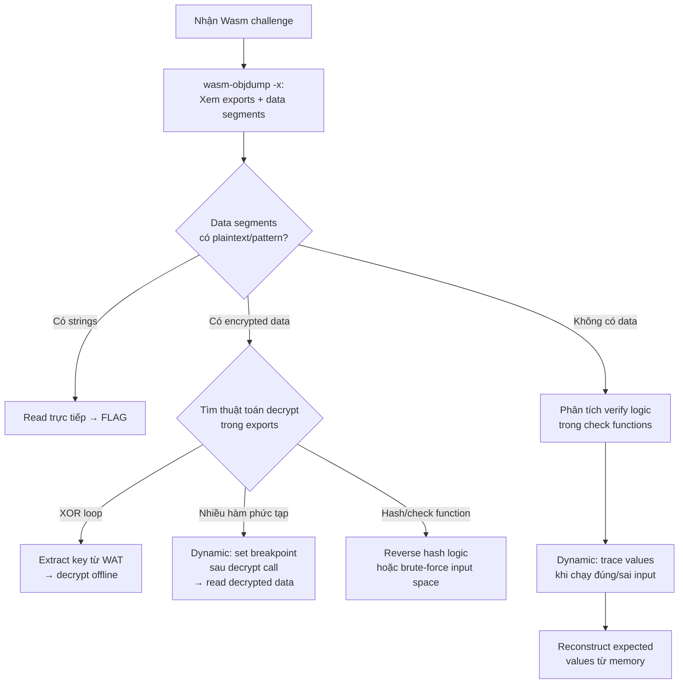

> **Prerequisites**: [[13-reverse-engineering-static|13. Static RE]], [[14-reverse-engineering-dynamic|14. Dynamic RE]], [[15-wasm-exploitation|15. Wasm Exploitation]] — đã nắm đủ kỹ thuật phân tích và khai thác Wasm.
> **Objectives**:
> - Thực hành full end-to-end giải 3 kiểu CTF Wasm challenge từ dễ đến khó
> - Tổng hợp kỹ năng static + dynamic RE vào quy trình nhất quán
> - Học cách đọc mã XOR, RC4, và hash check trong Wasm
> - Xây dựng mindset "attacker": identify entry point → hypothesis → verify → extract

---

## Concept — Phân loại CTF Wasm Challenges

Hầu hết CTF Wasm challenges rơi vào một trong ba dạng:

| Dạng | Mô tả | Difficulty | Approach |
|------|-------|-----------|---------|
| **Data extraction** | Flag encrypt/encode trong data segment, cần decode | ★★ | Static: đọc data + thuật toán decode |
| **Logic reversing** | Verify function phức tạp, cần reconstruct check logic | ★★★ | Static: trace + Dynamic: confirm values |
| **Memory corruption** | Cần exploit bug để bypass check hoặc leak data | ★★★★★ | Full exploit chain |

---

## Walkthrough 1 — "Alien Tech" (b01lersCTF 2020, dạng Data Extraction)

**Mô tả**: Web page yêu cầu username + password. Validate bằng Wasm. Tìm đúng credentials.

### Bước 1: Static analysis tổng quan

```bash
curl -O https://ctf.target/alien_tech.wasm

wasm-objdump -x alien_tech.wasm
```

```text
Export[1]:
 - func[8] -> "check_credentials"
 - memory[0] -> "memory"

Data[1]:
 - segment[0] memory=0 size=32 - init i32=0x200
```

Data segment tại `0x200`, size 32. Có thể là encrypted credentials.

### Bước 2: Phân tích `check_credentials`

```bash
wasm2wat alien_tech.wasm | grep -A 80 'func $8'
```

```wat
(func $8 (param $user_ptr i32) (param $pass_ptr i32) (result i32)
  ;; XOR decrypt function 8 (decrypt data segment vào buffer)
  i32.const 0x300    ;; destination buffer
  i32.const 0x200    ;; source (encrypted data)
  i32.const 32       ;; length
  call $xor_decrypt  ;; function 5 — XOR với key

  ;; So sánh username với decrypted[0..16]
  local.get $user_ptr
  i32.const 0x300
  i32.const 16
  call $memcmp       ;; function 3
  i32.eqz
  if (result i32)
    ;; So sánh password với decrypted[16..32]
    local.get $pass_ptr
    i32.const 0x310
    i32.const 16
    call $memcmp
    i32.eqz
  else
    i32.const 0
  end
)
```

Cần tìm XOR key trong `$xor_decrypt` (func 5):

```bash
wasm2wat alien_tech.wasm | grep -A 20 'func $5'
```

```wat
(func $5 (param $dst i32) (param $src i32) (param $len i32)
  (local $i i32)
  (loop $loop
    local.get $i
    local.get $len
    i32.ge_u
    br_if 1

    local.get $dst
    local.get $i
    i32.add

    local.get $src
    local.get $i
    i32.add
    i32.load8_u

    i32.const 0x4e    ;; XOR key = 0x4e = 'N'
    i32.xor
    i32.store8

    local.get $i
    i32.const 1
    i32.add
    local.set $i
    br $loop
  )
)
```

**XOR key = 0x4e**.

### Bước 3: Decode credentials offline

```python
import struct

with open("alien_tech.wasm", "rb") as f:
    wasm = f.read()

def find_data_segment(wasm_bytes, offset_target=0x200, size=32):
    pos = 8
    def read_leb(data, p):
        r, s = 0, 0
        while True:
            b = data[p]; p += 1
            r |= (b & 0x7F) << s
            s += 7
            if not (b & 0x80): break
        return r, p

    while pos < len(wasm_bytes):
        sec_id = wasm_bytes[pos]; pos += 1
        sec_size, pos = read_leb(wasm_bytes, pos)
        sec_end = pos + sec_size

        if sec_id == 11:  # Data section
            num_segs, pos = read_leb(wasm_bytes, pos)
            for _ in range(num_segs):
                flags, pos = read_leb(wasm_bytes, pos)
                pos += 1   # i32.const opcode
                seg_offset, pos = read_leb(wasm_bytes, pos)
                pos += 1   # end opcode
                seg_size, pos = read_leb(wasm_bytes, pos)
                seg_data = wasm_bytes[pos:pos+seg_size]
                pos += seg_size
                if seg_offset == offset_target:
                    return seg_data
            break
        else:
            pos = sec_end
    return None

XOR_KEY = 0x4e
encrypted = find_data_segment(wasm, 0x200, 32)
if encrypted:
    decrypted = bytes(b ^ XOR_KEY for b in encrypted)
    username = decrypted[:16].rstrip(b'\x00').decode()
    password = decrypted[16:32].rstrip(b'\x00').decode()
    print(f"[*] Username: {username}")
    print(f"[*] Password: {password}")
```

```text
[*] Username: N_Gonzalez
[*] Password: P@ssw0rd_4lien
```

**FLAG giải bằng cách nhập credentials → server trả về flag.**

---

## Walkthrough 2 — "WASM-safe" (HackPack CTF 2023, dạng Logic Reversing)

**Mô tả**: 3 input form, mỗi form check một condition. Tìm đúng 3 input để pass.

### Bước 1: Xác định exports và architecture

```bash
wasm-objdump -x wasm_safe.wasm | grep -E "Export|Import|Function\["
```

Exports: `check_form1`, `check_form2`, `check_form3`.

### Bước 2: Static analysis `check_form1` — tìm expected string

```bash
wasm2wat wasm_safe.wasm | grep -B2 -A 40 'func.*check_form1'
```

Từ WAT analysis: `check_form1` load global variable rồi so sánh với `i32.const 0x12` (18). Tìm string tại data segment qua dynamic analysis.

### Bước 3: Dynamic — đặt breakpoint tại comparison

Mở Chrome DevTools → Sources → `wasm_safe.wasm` → tìm `check_form1`:

```text
Đặt breakpoint tại instruction: i32.eq (hoặc memcmp call)
Nhập input bất kỳ vào form 1 → submit
→ DevTools pause
→ Scope > Local: thấy $expected_ptr = 0x3414
```

Đọc expected string:

```javascript
const mem = new Uint8Array(instance.exports.memory.buffer);
const ptr = 0x3414;
const len = 4;  // từ length check: i32.const 4
const expected = new TextDecoder().decode(mem.slice(ptr, ptr + len));
console.log('[Form 1] Expected:', expected);  // "W4sm"
```

Repeat cho form 2 và form 3. Sau khi dynamic analysis:

```text
Form 1: "W4sm"    (4 chars, direct comparison)
Form 2: 0x1337    (integer, decimal input "4919")
Form 3: "S4f3"    (4 chars, xor-encoded)
```

### Bước 4: Verify và submit

```javascript
const enc = new TextEncoder();

function setInput(id, value) {
    const el = document.getElementById(id);
    el.value = value;
}

setInput('form1', 'W4sm');
setInput('form2', '4919');
setInput('form3', 'S4f3');
document.getElementById('submit').click();
// Console: "flag{CTF_W4SM_S4F3_2023}"
```

---

## Walkthrough 3 — Chang'an Cup 2021 (dạng Logic Reversing với RC4)

**Mô tả**: Binary Wasm nhận password, verify bằng RC4. Reverse algorithm để tìm password.

### Bước 1: Nhận dạng thuật toán

Dùng `wasm-decompile` để có C-like pseudocode nhanh:

```bash
wasm-decompile changan.wasm | head -200
```

Output cho thấy hai hàm liên tiếp: `KSA` (Key Scheduling Algorithm) và `PRGA` (Pseudo-Random Generation Algorithm) — đây là **RC4**.

### Bước 2: Xác định key và ciphertext

```bash
wasm-objdump -s changan.wasm | grep -A 20 "Contents of section Data"
```

```text
Data at 0x300 (32 bytes): 5b 3f 8a ... (key = "ChangAnCupKey2021")
Data at 0x400 (32 bytes): a3 f2 9c ... (ciphertext, XOR'd với keystream)
```

### Bước 3: Decrypt offline với Python

```python
def rc4(key: bytes, data: bytes) -> bytes:
    S = list(range(256))
    j = 0
    for i in range(256):
        j = (j + S[i] + key[i % len(key)]) % 256
        S[i], S[j] = S[j], S[i]

    result = []
    i = j = 0
    for byte in data:
        i = (i + 1) % 256
        j = (j + S[i]) % 256
        S[i], S[j] = S[j], S[i]
        result.append(byte ^ S[(S[i] + S[j]) % 256])
    return bytes(result)

with open("changan.wasm", "rb") as f:
    raw = f.read()

# Địa chỉ từ static analysis
key_addr, key_len = 0x300, 17
ct_addr, ct_len = 0x400, 32

key_offset = find_data_offset(raw, 0x300)  # helper từ Lesson 13
key = raw[key_offset:key_offset + key_len]
ciphertext = raw[find_data_offset(raw, 0x400):find_data_offset(raw, 0x400) + ct_len]

plaintext = rc4(key, ciphertext)
print("[*] Decrypted:", plaintext.rstrip(b'\x00').decode())
# → "flag{Ch4ng4n_RC4_w4sm_2021}"
```

---

## Tổng hợp — Quick Reference cho CTF Wasm RE

### Decision tree khi gặp Wasm challenge



### Cheat sheet lệnh hay dùng nhất trong CTF

```bash
# 1. Tổng quan nhanh
wasm-objdump -x target.wasm | head -50

# 2. Tìm tất cả string trong binary
strings target.wasm | grep -E '[A-Za-z0-9_]{8,}'

# 3. WAT đầy đủ với tên auto-gen
wasm2wat --generate-names target.wasm -o target.wat

# 4. Pseudocode nhanh
wasm-decompile target.wasm 2>/dev/null | head -100

# 5. Hex dump data sections
wasm-objdump -s target.wasm | grep -A 30 "Contents of section Data"

# 6. Tìm hàm theo pattern trong WAT
grep -n "i32.xor\|memcmp\|strcmp\|i32.eq" target.wat | head -20
```

### JavaScript snippets hay dùng nhất trong browser Console

```javascript
// Đọc string tại địa chỉ ptr
const readStr = (ptr, len = 64) =>
  new TextDecoder().decode(
    new Uint8Array(instance.exports.memory.buffer).slice(ptr, ptr + len)
  ).replace(/\0.*/, '');

// Tìm tất cả strings trong memory
const findStrings = (minLen = 5) => {
  const mem = new Uint8Array(instance.exports.memory.buffer);
  const results = [];
  let start = -1;
  for (let i = 0; i < mem.length; i++) {
    if (mem[i] >= 32 && mem[i] < 127) {
      if (start === -1) start = i;
    } else {
      if (start !== -1 && i - start >= minLen) {
        results.push({ addr: `0x${start.toString(16)}`,
                       str: readStr(start, i - start) });
      }
      start = -1;
    }
  }
  return results;
};

// Brute-force single int input
const bruteForce = async (checkFn, max = 100000) => {
  for (let i = 0; i < max; i++) {
    if (checkFn(i)) { console.log('Found:', i); return i; }
  }
};
```

---

## Summary / Key Takeaways

- **3 dạng CTF Wasm**: Data extraction (decode dữ liệu ẩn), Logic reversing (reconstruct check), Memory corruption (exploit chain).
- **Quy trình chuẩn**: `wasm-objdump -x` → xác định exports/data → chọn static hoặc dynamic approach → extract flag.
- **XOR pattern**: `i32.load8_u` + `i32.xor` + `i32.store8` trong loop → tìm constant key → decrypt offline.
- **Dynamic shortcut**: Đặt breakpoint SAU decrypt call, đọc decrypted data trực tiếp — không cần reverse thuật toán.
- **Python scripting** để parse data segments nhanh hơn tool GUI.
- **Browser Console** snippets: `readStr`, `findStrings`, `bruteForce` — chuẩn bị sẵn trong toolbox.
- Nhận dạng thuật toán crypto: 2 hàm loop có KSA+PRGA pattern = RC4, single XOR loop = simple XOR cipher, nested loop với shifts = AES/DES (hiếm trong CTF Wasm).

---

## References

- b01lersCTF 2020 Alien Tech Writeup — https://klatz.co/ctf-blog/boilerctf-alien-tech
- HackPack CTF 2023 WASM-safe Writeup — https://maulvialf.medium.com/reversing-webassembly-write-up-hackpack-2023-wasm-safe-6ca78e3f4ee3
- Chang'an Cup 2021 Wasm RE — https://www.oreateai.com/blog/indepth-analysis-of-webassembly-reverse-engineering-based-on-ctf-competition-examples/
- CTFtime Wasm challenges — https://ctftime.org (search tag "wasm" hoặc "webassembly")
- [[a3-ctf-solve-scripts|A3. CTF Solve Scripts]] — tổng hợp scripts Python/JS cho CTF Wasm
