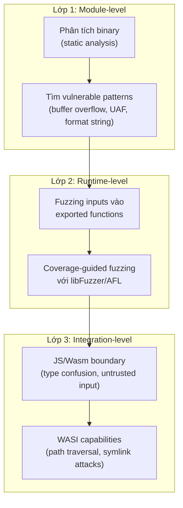
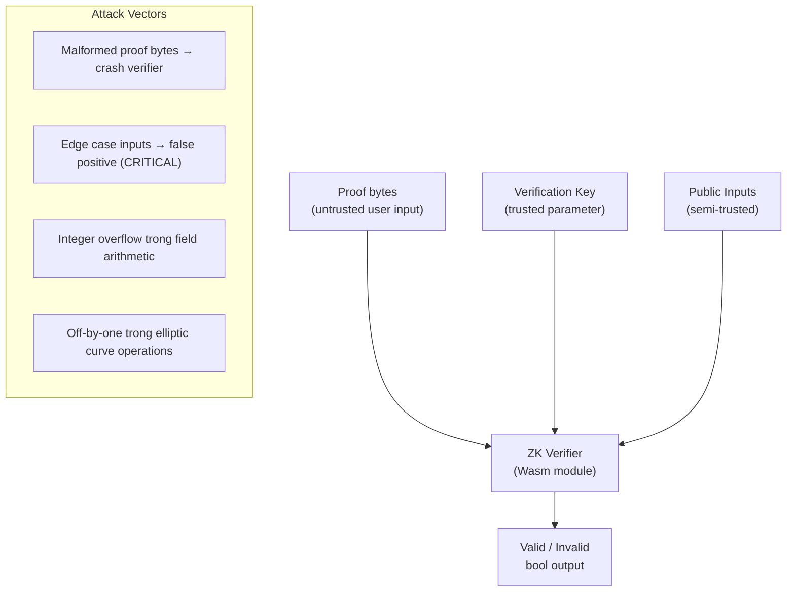

> **Prerequisites**: [[12-wasm-security-model|12. Wasm Security Model]], [[15-wasm-exploitation|15. Wasm Exploitation]] — hiểu attack surface. [[13-reverse-engineering-static|13. Static RE]] — biết phân tích binary.
> **Objectives**:
> - Nắm quy trình audit Wasm module có hệ thống (checklist-based)
> - Biết các kỹ thuật fuzzing cho Wasm: mutation, grammar-based, AFL/libFuzzer với WASI
> - Dùng Binaryen/wasm-opt để instrument binary cho coverage-guided fuzzing
> - Biết cách tìm lỗi trong zkVerify và các ZK proof system Wasm runtime
> - Xây dựng PoC report đạt chuẩn Immunefi bug bounty

---

## Concept — Security Testing Wasm: Ba Lớp

Kiểm thử bảo mật Wasm cần cover ba lớp khác nhau:



---

## Audit Checklist — Phân tích Tĩnh Có Hệ Thống

Khi nhận một Wasm module để audit (ví dụ zkVerify circuit verifier), thực hiện theo thứ tự:

### Phase 1: Reconnaissance

```bash
# 1. Kiểm tra format và version
wasm-validate target.wasm && echo "Valid"
wasm-objdump -x target.wasm | head -80

# 2. Tìm tất cả exported functions (entry points)
wasm-objdump -x target.wasm | grep "func\[" | grep '"->'

# 3. Kiểm tra custom sections (payload ẩn?)
wasm-objdump -x target.wasm | grep -A 5 "Custom"

# 4. Đọc data segments (secrets, keys, hardcoded values?)
wasm-objdump -s target.wasm | grep -A 30 "Contents of section Data"

# 5. Thống kê instruction distribution
wasm-stats target.wasm | sort -rn | head -20
```

### Phase 2: Tìm Vulnerable Patterns

```bash
# Tìm memcpy/strcpy patterns (potential BOF sources)
wasm2wat target.wasm | grep -n "memory.copy\|memory.fill\|i32.store8"

# Tìm hàm có nhiều locals và memory access (complex logic)
wasm2wat target.wasm | awk '/\(func/{ f=$0; c=0 } /local\.get|i32\.load/{c++} c>50{print f; c=0}'

# Đếm số call_indirect (CFI attack surface)
wasm2wat target.wasm | grep -c "call_indirect"

# Tìm Table size (CFI equivalence class)
wasm-objdump -x target.wasm | grep -A 3 "Table\["

# Tìm format string patterns
wasm2wat target.wasm | grep -B3 -A3 "call.*printf\|call.*sprintf\|call.*fprintf"
```

### Phase 3: JS/Wasm Boundary Review

```javascript
// Kiểm tra tất cả exported functions — có validate input không?
const exp = instance.exports;
for (const [name, fn] of Object.entries(exp)) {
  if (typeof fn === 'function') {
    console.log(`Export: ${name}`);
    // Thử gọi với invalid inputs: null ptr, negative len, max i32
    try { fn(0, -1); } catch(e) { console.log(`  → Exception: ${e}`); }
    try { fn(0x7fffffff, 0x7fffffff); } catch(e) { console.log(`  → Exception: ${e}`); }
    try { fn(-1, 0); } catch(e) { console.log(`  → Exception: ${e}`); }
  }
}
```

### Phase 4: WASI Capability Audit

```bash
# Kiểm tra imports — module yêu cầu gì?
wasm-objdump -x target.wasm | grep -A 20 "Import\["

# Với WASI modules: thử path traversal
wasmtime --dir /tmp target.wasm -- /tmp/../etc/passwd
wasmtime --dir /tmp target.wasm -- /tmp/../../../../etc/shadow

# Kiểm tra symlink handling
ln -s /etc/passwd /tmp/test_link
wasmtime --dir /tmp target.wasm -- /tmp/test_link
```

### Phase 5: Audit Checklist

> [!abstract] Wasm Security Audit Checklist
>
> **Binary Format:**
> - [ ] Custom sections không chứa executable payload hay sensitive data
> - [ ] Name section strip (tránh lộ function names trong production)
> - [ ] Version hợp lệ, không có malformed sections
>
> **Memory Safety:**
> - [ ] Tất cả string/array handling có bounds check
> - [ ] Không dùng `strcpy`/`sprintf` không safe (thay bằng `strncpy`/`snprintf`)
> - [ ] Heap allocation có kiểm tra return value (malloc trả 0 khi fail)
> - [ ] Không có use-after-free patterns (free rồi dùng lại pointer)
>
> **Control Flow:**
> - [ ] Table size tối thiểu (chỉ chứa những function cần `call_indirect`)
> - [ ] Không có function pointer trong linear memory trừ khi cần thiết
> - [ ] Import list tối thiểu (least privilege)
>
> **Input Validation:**
> - [ ] Mọi pointer từ JS được validate bounds trước khi dùng trong Wasm
> - [ ] Length values không overflow khi cộng với base pointer
> - [ ] Không dùng user input làm format string cho printf
>
> **WASI (nếu applicable):**
> - [ ] Path normalization trước khi `path_open`
> - [ ] Không có directory traversal với `..` components
> - [ ] Symlink handling đúng

---

## Fuzzing Wasm — Mutation-based với libFuzzer

### Setup fuzzing cho WASI module

```c
// fuzz_target.c — Harness cho libFuzzer với wasmtime embedding
#include <stdint.h>
#include <stddef.h>
#include <wasmtime.h>

// Global engine và store (setup một lần)
static wasm_engine_t* g_engine = NULL;
static wasmtime_store_t* g_store = NULL;
static wasmtime_instance_t g_instance;
static wasmtime_func_t g_fuzz_func;

void setup_wasm(void) {
    g_engine = wasm_engine_new();
    g_store = wasmtime_store_new(g_engine, NULL, NULL);
    wasmtime_context_t* ctx = wasmtime_store_context(g_store);

    FILE* f = fopen("target.wasm", "rb");
    fseek(f, 0, SEEK_END);
    size_t sz = ftell(f);
    rewind(f);
    uint8_t* wasm_bytes = malloc(sz);
    fread(wasm_bytes, 1, sz, f);
    fclose(f);

    wasmtime_module_t* module;
    wasmtime_module_new(g_engine, wasm_bytes, sz, &module);
    free(wasm_bytes);

    // Instantiate với WASI
    wasi_config_t* wasi_config = wasi_config_new();
    wasmtime_context_set_wasi(ctx, wasi_config);

    wasmtime_linker_t* linker = wasmtime_linker_new(g_engine);
    wasmtime_linker_define_wasi(linker);
    wasmtime_linker_instantiate(linker, ctx, module, &g_instance, NULL);

    // Lấy exported function "process_input"
    wasmtime_extern_t item;
    wasmtime_instance_export_get(ctx, &g_instance, "process_input", 13, &item);
    g_fuzz_func = item.of.func;
}

// libFuzzer entry point
int LLVMFuzzerTestOneInput(const uint8_t* data, size_t size) {
    if (!g_engine) setup_wasm();

    wasmtime_context_t* ctx = wasmtime_store_context(g_store);

    // Copy fuzz input vào Wasm linear memory
    wasmtime_extern_t mem_extern;
    wasmtime_instance_export_get(ctx, &g_instance, "memory", 6, &mem_extern);
    wasmtime_memory_t* wasm_mem = &mem_extern.of.memory;

    size_t mem_size = wasmtime_memory_data_size(ctx, wasm_mem);
    if (size > mem_size - 0x1000) size = mem_size - 0x1000;

    uint8_t* mem_data = wasmtime_memory_data(ctx, wasm_mem);
    memcpy(mem_data + 0x1000, data, size);

    // Gọi exported function với fuzz input
    wasmtime_val_t args[2] = {
        {.kind = WASMTIME_I32, .of.i32 = 0x1000},   // ptr
        {.kind = WASMTIME_I32, .of.i32 = (int32_t)size},  // len
    };
    wasmtime_val_t results[1];
    wasmtime_trap_t* trap = NULL;

    wasmtime_func_call(ctx, &g_fuzz_func, args, 2, results, 1, &trap);

    if (trap) {
        wasmtime_trap_delete(trap);
    }

    return 0;
}
```

```bash
# Compile fuzz harness với libFuzzer
clang -fsanitize=fuzzer,address \
  fuzz_target.c \
  -lwasmtime \
  -o fuzz_wasm

# Chạy fuzzer
./fuzz_wasm -max_len=4096 -runs=1000000 corpus/
```

### Coverage-guided fuzzing với wasm-opt instrumentation

```bash
# Binaryen cung cấp coverage instrumentation cho Wasm
wasm-opt target.wasm \
  --instrument-locals \
  --instrument-memory \
  -o instrumented.wasm

# Hoặc dùng AFL++ với Wasm support
cargo install cargo-fuzz
# Trong Rust crate:
cargo fuzz run fuzz_target_1
```

---

## Fuzzing ZK Proof System Wasm — Áp dụng cho zkVerify

Đây là phần quan trọng nhất cho mục tiêu bug bounty của bạn trên Immunefi/zkVerify.

### Attack Surface của ZK Verifier Wasm



> [!danger] Critical: False Positive Verification
> Bug nghiêm trọng nhất trong ZK verifier là **false positive** — verifier chấp nhận proof KHÔNG HỢP LỆ. Điều này có thể cho phép attacker:
> - Mint token vô hạn trên blockchain
> - Bypass authentication trong ZK-based system
> - Chứng minh ownership không có thật
>
> Đây là loại lỗi đáng giá $50,000 trên Immunefi critical bounty.

### Fuzzing Strategy cho ZK Verifier

```python
"""
zk_verifier_fuzzer.py — Mutation fuzzing cho ZK proof verifier

Mục tiêu: Tìm proof bytes làm verifier crash HOẶC
          trả về true khi proof không hợp lệ
"""

import struct
import random
import subprocess
import hashlib
from typing import Optional

def generate_valid_proof_skeleton() -> bytes:
    """Tạo proof bytes có cấu trúc hợp lệ nhưng field values random."""
    # BN254 G1 point: 2 x 32-byte field elements
    # BN254 G2 point: 2 x 64-byte field elements
    # Proof = (A: G1, B: G2, C: G1) = 32+32+64+64+32+32 = 256 bytes

    # Modulus BN254: r = 21888242871839275222246405745257275088548364400416034343698204186575808495617
    BN254_R = 0x30644e72e131a029b85045b68181585d2833e84879b9709143e1f593f0000001

    def random_fr() -> bytes:
        return (random.randint(0, BN254_R - 1)).to_bytes(32, 'big')

    proof = b''
    proof += random_fr() + random_fr()       # A (G1)
    proof += random_fr() * 2 + random_fr() * 2  # B (G2)
    proof += random_fr() + random_fr()       # C (G1)
    return proof

def mutate_proof(proof: bytes, strategy: str = "random") -> bytes:
    """Các mutation strategy."""
    proof = bytearray(proof)

    if strategy == "random":
        # Flip random bytes
        n = random.randint(1, 8)
        for _ in range(n):
            idx = random.randint(0, len(proof) - 1)
            proof[idx] = random.randint(0, 255)

    elif strategy == "zero_point":
        # G1 point of infinity = (0, 0)
        offset = random.choice([0, 128, 192])
        proof[offset:offset+64] = b'\x00' * 64

    elif strategy == "boundary":
        # Giá trị biên: 0, 1, r-1, r, r+1
        BN254_R = 0x30644e72e131a029b85045b68181585d2833e84879b9709143e1f593f0000001
        boundary = random.choice([0, 1, BN254_R - 1, BN254_R, BN254_R + 1])
        offset = random.choice([0, 32, 64, 128, 160, 192, 224])
        proof[offset:offset+32] = boundary.to_bytes(32, 'big')

    elif strategy == "truncate":
        # Truncate proof — invalid length
        cut = random.randint(1, len(proof) - 1)
        proof = proof[:cut]

    elif strategy == "extend":
        # Thêm bytes sau proof
        proof += bytes(random.randint(0, 255) for _ in range(random.randint(1, 64)))

    return bytes(proof)

def run_verifier(proof: bytes, public_inputs: bytes, vk: bytes) -> Optional[bool]:
    """
    Chạy Wasm verifier và trả về kết quả.
    True = accepted, False = rejected, None = crash/error
    """
    try:
        result = subprocess.run(
            ["wasmtime", "verifier.wasm",
             "--proof", proof.hex(),
             "--inputs", public_inputs.hex(),
             "--vk", vk.hex()],
            capture_output=True, timeout=5
        )
        if result.returncode == 2:  # crash
            return None
        output = result.stdout.strip()
        return output == b"valid"
    except subprocess.TimeoutExpired:
        return None  # timeout cũng là bug

def fuzz_verifier(vk: bytes, valid_proof: bytes, public_inputs: bytes,
                  iterations: int = 10000):
    """Main fuzzing loop."""
    bugs_found = []
    strategies = ["random", "zero_point", "boundary", "truncate", "extend"]

    for i in range(iterations):
        strategy = random.choice(strategies)
        mutated = mutate_proof(valid_proof, strategy)

        result = run_verifier(mutated, public_inputs, vk)

        if result is None:
            print(f"[!] CRASH at iteration {i}, strategy={strategy}")
            bugs_found.append({
                "type": "crash",
                "proof_hex": mutated.hex(),
                "strategy": strategy,
            })
        elif result == True:
            print(f"[!] FALSE POSITIVE at iteration {i}, strategy={strategy}")
            bugs_found.append({
                "type": "false_positive",
                "proof_hex": mutated.hex(),
                "strategy": strategy,
            })

        if i % 1000 == 0:
            print(f"[*] Progress: {i}/{iterations}, bugs: {len(bugs_found)}")

    return bugs_found
```

---

## Viết Bug Report Đạt Chuẩn Immunefi

Khi tìm được bug trên zkVerify, report phải có đủ các phần:

### Template Bug Report

Một report Immunefi hợp lệ cần các phần sau:

**Title**: `[Critical] ZK Verifier accepts invalid proofs due to missing point-at-infinity check`

**Summary**: Mô tả ngắn gọn lỗ hổng và impact trong 1 đoạn.

**Vulnerability Details**:

- *Root Cause*: Hàm `check_pairing_eq()` (func\[42\] trong verifier.wasm) không validate G1 input points không phải điểm vô cực (0, 0) trước khi gọi `bn254_miller_loop()`. Điều này cho phép attacker craft proof với A = (0,0) qua pairing check.
- *Affected Component*: `verifier.wasm` (SHA256: ...), func index 42 tại offset 0x3a14, WASI target wasm32-wasip1.
- *Steps to Reproduce*:
  1. Deploy smart contract với zkVerify làm proof verifier.
  2. Generate invalid proof với A = G1 point of infinity: `proof = b'\x00' * 64 + valid_B + valid_C`.
  3. Submit proof với bất kỳ public input nào.

**Proof of Concept**:

```python
import subprocess

VALID_B = bytes(128)   # placeholder
VALID_C = bytes(64)    # placeholder
invalid_proof = bytes(64) + VALID_B + VALID_C

result = subprocess.run(
    ["wasmtime", "verifier.wasm", "--proof", invalid_proof.hex()],
    capture_output=True
)
assert result.returncode == 0, "Bug not triggered"
print("Bug confirmed: invalid proof accepted")
```

**Impact**: Attacker có thể submit proofs mà không cần biết secret witness — bypass toàn bộ verification, cho phép arbitrary state transitions on-chain.

**Severity: Critical (CVSS 9.8)** — Attack Vector: Network, Privileges Required: None, Confidentiality/Integrity/Availability: High.

---

## Summary / Key Takeaways

- **Ba lớp kiểm thử**: Module-level (static analysis), Runtime-level (fuzzing), Integration-level (boundary + WASI).
- **Audit checklist**: Custom sections, memory safety patterns, Table size, input validation tại JS/Wasm boundary, WASI path traversal.
- **libFuzzer + wasmtime**: Viết harness C/Rust, instrument binary với wasm-opt, coverage-guided fuzzing tự động.
- **ZK Verifier fuzzing**: Target là **false positive** (accept invalid proof) — critical severity, $50k bounty. Mutation strategies: random bytes, zero/infinity points, boundary values (0, 1, r-1, r, r+1), truncate/extend.
- **Bug report Immunefi**: Title → Summary → Root Cause → Affected Component → Steps to Reproduce → PoC → Impact → Severity.
- Rust-based ZK verifiers an toàn hơn C/C++ về memory safety, nhưng **logic bugs** (wrong arithmetic, missing checks) vẫn có trong mọi ngôn ngữ.

---

## References

- Immunefi Bug Bounty Platform — https://immunefi.com
- zkVerify Documentation — https://docs.zkverify.io
- Binaryen/wasm-opt instrumentation — https://github.com/WebAssembly/binaryen
- libFuzzer documentation — https://llvm.org/docs/LibFuzzer.html
- Wasmtime fuzzing API — https://docs.wasmtime.dev/stability-fuzzing.html
- "Wemby's Web: Hunting for Memory Corruption in WebAssembly" — https://www.ias.cs.tu-bs.de/publications/wemby.pdf
