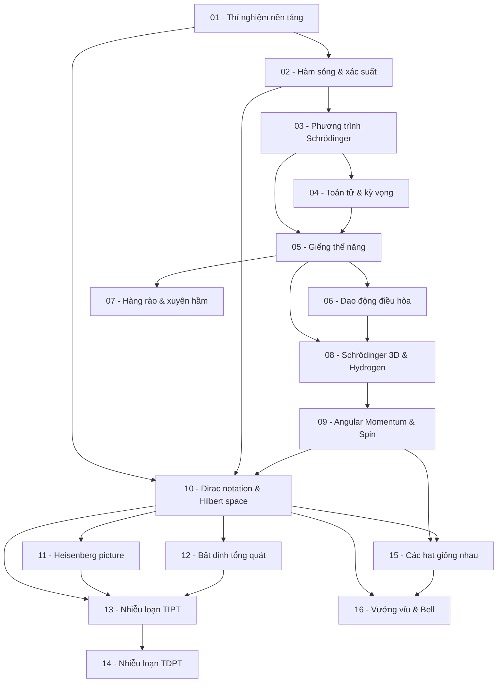

> **Chủ đề**: Cơ học lượng tử (Quantum Mechanics)
> **Domain**: Physics
> **Level**: Advanced — toán đầy đủ, gần sách giáo khoa đại học
> **Background**: Giải tích (đạo hàm, tích phân), đại số tuyến tính (ma trận, vector), cơ học cổ điển
> **Nguồn tham khảo chính**: Griffiths — *Introduction to Quantum Mechanics* (2nd ed.); MIT OCW 8.04/8.05 (Zwiebach, Adams)

---

## Lessons

| # | Tiêu đề | Khái niệm chính | Prereq | Độ khó |
|---|---------|----------------|--------|--------|
| 01 | Thí nghiệm nền tảng & sự ra đời của QM | Hiệu ứng quang điện, khe đôi Young, de Broglie, lưỡng tính sóng-hạt | — | ★★☆☆☆ |
| 02 | Hàm sóng & diễn giải xác suất | ψ(x,t), \|ψ\|², Born rule, normalization, probability current | 01 | ★★★☆☆ |
| 03 | Phương trình Schrödinger | TDSE, TISE, tách biến, stationary states | 02 | ★★★☆☆ |
| 04 | Toán tử & giá trị kỳ vọng | Hermitian operator, eigenstate, ⟨x⟩, ⟨p⟩, Heisenberg uncertainty | 03 | ★★★★☆ |
| 05 | Giếng thế năng vô hạn & hữu hạn | Điều kiện biên, lượng tử hóa năng lượng, bound state | 03, 04 | ★★★☆☆ |
| 06 | Dao động điều hòa lượng tử | Ladder operators â±, algebraic method, zero-point energy | 05 | ★★★★☆ |
| 07 | Hàng rào thế năng & xuyên hầm | Transmission/reflection, tunneling, ứng dụng (STM, alpha decay) | 05 | ★★★☆☆ |
| 08 | Schrödinger 3D & nguyên tử Hydrogen | Tọa độ cầu, angular momentum L, Ylm, mức năng lượng Hydrogen | 05, 06 | ★★★★☆ |
| 09 | Mômen động lượng & spin | [L, L²], spin-1/2, ma trận Pauli, hệ số Clebsch-Gordan | 08 | ★★★★★ |
| 10 | Ký hiệu Dirac & không gian Hilbert | Bra-ket, Hilbert space, completeness, toán tử dạng ma trận | 01–09 | ★★★★☆ |
| 11 | Heisenberg picture & cơ học ma trận | Heisenberg vs Schrödinger picture, equations of motion | 10 | ★★★★☆ |
| 12 | Nguyên lý bất định tổng quát | Generalized uncertainty, compatible observables, commutator | 10 | ★★★★☆ |
| 13 | Nhiễu loạn không phụ thuộc thời gian | First/second order TIPT, degenerate perturbation theory | 10–12 | ★★★★★ |
| 14 | Nhiễu loạn phụ thuộc thời gian | TDPT, Fermi's golden rule, selection rules | 13 | ★★★★★ |
| 15 | Các hạt giống nhau & thống kê lượng tử | Exchange symmetry, boson/fermion, Pauli exclusion, Slater determinant | 09, 10 | ★★★★☆ |
| 16 | Vướng víu lượng tử & định lý Bell | EPR paradox, Bell inequalities, quantum information intro | 10–15 | ★★★★☆ |

## Appendix

| ID | Nội dung | Liên quan |
|----|---------|---------|
| A0 | Toán học thiết yếu cho QM | Tất cả — Fourier transform, ODE, tọa độ cầu, số phức |
| A1 | Bài toán mẫu đầy đủ | Tổng hợp worked problems từ tất cả các phase |

---

## Dependency Graph

---

## Progress Tracker

- [ ] [[00-roadmap|00. Roadmap]]
- [ ] [[01-experimental-foundations|01. Thí nghiệm nền tảng & sự ra đời của QM]]
- [ ] [[02-wavefunction-probability|02. Hàm sóng & diễn giải xác suất]]
- [ ] [[03-schrodinger-equation|03. Phương trình Schrödinger]]
- [ ] [[04-operators-expectation|04. Toán tử & giá trị kỳ vọng]]
- [ ] [[05-potential-wells|05. Giếng thế năng vô hạn & hữu hạn]]
- [ ] [[06-harmonic-oscillator|06. Dao động điều hòa lượng tử]]
- [ ] [[07-tunneling|07. Hàng rào thế năng & xuyên hầm]]
- [ ] [[08-hydrogen-atom|08. Schrödinger 3D & nguyên tử Hydrogen]]
- [ ] [[09-angular-momentum-spin|09. Mômen động lượng & spin]]
- [ ] [[10-dirac-hilbert|10. Ký hiệu Dirac & không gian Hilbert]]
- [ ] [[11-heisenberg-picture|11. Heisenberg picture & cơ học ma trận]]
- [ ] [[12-generalized-uncertainty|12. Nguyên lý bất định tổng quát]]
- [ ] [[13-time-independent-perturbation|13. Nhiễu loạn không phụ thuộc thời gian]]
- [ ] [[14-time-dependent-perturbation|14. Nhiễu loạn phụ thuộc thời gian]]
- [ ] [[15-identical-particles|15. Các hạt giống nhau & thống kê lượng tử]]
- [ ] [[16-entanglement-bell|16. Vướng víu lượng tử & định lý Bell]]
- [ ] [[a0-math-essentials|A0. Toán học thiết yếu cho QM]]
- [ ] [[a1-worked-problems|A1. Bài toán mẫu đầy đủ]]
