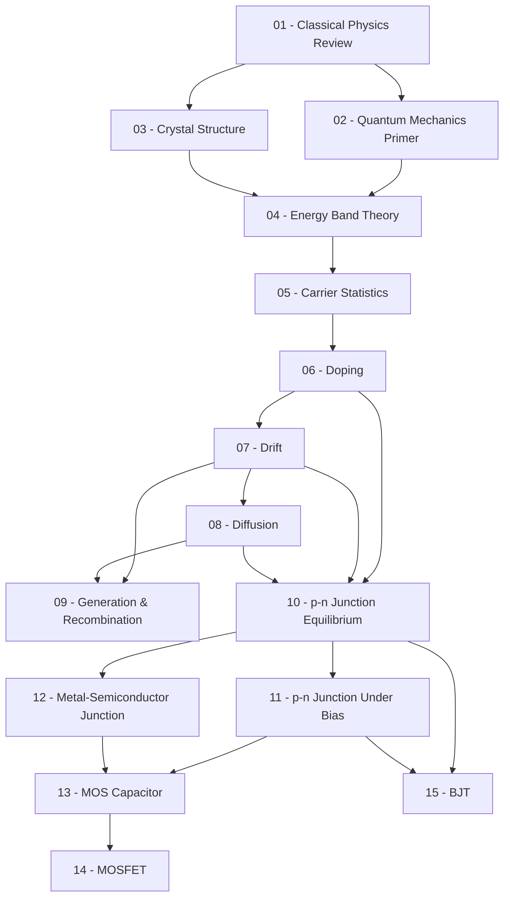

> **Topic**: Semiconductor Device Physics
> **Domain**: Physics — Device Physics
> **Level**: Intermediate → Advanced (graduate-level)
> **Background**: Vật lý phổ thông (điện, từ), đạo hàm / tích phân cơ bản
> **Sources**: MIT 6.012/6.720J, Pierret *Semiconductor Device Fundamentals*, Streetman & Banerjee *Solid State Electronic Devices*

---

## Lessons

| # | Title | Key Concepts | Prerequisites | Difficulty |
|---|-------|-------------|---------------|------------|
| 01 | Classical Physics Review | Điện trường, thế năng điện, năng lượng, lực Coulomb, potential | — | ★☆☆☆☆ |
| 02 | Quantum Mechanics Primer | Wave-particle duality, quantization, Schrödinger equation (conceptual), electron trong tinh thể | 01 | ★★☆☆☆ |
| 03 | Crystal Structure | Mạng tinh thể, unit cell, cấu trúc silicon, liên kết cộng hóa trị | 01 | ★★☆☆☆ |
| 04 | Energy Band Theory | Band gap, conduction band, valence band, E-k diagram, kim loại vs. bán dẫn vs. điện môi | 02, 03 | ★★★☆☆ |
| 05 | Carrier Statistics | Fermi-Dirac distribution, density of states, intrinsic carrier concentration $n_i$ | 04 | ★★★☆☆ |
| 06 | Doping | n-type / p-type, donor & acceptor levels, charge neutrality, extrinsic carrier concentration | 05 | ★★☆☆☆ |
| 07 | Drift | Điện trường, mobility, velocity saturation, Ohm's law vi mô | 06 | ★★★☆☆ |
| 08 | Diffusion | Gradient nồng độ, diffusion coefficient, Einstein relation | 07 | ★★★☆☆ |
| 09 | Generation & Recombination | Direct/indirect G-R, SRH mechanism, minority carrier lifetime, continuity equation | 07, 08 | ★★★★☆ |
| 10 | p-n Junction Equilibrium | Built-in potential, depletion region, energy band diagram | 06, 07, 08 | ★★★☆☆ |
| 11 | p-n Junction Under Bias | Forward/reverse bias, ideal diode equation, minority carrier injection | 10 | ★★★☆☆ |
| 12 | Metal-Semiconductor Junction | Schottky barrier, Fermi level alignment, ohmic contact | 10 | ★★★☆☆ |
| 13 | MOS Capacitor | Flat-band, depletion, inversion; C-V characteristics | 11, 12 | ★★★★☆ |
| 14 | MOSFET | Cấu trúc, threshold voltage, I-V model (linear + saturation), short-channel effects | 13 | ★★★★☆ |
| 15 | BJT | Cấu trúc, chế độ hoạt động, Ebers-Moll model, current gain $\beta$ | 10, 11 | ★★★★☆ |

## Appendix Candidates

| ID | Content | Related Lesson | Notes |
|----|---------|----------------|-------|
| A0 | Quantum Mechanics Deeper | 02 | Schrödinger equation đầy đủ, particle in a box — cho ai muốn đào sâu hơn |
| A1 | Math Toolbox | 08, 09 | Continuity equation, Poisson equation, diffusion equation — tổng hợp toán cần thiết |

---

## Dependency Graph

---

## Progress Tracker

- [ ] [[00-roadmap|00. Roadmap]]
- [ ] [[01-classical-physics-review|01. Classical Physics Review]]
- [ ] [[02-quantum-mechanics-primer|02. Quantum Mechanics Primer]]
- [ ] [[03-crystal-structure|03. Crystal Structure]]
- [ ] [[04-energy-band-theory|04. Energy Band Theory]]
- [ ] [[05-carrier-statistics|05. Carrier Statistics]]
- [ ] [[06-doping|06. Doping]]
- [ ] [[07-drift|07. Drift]]
- [ ] [[08-diffusion|08. Diffusion]]
- [ ] [[09-generation-recombination|09. Generation & Recombination]]
- [ ] [[10-pn-junction-equilibrium|10. p-n Junction Equilibrium]]
- [ ] [[11-pn-junction-under-bias|11. p-n Junction Under Bias]]
- [ ] [[12-metal-semiconductor-junction|12. Metal-Semiconductor Junction]]
- [ ] [[13-mos-capacitor|13. MOS Capacitor]]
- [ ] [[14-mosfet|14. MOSFET]]
- [ ] [[15-bjt|15. BJT]]
- [ ] [[a0-quantum-mechanics-deeper|A0. Quantum Mechanics Deeper]]
- [ ] [[a1-math-toolbox|A1. Math Toolbox]]
