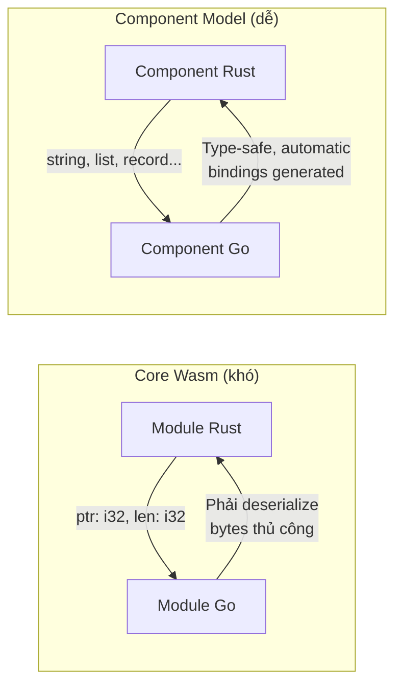
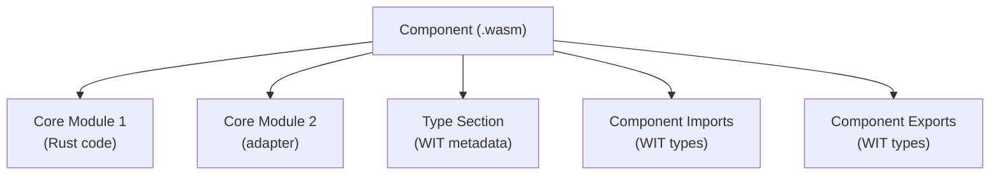
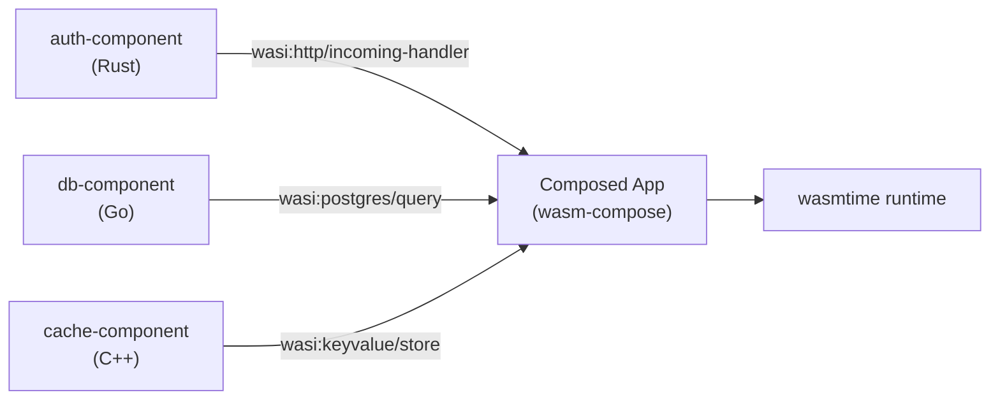
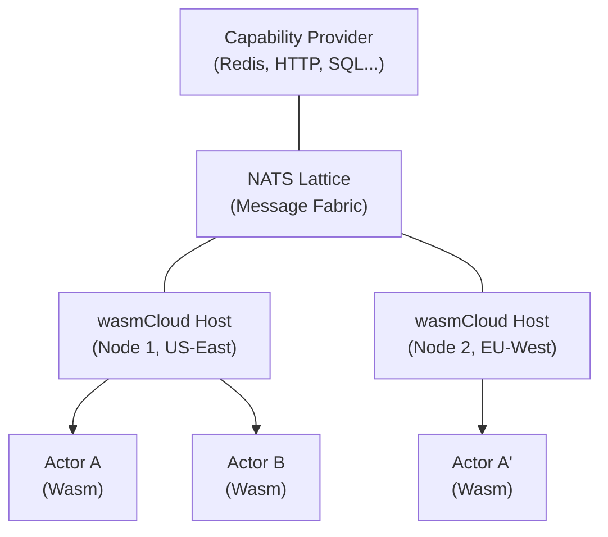

> **Prerequisites**: [[09-wasi-wasm-ngoai-trinh-duyet|09. WASI]] — hiểu WASI capability model, wasmtime. [[06-rust-wasm-pack|06. Rust + wasm-pack]] — biết Rust crate system và wasm-bindgen.
> **Objectives**:
> - Hiểu vấn đề Component Model giải quyết: tại sao module-to-module communication khó khăn
> - Nắm cú pháp WIT (WebAssembly Interface Types) — IDL của Component Model
> - Phân biệt core Wasm module vs Component
> - Viết và compile Rust component với WASI 0.2
> - Hiểu "worlds" và cách compose nhiều components
> - Nắm bức tranh cloud-native: Spin, wasmCloud, Kubernetes với Wasm

---

## Concept — Vấn đề Component Model Giải quyết

### Giới hạn của core Wasm module

Core Wasm module giao tiếp qua **raw bytes** và **numbers**:
- Wasm A gọi hàm của Wasm B → phải truyền con trỏ vào linear memory
- Hai module phải **chia sẻ memory** hoặc serialize/deserialize qua boundary
- Không có type safety qua module boundary — chỉ là `i32`/`i64`/`f32`/`f64`
- Language barrier: Rust module không "nói chuyện" tự nhiên với Go module



### Component Model là gì?

> [!note] Định nghĩa
> **Component Model** là một kiến trúc cho phép các Wasm module giao tiếp với nhau qua **interface được định nghĩa rõ ràng**, type-safe, và ngôn ngữ-agnostic. Nó định nghĩa:
>
> 1. **WIT (WebAssembly Interface Types)**: IDL (Interface Description Language) để viết interface contract
> 2. **Component binary format**: Định dạng `.wasm` mở rộng chứa type metadata
> 3. **Linking semantics**: Cách compose nhiều components thành application

Metaphor hay dùng: Component Model biến Wasm modules thành **LEGO bricks** — mỗi brick có hình dạng chuẩn, có thể ghép với bất kỳ brick nào khác bất kể brick đó được làm từ vật liệu gì (Rust, Go, Python...).

---

## WIT — WebAssembly Interface Types

WIT là ngôn ngữ định nghĩa interface của Component Model. File `.wit` mô tả:
- **Types**: `record`, `variant`, `enum`, `list`, `option`, `result`, `tuple`
- **Functions**: signature với WIT types (không phải `i32`/`f32`)
- **Interfaces**: tập hợp functions và types
- **Worlds**: tập hợp interfaces (imports + exports) tạo thành contract của một component

### Cú pháp WIT cơ bản

```wit
// calculator.wit
package docs:calculator@0.1.0;

/// Interface cho các phép toán cơ bản
interface operations {
  /// Kiểu lỗi có thể xảy ra
  variant calc-error {
    division-by-zero,
    overflow,
    invalid-input(string),
  }

  /// Cộng hai số
  add: func(a: f64, b: f64) -> f64;

  /// Chia — có thể thất bại
  divide: func(a: f64, b: f64) -> result<f64, calc-error>;

  /// Tìm min trong danh sách
  min-of: func(values: list<f64>) -> option<f64>;
}

/// World mô tả toàn bộ contract của component
world calculator {
  export operations;
}
```

### WIT Types — Bảng tham chiếu

| WIT Type | Ví dụ | Tương đương |
|----------|-------|------------|
| `u8`/`u16`/`u32`/`u64` | `u32` | Unsigned integers |
| `s8`/`s16`/`s32`/`s64` | `s32` | Signed integers |
| `f32`/`f64` | `f64` | Floats |
| `bool` | `bool` | Boolean |
| `string` | `string` | UTF-8 string |
| `char` | `char` | Unicode scalar |
| `list<T>` | `list<u8>` | Dynamic array |
| `option<T>` | `option<string>` | Maybe / Optional |
| `result<T, E>` | `result<u32, string>` | Ok/Err |
| `tuple<T1, T2>` | `tuple<string, u32>` | Fixed-size tuple |
| `record` | `record point { x: f64, y: f64 }` | Struct |
| `variant` | `variant shape { circle(f64), rect(f64, f64) }` | Tagged union |
| `enum` | `enum color { red, green, blue }` | Enum |
| `resource` | `resource file-handle { ... }` | Opaque handle (RAII) |

---

## Component vs Core Module

> [!info] Phân biệt Component và Core Module
>
> **Core Wasm Module**: File `.wasm` theo spec MVP/2.0 — có linear memory, functions, imports/exports theo kiểu `i32`/`f32`...
>
> **Component**: File `.wasm` mở rộng chứa:
> - Một hoặc nhiều core modules bên trong
> - Type metadata theo WIT format
> - Component-level imports/exports với WIT types
>
> Mọi component đều chứa core module(s) — Component Model là lớp bên ngoài bọc lấy core modules và thêm type information.



---

## Worked Project — Rust Component với WASI 0.2

### Bước 1: Cài cargo-component

```bash
# Tool để build Rust components
cargo install cargo-component

# Kiểm tra
cargo component --version
```

### Bước 2: Tạo project

```bash
cargo component new --reactor hello-component
cd hello-component
```

Cấu trúc project:

```text
hello-component/
├── Cargo.toml
├── src/
│   └── lib.rs
└── wit/
    └── world.wit       ← WIT interface definition
```

### Bước 3: Viết WIT interface

```wit
// wit/world.wit
package hello:component@0.1.0;

interface greet {
  greet: func(name: string) -> string;
  count-words: func(text: string) -> u32;
}

world hello-world {
  export greet;
}
```

### Bước 4: Implement trong Rust

```rust
// src/lib.rs
cargo_component_bindings::generate!();

use exports::hello::component::greet::Guest;

struct Component;

impl Guest for Component {
    fn greet(name: String) -> String {
        format!("Xin chào, {}! Chào mừng đến với Wasm Component!", name)
    }

    fn count_words(text: String) -> u32 {
        text.split_whitespace().count() as u32
    }
}

export!(Component);
```

### Bước 5: Build và chạy

```bash
# Build thành component
cargo component build --release

# Chạy với wasmtime (WASI 0.2)
wasmtime run \
  --invoke greet \
  target/wasm32-wasip2/release/hello_component.wasm \
  "Kitsu"
# Output: Xin chào, Kitsu! Chào mừng đến với Wasm Component!
```

---

## Composing Components — Ghép nhiều Components

Một trong những tính năng mạnh nhất của Component Model là **composition** — link nhiều components lại thành một application lớn hơn, ngay cả khi chúng được viết bằng ngôn ngữ khác nhau.



Tool để compose: `wasm-compose` (từ Bytecode Alliance)

```bash
# Cài wasm-compose
cargo install wasm-compose

# Compose 2 components
wasm-compose \
  -c auth.wasm \
  -c handler.wasm \
  -o app.wasm
```

---

## Worlds trong WASI 0.2

WASI 0.2 định nghĩa các **worlds** chuẩn hóa — "bộ interfaces" mà component có thể target:

### `wasi:cli/command` — CLI application

```wit
world command {
  import wasi:filesystem/types@0.2.0;
  import wasi:filesystem/preopens@0.2.0;
  import wasi:clocks/wall-clock@0.2.0;
  import wasi:io/streams@0.2.0;
  import wasi:cli/stdin@0.2.0;
  import wasi:cli/stdout@0.2.0;
  import wasi:cli/stderr@0.2.0;
  import wasi:cli/environment@0.2.0;
  import wasi:cli/exit@0.2.0;
  // ...
  export wasi:cli/run@0.2.0;  // entry point
}
```

### `wasi:http/proxy` — HTTP handler

```wit
world proxy {
  import wasi:http/outgoing-handler@0.2.0;  // HTTP client
  import wasi:io/streams@0.2.0;
  // ...
  export wasi:http/incoming-handler@0.2.0;  // HTTP server
}
```

Component target `wasi:http/proxy` là HTTP handler — nhận request, trả response:

```rust
use wasi::http::types::{IncomingRequest, ResponseOutparam, OutgoingResponse};

struct HttpHandler;

impl exports::wasi::http::incoming_handler::Guest for HttpHandler {
    fn handle(request: IncomingRequest, response_out: ResponseOutparam) {
        let headers = wasi::http::types::Fields::new();
        let response = OutgoingResponse::new(headers);
        response.set_status_code(200).unwrap();

        let body = response.body().unwrap();
        let stream = body.write().unwrap();
        stream.write_all(b"Hello from Wasm!").unwrap();

        ResponseOutparam::set(response_out, Ok(response));
    }
}
```

---

## Cloud-Native Wasm Ecosystem

### Fermyon Spin — Serverless Wasm Platform

**Spin** là framework của Fermyon để build serverless apps với Wasm Components:

```toml
# spin.toml
spin_manifest_version = 2

[application]
name = "my-api"
version = "0.1.0"

[[trigger.http]]
route = "/api/..."
component = "api-handler"

[component.api-handler]
source = "target/wasm32-wasip2/release/api_handler.wasm"
allowed_outbound_hosts = ["https://api.example.com"]

[component.api-handler.build]
command = "cargo component build --release"
```

```bash
spin build
spin up
# Listening on http://127.0.0.1:3000
```

### wasmCloud — Distributed Wasm Platform

**wasmCloud** là platform orchestration dùng Wasm Actor model:



Actors (Wasm components) giao tiếp qua message lattice — không có shared state, mỗi actor là isolated. Scale horizontally bằng cách deploy thêm actor instances.

### Kubernetes với Wasm Runtime Class

```yaml
# RuntimeClass cho wasmtime
apiVersion: node.k8s.io/v1
kind: RuntimeClass
metadata:
  name: wasmtime-spin
handler: spin

---
apiVersion: v1
kind: Pod
metadata:
  name: wasm-app
spec:
  runtimeClassName: wasmtime-spin   # dùng Wasm runtime thay Docker
  containers:
  - name: app
    image: myregistry/myapp:latest   # OCI image chứa .wasm
```

Với **Krustlet** hoặc **containerd-wasm-shim**, Kubernetes có thể schedule Wasm workloads như Docker containers — nhưng khởi động nhanh hơn ~100x.

---

## Design Pattern — Khi nào dùng Component Model?

| Tình huống | Có nên dùng Component Model? |
|-----------|------------------------------|
| Browser-side code với JS | ❌ — dùng wasm-bindgen |
| CLI tool đơn giản | ❌ — WASI 0.1 đủ |
| Serverless HTTP handler | ✅ — target `wasi:http/proxy` |
| Plugin system cần language-agnostic | ✅ — Component Model tỏa sáng |
| Microservices cần interop | ✅ — compose nhiều components |
| Smart contracts (NEAR, CosmWasm) | ⚠️ — tùy chain runtime |

---

## Summary / Key Takeaways

- **Component Model** giải quyết vấn đề cross-module/cross-language communication: thay vì raw bytes, dùng WIT types (string, list, record, variant, result, resource...).
- **WIT** là IDL của Component Model — định nghĩa types, interfaces, và worlds. File `.wit` được compile thành type metadata trong component binary.
- **World** = tập hợp interfaces (imports + exports) mô tả toàn bộ contract của component.
- **WASI 0.2** dùng Component Model làm nền tảng — mọi WASI API được định nghĩa bằng WIT.
- Hai worlds chuẩn hóa quan trọng: `wasi:cli/command` (CLI apps) và `wasi:http/proxy` (HTTP handlers).
- **Composition**: Nhiều components viết bằng ngôn ngữ khác nhau ghép lại thành một app — `wasm-compose`, Spin, wasmCloud.
- Cloud-native: Spin (serverless), wasmCloud (distributed actors), Kubernetes RuntimeClass đều chạy Wasm components trong production.

---

## References

- Component Model Book — https://component-model.bytecodealliance.org/
- WIT Specification — https://github.com/WebAssembly/component-model/blob/main/design/mvp/WIT.md
- WASI 0.2 Interfaces — https://wasi.dev/interfaces
- Fermyon Spin — https://developer.fermyon.com/spin/
- wasmCloud Documentation — https://wasmcloud.com/docs/
- cargo-component — https://github.com/bytecodealliance/cargo-component
