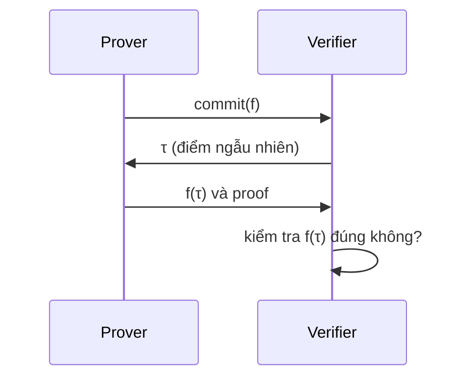
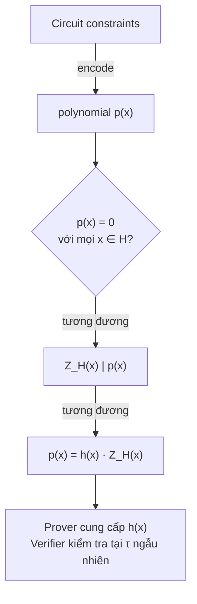
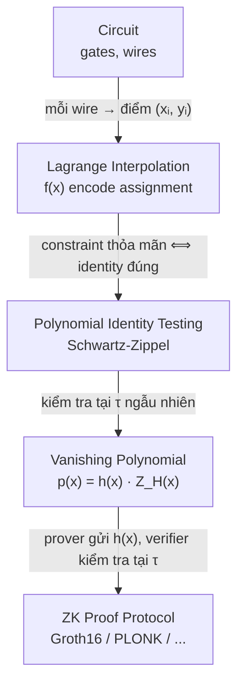

> **Prerequisites**: [[01-finite-fields|01. Finite Fields & Field Arithmetic]] — phép toán trong $\mathbb{F}_p$, roots of unity  
> **Objectives**:  
> - Hiểu đa thức trên $\mathbb{F}_p$ và tại sao chúng là công cụ trung tâm của ZK
> - Thành thạo Lagrange interpolation — kỹ thuật chuyển "danh sách giá trị" thành "đa thức"
> - Hiểu và vận dụng Schwartz-Zippel lemma — nền tảng của polynomial identity testing
> - Nắm được vai trò của đa thức trong encoding R1CS → QAP (cầu nối sang các bài sau)

---

## Motivation

Tại sao ZK proof systems lại "ám ảnh" với đa thức đến vậy?

Câu trả lời nằm ở một tính chất đặc biệt: **hai đa thức bậc $d$ khác nhau thì chỉ đồng ý với nhau ở tối đa $d$ điểm**. Trên một field có $p$ phần tử, nếu ta chọn một điểm ngẫu nhiên $r$, xác suất hai đa thức khác nhau nhưng có cùng giá trị tại $r$ chỉ là $d/p$ — cực kỳ nhỏ khi $p$ lớn.

Đây là ý tưởng cốt lõi của **polynomial identity testing**: thay vì kiểm tra hai đa thức bằng nhau ở mọi điểm (tốn kém), chỉ cần kiểm tra tại một điểm ngẫu nhiên — nếu bằng nhau, gần như chắc chắn chúng là cùng một đa thức.

ZK proof systems khai thác điều này: toàn bộ "bằng chứng" rằng một computation đúng được **encode thành một đồng nhất thức đa thức** (polynomial identity), rồi kiểm tra tại một điểm ngẫu nhiên bí mật. Kẻ gian không thể làm giả bằng chứng vì không biết điểm ngẫu nhiên đó.

---

## 1. Đa thức trên $\mathbb{F}_p$

> [!definition] Definition 2.1 — Polynomial Ring $\mathbb{F}_p[x]$
> **Đa thức** trên $\mathbb{F}_p$ là biểu thức dạng:
> 
> $$f(x) = a_d x^d + a_{d-1} x^{d-1} + \cdots + a_1 x + a_0$$
> 
> với các **hệ số** $a_i \in \mathbb{F}_p$ và $a_d \neq 0$.
> 
> - **Bậc** (degree): $\deg(f) = d$
> - Tập tất cả đa thức trên $\mathbb{F}_p$ ký hiệu $\mathbb{F}_p[x]$ — đây là một **ring**

Phép toán trên đa thức (cộng, trừ, nhân) thực hiện bình thường, **tất cả hệ số tính modulo $p$**:

```python
p = 7

# Biểu diễn đa thức bằng list hệ số [a0, a1, a2, ...]
# f(x) = 3x^2 + 2x + 1  →  [1, 2, 3]
# g(x) = x^2 + 5         →  [5, 0, 1]

def poly_add(f, g, p):
    """Cộng hai đa thức trong F_p[x]"""
    n = max(len(f), len(g))
    result = [(( f[i] if i < len(f) else 0) + (g[i] if i < len(g) else 0)) % p
              for i in range(n)]
    # Loại bỏ hệ số 0 ở bậc cao
    while len(result) > 1 and result[-1] == 0:
        result.pop()
    return result

def poly_eval(f, x, p):
    """Evaluate f tại x trong F_p (dùng Horner's method)"""
    result = 0
    for coef in reversed(f):
        result = (result * x + coef) % p
    return result

f = [1, 2, 3]  # 3x^2 + 2x + 1
g = [5, 0, 1]  # x^2 + 5

print(poly_add(f, g, p))          # [6, 2, 4] → 4x^2 + 2x + 6
print(poly_eval(f, 2, p))         # 3*4 + 2*2 + 1 = 17 ≡ 3 mod 7
```

### Roots (Nghiệm) của đa thức

> [!theorem] Theorem 2.2 — Số nghiệm của đa thức
> Một đa thức $f \in \mathbb{F}_p[x]$ bậc $d$ có **tối đa $d$ nghiệm** trong $\mathbb{F}_p$.

Điều này **không đúng trong $\mathbb{Z}$** hay $\mathbb{Z}/n\mathbb{Z}$ khi $n$ không phải prime (ví dụ $x^2 \equiv 1 \pmod{8}$ có 4 nghiệm). Đây là lý do ta cần field (modulus là prime) để bảo đảm tính chất này.

```python
# Tìm tất cả nghiệm của f(x) = x^2 - 1 trong F_7
p = 7
f = [-1, 0, 1]   # x^2 - 1  (hệ số: [-1 mod 7, 0, 1] = [6, 0, 1])

roots = [x for x in range(p) if poly_eval(f, x, p) == 0]
print(roots)   # [1, 6]  — đúng 2 nghiệm (1^2=1, 6^2=36≡1 mod 7)
```

---

## 2. Lagrange Interpolation

**Vấn đề**: Cho $n$ điểm $(x_0, y_0), (x_1, y_1), \ldots, (x_{n-1}, y_{n-1})$ với $x_i$ phân biệt — tìm đa thức bậc $\leq n-1$ đi qua tất cả các điểm này.

Đây là bài toán cực kỳ quan trọng trong ZK: **encode $n$ giá trị (assignment của circuit) thành một đa thức** để có thể polynomial commit và verify.

> [!definition] Definition 2.3 — Lagrange Interpolation
> Cho $n$ điểm $(x_0, y_0), \ldots, (x_{n-1}, y_{n-1})$ với $x_i \in \mathbb{F}_p$ phân biệt. **Lagrange interpolating polynomial** là:
> 
> $$L(x) = \sum_{i=0}^{n-1} y_i \cdot \ell_i(x)$$
> 
> trong đó **Lagrange basis polynomial**:
> 
> $$\ell_i(x) = \prod_{j \neq i} \frac{x - x_j}{x_i - x_j}$$
> 
> $\ell_i$ có tính chất: $\ell_i(x_j) = \begin{cases} 1 & \text{nếu } j = i \\ 0 & \text{nếu } j \neq i \end{cases}$

Trực giác: $\ell_i(x)$ là "bộ chọn" — bằng 1 tại $x_i$ và bằng 0 ở tất cả các điểm còn lại. Khi cộng có trọng số $y_i$, ta được đa thức khớp đúng tất cả điểm.

```python
def lagrange_interpolation(points, p):
    """
    points: list các tuple (x, y) trong F_p
    Trả về hệ số đa thức [a0, a1, ..., ad]
    """
    n = len(points)
    xs = [pt[0] for pt in points]
    ys = [pt[1] for pt in points]

    def basis(i, x):
        """Tính ell_i(x) trong F_p"""
        num, den = 1, 1
        for j in range(n):
            if j != i:
                num = (num * (x - xs[j])) % p
                den = (den * (xs[i] - xs[j])) % p
        return (num * pow(den, p - 2, p)) % p  # num / den trong F_p

    def eval_poly(x):
        return sum(ys[i] * basis(i, x) for i in range(n)) % p

    return eval_poly

# Ví dụ: tìm đa thức qua (1,3), (2,5), (3,2) trong F_7
p = 7
points = [(1, 3), (2, 5), (3, 2)]
L = lagrange_interpolation(points, p)

# Kiểm tra: đa thức đi qua đúng các điểm
for (x, y) in points:
    assert L(x) == y, f"L({x}) = {L(x)} ≠ {y}"
    print(f"L({x}) = {L(x)} ✓")
```

### Uniqueness của Lagrange Polynomial

> [!theorem] Theorem 2.4 — Uniqueness
> Cho $n$ điểm với $x_i$ phân biệt. Tồn tại **duy nhất** đa thức bậc $\leq n-1$ đi qua tất cả $n$ điểm này.

**Chứng minh ý tưởng**: Giả sử có hai đa thức $L_1$ và $L_2$ bậc $\leq n-1$ cùng đi qua $n$ điểm. Khi đó $L_1 - L_2$ là đa thức bậc $\leq n-1$ có $n$ nghiệm. Theo Theorem 2.2, điều này chỉ xảy ra khi $L_1 - L_2 \equiv 0$, tức $L_1 = L_2$. $\blacksquare$

**Ý nghĩa trong ZK**: Ta có thể map 1-1 giữa "danh sách $n$ giá trị" và "đa thức bậc $\leq n-1$". Thay vì kiểm tra từng giá trị, chỉ cần kiểm tra đa thức tại một điểm ngẫu nhiên.

---

## 3. Schwartz-Zippel Lemma

Đây là định lý **nền tảng** của mọi polynomial-based ZK proof system. Nếu bạn chỉ nhớ một định lý từ bài này, hãy nhớ cái này.

> [!theorem] Theorem 2.5 — Schwartz-Zippel Lemma
> Cho $f(x_1, \ldots, x_k) \in \mathbb{F}_p[x_1, \ldots, x_k]$ là đa thức **không đồng nhất bằng 0**, bậc tổng cộng $\leq d$. Nếu $r_1, \ldots, r_k$ được chọn **ngẫu nhiên độc lập** từ $\mathbb{F}_p$, thì:
> 
> $$\Pr[f(r_1, \ldots, r_k) = 0] \leq \frac{d}{p}$$

Trường hợp một biến ($k=1$): đa thức $f(x) \not\equiv 0$ bậc $d$ có xác suất bằng 0 tại điểm ngẫu nhiên $r$ là $\leq d/p$.

> [!example] Example 2.6 — Ứng dụng: Kiểm tra hai đa thức có bằng nhau không
> **Câu hỏi**: $f(x) = (x+1)(x+2)(x+3)$ có bằng $g(x) = x^3 + 6x^2 + 11x + 6$ không?
> 
> **Cách ngây thơ**: Nhân ra $f(x)$ rồi so sánh hệ số — $O(d^2)$ phép toán.
> 
> **Cách Schwartz-Zippel**: Chọn ngẫu nhiên $r \in \mathbb{F}_p$, tính $f(r)$ và $g(r)$. Nếu bằng nhau, kết luận $f = g$ với xác suất sai $\leq d/p \approx 3/p$ (rất nhỏ với $p$ lớn).

```python
import random

def check_poly_identity(f_eval, g_eval, p, degree, trials=10):
    """
    Kiểm tra f ≡ g bằng Schwartz-Zippel.
    f_eval, g_eval: hàm nhận x, trả về f(x), g(x) trong F_p
    """
    for _ in range(trials):
        r = random.randint(1, p - 1)
        if f_eval(r) != g_eval(r):
            return False, r   # Chắc chắn f ≠ g, tìm được điểm phân biệt
    # Xác suất sai: <= (degree / p)^trials ≈ 0
    return True, None

p = 10**9 + 7   # prime lớn thường dùng trong competitive programming

# f(x) = (x+1)(x+2)(x+3)
def f_eval(x):
    return ((x+1) * (x+2) * (x+3)) % p

# g(x) = x^3 + 6x^2 + 11x + 6
def g_eval(x):
    return (x**3 + 6*x**2 + 11*x + 6) % p

result, witness = check_poly_identity(f_eval, g_eval, p, degree=3)
print(f"f ≡ g? {result}")   # True

# Thử với h(x) = x^3 + 6x^2 + 11x + 5 (sai một hệ số)
def h_eval(x):
    return (x**3 + 6*x**2 + 11*x + 5) % p

result2, w2 = check_poly_identity(f_eval, h_eval, p, degree=3)
print(f"f ≡ h? {result2}, witness: {w2}")   # False
```

### Tại sao Schwartz-Zippel đảm bảo soundness trong ZK?

Trong ZK proof, verifier gửi một điểm ngẫu nhiên $\tau$ (thường là **challenge** sau khi prover commit). Prover phải chứng minh đa thức của mình có giá trị đúng tại $\tau$. Nếu prover gian lận (dùng đa thức sai), xác suất đa thức sai trùng giá trị với đúng tại $\tau$ là $\leq d/p$ — negligible.



*Luồng tương tác cơ bản trong polynomial protocol — Schwartz-Zippel đảm bảo prover không thể gian lận tại điểm ngẫu nhiên $\tau$.*

---

## 4. Vanishing Polynomial & Target Polynomial

Đây là hai khái niệm xuất hiện trực tiếp trong R1CS → QAP conversion (Lesson 09).

> [!definition] Definition 2.7 — Vanishing Polynomial
> Cho tập $H = \{r_1, r_2, \ldots, r_n\} \subset \mathbb{F}_p$. **Vanishing polynomial** trên $H$ là:
> 
> $$Z_H(x) = \prod_{i=1}^{n}(x - r_i)$$
> 
> $Z_H$ là đa thức bậc $n$ có **đúng $n$ nghiệm** là các phần tử của $H$, và $Z_H(x) = 0$ khi và chỉ khi $x \in H$.

> [!example] Example 2.8 — Vanishing polynomial trên roots of unity
> Lấy $H = \{1, \omega, \omega^2, \ldots, \omega^{n-1}\}$ là tập $n$ roots of unity. Khi đó:
> 
> $$Z_H(x) = x^n - 1$$
> 
> (vì $x^n - 1 = \prod_{i=0}^{n-1}(x - \omega^i)$ — tích khai triển cho đúng roots of unity)

```python
p = 17
# Primitive 4th roots of unity trong F_17
omega = pow(3, (p-1)//4, p)  # omega = 13
H = [pow(omega, i, p) for i in range(4)]
print("H =", H)   # [1, 13, 16, 4]

# Z_H(x) = x^4 - 1
def vanish(x, p):
    return (pow(x, 4, p) - 1) % p

# Kiểm tra: Z_H bằng 0 tại mọi phần tử H
for h in H:
    assert vanish(h, p) == 0, f"Z_H({h}) ≠ 0"
print("Z_H bằng 0 tại mọi h ∈ H ✓")

# Z_H ≠ 0 tại điểm ngoài H
print(f"Z_H(2) = {vanish(2, p)}")   # ≠ 0
```

### Divisibility — Kết nối sang QAP

> [!theorem] Theorem 2.9 — Divisibility bởi Vanishing Polynomial
> Đa thức $f(x)$ bằng 0 tại **mọi** điểm trong $H$ khi và chỉ khi $Z_H(x) \mid f(x)$, tức là:
> 
> $$f(x) = h(x) \cdot Z_H(x) \quad \text{cho một đa thức } h(x) \in \mathbb{F}_p[x]$$

**Ý nghĩa cực kỳ quan trọng**: Trong QAP (Lesson 09), ta encode toàn bộ hệ constraint thành một đa thức $p(x)$. Constraint được thỏa mãn khi và chỉ khi $p(x) = 0$ tại mọi điểm trong $H$, tức $Z_H \mid p$, tức tồn tại $h(x)$ sao cho $p(x) = h(x) \cdot Z_H(x)$.

Prover chứng minh điều này bằng cách cung cấp $h(x)$ — verifier kiểm tra $p(\tau) = h(\tau) \cdot Z_H(\tau)$ tại điểm ngẫu nhiên $\tau$.



*Encode constraint thành polynomial divisibility — nền tảng của QAP.*

---

## 5. Polynomial Division & GCD

Một số phép toán cần thiết cho phần sau:

```python
def poly_mul(f, g, p):
    """Nhân hai đa thức trong F_p[x]"""
    result = [0] * (len(f) + len(g) - 1)
    for i, a in enumerate(f):
        for j, b in enumerate(g):
            result[i + j] = (result[i + j] + a * b) % p
    return result

def poly_divmod(f, g, p):
    """
    Chia đa thức f cho g trong F_p[x].
    Trả về (quotient q, remainder r) sao cho f = q*g + r
    """
    f = list(f)
    g = list(g)
    if len(f) < len(g):
        return [0], f
    q = []
    while len(f) >= len(g):
        # Hệ số leading
        coef = (f[-1] * pow(g[-1], p - 2, p)) % p
        q.insert(0, coef)
        # Trừ coef * x^k * g khỏi f
        deg_diff = len(f) - len(g)
        for i in range(len(g)):
            f[deg_diff + i] = (f[deg_diff + i] - coef * g[i]) % p
        f.pop()
    # Loại số 0 đầu
    while len(f) > 1 and f[-1] == 0:
        f.pop()
    return q, f

# Kiểm tra: f(x) = x^4 - 1, g(x) = x - 1
# Kỳ vọng: quotient = x^3 + x^2 + x + 1, remainder = 0
p = 7
f = [-1, 0, 0, 0, 1]   # x^4 - 1  →  [-1 mod 7, 0,0,0,1] = [6,0,0,0,1]
g = [-1, 1]             # x - 1   →  [6, 1]

q, r = poly_divmod(f, g, p)
print("quotient:", q)   # [1, 1, 1, 1] → x^3 + x^2 + x + 1
print("remainder:", r)  # [0]

# Verify: q*g + r = f
product = poly_mul(q, g, p)
reconstructed = poly_add(product, r, p)
print("reconstructed == f:", reconstructed == f)   # True
```

---

## 6. Tóm tắt vai trò của Polynomials trong ZK Pipeline

Để thấy rõ bức tranh tổng thể, đây là cách các khái niệm bài này kết nối với toàn bộ ZK pipeline:



*Pipeline từ circuit sang ZK proof — polynomials là ngôn ngữ trung gian.*

---

## Summary

- Đa thức trên $\mathbb{F}_p$ có tối đa $d$ nghiệm — tính chất nền tảng đảm bảo uniqueness và soundness.
- **Lagrange interpolation**: duy nhất một đa thức bậc $\leq n-1$ đi qua $n$ điểm — dùng để encode assignment.
- **Schwartz-Zippel lemma**: xác suất đa thức $\neq 0$ bằng 0 tại điểm ngẫu nhiên $\leq d/p$ — cực nhỏ với $p$ lớn, cho phép kiểm tra polynomial identity hiệu quả.
- **Vanishing polynomial** $Z_H(x) = \prod_{i}(x - r_i)$ — bằng 0 đúng trên $H$; với roots of unity: $Z_H(x) = x^n - 1$.
- **Divisibility** $Z_H \mid p(x)$ ⟺ $p(x) = 0$ trên $H$ ⟺ constraint thỏa mãn — liên kết trực tiếp sang QAP.

---

## References

- Justin Thaler — *Proofs, Arguments, and Zero-Knowledge*, Ch. 2–4 (proofs-arguments-and-zero-knowledge.pdf)
- Vitalik Buterin — *Quadratic Arithmetic Programs: from Zero to Hero* (medium.com/@VitalikButerin, 2016)
- Oded Goldreich — *Computational Complexity: A Conceptual Perspective*, Ch. 7
- ZKProof Community Reference — Section 3: Polynomial Commitments
