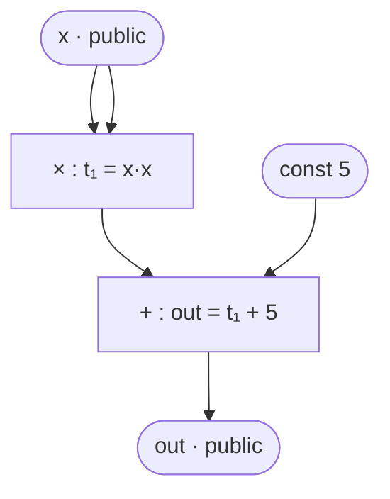

> **Prerequisites**: [[05-constraint-systems-overview|05. Constraint Systems — Tổng quan]] — satisfying assignment, ý tưởng encode circuit thành constraint; [[04-signals-witnesses-visibility|04. Signals, Witnesses & Visibility]] — witness vector $\vec{z}$  
> **Objectives**:  
> - Định nghĩa chính xác R1CS qua ba ma trận $A, B, C$ và phương trình $Az \circ Bz = Cz$
> - Hiểu ý nghĩa của Hadamard product $\circ$ và tại sao format này được chọn
> - Đọc và viết được R1CS cho một circuit đơn giản
> - Implement kiểm tra R1CS satisfiability bằng Python

---

## Motivation

Ở Lesson 05 ta thấy mỗi gate sinh ra một constraint dạng $(L) \cdot (R) = (O)$. Nhưng để proof system có thể làm việc, ta cần **format đồng nhất** — một cách biểu diễn tất cả constraints cùng một kiểu, dạng ma trận, để sau đó áp dụng polynomial encoding.

**R1CS** (Rank-1 Constraint System) là chuẩn hóa đó. Mỗi constraint là một "rank-1" equation — tích của hai linear forms bằng một linear form — và toàn bộ hệ được biểu diễn bởi ba ma trận $A, B, C$. Đây là format đầu vào của Groth16 và nhiều zk-SNARK quan trọng.

---

## 1. Định nghĩa R1CS

> [!definition] Definition 6.1 — R1CS
> Một **R1CS** là bộ $(A, B, C, \vec{z})$ với:
>
> - $A, B, C \in \mathbb{F}_p^{m \times n}$: ba ma trận kích thước $m \times n$
> - $m$: số constraints
> - $n = 1 + \ell + k$: kích thước witness vector ($1$ hằng số + $\ell$ public inputs + $k$ private/intermediate)
> - $\vec{z} \in \mathbb{F}_p^n$: witness vector
>
> Hệ R1CS được **thỏa mãn** khi và chỉ khi:
>
> $$A\vec{z} \circ B\vec{z} = C\vec{z}$$
>
> trong đó $\circ$ là **Hadamard product** (nhân từng phần tử tương ứng).

Mở rộng ra: phương trình trên là $m$ phương trình riêng lẻ — một cho mỗi constraint $i \in \{1, \ldots, m\}$:

$$\langle A_i, \vec{z} \rangle \cdot \langle B_i, \vec{z} \rangle = \langle C_i, \vec{z} \rangle$$

trong đó $A_i, B_i, C_i$ là hàng thứ $i$ của ma trận tương ứng, và $\langle \cdot, \cdot \rangle$ là inner product.

> [!note] Tại sao gọi là "Rank-1"?
> Mỗi constraint $\langle A_i, \vec{z} \rangle \cdot \langle B_i, \vec{z} \rangle = \langle C_i, \vec{z} \rangle$ tương đương với ma trận $\vec{u} \vec{v}^T$ (outer product của hai vector) có rank = 1. Đây là nguồn gốc của tên gọi.

---

## 2. Hadamard Product — Ý nghĩa và Ký hiệu

> [!definition] Definition 6.2 — Hadamard Product
> Với hai vector $\vec{u}, \vec{v} \in \mathbb{F}_p^m$, **Hadamard product** là:
>
> $$\vec{u} \circ \vec{v} = (u_1 v_1,\ u_2 v_2,\ \ldots,\ u_m v_m)$$
>
> Nhân **từng phần tử tương ứng** — khác với dot product (cho ra scalar) hay matrix product.

Phương trình $A\vec{z} \circ B\vec{z} = C\vec{z}$ có nghĩa: với mỗi hàng $i$:

$$\underbrace{(A_i \cdot \vec{z})}_{\text{linear combination}} \times \underbrace{(B_i \cdot \vec{z})}_{\text{linear combination}} = \underbrace{(C_i \cdot \vec{z})}_{\text{linear combination}}$$

Đây là đúng **một phép nhân** duy nhất mỗi constraint — tính chất "rank-1".

```python
import numpy as np

def hadamard(u, v):
    """Hadamard product (element-wise) của hai vector trong F_p"""
    return [u[i] * v[i] for i in range(len(u))]

# Ví dụ
u = [1, 2, 3]
v = [4, 5, 6]
print(hadamard(u, v))   # [4, 10, 18]
```

---

## 3. Cấu trúc Witness Vector $\vec{z}$

Nhắc lại từ Lesson 04, witness vector luôn có dạng:

$$\vec{z} = (\underbrace{1}_{\text{const}},\ \underbrace{x_1, \ldots, x_\ell}_{\text{public inputs}},\ \underbrace{w_1, \ldots, w_k}_{\text{private + intermediate}})$$

Phần tử đầu tiên **luôn là** $1$ — dùng để encode constant gates (gate cộng hoặc nhân với hằng số chỉ cần đặt hệ số tại vị trí $0$ trong hàng ma trận).

> [!example] Example 6.3 — Witness vector cho $out = x^2 + 5$
>
> Signals: $x$ (public input), $out$ (public output), $t_1 = x^2$ (intermediate)
>
> $$\vec{z} = (1,\ x,\ out,\ t_1)$$
>
> Thứ tự: hằng số $1$ → public inputs → intermediates.

---

## 4. Encoding Một Constraint vào Ma trận

Mỗi constraint dạng $(L) \cdot (R) = (O)$ được encode thành một **hàng** của ba ma trận $A, B, C$.

**Quy tắc**:
- Hàng $A_i$: hệ số của linear combination cho vế trái của phép nhân
- Hàng $B_i$: hệ số của linear combination cho vế phải của phép nhân
- Hàng $C_i$: hệ số của linear combination cho vế phải của dấu bằng

**Ví dụ chi tiết**: constraint $t_1 = x \cdot x$ với $\vec{z} = (1, x, out, t_1)$:

| Vị trí trong $\vec{z}$ | 0 ($=1$) | 1 ($=x$) | 2 ($=out$) | 3 ($=t_1$) |
|------------------------|----------|----------|------------|------------|
| $A_i$ (left factor)    | 0        | 1        | 0          | 0          |
| $B_i$ (right factor)   | 0        | 1        | 0          | 0          |
| $C_i$ (output)         | 0        | 0        | 0          | 1          |

Kiểm tra: $\langle A_i, \vec{z} \rangle = x$, $\langle B_i, \vec{z} \rangle = x$, $\langle C_i, \vec{z} \rangle = t_1$. Vậy constraint là $x \cdot x = t_1$. ✓

---

## 5. Ví dụ End-to-End: $out = x^2 + 5$

### Circuit và constraints



*Circuit tính $out = x^2 + 5$ — 2 gates, witness vector kích thước 4.*

**Liệt kê constraints:**

1. `t₁ = x * x`  →  $x \cdot x = t_1$
2. `out = t₁ + 5`  →  $(t_1 + 5 \cdot 1) \cdot 1 = out$

**Witness vector**: $\vec{z} = (1, x, out, t_1)$, index: $z_0=1, z_1=x, z_2=out, z_3=t_1$

### Xây dựng ma trận

**Constraint 1**: $x \cdot x = t_1$

$$A_1 = [0, 1, 0, 0], \quad B_1 = [0, 1, 0, 0], \quad C_1 = [0, 0, 0, 1]$$

Kiểm tra: $(0\cdot1 + 1\cdot x + 0\cdot out + 0\cdot t_1) \cdot (0\cdot1 + 1\cdot x + \ldots) = (0 + 0 + 0 + 1\cdot t_1)$, tức $x \cdot x = t_1$. ✓

**Constraint 2**: $(t_1 + 5) \cdot 1 = out$

$$A_2 = [5, 0, 0, 1], \quad B_2 = [1, 0, 0, 0], \quad C_2 = [0, 0, 1, 0]$$

Kiểm tra: $(5\cdot1 + 0\cdot x + 0\cdot out + 1\cdot t_1) \cdot (1\cdot1 + 0 + \ldots) = (0 + 0 + 1\cdot out + 0)$, tức $(5 + t_1) \cdot 1 = out$. ✓

### Ma trận đầy đủ

$$A = \begin{pmatrix} 0 & 1 & 0 & 0 \\ 5 & 0 & 0 & 1 \end{pmatrix}, \quad B = \begin{pmatrix} 0 & 1 & 0 & 0 \\ 1 & 0 & 0 & 0 \end{pmatrix}, \quad C = \begin{pmatrix} 0 & 0 & 0 & 1 \\ 0 & 0 & 1 & 0 \end{pmatrix}$$

### Implementation và kiểm tra

```python
def r1cs_check(A, B, C, z, p):
    """
    Kiểm tra R1CS: Az ∘ Bz = Cz trong F_p
    A, B, C: list of rows (list of list)
    z: witness vector
    """
    def mat_vec(M, v, p):
        """Nhân ma trận M với vector v trong F_p"""
        return [sum(M[i][j] * v[j] for j in range(len(v))) % p
                for i in range(len(M))]

    Az = mat_vec(A, z, p)
    Bz = mat_vec(B, z, p)
    Cz = mat_vec(C, z, p)

    # Hadamard product Az ∘ Bz
    AzBz = [(Az[i] * Bz[i]) % p for i in range(len(Az))]

    print(f"Az    = {Az}")
    print(f"Bz    = {Bz}")
    print(f"Az∘Bz = {AzBz}")
    print(f"Cz    = {Cz}")

    satisfied = all((AzBz[i] - Cz[i]) % p == 0 for i in range(len(Cz)))
    print(f"Satisfied: {satisfied}")
    return satisfied

p = 13

# Circuit: out = x^2 + 5, với x = 3
x = 3
t1 = (x * x) % p          # t1 = 9
out = (t1 + 5) % p        # out = 14 % 13 = 1

# z = [1, x, out, t1]
z = [1, x, out, t1]
print(f"z = {z}")           # [1, 3, 1, 9]

# Ma trận A, B, C
#         [1, x, out, t1]
A = [
    [0, 1, 0, 0],   # constraint 1: left = x
    [5, 0, 0, 1],   # constraint 2: left = 5 + t1
]
B = [
    [0, 1, 0, 0],   # constraint 1: right = x
    [1, 0, 0, 0],   # constraint 2: right = 1
]
C = [
    [0, 0, 0, 1],   # constraint 1: output = t1
    [0, 0, 1, 0],   # constraint 2: output = out
]

r1cs_check(A, B, C, z, p)
```

---

## 6. Tính chất Tuyến tính của R1CS — Addition "Miễn phí"

Một đặc điểm quan trọng: **addition gate không cần constraint riêng** — nó được hấp thụ vào linear combination của constraint liền kề.

> [!example] Example 6.4 — Addition miễn phí
> Circuit: $out = (a + b) \cdot c$
>
> Ta **không** cần constraint riêng cho $a + b$. Constraint duy nhất:
>
> $$\underbrace{(a + b)}_{\langle A_i, \vec{z} \rangle} \cdot \underbrace{c}_{\langle B_i, \vec{z} \rangle} = \underbrace{out}_{\langle C_i, \vec{z} \rangle}$$
>
> $A_i = [0, 1, 1, 0, 0]$, $B_i = [0, 0, 0, 1, 0]$, $C_i = [0, 0, 0, 0, 1]$
>
> với $\vec{z} = (1, a, b, c, out)$ — chỉ **1 constraint** thay vì 2.

```python
# out = (a + b) * c  — chỉ 1 constraint
# z = [1, a, b, c, out]
p = 13
a, b, c = 2, 3, 4
out = ((a + b) * c) % p   # (2+3)*4 = 20 ≡ 7 mod 13

z = [1, a, b, c, out]     # [1, 2, 3, 4, 7]

A = [[0, 1, 1, 0, 0]]     # left = a + b
B = [[0, 0, 0, 1, 0]]     # right = c
C = [[0, 0, 0, 0, 1]]     # output = out

r1cs_check(A, B, C, z, p)
# Az∘Bz = [(a+b)*c] = [20 mod 13] = [7]
# Cz    = [out]     = [7]  → Satisfied: True
```

---

## 7. Constant Signals — Dùng $z_0 = 1$

Khi cần hằng số trong constraint, ta dùng vị trí $0$ của $\vec{z}$ (luôn bằng $1$):

```python
# out = x * 7  (nhân với hằng số 7)
# z = [1, x, out]
p = 13
x = 3
out = (x * 7) % p   # 21 % 13 = 8

z = [1, x, out]

A = [[0, 1, 0]]   # left = x
B = [[7, 0, 0]]   # right = 7 * z[0] = 7 * 1 = 7
C = [[0, 0, 1]]   # output = out

r1cs_check(A, B, C, z, p)
# Az = [3], Bz = [7], Az∘Bz = [21 mod 13] = [8] = Cz ✓
```

---

## 8. Kích thước R1CS và Hiệu quả

> [!definition] Definition 6.5 — R1CS Size
> Với circuit có $m$ multiplication gates và witness vector kích thước $n$:
> - Số constraints: $m$ (mỗi multiplication gate → 1 constraint)
> - Kích thước mỗi ma trận: $m \times n$
> - Tổng dữ liệu: $3mn$ field elements
>
> **Thực tế**: ma trận $A, B, C$ **rất thưa** (sparse) — hầu hết entries là $0$. Mỗi hàng thường chỉ có 1–3 entries khác $0$. Lưu trữ dưới dạng sparse matrix.

```python
def r1cs_stats(A, B, C, z):
    """Thống kê R1CS"""
    m, n = len(A), len(z)
    nonzero_A = sum(1 for row in A for v in row if v != 0)
    nonzero_B = sum(1 for row in B for v in row if v != 0)
    nonzero_C = sum(1 for row in C for v in row if v != 0)
    print(f"Constraints (m): {m}")
    print(f"Witness size (n): {n}")
    print(f"Non-zero entries: A={nonzero_A}, B={nonzero_B}, C={nonzero_C}")
    total = 3 * m * n
    nonzero = nonzero_A + nonzero_B + nonzero_C
    print(f"Sparsity: {nonzero}/{total} = {nonzero/total:.1%} non-zero")

r1cs_stats(A, B, C, z)
```

---

## Summary

- **R1CS** là bộ $(A, B, C, \vec{z})$ thỏa mãn khi $A\vec{z} \circ B\vec{z} = C\vec{z}$ — mỗi hàng là một constraint dạng $(linear) \times (linear) = (linear)$.
- **Witness vector** $\vec{z} = (1, \text{public inputs}, \text{private/intermediate})$ — phần tử đầu luôn là $1$.
- Mỗi **multiplication gate** → một hàng trong $A, B, C$.
- **Addition** được encode "miễn phí" vào linear combination — không tốn thêm constraint.
- **Hằng số** dùng vị trí $z_0 = 1$ với hệ số tương ứng trong ma trận.
- Ma trận thực tế rất **sparse** — lưu dưới dạng sparse để hiệu quả.

---

## References

- Vitalik Buterin — *Quadratic Arithmetic Programs: from Zero to Hero* (medium.com/@VitalikButerin, 2016)
- Justin Thaler — *Proofs, Arguments, and Zero-Knowledge*, Ch. 4.2
- ZKProof Community Reference — Section 5.1: R1CS
- snarkjs R1CS format spec — github.com/iden3/snarkjs
