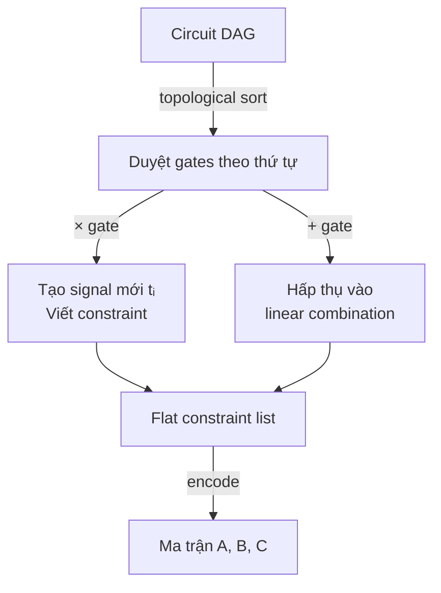
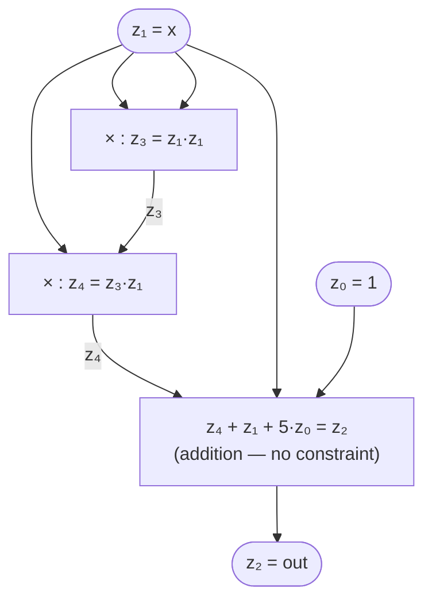
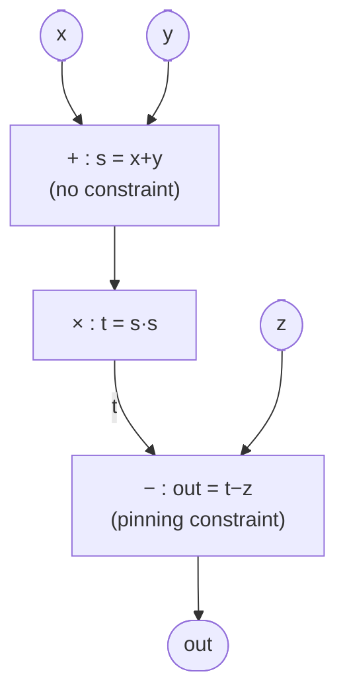
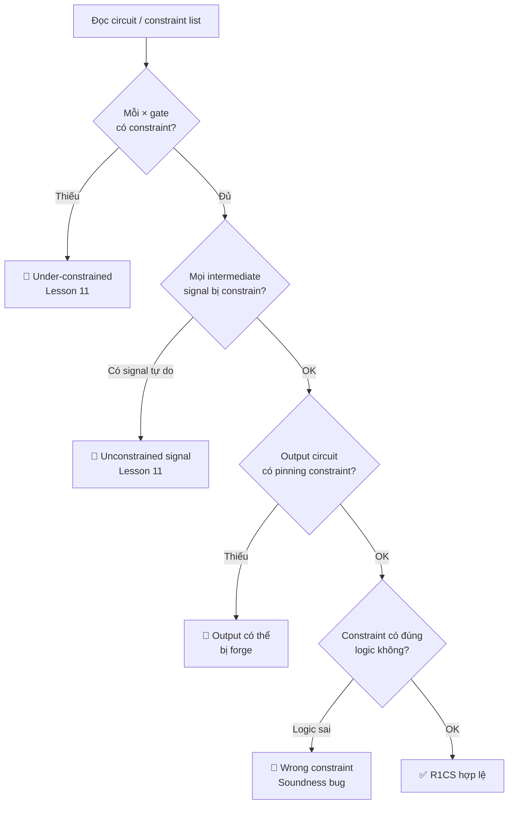

> **Prerequisites**: [[06-r1cs|06. R1CS — Rank-1 Constraint System]] — ma trận $A, B, C$, witness vector, encoding constraint; [[03-arithmetic-circuits|03. Arithmetic Circuits — Định nghĩa & Cấu trúc]] — gates, wires  
> **Objectives**:  
> - Nắm vững quy trình **flattening** — chuyển circuit thành danh sách phương trình phẳng
> - Thực hiện được conversion Circuit → R1CS end-to-end cho circuit tùy ý
> - Hiểu cách xử lý các trường hợp đặc biệt: addition, constant, boolean, conditional
> - Implement R1CS builder tự động từ danh sách gates

---

## Motivation

Lesson 06 đã định nghĩa R1CS và cho ví dụ nhỏ. Bài này đi sâu vào **quy trình chuyển đổi** — một circuit phức tạp tùy ý thành hệ R1CS hoàn chỉnh. Đây là bước mà các công cụ như Circom, Bellman, gnark thực hiện tự động khi compile circuit.

Hiểu rõ quy trình này quan trọng với bug bounty vì: nếu compiler chuyển đổi sai, constraint bị thiếu hoặc sai → under/over-constrained. Biết cách conversion thủ công giúp verify compiler output.

---

## 1. Quy trình Flattening

**Flattening** là bước biến biểu thức phức tạp thành danh sách các phương trình đơn — mỗi phương trình chứa đúng một phép nhân (hoặc là phép cộng thuần túy).

> [!definition] Definition 7.1 — Flattening
> **Flatten** một circuit là quá trình:
> 1. Duyệt DAG theo thứ tự topological (từ input đến output)
> 2. Với mỗi **multiplication gate**: tạo intermediate signal mới và viết constraint $a \cdot b = t$
> 3. Với **addition gate**: không tạo constraint mới — hấp thụ vào linear combination của constraint liền kề
> 4. Kết quả: danh sách các "flat constraints" dạng $(linear) \cdot (linear) = (linear)$



*Quy trình flattening — multiplication gates tạo constraint mới, addition gates được hấp thụ.*

---

## 2. Bảng Encoding Chuẩn

Trước khi làm ví dụ, đây là bảng tra cứu encoding cho từng loại phép toán:

| Biểu thức | Flat constraint | $A_i$ | $B_i$ | $C_i$ |
|-----------|----------------|-------|-------|-------|
| $t = a \cdot b$ | $a \cdot b = t$ | $[\ldots, a{:}1, \ldots]$ | $[\ldots, b{:}1, \ldots]$ | $[\ldots, t{:}1, \ldots]$ |
| $t = a \cdot k$ (hằng) | $a \cdot k = t$ | $[\ldots, a{:}1, \ldots]$ | $[1{:}k, \ldots]$ | $[\ldots, t{:}1, \ldots]$ |
| $t = a + b$ | *miễn phí* — dùng trong LC | — | — | — |
| $t = a + k$ | *miễn phí* — dùng trong LC | — | — | — |
| $b \in \{0,1\}$ | $b \cdot b = b$ | $[\ldots, b{:}1, \ldots]$ | $[\ldots, b{:}1, \ldots]$ | $[\ldots, b{:}1, \ldots]$ |
| $t = \text{if } b \text{ then } a \text{ else } c$ | $b \cdot (a - c) = t - c$ | $[\ldots, b{:}1, \ldots]$ | $[\ldots, a{:}1, c{:}{-1}, \ldots]$ | $[\ldots, t{:}1, c{:}{-1}, \ldots]$ |

---

## 3. Ví dụ 1: $out = x^3 + x + 5$

Circuit này có 4 gates, trong đó 2 multiplication và 2 addition.

### Bước 1 — Vẽ circuit và đánh số signals



*Circuit $x^3 + x + 5$ — chỉ multiplication gates sinh ra constraint; additions hấp thụ vào R1CS cuối.*

### Bước 2 — Witness vector

$$\vec{z} = (z_0, z_1, z_2, z_3, z_4) = (1, x, out, t_1, t_2)$$

| Index | Signal | Giá trị ($x=2, p=13$) |
|-------|--------|----------------------|
| $z_0$ | $1$ (hằng) | $1$ |
| $z_1$ | $x$ (public input) | $2$ |
| $z_2$ | $out$ (public output) | $2$ |
| $z_3$ | $t_1 = x^2$ | $4$ |
| $z_4$ | $t_2 = x^3$ | $8$ |

### Bước 3 — Flat constraints

**Constraint 1** (mul gate $t_1 = x \cdot x$):

$$x \cdot x = t_1 \implies z_1 \cdot z_1 = z_3$$

**Constraint 2** (mul gate $t_2 = t_1 \cdot x$):

$$t_1 \cdot x = t_2 \implies z_3 \cdot z_1 = z_4$$

**Constraint 3** (addition $out = t_2 + x + 5$ — nhưng cần ít nhất 1 constraint để "pin" output):

$$1 \cdot (t_2 + x + 5) = out \implies (z_4 + z_1 + 5 \cdot z_0) \cdot 1 = z_2$$

> [!note] Addition gate cần "pinning"
> Dù addition miễn phí, **output cuối cùng** của circuit vẫn cần được constrain bằng một equation — nếu không prover có thể đặt `out` tùy ý. Constraint 3 là "pin" đó: left = $(t_2 + x + 5)$, right = $1$, output = $out$.

### Bước 4 — Ma trận ($m=3$, $n=5$, index $z_0 \ldots z_4$)

$$A = \begin{pmatrix} 0 & 1 & 0 & 0 & 0 \\ 0 & 0 & 0 & 1 & 0 \\ 5 & 1 & 0 & 0 & 1 \end{pmatrix}, \quad B = \begin{pmatrix} 0 & 1 & 0 & 0 & 0 \\ 0 & 1 & 0 & 0 & 0 \\ 1 & 0 & 0 & 0 & 0 \end{pmatrix}, \quad C = \begin{pmatrix} 0 & 0 & 0 & 1 & 0 \\ 0 & 0 & 0 & 0 & 1 \\ 0 & 0 & 1 & 0 & 0 \end{pmatrix}$$

### Bước 5 — Verify bằng code

```python
def r1cs_check(A, B, C, z, p):
    def mv(M, v):
        return [sum(M[i][j]*v[j] for j in range(len(v))) % p for i in range(len(M))]
    Az, Bz, Cz = mv(A,z), mv(B,z), mv(C,z)
    ok = all((Az[i]*Bz[i]-Cz[i])%p==0 for i in range(len(Az)))
    print(f"Az={Az}, Bz={Bz}, Az∘Bz={[(Az[i]*Bz[i])%p for i in range(len(Az))]}, Cz={Cz}")
    print(f"Satisfied: {ok}")
    return ok

p = 13
x = 2
t1 = (x*x) % p          # 4
t2 = (t1*x) % p         # 8
out = (t2 + x + 5) % p  # 15 % 13 = 2

z = [1, x, out, t1, t2]
print(f"z = {z}")        # [1, 2, 2, 4, 8]

#       z0  z1  z2  z3  z4
A = [
    [0,  1,  0,  0,  0],   # c1 left:  x
    [0,  0,  0,  1,  0],   # c2 left:  t1
    [5,  1,  0,  0,  1],   # c3 left:  5 + x + t2
]
B = [
    [0,  1,  0,  0,  0],   # c1 right: x
    [0,  1,  0,  0,  0],   # c2 right: x
    [1,  0,  0,  0,  0],   # c3 right: 1
]
C = [
    [0,  0,  0,  1,  0],   # c1 out:   t1
    [0,  0,  0,  0,  1],   # c2 out:   t2
    [0,  0,  1,  0,  0],   # c3 out:   out
]

r1cs_check(A, B, C, z, p)
```

---

## 4. Ví dụ 2: Boolean Conditional — $out = \text{if } b \text{ then } a \text{ else } c$

Đây là pattern rất phổ biến trong ZK circuits (selector, mux). Cần 2 constraints:

**Constraint 1** — $b$ là bit: $b \cdot b = b$

**Constraint 2** — mux: $b \cdot (a - c) = out - c$

> [!theorem] Theorem 7.2 — Correctness của MUX encoding
> Với $b \in \{0,1\}$:
> - $b = 1$: $1 \cdot (a - c) = out - c \implies out = a$ ✓
> - $b = 0$: $0 \cdot (a - c) = out - c \implies out = c$ ✓

```python
# z = [1, b, a, c, out]
#      z0  z1  z2  z3  z4
p = 13

def mux_r1cs(b, a, c_val, p):
    out = a if b == 1 else c_val
    z = [1, b, a, c_val, out]

    # Constraint 1: b * b = b  (boolean check)
    # A1 = [0,1,0,0,0], B1 = [0,1,0,0,0], C1 = [0,1,0,0,0]
    # Constraint 2: b*(a - c) = out - c
    # A2 = [0,1,0,0,0]
    # B2 = [0,0,1,-1,0]  → b*(a - c)
    # C2 = [0,0,0,-1,1]  → out - c
    A = [
        [0, 1,  0,  0, 0],
        [0, 1,  0,  0, 0],
    ]
    B = [
        [0, 1,  0,  0, 0],
        [0, 0,  1, -1, 0],
    ]
    C = [
        [0, 1,  0,  0, 0],
        [0, 0,  0, -1, 1],
    ]
    return r1cs_check(A, B, C, z, p)

print("=== b=1, a=7, c=3: out phải là 7 ===")
mux_r1cs(1, 7, 3, p)

print("=== b=0, a=7, c=3: out phải là 3 ===")
mux_r1cs(0, 7, 3, p)
```

---

## 5. Ví dụ 3: Circuit Phức hợp — $out = (x + y)^2 - z$

Circuit này có fan-in 2, intermediate signal, và cần xử lý cả addition lẫn multiplication.



*Circuit $(x+y)^2 - z$ — addition hấp thụ vào left factor của multiplication gate.*

**Signals**: $\vec{z} = (1, x, y, z_{in}, out, t)$ với $t = (x+y)^2$

**Chỉ 2 constraints**:

1. $(x + y) \cdot (x + y) = t$
2. $1 \cdot (t - z_{in}) = out$

```python
p = 13
x_val, y_val, z_val = 2, 3, 1
s = (x_val + y_val) % p          # s = 5 (không cần signal riêng!)
t = (s * s) % p                  # t = 25 % 13 = 12
out_val = (t - z_val) % p        # out = 11

# z = [1, x, y, z_in, out, t]
#      z0 z1  z2  z3   z4  z5
z = [1, x_val, y_val, z_val, out_val, t]
print(f"z = {z}")

#       z0  z1  z2  z3   z4  z5
A = [
    [0,  1,  1,  0,   0,  0],   # c1 left:  x + y
    [1,  0,  0,  0,   0,  0],   # c2 left:  1
]
B = [
    [0,  1,  1,  0,   0,  0],   # c1 right: x + y
    [0,  0,  0, -1,   0,  1],   # c2 right: t - z_in
]
C = [
    [0,  0,  0,  0,   0,  1],   # c1 out:   t
    [0,  0,  0,  0,   1,  0],   # c2 out:   out
]

r1cs_check(A, B, C, z, p)
```

---

## 6. R1CS Builder — Tự động hoá

Đây là skeleton của một R1CS builder đơn giản — mô phỏng cách Circom/gnark hoạt động:

```python
class R1CSBuilder:
    """
    Builder tự động xây dựng R1CS từ danh sách gate operations.
    Mỗi operation: ('mul', out, left, right) hoặc ('pin', out, expr)
    expr là list [(coef, signal_idx), ...]
    """
    def __init__(self, n_signals, p):
        self.n = n_signals
        self.p = p
        self.A, self.B, self.C = [], [], []

    def _row(self, terms):
        """Tạo hàng ma trận từ list [(coef, idx)]"""
        row = [0] * self.n
        for coef, idx in terms:
            row[idx] = (row[idx] + coef) % self.p
        return row

    def add_mul(self, left_terms, right_terms, out_idx):
        """Thêm constraint: (∑ left) * (∑ right) = signal[out_idx]"""
        self.A.append(self._row(left_terms))
        self.B.append(self._row(right_terms))
        self.C.append(self._row([(1, out_idx)]))

    def add_pin(self, linear_terms, out_idx):
        """Thêm pinning constraint: 1 * (∑ terms) = signal[out_idx]"""
        self.A.append(self._row([(1, 0)]))   # left = 1
        self.B.append(self._row(linear_terms))
        self.C.append(self._row([(1, out_idx)]))

# Ví dụ: out = x^2 + 5
# z = [1, x, out, t1] — index: 0,1,2,3
p, x_val = 13, 3
t1 = (x_val * x_val) % p
out_val = (t1 + 5) % p
z = [1, x_val, out_val, t1]

builder = R1CSBuilder(n_signals=4, p=p)
builder.add_mul([(1, 1)], [(1, 1)], out_idx=3)      # t1 = x * x
builder.add_pin([(5, 0), (1, 3)], out_idx=2)         # out = 5 + t1

r1cs_check(builder.A, builder.B, builder.C, z, p)
```

---

## 7. Checklist Conversion khi Audit

Khi đọc code circuit hoặc R1CS output từ compiler, kiểm tra theo thứ tự:



*Checklist kiểm tra R1CS khi audit — theo thứ tự từ trên xuống dưới.*

---

## Summary

- **Flattening**: duyệt DAG topological → mỗi `×` gate tạo một flat constraint → encode vào hàng $A_i, B_i, C_i$.
- **Addition miễn phí** nhưng **output cuối phải có pinning constraint** — nếu không, prover tự đặt giá trị tùy ý.
- **Boolean MUX** cần 2 constraints: bit check $b \cdot b = b$ và selector $b \cdot (a-c) = out-c$.
- **Builder pattern**: thêm constraint từng cái, index vào witness vector — mô phỏng cách compiler hoạt động.
- Khi audit: kiểm tra mọi `×` gate có constraint, mọi intermediate signal bị constrain, output có pinning.

---

## References

- Vitalik Buterin — *Quadratic Arithmetic Programs: from Zero to Hero* (medium.com/@VitalikButerin, 2016)
- Justin Thaler — *Proofs, Arguments, and Zero-Knowledge*, Ch. 4.2–4.3
- Circom compiler source — github.com/iden3/circom (r1cs generation logic)
- 0xPARC — *ZK Learning Resources* (learn.0xparc.org)
