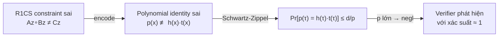
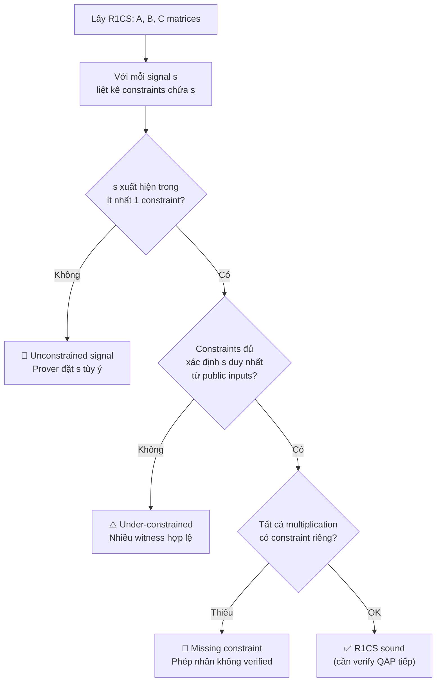

> **Prerequisites**: [[06-r1cs|06. R1CS — Rank-1 Constraint System]] — định nghĩa R1CS; [[07-circuit-to-r1cs|07. Chuyển đổi Circuit → R1CS]] — quy trình conversion; [[02-polynomials-over-finite-fields|02. Polynomials over Finite Fields]] — Schwartz-Zippel lemma  
> **Objectives**:  
> - Định nghĩa chính xác **completeness** và **soundness** trong ngữ cảnh R1CS và ZK proof
> - Hiểu **knowledge soundness** — tại sao prover phải *thực sự biết* witness
> - Phân tích nguồn gốc lỗi soundness trong R1CS: constraint sai, constraint thiếu, witness flexibility
> - Kết nối soundness của R1CS với soundness của toàn bộ ZK proof system

---

## Motivation

R1CS đúng về mặt cú pháp không đủ — ta cần biết R1CS đó có **đảm bảo tính đúng đắn** không. Hai thuộc tính cốt lõi: *completeness* (nếu prover trung thực thì proof thành công) và *soundness* (nếu statement sai thì proof thất bại). Hiểu sâu hai thuộc tính này là nền tảng để nhận ra lỗi circuit trong bug bounty.

---

## 1. Completeness

> [!definition] Definition 8.1 — Completeness
> Một R1CS $(A, B, C)$ và proof system $\Pi$ đạt **completeness** nếu:
>
> Với mọi satisfying assignment $\vec{z}^*$ (tức $A\vec{z}^* \circ B\vec{z}^* = C\vec{z}^*$), prover **luôn có thể** tạo ra proof $\pi$ mà verifier chấp nhận.
>
> $$\text{Completeness}: \quad A\vec{z}^* \circ B\vec{z}^* = C\vec{z}^* \implies \Pr[\text{Verify}(x, \pi) = 1] = 1$$

Nói nôm na: **"prover trung thực không bao giờ bị từ chối"**.

### Khi nào completeness bị phá vỡ?

**Over-constrained circuit**: có constraint mâu thuẫn — không có $\vec{z}$ nào thỏa mãn toàn bộ, kể cả witness hợp lệ.

```python
p = 13

# Over-constrained: cùng lúc yêu cầu t = x*x VÀ t = x*x + 1
# (hai constraint mâu thuẫn cho cùng signal t)
x = 3
t = (x * x) % p   # t = 9

z = [1, x, t]   # z = [1, 3, 9]

#       z0  z1  z2(=t)
A = [[0, 1, 0],   # c1: x * x = t
     [0, 1, 0]]   # c2: x * x = t + 1  (mâu thuẫn!)
B = [[0, 1, 0],
     [0, 1, 0]]
C = [[0, 0, 1],        # c1: = t
     [1, 0, 1]]        # c2: = 1 + t  ← CONFLICT: x*x không thể vừa = t vừa = t+1

def r1cs_check_verbose(A, B, C, z, p):
    def mv(M, v):
        return [sum(M[i][j]*v[j] for j in range(len(v))) % p for i in range(len(M))]
    Az, Bz, Cz = mv(A,z), mv(B,z), mv(C,z)
    for i in range(len(Az)):
        lhs = (Az[i] * Bz[i]) % p
        rhs = Cz[i]
        status = "✓" if lhs == rhs else "✗ VIOLATED"
        print(f"  Constraint {i+1}: {Az[i]} × {Bz[i]} = {lhs}, Cz = {rhs} {status}")
    return all((Az[i]*Bz[i]-Cz[i])%p==0 for i in range(len(Az)))

print("Over-constrained R1CS:")
sat = r1cs_check_verbose(A, B, C, z, p)
print(f"Satisfiable: {sat}")   # False — completeness broken
```

---

## 2. Soundness

> [!definition] Definition 8.2 — Soundness
> Một proof system $\Pi$ cho R1CS đạt **soundness** nếu:
>
> Với mọi $\vec{z}^*$ **không** thỏa mãn R1CS (tức $A\vec{z}^* \circ B\vec{z}^* \neq C\vec{z}^*$), không có prover nào có thể tạo proof $\pi$ mà verifier chấp nhận — trừ với xác suất negligible.
>
> $$\text{Soundness}: \quad A\vec{z}^* \circ B\vec{z}^* \neq C\vec{z}^* \implies \Pr[\text{Verify}(x, \pi) = 1] \leq \text{negl}(\lambda)$$

Nói nôm na: **"kẻ gian không thể forge proof cho statement sai"**.

### Nguồn gốc soundness từ Schwartz-Zippel

Tại sao soundness xấp xỉ $1$? Lý do đến từ Schwartz-Zippel lemma (Lesson 02): R1CS được chuyển thành polynomial identity (QAP — Lesson 09), và verifier kiểm tra identity đó tại điểm ngẫu nhiên $\tau$. Nếu prover gian lận, polynomial identity sai, xác suất trùng giá trị tại $\tau$ ngẫu nhiên $\leq d/p$ — negligible.



*Chuỗi lý luận soundness: R1CS sai → polynomial sai → Schwartz-Zippel đảm bảo phát hiện.*

---

## 3. Knowledge Soundness

Soundness thông thường chỉ đảm bảo "không thể prove statement sai". Nhưng ZK cần mạnh hơn: không chỉ prove statement đúng, mà prover phải **thực sự biết witness**.

> [!definition] Definition 8.3 — Knowledge Soundness (Proof of Knowledge)
> Một proof system đạt **knowledge soundness** (hay là *proof of knowledge*) nếu tồn tại một **extractor** $\mathcal{E}$ sao cho:
>
> Với mọi prover $P^*$ tạo được proof hợp lệ cho statement $x$, extractor $\mathcal{E}$ (với khả năng rewind $P^*$) có thể **extract** được witness $w$ từ $P^*$.
>
> $$\Pr[\text{Verify}(x, \pi) = 1] \geq \kappa \implies \Pr[\mathcal{E}^{P^*}(x) \text{ outputs valid } w] \geq \text{poly}(\kappa)$$

Ý nghĩa thực tế: nếu ai đó có thể prove, họ **bắt buộc phải biết** witness. Không thể prove mà không biết — đây là thuộc tính mạnh hơn soundness thông thường.

---

## 4. Phân tích: Khi nào Soundness của R1CS bị phá?

### 4.1 Under-constrained Signal

Khi một signal không bị constrain, prover tự do chọn giá trị của nó. Điều này phá vỡ soundness:

```python
# BUG: circuit muốn prove "tôi biết x sao cho x^2 = 9"
# Nhưng R1CS bị under-constrained — prover fake t mà không cần x thật

p = 13

# Witness vector: z = [1, x, out(=9), t]
# Constraint đúng:
#   t = x * x  (x*x = t)
#   out = t    (1*t = out → pinning)

# R1CS có bug: constraint 2 (pinning) BỊ THIẾU
A_buggy = [[0, 1, 0, 0]]   # chỉ có constraint 1: x*x = t
B_buggy = [[0, 1, 0, 0]]
C_buggy = [[0, 0, 0, 1]]

# Prover FAKE: dùng x_fake = 5, t_fake = 9 (nhưng 5*5=25≠9 mod 13)
# Thay vào t trực tiếp mà không qua x
x_fake, t_fake, out_val = 5, 9, 9
z_fake = [1, x_fake, out_val, t_fake]

print("=== Fake witness (t ≠ x²) nhưng R1CS bị thiếu constraint ===")
print(f"x_fake = {x_fake}, x_fake^2 mod 13 = {(x_fake*x_fake)%p}, t_fake = {t_fake}")
# t_fake (=9) ≠ x_fake² (=25%13=12) → cheating!
# Nhưng constraint 1 check: x*x = t  →  5*5=25%13=12 ≠ 9 → sẽ fail

# Thực ra ngay constraint 1 cũng catch được
# Vấn đề thực sự: nếu constraint 1 không liên kết t với out
# (thiếu pinning), prover chọn t=9 và x tùy ý thỏa x*x=t mod p
x_real_alt = 3  # 3^2 = 9 mod 13 → ĐÚNG
z_legit = [1, x_real_alt, out_val, (x_real_alt*x_real_alt)%p]
print(f"\nLegit z: {z_legit}")
r1cs_check_verbose(A_buggy, B_buggy, C_buggy, z_legit, p)

# Vấn đề: nếu thiếu pinning "out = t", prover đặt out=9 và t=bất kỳ
# Xem Lesson 11 cho phân tích đầy đủ under-constrained
```

### 4.2 Constraint Sai Logic

Constraint đúng format R1CS nhưng không encode đúng ý định circuit:

```python
# BUG: circuit muốn t = x * y nhưng encode nhầm thành t = x + y
p = 13
x, y = 3, 4
t_wrong = (x + y) % p   # 7  — lẽ ra phải là 3*4=12

z = [1, x, y, t_wrong]

# Prover dùng t = x + y thay vì x * y
A_wrong = [[0, 1, 0, 0]]   # left = x
B_wrong = [[0, 0, 1, 0]]   # right = y
C_wrong = [[0, 0, 0, 1]]   # out = t

# Constraint thực sự enforce: x * y = t
# Nhưng prover dùng t = x + y = 7, còn x*y = 12
# → R1CS KHÔNG thỏa mãn (sound — phát hiện được)
print("=== Constraint sai logic ===")
r1cs_check_verbose(A_wrong, B_wrong, C_wrong, z, p)
# Kết quả: Az=3, Bz=4, Az∘Bz=12, Cz=7 → VIOLATED ✓ (đúng phát hiện)

# Vấn đề: nếu VERIFIER dùng wrong constraint system thì chấp nhận proof sai
# → Bug nằm ở verifier, không phải witness
```

### 4.3 Witness Malleability

Đôi khi R1CS đúng nhưng có nhiều witnesses hợp lệ cho cùng public input — điều này không vi phạm soundness nhưng có thể vi phạm **uniqueness** trong một số applications:

```python
# Ví dụ: constraint x^2 = 9 trong F_13 có hai nghiệm: x=3 và x=10
p = 13
target = 9

solutions = [x for x in range(p) if (x*x)%p == target]
print(f"Số x thỏa x² = {target} mod {p}: {solutions}")
# [3, 10] — cả hai đều là valid witness

# Nếu application cần "unique" preimage → phải thêm range constraint
# hoặc ràng buộc thêm (ví dụ: x < p/2)
```

---

## 5. Bảng Tổng hợp: Thuộc tính và Lỗi

| Thuộc tính | Định nghĩa | Bị phá khi | Hậu quả |
|------------|-----------|------------|---------|
| **Completeness** | Prover trung thực luôn succeed | Over-constrained (mâu thuẫn) | Honest prover bị từ chối → DoS |
| **Soundness** | Kẻ gian không forge proof | Under-constrained, constraint sai | Proof giả được chấp nhận → **critical** |
| **Knowledge Soundness** | Prover phải biết witness thực sự | Weak extractor, non-black-box | Prove mà không biết witness → **critical** |
| **Zero-Knowledge** | Proof không lộ witness | Visibility bug (Lesson 04) | Leak thông tin bí mật → privacy break |

---

## 6. Kiểm tra Soundness trong Thực tế — Workflow Audit

Khi audit một R1CS (từ Circom output, snarkjs, hoặc custom circuit):



*Workflow audit soundness của R1CS — từ signal coverage đến constraint completeness.*

```python
def audit_r1cs_soundness(A, B, C, n_signals, public_indices, output_indices):
    """
    Kiểm tra sơ bộ soundness của R1CS.
    n_signals: tổng số signals (kể cả z[0]=1)
    public_indices: set các index là public input/output
    output_indices: set các index là output (phải xuất hiện trong C)
    """
    issues = []
    m = len(A)

    # 1. Kiểm tra mỗi signal (trừ z[0]=1) có xuất hiện trong constraint không
    for s in range(1, n_signals):
        in_constraint = any(
            A[i][s] != 0 or B[i][s] != 0 or C[i][s] != 0
            for i in range(m)
        )
        if not in_constraint and s not in public_indices:
            issues.append(f"Signal z[{s}] không xuất hiện trong bất kỳ constraint nào")

    # 2. Kiểm tra output signal có trong C (cần được "pinned") không
    for out_idx in output_indices:
        in_C = any(C[i][out_idx] != 0 for i in range(m))
        if not in_C:
            issues.append(f"Output signal z[{out_idx}] không bị constrain trong C — có thể forge")

    if not issues:
        print("Không tìm thấy vấn đề soundness cơ bản ✓")
    else:
        for issue in issues:
            print(f"⚠️  {issue}")
    return issues

# Ví dụ: R1CS cho x^2 + 5, z=[1,x,out,t1]
# x (z[1]) là public input, out (z[2]) là public output
A = [[0,1,0,0],[5,0,0,1]]
B = [[0,1,0,0],[1,0,0,0]]
C = [[0,0,0,1],[0,0,1,0]]
public_indices = {1, 2}   # x và out
output_indices = {2}       # chỉ out cần pinning trong C

audit_r1cs_soundness(A, B, C, n_signals=4,
                     public_indices=public_indices,
                     output_indices=output_indices)
```

---

## Summary

- **Completeness**: assignment hợp lệ → proof luôn pass. Bị phá bởi over-constrained (constraint mâu thuẫn).
- **Soundness**: assignment không hợp lệ → proof luôn fail (xác suất negligible). Bị phá bởi under-constrained, constraint sai, thiếu pinning.
- **Knowledge soundness**: mạnh hơn soundness — prover phải *thực sự biết* witness để prove.
- Soundness của R1CS được đảm bảo bởi **Schwartz-Zippel**: R1CS sai → polynomial identity sai → phát hiện tại điểm ngẫu nhiên.
- Khi audit: kiểm tra mọi signal bị constrain, output có pinning, không có constraint mâu thuẫn.

---

## References

- Justin Thaler — *Proofs, Arguments, and Zero-Knowledge*, Ch. 4.3–4.5
- Boneh & Shoup — *A Graduate Course in Applied Cryptography*, Ch. 19–20
- Trail of Bits — *Building Secure ZK Circuits* (blog.trailofbits.com)
- 0xPARC — *ZK Bug Tracker* (github.com/0xPARC/zk-bug-tracker)
- Oded Goldreich — *Foundations of Cryptography*, Vol. 1 Ch. 4 (Proof of Knowledge)
