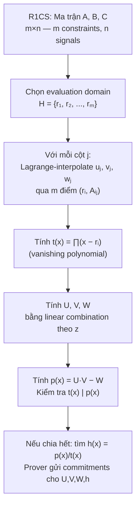
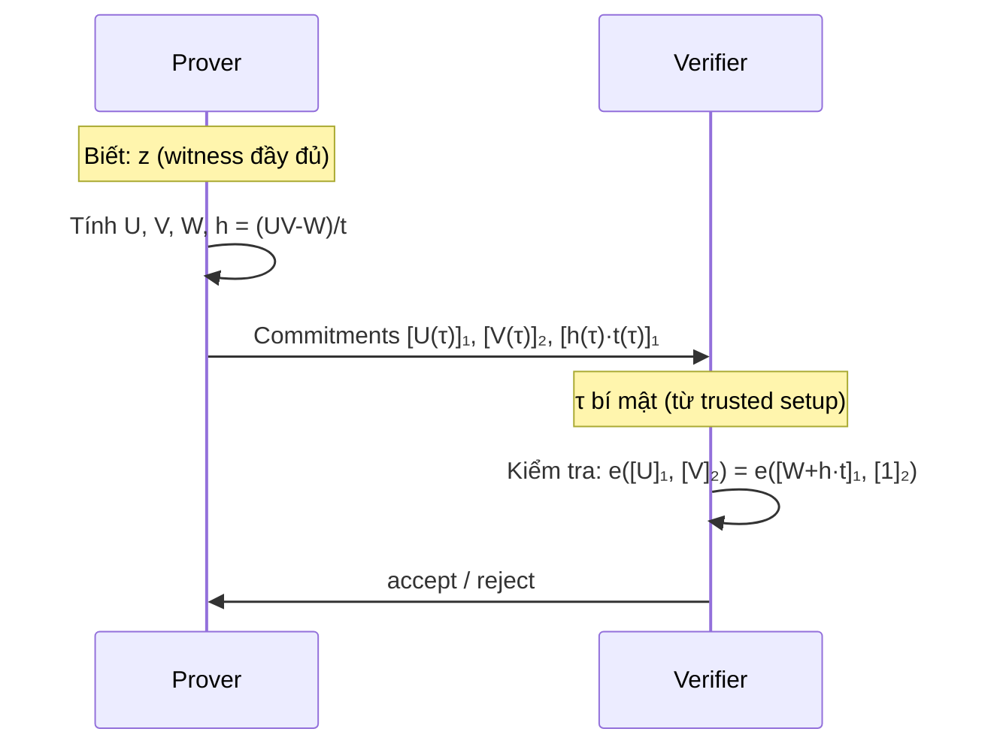

> **Prerequisites**: [[06-r1cs|06. R1CS — Rank-1 Constraint System]] — ma trận $A, B, C$, $Az \circ Bz = Cz$; [[02-polynomials-over-finite-fields|02. Polynomials over Finite Fields]] — Lagrange interpolation, vanishing polynomial, divisibility  
> **Objectives**:  
> - Hiểu tại sao cần chuyển R1CS sang QAP — polynomial encoding mở ra polynomial commitment
> - Thực hiện được conversion R1CS → QAP: từ ma trận sang tập đa thức
> - Hiểu target polynomial $t(x)$ và ý nghĩa của phép chia $p(x) / t(x)$
> - Implement QAP construction từ R1CS bằng Python / SageMath

---

## Motivation

R1CS là hệ $m$ phương trình trên $\mathbb{F}_p$. Để prove R1CS satisfied mà không lộ witness, proof system cần một cách **commit** toàn bộ hệ một lần và kiểm tra tại một điểm ngẫu nhiên duy nhất — thay vì gửi $m$ phương trình riêng lẻ.

**QAP** (Quadratic Arithmetic Program) là bước chuyển đổi đó: encode toàn bộ hệ $m$ constraints thành một **polynomial identity duy nhất**. Sau đó áp dụng Schwartz-Zippel — kiểm tra identity tại một điểm ngẫu nhiên bí mật $\tau$ là đủ để verify toàn bộ R1CS với xác suất overwhelming.

Đây là bước then chốt biến R1CS (đại số tuyến tính) thành thứ mà Groth16 và các zk-SNARK có thể hoạt động trên.

---

## 1. Ý tưởng Cốt lõi — Mã hoá Constraint thành Polynomial

Nhìn lại R1CS: với $m$ constraints và witness $\vec{z}$ kích thước $n$, ta có $m$ phương trình:

$$\langle A_i, \vec{z} \rangle \cdot \langle B_i, \vec{z} \rangle = \langle C_i, \vec{z} \rangle \quad \forall i \in \{1, \ldots, m\}$$

**Ý tưởng**: Chọn $m$ điểm phân biệt $r_1, \ldots, r_m \in \mathbb{F}_p$ làm **evaluation domain** $H = \{r_1, \ldots, r_m\}$. Với mỗi cột $j$ của ma trận, xây dựng đa thức $u_j(x), v_j(x), w_j(x)$ bậc $\leq m-1$ sao cho:

$$u_j(r_i) = A_{i,j}, \quad v_j(r_i) = B_{i,j}, \quad w_j(r_i) = C_{i,j}$$

Khi đó, định nghĩa các đa thức tổng:

$$U(x) = \sum_{j=0}^{n-1} z_j \cdot u_j(x), \quad V(x) = \sum_{j=0}^{n-1} z_j \cdot v_j(x), \quad W(x) = \sum_{j=0}^{n-1} z_j \cdot w_j(x)$$

Tại mỗi $r_i$:

$$U(r_i) = \langle A_i, \vec{z} \rangle, \quad V(r_i) = \langle B_i, \vec{z} \rangle, \quad W(r_i) = \langle C_i, \vec{z} \rangle$$

Do đó: **R1CS satisfied** $\Longleftrightarrow$ $U(r_i) \cdot V(r_i) - W(r_i) = 0$ với mọi $i$ $\Longleftrightarrow$ $t(x) \mid U(x) \cdot V(x) - W(x)$

---

## 2. Định nghĩa QAP

> [!definition] Definition 9.1 — QAP (Quadratic Arithmetic Program)
> Một **QAP** $\mathcal{Q}$ kích thước $m$ trên $n$ biến là bộ:
>
> $$\mathcal{Q} = \bigl(\{u_j(x)\}_{j=0}^{n-1},\ \{v_j(x)\}_{j=0}^{n-1},\ \{w_j(x)\}_{j=0}^{n-1},\ t(x)\bigr)$$
>
> trong đó:
> - $u_j, v_j, w_j \in \mathbb{F}_p[x]$: các **selector polynomials** bậc $\leq m-1$
> - $t(x) = \prod_{i=1}^{m}(x - r_i)$: **target polynomial** (vanishing polynomial trên $H$), bậc $m$
>
> QAP được **thỏa mãn** bởi assignment $\vec{z} = (z_0, \ldots, z_{n-1})$ khi và chỉ khi:
>
> $$t(x) \mid U(x) \cdot V(x) - W(x)$$
>
> tức là tồn tại đa thức $h(x)$ sao cho:
>
> $$U(x) \cdot V(x) - W(x) = h(x) \cdot t(x)$$

---

## 3. Quy trình Conversion R1CS → QAP



*Pipeline conversion R1CS → QAP: từ ma trận sang polynomial identity.*

### Bước 1 — Chọn Evaluation Domain

Thường chọn $H = \{1, 2, \ldots, m\}$ (đơn giản) hoặc $H$ là tập $m$-th roots of unity (hiệu quả hơn khi dùng NTT). Ta dùng $H = \{1, 2, \ldots, m\}$ cho ví dụ.

### Bước 2 — Lagrange Interpolation cho mỗi cột

Với cột $j$ của ma trận $A$: lấy $m$ điểm $(r_1, A_{1,j}), (r_2, A_{2,j}), \ldots, (r_m, A_{m,j})$, tính $u_j(x)$ đi qua tất cả.

### Bước 3 — Target Polynomial

$$t(x) = (x - r_1)(x - r_2) \cdots (x - r_m) = \prod_{i=1}^{m}(x - r_i)$$

Với $H = \{1, 2, \ldots, m\}$: $t(x) = (x-1)(x-2)\cdots(x-m)$.

### Bước 4 — Kiểm tra Divisibility

Tính $p(x) = U(x) \cdot V(x) - W(x)$. Nếu R1CS satisfied thì $p(r_i) = 0$ với mọi $i$ → $t(x) \mid p(x)$ → tìm được $h(x)$.

---

## 4. Ví dụ End-to-End: $out = x^2 + 5$

### R1CS đã có từ Lesson 06

$$\vec{z} = (1, x, out, t_1), \quad m = 2 \text{ constraints}$$

$$A = \begin{pmatrix} 0 & 1 & 0 & 0 \\ 5 & 0 & 0 & 1 \end{pmatrix},\quad B = \begin{pmatrix} 0 & 1 & 0 & 0 \\ 1 & 0 & 0 & 0 \end{pmatrix},\quad C = \begin{pmatrix} 0 & 0 & 0 & 1 \\ 0 & 0 & 1 & 0 \end{pmatrix}$$

### Evaluation Domain: $H = \{1, 2\}$

Với $m = 2$ constraints, domain gồm 2 điểm: $r_1 = 1$, $r_2 = 2$.

### Lagrange Interpolation — Tính $u_j$, $v_j$, $w_j$

Với mỗi cột $j \in \{0,1,2,3\}$, ta interpolate qua 2 điểm nên kết quả là đa thức bậc $\leq 1$ (đường thẳng).

Ví dụ cột $j=0$ của $A$: $(r_1, A_{1,0}) = (1, 0)$ và $(r_2, A_{2,0}) = (2, 5)$.

$$u_0(x) = \text{đường thẳng qua } (1, 0) \text{ và } (2, 5)$$

$$u_0(x) = \frac{0 \cdot (x-2) - 5 \cdot (x-1)}{1-2} = \frac{-5(x-1)}{-1} = 5(x-1) = 5x - 5$$

```python
p = 13  # working in F_13 for this example

def lagrange_linear(r1, y1, r2, y2, p):
    """
    Interpolate đường thẳng qua (r1,y1) và (r2,y2) trong F_p.
    Trả về hệ số [a0, a1] sao cho f(x) = a0 + a1*x.
    """
    # slope = (y2 - y1) / (r2 - r1)
    slope = ((y2 - y1) * pow(r2 - r1, p - 2, p)) % p
    # intercept = y1 - slope * r1
    intercept = (y1 - slope * r1) % p
    return [intercept, slope]   # [a0, a1]

def poly_eval_linear(coeffs, x, p):
    return (coeffs[0] + coeffs[1] * x) % p

r1, r2 = 1, 2

# Ma trận A (rows = constraints, cols = signals)
# Col j=0: A[:,0] = [0, 5]  (constraint 1 row0=0, constraint 2 row1=5)
# Col j=1: A[:,1] = [1, 0]
# Col j=2: A[:,2] = [0, 0]
# Col j=3: A[:,3] = [0, 1]
A_cols = [[0, 5], [1, 0], [0, 0], [0, 1]]
B_cols = [[0, 1], [1, 0], [0, 0], [0, 0]]
C_cols = [[0, 0], [0, 0], [0, 1], [1, 0]]

# Interpolate uⱼ, vⱼ, wⱼ cho mỗi cột
u = [lagrange_linear(r1, col[0], r2, col[1], p) for col in A_cols]
v = [lagrange_linear(r1, col[0], r2, col[1], p) for col in B_cols]
w = [lagrange_linear(r1, col[0], r2, col[1], p) for col in C_cols]

print("Selector polynomials u_j(x) = a0 + a1*x:")
for j, uj in enumerate(u):
    print(f"  u_{j}(x) = {uj[0]} + {uj[1]}x")

# Kiểm tra: u_0(1) = 0, u_0(2) = 5
for j in range(4):
    assert poly_eval_linear(u[j], r1, p) == A_cols[j][0], f"u_{j}(r1) mismatch"
    assert poly_eval_linear(u[j], r2, p) == A_cols[j][1], f"u_{j}(r2) mismatch"
print("Interpolation check: OK ✓")
```

### Tính $U(x)$, $V(x)$, $W(x)$ với witness $\vec{z}$

```python
# Witness: x=3, out=(9+5)%13=1, t1=9
x_val = 3
t1_val = (x_val * x_val) % p     # 9
out_val = (t1_val + 5) % p       # 14 % 13 = 1

z = [1, x_val, out_val, t1_val]  # [1, 3, 1, 9]
print(f"\nWitness z = {z}")

def eval_combined(polys, z_vec, x, p):
    """
    U(x) = Σ z_j * u_j(x) trong F_p
    """
    result = 0
    for j, poly in enumerate(polys):
        result = (result + z_vec[j] * poly_eval_linear(poly, x, p)) % p
    return result

# Kiểm tra tại r1=1 và r2=2: U(ri) phải = <A_i, z>
def inner_product(row, vec, p):
    return sum(row[j] * vec[j] for j in range(len(row))) % p

A_rows = [[0,1,0,0], [5,0,0,1]]
B_rows = [[0,1,0,0], [1,0,0,0]]
C_rows = [[0,0,0,1], [0,0,1,0]]

print("\nKiểm tra U(rᵢ) = <Aᵢ, z>:")
for i, ri in enumerate([r1, r2]):
    Uz = eval_combined(u, z, ri, p)
    Az = inner_product(A_rows[i], z, p)
    print(f"  U(r{i+1}={ri}) = {Uz},  <A_{i+1}, z> = {Az},  match={Uz==Az}")
```

### Target Polynomial và Divisibility

```python
def poly_mul_coeffs(f, g, p):
    """Nhân hai đa thức (list hệ số) trong F_p"""
    result = [0] * (len(f) + len(g) - 1)
    for i, a in enumerate(f):
        for j, b in enumerate(g):
            result[i+j] = (result[i+j] + a*b) % p
    return result

def poly_sub_coeffs(f, g, p):
    """Trừ hai đa thức trong F_p"""
    n = max(len(f), len(g))
    result = [((f[i] if i < len(f) else 0) - (g[i] if i < len(g) else 0)) % p
              for i in range(n)]
    while len(result) > 1 and result[-1] == 0:
        result.pop()
    return result

def poly_divmod_coeffs(f, g, p):
    """Chia f cho g trong F_p[x], trả về (quotient, remainder)"""
    f = list(f)
    g = list(g)
    if len(f) < len(g):
        return [0], f
    q = []
    while len(f) >= len(g):
        coef = (f[-1] * pow(g[-1], p-2, p)) % p
        q.insert(0, coef)
        diff = len(f) - len(g)
        for i in range(len(g)):
            f[diff+i] = (f[diff+i] - coef*g[i]) % p
        f.pop()
    while len(f) > 1 and f[-1] == 0:
        f.pop()
    return q, f

# Target polynomial: t(x) = (x-1)(x-2) = x^2 - 3x + 2 = x^2 + 10x + 2 mod 13
# (x-1)(x-2) = x^2 - 3x + 2; mod 13: -3 ≡ 10, +2 stays
t_poly = poly_mul_coeffs([-1, 1], [-2, 1], p)   # (x-1)(x-2)
print(f"\nTarget polynomial t(x) = {t_poly}")
# [2, 10, 1] → 2 + 10x + x^2

# Tính U(x), V(x), W(x) dưới dạng đa thức
def combined_poly(polys, z_vec, p):
    """Tính U(x) = Σ z_j * u_j(x) dưới dạng hệ số"""
    n_terms = max(len(poly) for poly in polys)
    result = [0] * n_terms
    for j, poly in enumerate(polys):
        for k in range(len(poly)):
            result[k] = (result[k] + z_vec[j] * poly[k]) % p
    return result

U_poly = combined_poly(u, z, p)
V_poly = combined_poly(v, z, p)
W_poly = combined_poly(w, z, p)
print(f"\nU(x) = {U_poly}")
print(f"V(x) = {V_poly}")
print(f"W(x) = {W_poly}")

# p(x) = U(x)*V(x) - W(x)
UV_poly = poly_mul_coeffs(U_poly, V_poly, p)
p_poly = poly_sub_coeffs(UV_poly, W_poly, p)
print(f"\np(x) = U·V - W = {p_poly}")

# Kiểm tra t(x) | p(x)
h_poly, remainder = poly_divmod_coeffs(p_poly, t_poly, p)
print(f"h(x) = p(x)/t(x) = {h_poly}")
print(f"remainder = {remainder}")
assert all(r == 0 for r in remainder), "Không chia hết — R1CS NOT satisfied!"
print("t(x) | p(x) ✓ — QAP satisfied!")
```

---

## 5. Tổng hợp: R1CS ↔ QAP Tương đương

> [!theorem] Theorem 9.2 — R1CS/QAP Equivalence
> Với R1CS $(A, B, C)$ và QAP $\mathcal{Q}$ được xây từ $A, B, C$ qua Lagrange interpolation trên $H = \{r_1, \ldots, r_m\}$:
>
> $$A\vec{z} \circ B\vec{z} = C\vec{z} \quad \Longleftrightarrow \quad t(x) \mid U(x) \cdot V(x) - W(x)$$
>
> **Proof sketch**: ($\Rightarrow$) Nếu R1CS satisfied thì $U(r_i) V(r_i) - W(r_i) = 0$ với mọi $r_i \in H$ → $p(r_i) = 0$ → $t \mid p$. ($\Leftarrow$) Nếu $t \mid p$ thì $p(r_i) = 0$ với mọi $r_i$ → $U(r_i)V(r_i) = W(r_i)$ → R1CS constraint $i$ thỏa mãn. $\blacksquare$

---

## 6. Vai trò của $h(x)$ trong ZK Proof

Khi R1CS satisfied, prover tìm được $h(x) = p(x)/t(x)$. Trong Groth16:



*Groth16 proof protocol — prover commit các evaluations tại điểm bí mật $\tau$, verifier kiểm tra bằng pairing equation.*

Verifier không biết $\tau$ trực tiếp — $\tau$ được "nhúng" vào **structured reference string (SRS)** từ trusted setup. Prover tính $[h(\tau)]_1$ từ SRS mà không cần biết $\tau$.

---

## 7. Optimization: Roots of Unity làm Domain

Trong thực tế, thay vì $H = \{1, 2, \ldots, m\}$, ta dùng $H = \{1, \omega, \omega^2, \ldots, \omega^{m-1}\}$ với $\omega$ là primitive $m$-th root of unity.

**Lý do**:
- Target polynomial trở thành $t(x) = x^m - 1$ — cực kỳ đơn giản
- Lagrange interpolation trên roots of unity tương đương **NTT** (Number Theoretic Transform) — $O(m \log m)$ thay vì $O(m^2)$

```python
# Với p = 17, m = 4: dùng 4th roots of unity
p_opt = 17
omega = pow(3, (p_opt-1)//4, p_opt)   # primitive 4th root of unity = 13
H_opt = [pow(omega, i, p_opt) for i in range(4)]
print(f"\nRoots of unity domain (p=17, m=4): H = {H_opt}")

# Target polynomial: t(x) = x^4 - 1
# Kiểm tra: t(h) = 0 với mọi h ∈ H
for h in H_opt:
    assert (pow(h, 4, p_opt) - 1) % p_opt == 0
print("t(x) = x^4 - 1: zero tại mọi h ∈ H ✓")
```

---

## Summary

- **QAP** encode R1CS thành polynomial identity: $t(x) \mid U(x) \cdot V(x) - W(x)$.
- **Selector polynomials** $u_j, v_j, w_j$: interpolate qua $(r_i, A_{i,j})$ — "lift" cột ma trận thành đa thức.
- **Target polynomial** $t(x) = \prod(x - r_i)$ — vanishing polynomial trên evaluation domain $H$.
- **Quotient polynomial** $h(x) = p(x)/t(x)$ — prover tính được khi và chỉ khi R1CS satisfied.
- **Equivalence**: R1CS satisfied $\Leftrightarrow$ QAP satisfied — hai biểu diễn hoàn toàn tương đương.
- **Optimization**: dùng roots of unity làm domain → $t(x) = x^m - 1$ và NTT thay Lagrange.

---

## References

- Vitalik Buterin — *Quadratic Arithmetic Programs: from Zero to Hero* (medium.com/@VitalikButerin, 2016)
- Rosario Gennaro, Craig Gentry, Bryan Parno, Mariana Raykova — *Quadratic Span Programs and Succinct NIZKs without PCPs* (eprint.iacr.org/2012/215)
- Justin Thaler — *Proofs, Arguments, and Zero-Knowledge*, Ch. 5
- Jens Groth — *On the Size of Pairing-Based Non-interactive Arguments* (eprint.iacr.org/2016/260)
