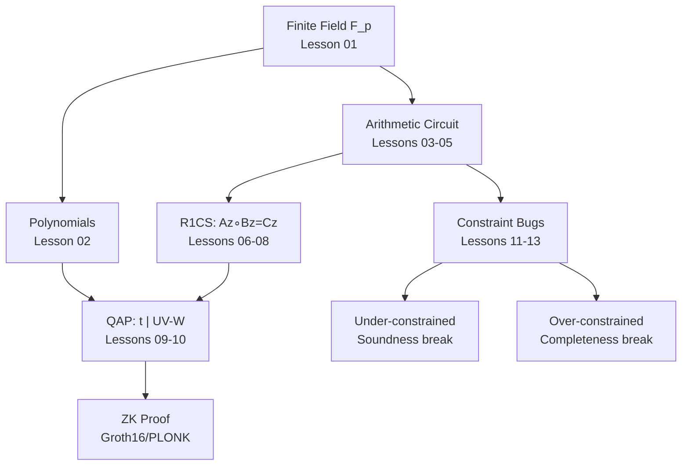

> **Mục tiêu series**: Nắm vững arithmetic circuits, R1CS, và QAP — nền tảng kỹ thuật để tìm constraint bugs trong ZK circuits, ứng dụng trực tiếp vào bug bounty trên **zkVerify**.

---

## Phần 1 — Nền tảng 

- [[01-finite-fields|01. Finite Fields & Field Arithmetic]] — $\mathbb{F}_p$, phép toán field, multiplicative inverse (Extended GCD + Fermat), $\mathbb{F}_p^*$ cyclic group, primitive roots, roots of unity, extension fields. Bảng các trường ZK thực tế: BN254, BLS12-381, Goldilocks, Baby Bear.
- [[02-polynomials-over-finite-fields|02. Polynomials over Finite Fields]] — Evaluation (Horner), roots, Lagrange interpolation, Schwartz-Zippel lemma, vanishing polynomial $Z_H(x)$, divisibility $Z_H \mid p(x)$ ↔ constraint satisfied.

## Phần 2 — Arithmetic Circuit Model 

- [[03-arithmetic-circuits|03. Arithmetic Circuits — Định nghĩa & Cấu trúc]] — Định nghĩa DAG, gates ($+$, $\times$), wires, size/depth/fan-in/fan-out, Boolean vs Arithmetic, CSAT NP-complete, circuit cho $x^3+x+5$, sub-circuit reuse.
- [[04-signals-witnesses-visibility|04. Signals, Witnesses & Visibility]] — Ba loại signal, witness vector $\vec{z} = (1, x_1\ldots, w_1\ldots)$, luồng Prover↔Verifier, ZK visibility invariant, 3 visibility bug patterns.
- [[05-constraint-systems-overview|05. Constraint Systems — Tổng quan]] — Gate→constraint mapping, R1CS vs Plonkish vs AIR, pipeline đầy đủ Circuit→R1CS→QAP→Proof.

## Phần 3 — R1CS 

- [[06-r1cs|06. R1CS — Rank-1 Constraint System]] — Ma trận $A, B, C \in \mathbb{F}_p^{m\times n}$, Hadamard product $\circ$, encoding constraint, addition miễn phí, constant $z_0=1$, sparse representation.
- [[07-circuit-to-r1cs|07. Chuyển đổi Circuit → R1CS]] — Flattening, bảng encoding 6 loại phép toán, pinning constraint, Boolean MUX, R1CS builder class, checklist audit.
- [[08-r1cs-soundness-completeness|08. R1CS — Soundness & Completeness]] — Completeness / soundness / knowledge soundness, Schwartz-Zippel, 3 loại soundness bug, `audit_r1cs_soundness()`.

## Phần 4 — QAP & Polynomial Encoding 

- [[09-qap|09. QAP — Quadratic Arithmetic Programs]] — Selector polynomials $u_j, v_j, w_j$ qua Lagrange, target polynomial $t(x)$, divisibility $t \mid UV-W$, ví dụ end-to-end, NTT optimization.
- [[10-qap-satisfiability|10. QAP Satisfiability & Divisibility]] — Soundness tại $\tau$ ngẫu nhiên, tại sao không fake được $h(x)$, degree bound, 3 loại QAP-level bug, checklist audit QAP.

## Phần 5 — Constraint Analysis 

- [[11-under-constrained-circuits|11. Under-constrained Circuits]] — 5 dạng: signal tự do / thiếu bit check / sub-circuit output không linked / non-deterministic intermediate / field overflow. Case study Tornado Cash.
- [[12-over-constrained-circuits|12. Over-constrained Circuits]] — 4 dạng: conflicting / vô nghiệm trên $\mathbb{F}_p$ / equality quá strict / off-by-one range. Hậu quả DoS/griefing.
- [[13-constraint-completeness-audit|13. Constraint Completeness Audit]] — Framework 4 tầng, `CircuitAuditor` class, test suite template, checklist zkVerify, severity matrix.

## Appendices 

- [[a0-notation-reference|A0. Notation Reference]] — Bảng tra cứu đầy đủ: field, polynomial, circuit, R1CS, QAP, proof system, thuật ngữ Việt↔Anh.
- [[a1-worked-examples|A1. R1CS / QAP Worked Examples]] — $out = ab+cd$ (Lagrange 3pt, 3 constraints) và Boolean MUX đầy đủ với bit check và completeness test suite.

---

## Bản đồ Khái niệm

*Bản đồ toàn bộ series — từ finite field đến ZK proof và constraint bugs.*

---

## Tool & Library Guide

| Tool | Mục đích | Link |
|------|---------|------|
| `circom` | Viết và compile arithmetic circuit | docs.circom.io |
| `snarkjs` | Generate/verify Groth16 proof từ R1CS | github.com/iden3/snarkjs |
| `Circomspect` | Static analyzer — tìm under-constrained | github.com/trailofbits/circomspect |
| `ECNE` | Kiểm tra constraint non-equivalence | github.com/franklynwang/EcneProject |
| `Picus` | Formal verification circuit constraints | github.com/Veridise/Picus |
| `SageMath` | Tính toán field/polynomial/matrix | sagemath.org |

## Quick Reference

| Khái niệm | Định nghĩa ngắn |
|-----------|----------------|
| $Az \circ Bz = Cz$ | R1CS: $m$ constraints trên witness $\vec{z} \in \mathbb{F}_p^n$ |
| $t(x) \mid UV-W$ | QAP: polynomial identity tương đương R1CS |
| $h(x) = p(x)/t(x)$ | Quotient — prover tính được khi R1CS satisfied |
| Under-constrained | Nhiều witnesses hợp lệ → soundness break → **critical** |
| Over-constrained | Không có witness nào → completeness break → DoS |
| Pinning constraint | Constraint nối intermediate signal với output |
| Bit check | $b \cdot (b-1) = 0$ — bắt buộc khi signal dùng như bit |
