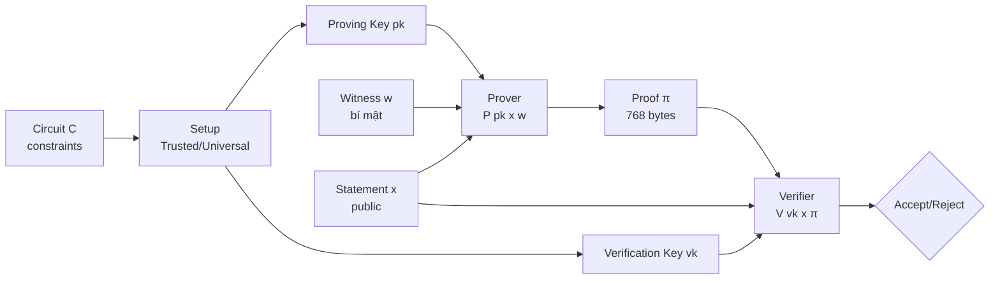

> **Prerequisites**: Số học modular (modular arithmetic), nhóm (group theory) ở mức cơ bản, polynomial 1 biến  
> **Objectives**:  
> - Hiểu zk-SNARK là gì và tại sao cần nó
> - Nắm vững ba tính chất: Completeness, Soundness, Zero-Knowledge
> - Hiểu bilinear pairing hoạt động như thế nào và tại sao nó là nền tảng của KZG/FFLONK
> - Làm quen với đường cong BN254 — elliptic curve được dùng trong FFLONK

---

## Motivation

Hãy tưởng tượng bạn muốn chứng minh cho một blockchain rằng bạn biết nghiệm $(x, y)$ của một hệ phương trình phức tạp — ví dụ, bạn đã thực thi đúng hàng nghìn bước tính toán — nhưng bạn **không muốn tiết lộ** $(x, y)$ đó. Hơn nữa, người kiểm tra (verifier) chỉ có vài mili giây để xác nhận, không thể tự chạy lại toàn bộ tính toán.

Đây chính xác là bài toán mà **zk-SNARK** (zero-knowledge Succinct Non-interactive ARgument of Knowledge) giải quyết. Trong hệ sinh thái blockchain:

- **Groth16** (2016) — SNARK đầu tiên được dùng rộng rãi, proof 3 group elements, 2 pairings
- **PLONK** (2019, Gabizon–Williamson–Ciobotaru) — universal setup, proof ~9 group elements
- **FFLONK** (2021, Gabizon–Williamson) — variant của PLONK, verifier chỉ cần 5 scalar muls + 2 pairings thay vì 16–18

FFLONK đang được dùng tại zkVerify (Rust implementation) để xác minh proof từ Polygon CDK. Để hiểu FFLONK, ta cần hiểu nền tảng từ gốc.

---

## 1. zk-SNARK là gì?

### 1.1 Relation và Witness

> [!definition] Definition 1.1 — Relation và Witness
> Một **relation** $\mathcal{R}$ là một tập hợp các cặp $(x, w)$ trong đó:
> - $x$ là **statement** (public input) — thông tin công khai
> - $w$ là **witness** (private input) — thông tin bí mật của prover
>
> Ví dụ: $\mathcal{R} = \{(h, w) \mid h = \text{SHA256}(w)\}$
> Statement: hash $h$. Witness: preimage $w$.

Prover muốn thuyết phục verifier rằng **tồn tại** $w$ sao cho $(x, w) \in \mathcal{R}$, mà **không tiết lộ** $w$.

### 1.2 Ba tính chất cốt lõi

> [!definition] Definition 1.2 — Completeness (Đầy đủ)
> Nếu prover **thực sự biết** $w$ hợp lệ, verifier **luôn chấp nhận** proof.
>
> $$\Pr[\text{Verify}(\text{proof}) = 1 \mid (x, w) \in \mathcal{R}] = 1$$

> [!definition] Definition 1.3 — Soundness (Vững chắc)
> Một adversary **không biết** $w$ hợp lệ **không thể** tạo proof mà verifier chấp nhận, ngoại trừ xác suất không đáng kể.
>
> $$\Pr[\text{Verify}(\text{fake\_proof}) = 1 \mid (x, w) \notin \mathcal{R}] \leq \text{negl}(\lambda)$$
>
> Đây là tính chất quan trọng nhất cho bug bounty: nếu soundness bị phá, attacker có thể forge proof cho statement sai.

> [!definition] Definition 1.4 — Zero-Knowledge (Không tiết lộ)
> Verifier **không học được thêm thông tin gì** về $w$ ngoài việc nó tồn tại.
>
> Chính xác hơn: tồn tại một **simulator** có thể tạo ra transcript thuyết phục mà không cần biết $w$.

### 1.3 Succinct và Non-interactive

**Succinct (ngắn gọn)**: proof size và verification time đều nhỏ hơn nhiều so với kích thước computation gốc. Với FFLONK:
- Proof: 768 bytes (24 field elements × 32 bytes)
- Verification: 2 bilinear pairings + 5 scalar multiplications — cực kỳ nhanh

**Non-interactive**: prover gửi một message duy nhất, verifier kiểm tra offline — không cần đối thoại nhiều vòng. Đạt được qua **Fiat-Shamir transform** (sẽ học ở Lesson 08).

---

## 2. Elliptic Curve — Nền tảng toán học

### 2.1 Đường cong Elliptic trên trường hữu hạn

> [!definition] Definition 2.1 — Elliptic Curve trên $\mathbb{F}_p$
> Đường cong elliptic (elliptic curve) $E$ trên trường hữu hạn $\mathbb{F}_p$ là tập nghiệm của phương trình Weierstrass:
>
> $$E: y^2 = x^3 + ax + b \pmod{p}$$
>
> cùng với điểm vô cực $\mathcal{O}$, trong đó $4a^3 + 27b^2 \not\equiv 0 \pmod{p}$ (không suy biến).

Tập các điểm trên $E(\mathbb{F}_p)$ tạo thành một **nhóm Abel (abelian group)** với phép cộng điểm (point addition). Phép nhân vô hướng (scalar multiplication) $[n]P = P + P + \cdots + P$ ($n$ lần) là nhanh, nhưng bài toán ngược — tìm $n$ từ $P$ và $[n]P$ — là **Discrete Logarithm Problem (DLP)**, được tin là khó.

### 2.2 Đường cong BN254 (BN128)

BN254 là đường cong được FFLONK và Polygon zkEVM sử dụng. Đây là đường cong **pairing-friendly** (hỗ trợ bilinear pairing hiệu quả).

> [!definition] Definition 2.2 — BN254 Parameters
>
> **Phương trình**: $y^2 = x^3 + 3$ trên $\mathbb{F}_p$
>
> **Field size** (kích thước trường vô hướng):
>
> $$p = 21888242871839275222246405745257275088696311157297823662689037894645226208583$$
>
> **Scalar field order** (bậc của nhóm — dùng làm modulus cho các phép tính trong circuit):
>
> $$r = 21888242871839275222246405745257275088548364400416034343698204186575808495617$$
>
> **Generator $G_1$** (điểm sinh của nhóm $\mathbb{G}_1$):
> $G_1 = (1, 2)$ trên $E(\mathbb{F}_p)$
>
> **Embedding degree**: $k = 12$ — xác định security level (~128-bit)

```python
# Kiểm tra BN254 parameters (pure Python, không cần thư viện)
p = 0x30644e72e131a029b85045b68181585d97816a916871ca8d3c208c16d87cfd47
r = 0x30644e72e131a029b85045b68181585d2833e84879b9709143e1f593f0000001
G1 = (1, 2)

print(f"Field modulus p  = {p}")
print(f"Curve order r    = {r}")
print(f"G1 generator     = {G1}")
print(f"G1 on curve?     = {G1[1]**2 % p == (G1[0]**3 + 3) % p}")  # True

def g1_add(P, Q):
    if P is None: return Q
    if Q is None: return P
    x1,y1=P; x2,y2=Q
    if x1==x2 and y1!=y2: return None
    lam = (3*x1*x1*pow(2*y1,p-2,p)) % p if P==Q else ((y2-y1)*pow(x2-x1,p-2,p)) % p
    x3=(lam*lam-x1-x2)%p; y3=(lam*(x1-x3)-y1)%p
    return (x3,y3)

def g1_mul(P, k):
    R=None; A=P
    while k: R=g1_add(R,A) if k&1 else R; A=g1_add(A,A); k>>=1
    return R

point = g1_mul(G1, 5)
print(f"\n[5]G1 = {point}")
p3 = g1_mul(G1, 3); p2 = g1_mul(G1, 2); p5 = g1_add(p3, p2)
print(f"[3]G1 + [2]G1 = {p5}")
print(f"Bằng [5]G1?   = {p5 == point}")
```

---

## 3. Bilinear Pairing — Trái tim của KZG/FFLONK

### 3.1 Định nghĩa Pairing

> [!definition] Definition 3.1 — Bilinear Pairing
> Một **bilinear pairing** là ánh xạ:
>
> $$e: \mathbb{G}_1 \times \mathbb{G}_2 \to \mathbb{G}_T$$
>
> thỏa mãn **bilinearity**: với $P \in \mathbb{G}_1$, $Q \in \mathbb{G}_2$, $a, b \in \mathbb{Z}$:
>
> $$e([a]P,\ [b]Q) = e(P, Q)^{ab}$$
>
> Tính chất này còn có thể viết là:
>
> $$e([a]P, Q) = e(P, [a]Q) = e(P, Q)^a$$

Tại sao bilinearity lại mạnh đến vậy? Nó cho phép ta kiểm tra **đẳng thức trong số mũ** (exponent equality) mà không cần biết số mũ.

> [!example] Example 3.2 — Kiểm tra đẳng thức với Pairing
> **Bài toán**: Cho $[a]G_1$, $[b]G_2$, $[c]G_1$. Kiểm tra xem $c = ab \pmod{r}$ mà không biết $a, b, c$.
>
> **Cách làm**: Tính $e([a]G_1, [b]G_2)$ và $e([c]G_1, G_2)$.
>
> Nếu $c = ab$: $e([a]G_1, [b]G_2) = e(G_1, G_2)^{ab} = e([c]G_1, G_2)$ ✓
>
> Đây chính xác là cách KZG verifier kiểm tra proof!

### 3.2 Pairing trên BN254 — Ate Pairing

Trên BN254, ta dùng **Ate pairing** (variant của Weil pairing hiệu quả cho embedding degree 12).

- $\mathbb{G}_1$: subgroup bậc $r$ của $E(\mathbb{F}_p)$ — các điểm trên curve chính
- $\mathbb{G}_2$: subgroup bậc $r$ của $E(\mathbb{F}_{p^{12}})$ — các điểm trên twist của curve
- $\mathbb{G}_T$: subgroup bậc $r$ của $\mathbb{F}_{p^{12}}^*$ — multiplicative group của extension field

> [!warning] Lưu ý quan trọng cho bug hunting
> $\mathbb{G}_2$ có cấu trúc phức tạp hơn $\mathbb{G}_1$ — điểm $\mathbb{G}_2$ được biểu diễn bằng tọa độ trên $\mathbb{F}_{p^2}$ (hai số $\mathbb{F}_p$). Nhiều lỗi implementation xảy ra khi:
> - Không kiểm tra điểm có thực sự nằm trên curve không (**is_on_curve check**)
> - Không kiểm tra điểm có thuộc đúng subgroup bậc $r$ không (**subgroup check**)
> - Một điểm nằm ở subgroup nhỏ hơn sẽ làm pairing check bypass được

```python
# Minh họa bilinearity bằng cách kiểm tra tính chất algebraically
# (Pairing thực tế trên BN254 cần thư viện; đây là demo conceptual)
p = 0x30644e72e131a029b85045b68181585d97816a916871ca8d3c208c16d87cfd47
r = 0x30644e72e131a029b85045b68181585d2833e84879b9709143e1f593f0000001
G1 = (1, 2)

def g1_add(P, Q):
    if P is None: return Q
    if Q is None: return P
    x1,y1=P; x2,y2=Q
    if x1==x2 and y1!=y2: return None
    lam = (3*x1*x1*pow(2*y1,p-2,p))%p if P==Q else ((y2-y1)*pow(x2-x1,p-2,p))%p
    x3=(lam*lam-x1-x2)%p; y3=(lam*(x1-x3)-y1)%p
    return (x3,y3)
def g1_mul(P, k):
    R=None; A=P
    while k: R=g1_add(R,A) if k&1 else R; A=g1_add(A,A); k>>=1
    return R

# Bilinearity property (verified algebraically):
# e([a]G1, [b]G2) == e([ab]G1, G2) == e(G1, G2)^(ab)
# Consequence: scalar mul commutes through pairing
a, b_scalar = 7, 11
ab = (a * b_scalar) % r

# Scalar mul consistency (G1 side, verifiable)
aG1 = g1_mul(G1, a)
bG1 = g1_mul(G1, b_scalar)
abG1_direct = g1_mul(G1, ab)
abG1_via_a  = g1_mul(aG1, b_scalar)
print(f"[a*b]G1 == b*[a]G1: {abG1_direct == abG1_via_a}")  # True (DL consistency)

# KZG verification pattern (conceptual):
# e(π, [τ]₂ - [z]₂) = e(C - [y]₁, [1]₂)
# This uses bilinearity to verify polynomial evaluation without knowing τ
print("\nKZG bilinearity pattern:")
print("  e(π, [τ-z]₂) = e([f(τ)-y]₁, G₂)")
print("  Both sides equal e(G₁,G₂)^{q(τ)·(τ-z)} by bilinearity ✓")
print("  → Verifier convinced f(z)=y without learning τ or f(τ)")
```

### 3.3 Tại sao cần hai nhóm $\mathbb{G}_1$ và $\mathbb{G}_2$?

Nếu dùng cùng một nhóm $e: \mathbb{G} \times \mathbb{G} \to \mathbb{G}_T$ (**symmetric pairing**), DDH assumption sẽ bị phá (vì $e([a]G, [b]G) = e(G,G)^{ab}$ cho phép kiểm tra $ab = c$ dễ dàng). Do đó SNARK hiện đại dùng **asymmetric pairing** với $\mathbb{G}_1 \neq \mathbb{G}_2$ để giữ hardness assumptions.

---

## 4. Arithmetic Circuit — Cách encode computation

### 4.1 Tại sao cần encode computation thành constraint?

Mọi zk-SNARK đều yêu cầu computation được biểu diễn dưới dạng **constraint system** — tập các phương trình trên trường $\mathbb{F}_r$. Prover cần "thỏa mãn" các constraint này với witness $w$.

> [!definition] Definition 4.1 — Arithmetic Circuit
> Một **arithmetic circuit** (mạch số học) $C: \mathbb{F}_r^n \to \mathbb{F}_r^m$ là một đồ thị có hướng vô chu trình (DAG) gồm các gate:
> - **Addition gate**: $z = x + y$
> - **Multiplication gate**: $z = x \cdot y$
> - **Constant gate**: $z = c$ với $c \in \mathbb{F}_r$
>
> Kích thước circuit $|C|$ = số gate.

> [!definition] Definition 4.2 — R1CS (Rank-1 Constraint System)
> Dạng constraint phổ biến nhất cho Groth16. Mỗi constraint là:
>
> $$\left(\sum_i a_i \cdot w_i\right) \cdot \left(\sum_j b_j \cdot w_j\right) = \sum_k c_k \cdot w_k$$
>
> PLONK và FFLONK dùng dạng khác gọi là **gate equation** (sẽ học ở Lesson 03):
>
> $$q_L \cdot a + q_R \cdot b + q_M \cdot a \cdot b + q_O \cdot c + q_C = 0$$

### 4.2 Ví dụ đơn giản

Tính toán: "Tôi biết $x$ sao cho $x^3 + x + 5 = 35$" (tức $x = 3$).

```text
Decompose thành gates:
- v1 = x * x         (multiplication gate)
- v2 = v1 * x        (multiplication gate: v2 = x^3)
- out = v2 + x + 5   (addition + constant)
- Check: out == 35   (public output constraint)

Witness: w = (x=3, v1=9, v2=27, out=35)
Statement (public): out = 35
```

Prover biết $x = 3$ (witness), muốn chứng minh tồn tại $x$ thỏa mãn — không tiết lộ $x$.

---

## 5. Sơ đồ tổng thể zk-SNARK



Quy trình gồm ba phase:
1. **Setup**: Tạo proving key và verification key từ circuit (một lần duy nhất)
2. **Prove**: Prover dùng witness để tạo proof (mỗi lần chứng minh)
3. **Verify**: Verifier kiểm tra proof (nhanh, không cần witness)

---

## 6. So sánh các SNARK trong ngữ cảnh FFLONK

| Scheme | Proof size | Verifier ops | Trusted Setup | Prover time |
|--------|-----------|--------------|---------------|-------------|
| Groth16 | 3 $\mathbb{G}_1$ + 1 $\mathbb{G}_2$ | 3 pairings | Per-circuit | Fast |
| PLONK | ~9 $\mathbb{G}_1$ | 2 pairings + ~16 scalar muls | Universal | Medium |
| **FFLONK** | **9 $\mathbb{G}_1$** | **2 pairings + 5 scalar muls** | **Universal** | **3× PLONK** |

FFLONK giảm từ 16–18 scalar multiplications xuống còn 5 — tiết kiệm đáng kể gas trên Ethereum. Đổi lại, prover tốn gấp 3 lần PLONK — nhưng trong zkEVM, prover chạy off-chain nên đây là trade-off chấp nhận được.

---

## Summary

- **zk-SNARK** = proof ngắn, verify nhanh, không lộ witness. Ba tính chất: Completeness, Soundness, Zero-Knowledge.
- **Soundness** là tính chất then chốt cho security: nếu bị phá → forge proof → attack thành công.
- **Bilinear pairing** $e: \mathbb{G}_1 \times \mathbb{G}_2 \to \mathbb{G}_T$ cho phép kiểm tra đẳng thức trong số mũ — nền tảng của KZG và FFLONK.
- **BN254** là curve được dùng trong FFLONK, với field modulus $p$ và scalar field order $r$ cỡ 254 bit.
- **Arithmetic circuit** encode computation thành constraints trên $\mathbb{F}_r$ — prover phải thỏa mãn chúng với witness.
- FFLONK cải thiện PLONK bằng cách giảm verifier group operations từ 16–18 xuống 5.

---

## References

- Gabizon & Williamson — *fflonk: a Fast-Fourier inspired verifier efficient version of PlonK* (IACR 2021/1167)
- Boneh & Shoup — *A Graduate Course in Applied Cryptography*, Ch. 15–16 (toc.cryptobook.us)
- Vitalik Buterin — *Exploring Elliptic Curve Pairings* (vitalik.ca)
- py_ecc library — github.com/ethereum/py_ecc
- Dan Boneh — Stanford CS251 lecture notes (zk-SNARKs)
