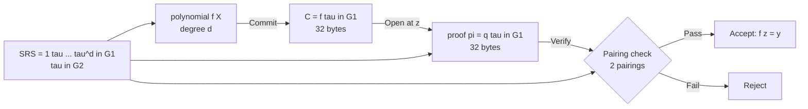

> **Prerequisites**: [[01-zk-foundations|01. ZK-SNARK Foundations]] — bilinear pairing, BN254, nhóm elliptic curve  
> **Objectives**:  
> - Hiểu Polynomial Commitment Scheme (PCS) là gì và tại sao nó là building block của PLONK/FFLONK
> - Nắm vững KZG scheme: Setup → Commit → Open → Verify
> - Hiểu KZG batch opening — nền tảng trực tiếp của cải tiến trong FFLONK
> - Phân biệt hiding vs binding, và ý nghĩa cho security

---

## Motivation

PLONK và FFLONK đều hoạt động theo mô hình: prover encode mọi thứ (witness, constraint satisfiability) vào **polynomial**, rồi cam kết (commit) với verifier rằng các polynomial đó có tính chất đúng.

Vấn đề: polynomial có thể có hàng nghìn hệ số — không thể gửi toàn bộ. Ta cần một cơ chế cho phép:

1. Prover **cam kết** với polynomial $f(X)$ bằng một **group element nhỏ** (32 bytes)
2. Sau đó prover **mở** (open) tại điểm $z$ bất kỳ, chứng minh $f(z) = y$
3. Verifier **kiểm tra** mà **không cần biết toàn bộ $f$**

Đây chính là **Polynomial Commitment Scheme (PCS)**. KZG (Kate–Zaverucha–Goldberg, 2010) là PCS dùng trong FFLONK.

---

## 1. Định nghĩa PCS

> [!definition] Definition 1.1 — Polynomial Commitment Scheme
> Một **PCS** gồm bốn thuật toán:
>
> - $\text{Setup}(\lambda, d) \to \text{srs}$: Tạo Structured Reference String từ security parameter $\lambda$ và degree bound $d$
> - $\text{Commit}(\text{srs}, f) \to C$: Tạo commitment $C$ cho polynomial $f \in \mathbb{F}_r^{\leq d}[X]$
> - $\text{Open}(\text{srs}, f, z) \to (y, \pi)$: Tạo evaluation proof $\pi$ cho $f(z) = y$
> - $\text{Verify}(\text{srs}, C, z, y, \pi) \to \{0, 1\}$: Kiểm tra proof

> [!definition] Definition 1.2 — Binding và Hiding
> **Binding** (ràng buộc): Prover không thể tạo hai openings $(y_1, \pi_1)$ và $(y_2, \pi_2)$ với $y_1 \neq y_2$ cho cùng commitment $C$ và cùng điểm $z$.
>
> **Hiding** (ẩn): Commitment $C$ không tiết lộ thông tin về $f$ — verifier không thể suy ra hệ số của polynomial từ $C$ một mình.
>
> KZG có **computational binding** (dựa trên $q$-SDH assumption) và **computational hiding** (nếu thêm blinding factor).

---

## 2. KZG Scheme — Chi tiết đầy đủ

### 2.1 Setup — Trusted Setup với trapdoor $\tau$

> [!definition] Definition 2.1 — KZG Setup
> Chọn ngẫu nhiên $\tau \in \mathbb{F}_r^*$ (trapdoor — **phải bị xóa sau ceremony**). Tạo SRS:
>
> $$\text{srs} = \left([1]_1,\, [\tau]_1,\, [\tau^2]_1,\, \ldots,\, [\tau^d]_1,\, [1]_2,\, [\tau]_2\right)$$
>
> Trong đó $[x]_1 = x \cdot G_1 \in \mathbb{G}_1$ và $[x]_2 = x \cdot G_2 \in \mathbb{G}_2$.
>
> **Quan trọng**: $\tau$ không được lộ ra. Nếu attacker biết $\tau$, họ có thể tạo commitment cho bất kỳ polynomial nào và forge evaluation proof tùy ý.

Trực giác: SRS cho phép tính $[f(\tau)]_1 = f_0 [1]_1 + f_1 [\tau]_1 + \cdots + f_d [\tau^d]_1$ mà không cần biết $\tau$.

### 2.2 Commit

> [!definition] Definition 2.2 — KZG Commit
> Với polynomial $f(X) = \sum_{i=0}^{d} f_i X^i$:
>
> $$C = \text{Commit}(f) = [f(\tau)]_1 = \sum_{i=0}^{d} f_i \cdot [\tau^i]_1$$
>
> Commitment là một điểm duy nhất trong $\mathbb{G}_1$ — **32 bytes** (với BN254).

### 2.3 Open — Tạo Evaluation Proof

> [!definition] Definition 2.3 — KZG Open
> Để chứng minh $f(z) = y$:
>
> **Bước 1**: Tính **quotient polynomial** (đa thức thương):
>
> $$q(X) = \frac{f(X) - y}{X - z}$$
>
> Đây là phép chia polynomial. Vì $f(z) = y$, $(X - z)$ chia hết $f(X) - y$, nên $q(X)$ là polynomial hợp lệ (không có phần dư).
>
> **Bước 2**: Tính evaluation proof:
>
> $$\pi = [q(\tau)]_1$$
>
> Proof cũng chỉ là một điểm trong $\mathbb{G}_1$ — **32 bytes**.

### 2.4 Verify — Kiểm tra với Pairing

> [!definition] Definition 2.4 — KZG Verify
> Verifier kiểm tra đẳng thức pairing:
>
> $$e\!\left(\pi,\, [\tau]_2 - [z]_2\right) \stackrel{?}{=} e\!\left(C - [y]_1,\, [1]_2\right)$$
>
> Nếu đúng → accept. Nếu sai → reject.

**Tại sao điều này hoạt động?** Expand vế trái:

$$
e\!\left([q(\tau)]_1,\, [\tau - z]_2\right) = e(G_1, G_2)^{q(\tau) \cdot (\tau - z)}
$$

Expand vế phải:

$$
e\!\left([f(\tau) - y]_1,\, G_2\right) = e(G_1, G_2)^{f(\tau) - y}
$$

Hai vế bằng nhau khi và chỉ khi $q(\tau)(\tau - z) = f(\tau) - y$, tức là $q(X)(X-z) = f(X) - y$ tại $X = \tau$ — đây chính là định nghĩa của quotient polynomial. $\blacksquare$

### 2.5 Tại sao không thể fake proof?

Giả sử attacker muốn chứng minh $f(z) = y' \neq y$ (giá trị sai). Họ cần $\pi' = [q'(\tau)]_1$ với $q'(X)(X-z) = f(X) - y'$.

Nhưng $f(X) - y'$ **không chia hết** cho $(X-z)$ (vì $f(z) = y \neq y'$), nên $q'(X)$ không phải polynomial nguyên. Để tính $[q'(\tau)]_1$, attacker cần biết $\tau$ — điều không thể theo $q$-SDH assumption.

```python
# KZG từ đầu bằng field arithmetic thuần (không cần external library)
# Minh họa concept với số nhỏ

# Dùng prime nhỏ để minh họa (KHÔNG dùng trong thực tế)
p = 101  # field modulus (nhỏ để minh họa)
r = 101  # scalar field = p cho đơn giản

def poly_eval(coeffs, x, mod):
    """Evaluate polynomial với hệ số coeffs tại x mod mod"""
    result = 0
    for i, c in enumerate(coeffs):
        result = (result + c * pow(x, i, mod)) % mod
    return result

def poly_div(f_coeffs, z, y, mod):
    """Tính quotient q(X) = (f(X) - y) / (X - z) mod mod"""
    # f(X) - y: giảm constant term đi y
    f = list(f_coeffs)
    f[0] = (f[0] - y) % mod
    # Synthetic division by (X - z)
    n = len(f)
    q = [0] * (n - 1)
    q[-1] = f[-1]  # leading coefficient
    for i in range(n-3, -1, -1):
        q[i] = (f[i+1] + z * q[i+1]) % mod
    return q

# Trusted setup: tau = 7 (demo only)
tau = 7
d = 3
srs = [pow(tau, i, p) for i in range(d+1)]  # [tau^0, tau^1, ..., tau^d]
print(f"SRS (tau powers): {srs}")

# Polynomial f(X) = 3 + 2X + X^2 (coeffs = [3, 2, 1])
f_coeffs = [3, 2, 1]
# f(tau) = 3 + 2*7 + 49 = 66 mod 101
f_tau = poly_eval(f_coeffs, tau, p)
print(f"f(tau) = {f_tau}")

# Commit C = [f(tau)]_1 (simplified: just f(tau) in Z_p)
C = f_tau
print(f"Commitment C = {C}")

# Open at z=5: f(5) = 3 + 10 + 25 = 38
z = 5
y = poly_eval(f_coeffs, z, p)
print(f"\nf({z}) = {y}")

# Quotient q(X) = (f(X) - y)/(X - z)
q_coeffs = poly_div(f_coeffs, z, y, p)
print(f"Quotient q(X) coeffs: {q_coeffs}")

# Proof pi = [q(tau)]_1 (simplified: q(tau) in Z_p)
pi = poly_eval(q_coeffs, tau, p)
print(f"Proof pi = {pi}")

# Verify: q(tau) * (tau - z) == f(tau) - y  (mod p)
lhs = (pi * (tau - z)) % p
rhs = (C - y) % p
print(f"\nVerify: q(tau)*(tau-z) = {lhs}, f(tau)-y = {rhs}")
print(f"Verification passed: {lhs == rhs}")
```

---

## 3. KZG Batch Opening — Nền tảng của FFLONK

### 3.1 Vấn đề: mở nhiều polynomial tại cùng một điểm

Trong PLONK/FFLONK, prover cần chứng minh đồng thời:
- $f_1(z) = y_1$
- $f_2(z) = y_2$
- $\ldots$
- $f_k(z) = y_k$

Nếu dùng KZG standard, cần $k$ proofs riêng biệt = $k$ group elements. Quá tốn kém.

### 3.2 Batch opening với random linear combination

> [!definition] Definition 3.1 — KZG Batch Opening (cùng điểm)
> Để mở $k$ polynomials $f_1, \ldots, f_k$ tại cùng điểm $z$, verifier gửi random challenge $\gamma \in \mathbb{F}_r$.
>
> Prover tính **polynomial tổ hợp** (combined polynomial):
>
> $$h(X) = \sum_{i=1}^{k} \gamma^{i-1} \cdot f_i(X)$$
>
> và gửi một proof duy nhất cho $h(z) = \sum_{i=1}^{k} \gamma^{i-1} y_i$.
>
> Verifier kiểm tra một pairing thay vì $k$ pairing — **tiết kiệm $k-1$ pairings**.

> [!theorem] Theorem 3.2 — Soundness của Batch Opening
> Nếu $\gamma$ là random (hoặc Fiat-Shamir hash), xác suất một prover gian lận (tức là $f_i(z) \neq y_i$ cho ít nhất một $i$) mà vẫn qua batch check là $\leq d/r$ (negligible vì $r \approx 2^{254}$).
>
> **Lý do**: Batch equation là một polynomial đẳng thức bậc $d$ trong biến $\gamma$ — nó chỉ có thể fail tại nhiều nhất $d$ điểm.

### 3.3 Multi-point opening — bước tiến của FFLONK

FFLONK đi xa hơn: mở $d$ polynomials tại $d$ điểm **khác nhau** bằng cách biến đổi thành mở **một polynomial tại nhiều điểm** (sẽ học kỹ ở Lesson 04). Đây là đổi mới cốt lõi của FFLONK.

```python
# Minh họa batch opening với random linear combination
import secrets

p = 101

def poly_eval(coeffs, x, p):
    """Horner's method: evaluate polynomial at x mod p"""
    result = 0
    for c in reversed(coeffs):
        result = (result * x + c) % p
    return result

# Hai polynomials f1(X) = 1 + 2X, f2(X) = 3 + X^2
f1 = [1, 2]    # f1(X) = 1 + 2X
f2 = [3, 0, 1] # f2(X) = 3 + X^2

z = 4

# Evaluations
y1 = poly_eval(f1, z, p)  # f1(4) = 1 + 8 = 9
y2 = poly_eval(f2, z, p)  # f2(4) = 3 + 16 = 19
print(f"f1({z}) = {y1}, f2({z}) = {y2}")

# Random challenge gamma (từ Fiat-Shamir trong thực tế)
gamma = 5  # demo fixed

# Combined polynomial h(X) = f1(X) + gamma * f2(X)
max_len = max(len(f1), len(f2))
h = [0] * max_len
for i in range(len(f1)):
    h[i] = (h[i] + f1[i]) % p
for i in range(len(f2)):
    h[i] = (h[i] + gamma * f2[i]) % p
print(f"h(X) coeffs: {h}")

# Batch evaluation: h(z) = y1 + gamma * y2
y_batch = (y1 + gamma * y2) % p
y_check = poly_eval(h, z, p)
print(f"h({z}) = {y_batch}, check = {y_check}")
print(f"Match: {y_batch == y_check}")
```

---

## 4. Security Analysis

### 4.1 q-SDH Assumption

> [!definition] Definition 4.1 — q-Strong Diffie-Hellman (q-SDH) Assumption
> Cho SRS $= ([1]_1, [\tau]_1, \ldots, [\tau^q]_1, [1]_2, [\tau]_2)$, không có adversary đa thức thời gian nào có thể tìm cặp $(c, [1/(\tau + c)]_1)$ với $c \in \mathbb{F}_r$.
>
> Binding của KZG **giảm về** q-SDH: nếu có thể tạo fake evaluation proof → có thể break q-SDH.

### 4.2 Hiding yêu cầu blinding

KZG cơ bản **không hiding** — verifier nhận $C = [f(\tau)]_1$ có thể kiểm tra xem $f$ có phải polynomial cụ thể không (vì họ có thể tính $[f(\tau)]_1$ từ SRS nếu biết $f$).

Để đạt zero-knowledge, FFLONK thêm **blinding factors** (random masking):

$$f_{\text{blind}}(X) = f(X) + r_1 \cdot Z_H(X) + \ldots$$

trong đó $Z_H(X) = \prod_{\omega^i \in H}(X - \omega^i)$ vanishes trên evaluation domain $H$ — nên không ảnh hưởng đến các evaluation tại điểm trong $H$, nhưng làm commitment trở nên hiding.

### 4.3 Trusted Setup Risk

> [!danger] Security Risk 4.2 — Trusted Setup Poisoning
> Nếu $\tau$ bị lộ (attacker biết trapdoor):
> 1. Attacker có thể tính $[\frac{1}{\tau - z}]_1$ cho bất kỳ $z$ nào
> 2. Từ đó tạo fake proof $\pi' = [\frac{y'}{C - [y]_1}]_1$ cho giá trị sai $y'$
> 3. Tất cả proof trước đó trở nên vô nghĩa
>
> **Mitigation**: Multi-party computation (MPC) ceremony — nếu ít nhất một participant xóa $\tau$, toàn bộ ceremony an toàn. Powers of Tau ceremony dùng trong FFLONK (universal) có hàng trăm participant.

---

## 5. Tóm tắt KZG so với SRS requirements



| Operation | Cost | Size |
|-----------|------|------|
| Commit | $d$ scalar muls trong $\mathbb{G}_1$ | 32 bytes |
| Open | $d$ scalar muls (poly division + commit) | 32 bytes |
| Verify | **2 pairings** | — |
| SRS | $d+1$ group elements | $(d+1) \times 32$ bytes |

---

## Summary

- **PCS** = cơ chế cam kết và mở polynomial tại điểm bất kỳ với proof nhỏ.
- **KZG** dùng trapdoor $\tau$ ẩn trong SRS, commitment là $[f(\tau)]_1$, proof là $[q(\tau)]_1$ với $q = (f - y)/(X - z)$.
- Verification dùng **2 pairings** để kiểm tra đẳng thức polynomial mà không cần biết $\tau$.
- **Batch opening** cho phép mở $k$ polynomial tại cùng điểm với 1 proof, dùng random linear combination.
- **Hiding** cần blinding factors; KZG cơ bản chỉ có binding.
- **Trusted setup poisoning** ($\tau$ bị lộ) = catastrophic — mọi proof đều có thể bị forge. Đây là bug class quan trọng nhất.

---

## References

- Kate, Zaverucha & Goldberg — *Constant-Size Commitments to Polynomials and Their Applications* (Asiacrypt 2010)
- Dankrad Feist — *KZG polynomial commitments* (dankradfeist.de/ethereum/2020/06/16/kate-polynomial-commitments.html)
- Boneh & Shoup — *A Graduate Course in Applied Cryptography*, Ch. 15.3
- IACR 2021/1167 — Gabizon & Williamson, fflonk paper
