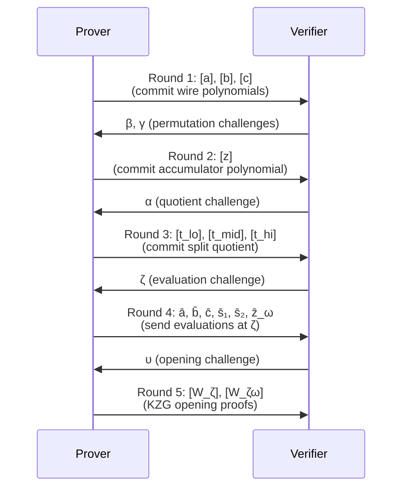

> **Prerequisites**: [[01-zk-foundations|01. ZK-SNARK Foundations]], [[02-polynomial-commitments|02. Polynomial Commitment Schemes]]  
> **Objectives**:  
> - Hiểu PLONK arithmetization: gate equations và copy constraints
> - Nắm được permutation argument — cách encode copy constraints bằng polynomial
> - Hiểu linearization trick — tại sao nó quan trọng và tại sao FFLONK cải tiến nó
> - Nắm vững PLONK prover/verifier pipeline ở mức đủ để hiểu FFLONK

---

## Motivation

KZG cho ta cách commit và mở polynomial. Nhưng làm sao biến một circuit (tập constraint) thành bài toán về polynomial? Đây là **arithmetization** — trái tim của PLONK.

PLONK (Permutations over Lagrange-bases for Oecumenical Noninteractive arguments of Knowledge, Gabizon–Williamson–Ciobotaru, 2019) là hệ SNARK **universal**: cùng một trusted setup (SRS) dùng được cho mọi circuit có kích thước $\leq d$. FFLONK kế thừa toàn bộ arithmetization của PLONK và chỉ thay đổi phần **polynomial opening**.

---

## 1. PLONK Arithmetization

### 1.1 Gate Structure

PLONK dùng **gate equation** tổng quát hơn R1CS:

> [!definition] Definition 1.1 — PLONK Gate Equation
> Mỗi gate $i$ (với $i = 0, \ldots, n-1$) thỏa mãn:
>
> $$q_L^{(i)} \cdot a_i + q_R^{(i)} \cdot b_i + q_M^{(i)} \cdot a_i b_i + q_O^{(i)} \cdot c_i + q_C^{(i)} = 0$$
>
> Trong đó:
> - $a_i, b_i, c_i \in \mathbb{F}_r$ — **wire values** (giá trị trên dây): left input, right input, output
> - $q_L, q_R, q_M, q_O, q_C \in \mathbb{F}_r$ — **selector polynomials** (hệ số cố định, encode loại gate)
>
> Ví dụ:
> - **Addition gate**: $q_L = q_R = 1$, $q_M = 0$, $q_O = -1$, $q_C = 0$ → $a + b - c = 0$
> - **Multiplication gate**: $q_L = q_R = 0$, $q_M = 1$, $q_O = -1$, $q_C = 0$ → $ab - c = 0$
> - **Constant gate**: $q_L = 1$, $q_C = -k$, rest 0 → $a = k$

### 1.2 Evaluation Domain

PLONK làm việc trên một **multiplicative subgroup** (nhóm con nhân):

> [!definition] Definition 1.2 — Evaluation Domain $H$
> Chọn $H = \{\omega^0, \omega^1, \ldots, \omega^{n-1}\}$ với $\omega$ là căn nguyên thủy bậc $n$ của đơn vị (primitive $n$-th root of unity) trong $\mathbb{F}_r$.
>
> $$\omega^n = 1 \quad \text{và} \quad \omega^k \neq 1 \text{ với } 0 < k < n$$
>
> **Vanishing polynomial** (đa thức triệt tiêu) trên $H$:
>
> $$Z_H(X) = X^n - 1 = \prod_{i=0}^{n-1}(X - \omega^i)$$
>
> $Z_H(\omega^i) = 0$ với mọi $\omega^i \in H$.

### 1.3 Polynomial Encoding của Gate Values

Các wire values được encode thành polynomial qua **Lagrange interpolation**:

> [!definition] Definition 1.3 — Wire Polynomials
> Tạo polynomials $a(X), b(X), c(X)$ sao cho:
>
> $$a(\omega^i) = a_i, \quad b(\omega^i) = b_i, \quad c(\omega^i) = c_i \quad \forall i \in [n]$$
>
> Tương tự, encode selector polynomials $q_L(X), q_R(X), q_M(X), q_O(X), q_C(X)$.
>
> **Gate equation tổng quát** trên $H$:
>
> $$q_L(X) \cdot a(X) + q_R(X) \cdot b(X) + q_M(X) \cdot a(X) b(X) + q_O(X) \cdot c(X) + q_C(X) = 0$$
>
> **cho mọi $X \in H$** — tức là đa thức trên chia hết cho $Z_H(X)$.

---

## 2. Copy Constraints và Permutation Argument

### 2.1 Vấn đề Copy Constraint

Circuit thường yêu cầu output của gate này bằng input của gate khác. Ví dụ: trong circuit $f(x) = x^2 \cdot (x + 1)$:

```text
Gate 0 (mul): a0 = x, b0 = x,  c0 = x^2
Gate 1 (mul): a1 = x, b1 = 1,  c1 = x+1     ← a1 phải = a0 (cùng là x)
Gate 2 (mul): a2 = x^2, b2 = (x+1), c2 = output ← a2 = c0, b2 = c1
```

Các ràng buộc $a0 = a1$, $c0 = a2$, $c1 = b2$ là **copy constraints** (wiring constraints). PLONK encode chúng bằng **permutation argument**.

### 2.2 Permutation Argument

> [!definition] Definition 2.1 — Permutation Argument
> Flatten tất cả wire values thành một vector:
>
> $$\mathbf{f} = (a_0, \ldots, a_{n-1},\ b_0, \ldots, b_{n-1},\ c_0, \ldots, c_{n-1})$$
>
> Copy constraints định nghĩa một **permutation** $\sigma$ trên $\{0, \ldots, 3n-1\}$: nếu wire $i$ phải bằng wire $j$, thì $\sigma(i) = j$ và $\sigma(j) = i$.
>
> **Mục tiêu**: Chứng minh vector $\mathbf{f}$ bất biến dưới $\sigma$ — tức là $f_i = f_{\sigma(i)}$ với mọi $i$.

> [!theorem] Theorem 2.2 — Permutation Check via Grand Product
> Hai multisets $\{f_i\}$ và $\{g_i\}$ bằng nhau khi và chỉ khi tích lũy (grand product) sau bằng 1:
>
> $$\prod_{i=0}^{n-1} \frac{f_i + \beta \cdot \text{id}(i) + \gamma}{f_i + \beta \cdot \sigma(\text{id}(i)) + \gamma} = 1$$
>
> với random challenges $\beta, \gamma \in \mathbb{F}_r$ từ verifier (Fiat-Shamir trong thực tế).

Prover encode grand product này thành một **accumulator polynomial** $Z(X)$:

$$Z(\omega^0) = 1, \quad Z(\omega^{i+1}) = Z(\omega^i) \cdot \frac{a(\omega^i) + \beta \cdot \omega^i + \gamma}{a(\omega^i) + \beta \cdot \sigma(\omega^i) + \gamma} \cdots$$

Constraint $Z(\omega^n) = Z(\omega^0) = 1$ được kiểm tra bằng cách verify $Z(X)$ là polynomial hợp lệ chia hết $Z_H$.

---

## 3. PLONK Prover Protocol (5 rounds)

PLONK là một **Interactive Oracle Proof (IOP)** — prover và verifier trao đổi nhiều vòng, sau đó compile thành NIZK qua Fiat-Shamir.



### 3.1 Round 1 — Wire Polynomial Commitments

Prover tính $a(X), b(X), c(X)$ (với blinding factors) và gửi commitments $[a]_1, [b]_1, [c]_1$.

### 3.2 Round 2 — Permutation Accumulator

Verifier gửi $\beta, \gamma$. Prover tính accumulator $z(X)$ và gửi $[z]_1$.

### 3.3 Round 3 — Quotient Polynomial

Verifier gửi $\alpha$. Prover tính **quotient polynomial**:

$$t(X) = \frac{1}{Z_H(X)} \Big[ \underbrace{q_L a + q_R b + q_M ab + q_O c + q_C}_{\text{gate equation}} + \alpha \cdot \underbrace{\text{permutation terms}}_{\text{copy constraints}} + \alpha^2 \cdot \underbrace{\text{accumulator check}}_{\text{Z boundary}} \Big]$$

Vì mọi polynomial trong ngoặc đều triệt tiêu trên $H$, $t(X)$ là polynomial nguyên bậc $\leq 3n+5$.

PLONK chia $t(X) = t_{lo}(X) + X^n t_{mid}(X) + X^{2n} t_{hi}(X)$ và commit ba phần.

### 3.4 Round 4 — Evaluations tại điểm ζ

Verifier gửi random $\zeta$. Prover gửi các **evaluation**:

$$\bar{a} = a(\zeta),\ \bar{b} = b(\zeta),\ \bar{c} = c(\zeta),\ \bar{s}_1 = S_{\sigma_1}(\zeta),\ \bar{s}_2 = S_{\sigma_2}(\zeta),\ \bar{z}_\omega = z(\zeta\omega)$$

### 3.5 Round 5 — KZG Opening Proofs (Linearization)

Đây là bước quan trọng nhất và là nơi FFLONK cải tiến.

> [!definition] Definition 3.1 — Linearization Trick
> Thay vì mở từng polynomial riêng, PLONK dùng **linearization**: tạo polynomial tuyến tính $r(X)$ bằng cách thay các evaluations đã biết ($\bar{a}, \bar{b}, \ldots$) vào, chỉ để nguyên $z(X)$ chưa biết:
>
> $$r(X) = q_M(\zeta)\bar{a}\bar{b} \cdot q_M(X) + \bar{a} \cdot q_L(X) + \ldots + \alpha \cdot z(X) \cdot (\ldots)$$
>
> Prover cần mở **hai điểm**: $\zeta$ (cho $r, a, b, c, s_1, s_2$) và $\zeta\omega$ (cho $z(\zeta\omega)$).
>
> Kết quả: **2 KZG proofs** $[W_\zeta]_1$ và $[W_{\zeta\omega}]_1$.

**Tại sao FFLONK cải tiến được?** Trong PLONK, verifier cần 16–18 scalar multiplications để reconstruct evaluation. FFLONK gộp nhiều polynomial lại bằng FFT-like trick, giảm xuống còn 5 — sẽ học ở Lesson 04 và 06.

---

## 4. PLONK Verifier

> [!definition] Definition 4.1 — PLONK Verifier Checks
> Verifier nhận proof $\pi = ([a]_1, [b]_1, [c]_1, [z]_1, [t_{lo}]_1, [t_{mid}]_1, [t_{hi}]_1, [W_\zeta]_1, [W_{\zeta\omega}]_1, \bar{a}, \bar{b}, \bar{c}, \bar{s}_1, \bar{s}_2, \bar{z}_\omega)$.
>
> **Bước 1**: Recompute Fiat-Shamir challenges $(\beta, \gamma, \alpha, \zeta, \upsilon)$ từ transcript.
>
> **Bước 2**: Tính $r_0$ (constant term của linearization) từ evaluations.
>
> **Bước 3**: Tính $[D]_1$ — commitment của linearization polynomial — bằng scalar multiplications.
>
> **Bước 4**: Tính $[F]_1$ và $[E]_1$ cho batch KZG check.
>
> **Bước 5**: **Pairing check** (2 pairings):
>
> $$e\!\left([W_\zeta]_1 + \upsilon [W_{\zeta\omega}]_1,\, [\tau]_2\right) \stackrel{?}{=} e\!\left(\zeta [W_\zeta]_1 + \upsilon\zeta\omega [W_{\zeta\omega}]_1 + [F]_1 - [E]_1,\, G_2\right)$$

Số lượng scalar multiplications trong Bước 3+4 là **16–18** — đây là bottleneck mà FFLONK cải tiến xuống còn 5.

---

## 5. Ví dụ đơn giản: circuit $x^2 + 5 = y$ bằng Python

```python
# PLONK arithmetization cho circuit: x^2 + 5 = y
# (minh họa concept, không phải full implementation)

# Scalar field modulus (nhỏ để demo)
r = 97  # prime field

# Circuit: Gate 0 (mul): a0=x, b0=x, c0=x^2
#          Gate 1 (add): a1=x^2, b1=5, c1=y

# Witness: x = 4
x = 4
x_sq = (x * x) % r  # = 16
y = (x_sq + 5) % r  # = 21

print(f"x = {x}, x^2 = {x_sq}, y = x^2+5 = {y}")

# Gate selectors
# Gate 0 (multiplication): qL=0, qR=0, qM=1, qO=-1, qC=0
# Check: 0*a + 0*b + 1*a*b + (-1)*c + 0 = x*x - x^2 = 0
gate0 = (0*x + 0*x + 1*x*x + (-1)*x_sq + 0) % r
print(f"Gate 0 check (should be 0): {gate0}")

# Gate 1 (addition with constant): qL=1, qR=0, qM=0, qO=-1, qC=5
# Check: 1*a + 0*b + 0*a*b + (-1)*c + 5 = x_sq + 5 - y = 0
gate1 = (1*x_sq + 0*5 + 0 + (-1)*y + 5) % r
print(f"Gate 1 check (should be 0): {gate1}")

# Copy constraint: c0 (= x^2) phải bằng a1 (= x^2)
# Trong PLONK, permutation sigma hoán đổi index c0 <-> a1
print(f"\nCopy constraint satisfied: c0={x_sq} == a1={x_sq}: {x_sq == x_sq}")

# Evaluation domain H với n=2 (2 gates)
# omega = primitive 2nd root of unity mod r
# omega^2 = 1 mod r => omega = r-1 (= -1 mod r) nếu n=2
omega = r - 1
print(f"\nomega (primitive 2nd root of unity mod {r}) = {omega}")
print(f"omega^2 mod {r} = {pow(omega, 2, r)}")

# Vanishing polynomial Z_H(X) = X^2 - 1
# Z_H(omega^0) = 1 - 1 = 0 ✓
# Z_H(omega^1) = (r-1)^2 - 1 = 1 - 1 = 0 ✓
for i in [0, 1]:
    zH = (pow(omega, 2*i, r) - 1) % r
    print(f"Z_H(omega^{i}) = {zH}")

# Lagrange interpolation: a(X) sao cho a(1)=x=4 và a(omega)=x_sq=16
# a(X) = L0(X)*4 + L1(X)*16
# L0(X) = (X - omega)/(1 - omega), L1(X) = (X - 1)/(omega - 1)

def lagrange_interp(points, r):
    """Tính polynomial nội suy Lagrange, trả về coefficients"""
    n = len(points)
    # points = [(x0,y0), (x1,y1), ...]
    # Simplified: chỉ minh họa evaluation tại điểm test
    def eval_at(t):
        result = 0
        for i, (xi, yi) in enumerate(points):
            num, den = 1, 1
            for j, (xj, _) in enumerate(points):
                if i != j:
                    num = (num * (t - xj)) % r
                    den = (den * (xi - xj)) % r
            result = (result + yi * num * pow(den, r-2, r)) % r
        return result
    return eval_at

a_poly = lagrange_interp([(1, x), (omega, x_sq)], r)
print(f"\na(1) = {a_poly(1)} (should be x={x})")
print(f"a(omega) = {a_poly(omega)} (should be x_sq={x_sq})")
```

---

## 6. PLONK vs FFLONK — Preview

PLONK Verifier cần compute:

$$[D]_1 = \bar{a}\bar{b} \cdot [q_M]_1 + \bar{a} \cdot [q_L]_1 + \bar{b} \cdot [q_R]_1 + \bar{c} \cdot [q_O]_1 + [q_C]_1 + \alpha \cdot [\ldots]_1 + \ldots$$

Đây là **16–18 scalar multiplications** chỉ để rebuild commitment.

FFLONK loại bỏ bước này bằng cách dùng **polynomial combining** — thay vì mở $d$ polynomials riêng tại điểm $\zeta$, FFLONK kết hợp chúng thành một polynomial và mở tại $d$ điểm tất cả cùng lúc. Verifier không cần rebuild $[D]_1$ từ nhiều commitments nữa.

---

## Summary

- **PLONK arithmetization** encode circuit thành gate equations trên domain $H$ và copy constraints thành permutation argument.
- **Gate equation**: $q_L a + q_R b + q_M ab + q_O c + q_C = 0$ trên mỗi row.
- **Permutation argument** dùng grand product để chứng minh copy constraints — encode thành accumulator polynomial $z(X)$.
- **Quotient polynomial** $t(X)$ encode toàn bộ constraint check; bị split thành 3 phần để giữ degree thấp.
- **Linearization trick**: tạo $r(X)$ để giảm số KZG openings cần thiết.
- **PLONK verifier**: 2 pairings + 16–18 scalar muls — FFLONK sẽ giảm xuống 5.

---

## References

- Gabizon, Williamson & Ciobotaru — *PLONK: Permutations over Lagrange-bases for Oecumenical Noninteractive arguments of Knowledge* (IACR 2019/953)
- Vitalik Buterin — *Understanding PLONK* (vitalik.ca/general/2019/09/22/plonk.html)
- metastate — *plonk-by-hand series* (metastate.dev)
- Gabizon & Williamson — *fflonk* (IACR 2021/1167) — Sections 1–2
