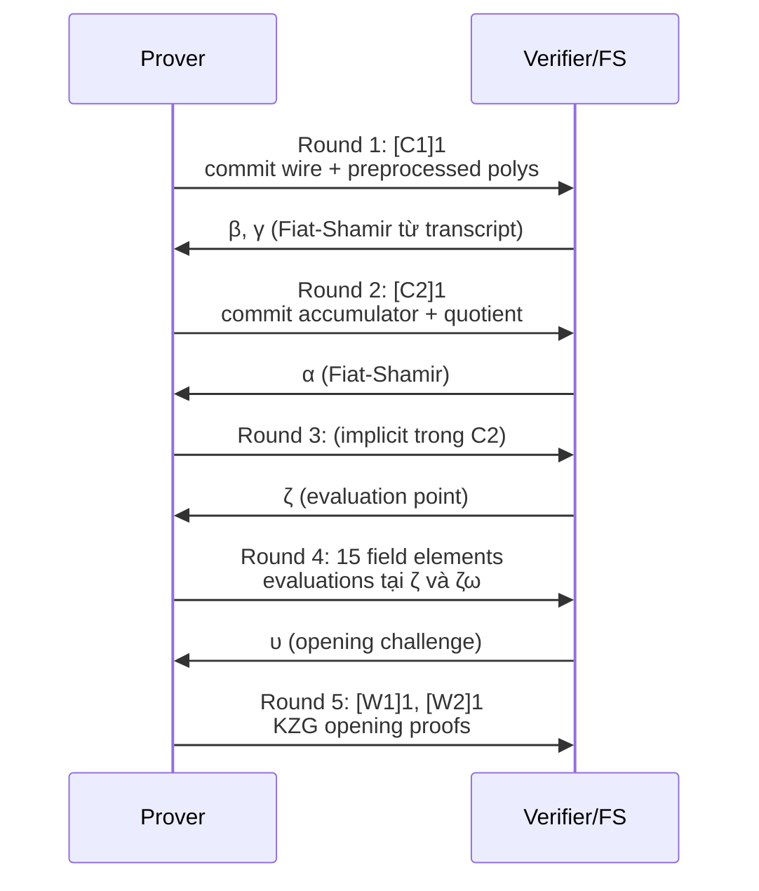

> **Prerequisites**: [[03-plonk|03. PLONK Protocol]], [[04-fflonk-core|04. FFLONK Core Idea]]  
> **Objectives**:  
> - Nắm vững 5 round của FFLONK prover: mỗi round làm gì, output là gì
> - Hiểu cách PLONK polynomials được nhóm và combined trong FFLONK
> - Nắm cấu trúc proof 768 bytes (24 field elements)
> - Hiểu các blinding factors và tại sao chúng cần thiết cho zero-knowledge
> - Biết đủ để đọc và audit Rust implementation trong `zkVerify/fflonk_verifier`

---

## Motivation

FFLONK prover kế thừa toàn bộ arithmetization của PLONK (gate equations, permutation argument, quotient polynomial). Điểm khác biệt nằm ở **Round cuối**: thay vì gửi 9 commitments riêng lẻ rồi để verifier combine, FFLONK prover gom các polynomials vào **2 combined polynomials** $C_0$ và $C_1$, commit và mở chúng hiệu quả hơn.

Kết quả: proof chỉ có **9 $\mathbb{G}_1$ commitments + 15 field elements** — tổng 24 elements = 768 bytes.

---

## 1. Tổng quan Proof Structure

> [!definition] Definition 1.1 — FFLONK Proof Format
> Proof $\pi$ gồm 24 elements, mỗi element 32 bytes (BN254 field element hoặc compressed $\mathbb{G}_1$ point):
>
> **9 Commitments** (điểm $\mathbb{G}_1$, 32 bytes mỗi cái):
> 1. $[C_1]_1$ — commitment của $C_1(X)$ (wire polys + permutation)
> 2. $[C_2]_1$ — commitment của $C_2(X)$ (quotient + accumulator)
> 3. $[W_1]_1$ — KZG opening proof tại $\zeta$
> 4. $[W_2]_1$ — KZG opening proof tại $\zeta\omega$
>
> *Cộng thêm các commitments khác từ public setup*
>
> **15 Field Elements** ($\mathbb{F}_r$, 32 bytes mỗi cái):
> Evaluations của các polynomials tại $\zeta$ và $\zeta\omega$

**Note**: Trong implementation của Polygon/zkVerify, proof có đúng 24 big-endian uint256 values, serialized thành 768 bytes.

---

## 2. Setup: Polynomials trong FFLONK-PlonK

### 2.1 Các polynomials prover cần tính

Trước khi mô tả các rounds, cần hiểu các polynomial player:

**Preprocessed polynomials** (từ circuit — cố định, trong VK):
- $q_L(X), q_R(X), q_M(X), q_O(X), q_C(X)$ — selector polynomials (5 polys)
- $S_{\sigma_1}(X), S_{\sigma_2}(X), S_{\sigma_3}(X)$ — permutation polynomials (3 polys)

**Prover polynomials** (tính từ witness):
- $a(X), b(X), c(X)$ — wire polynomials (3 polys)
- $z(X)$ — permutation accumulator (1 poly)
- $t_{lo}(X), t_{mid}(X), t_{hi}(X)$ — quotient polynomial parts (3 polys)

### 2.2 Nhóm polynomials cho FFLONK combining

FFLONK-PlonK nhóm các polynomials thành **2 nhóm** dựa trên điểm evaluation:

> [!definition] Definition 2.1 — FFLONK Polynomial Groups
>
> **Nhóm 1** — mở tại $\{\zeta, \zeta\omega, \zeta\omega^2\}$ (3 điểm, $t=3$):
> - $C_1(X) = \text{combined}(a, b, c, S_{\sigma_1}, S_{\sigma_2}, \text{ql}, \text{qr}, \text{qm}, \text{qo}, \text{qc})$
>
> **Nhóm 2** — mở tại $\{\zeta, \zeta\omega\}$ (2 điểm, $t=2$):
> - $C_2(X) = \text{combined}(z, t_{lo}, t_{mid}, t_{hi}, \text{linearization terms})$

Cụ thể hơn, cách combining tương ứng Definition 2.1 của Lesson 04:

$$C_1(X) = a(X^9) + X \cdot b(X^9) + X^2 \cdot c(X^9) + X^3 \cdot S_{\sigma_1}(X^9) + \ldots$$

(Với $t = 9$ trong implementation thực tế của Polygon để nhóm tất cả polynomials lại)

---

## 3. FFLONK Prover: 5 Rounds



### 3.1 Round 1 — Wire Polynomial Commitment

**Input**: Witness assignment $(a_i, b_i, c_i)_{i=0}^{n-1}$

**Quá trình**:

1. Tính $a(X), b(X), c(X)$ qua Lagrange interpolation trên $H$ (thêm blinding factors)
2. **FFLONK khác PLONK**: không commit riêng $[a]_1, [b]_1, [c]_1$ mà combine chúng vào $C_1(X)$
3. Commit $[C_1]_1 = [C_1(\tau)]_1$

> [!definition] Definition 3.1 — Blinding Factors
> Để đảm bảo **zero-knowledge** (hiding), prover thêm random terms vào mỗi wire polynomial:
>
> $$a_{\text{blind}}(X) = a(X) + (b_{a,1} X + b_{a,0}) \cdot Z_H(X)$$
>
> Terms $b_{a,1} X + b_{a,0}$ vanish trên $H$ (vì $Z_H(\omega^i) = 0$), nên không ảnh hưởng constraint satisfaction, nhưng làm commitment không lộ thông tin về $a$.

**Output Round 1**: $[C_1]_1 \in \mathbb{G}_1$

### 3.2 Round 2 — Permutation Accumulator + Quotient

**Input**: Challenges $\beta, \gamma$ từ Fiat-Shamir(transcript, $[C_1]_1$)

**Quá trình**:

1. Tính **accumulator polynomial** $z(X)$:

$$z(\omega^0) = 1$$
$$z(\omega^{i+1}) = z(\omega^i) \cdot \frac{(a_i + \beta\omega^i + \gamma)(b_i + \beta k_1\omega^i + \gamma)(c_i + \beta k_2\omega^i + \gamma)}{(a_i + \beta S_{\sigma_1}(\omega^i) + \gamma)(b_i + \beta S_{\sigma_2}(\omega^i) + \gamma)(c_i + \beta S_{\sigma_3}(\omega^i) + \gamma)}$$

trong đó $k_1, k_2$ là coset shifts (thường $k_1 = 2, k_2 = 3$).

2. Thêm challenge $\alpha$ (Fiat-Shamir), tính **quotient polynomial**:

$$t(X) = \frac{1}{Z_H(X)}\Big[q_L a + q_R b + q_M ab + q_O c + q_C + \alpha \cdot \text{perm\_num}(X) + \alpha^2 \cdot (z(X)-1) L_1(X)\Big]$$

($L_1$ là Lagrange basis polynomial thỏa $L_1(\omega^0) = 1$, $L_1(\omega^i) = 0$ với $i > 0$)

3. Combine $z, t_{lo}, t_{mid}, t_{hi}$ vào $C_2(X)$ và commit.

**Output Round 2**: $[C_2]_1 \in \mathbb{G}_1$

### 3.3 Round 3 — Evaluation Challenge

Verifier (Fiat-Shamir) gửi evaluation point $\zeta \in \mathbb{F}_r$.

### 3.4 Round 4 — Evaluations

**Prover tính và gửi** các evaluation tại $\zeta$ và $\zeta\omega$:

> [!definition] Definition 3.2 — FFLONK Evaluations (Round 4)
>
> Tại điểm $\zeta$:
> - $\bar{a} = a(\zeta)$, $\bar{b} = b(\zeta)$, $\bar{c} = c(\zeta)$
> - $\bar{s}_1 = S_{\sigma_1}(\zeta)$, $\bar{s}_2 = S_{\sigma_2}(\zeta)$
> - $\bar{t} = t(\zeta)$ (giá trị quotient polynomial)
>
> Tại điểm $\zeta\omega$:
> - $\bar{z}_\omega = z(\zeta\omega)$ (accumulator tại điểm shift)
>
> Các evaluations của selector polynomials ($q_L, q_R, \ldots$) ở trong VK (từ preprocessing).

**Tổng cộng**: 15 field elements (các evaluations cụ thể tùy implementation).

### 3.5 Round 5 — Opening Proofs

**Input**: Challenge $\upsilon$ từ Fiat-Shamir(transcript + evaluations)

**Đây là bước FFLONK khác biệt hoàn toàn so với PLONK.**

FFLONK dùng **SHPLONK multi-point opening**. Thay vì 2 KZG proofs riêng lẻ như PLONK, prover:

1. Tính **batched opening** cho tất cả polynomials trong nhóm tại mỗi điểm
2. Combine thành **2 final proofs** $[W_1]_1$ và $[W_2]_1$

> [!definition] Definition 3.3 — FFLONK Opening Proofs
>
> **$[W_1]_1$**: Chứng minh evaluations của $C_1$ tại các điểm trong nhóm 1
>
> $$W_1(X) = \frac{C_1(X) - r_1(X)}{\prod_{j} (X - z_j)}$$
>
> trong đó $r_1(X)$ là polynomial nội suy qua các evaluation points, và mẫu số là vanishing polynomial của tập điểm opening.
>
> **$[W_2]_1$**: Tương tự cho $C_2$ tại các điểm trong nhóm 2.

**Output Round 5**: $([W_1]_1, [W_2]_1) \in \mathbb{G}_1^2$

---

## 4. Proof Structure đầy đủ trong zkVerify

Từ code `zkVerify/fflonk_verifier`, proof là **768 bytes = 24 × 32 bytes** big-endian uint256, theo thứ tự:

> [!definition] Definition 4.1 — 24-Element Proof Layout
>
> ```text
> Index  Content                   Type
> ─────────────────────────────────────────
>  0-1   C1 point (x, y)           G1 point
>  2-3   C2 point (x, y)           G1 point
>  4     W1_x coordinate           G1 x-coord
>  5     W1_y coordinate           G1 y-coord
>  6     W2_x coordinate           G1 x-coord
>  7     W2_y coordinate           G1 y-coord
>  8     eval_ql                   Fr element
>  9     eval_qr                   Fr element
> 10     eval_qm                   Fr element
> 11     eval_qo                   Fr element
> 12     eval_qc                   Fr element
> 13     eval_s1                   Fr element
> 14     eval_s2                   Fr element
> 15     eval_s3 (= eval_s_sigma3) Fr element
> 16     eval_a                    Fr element
> 17     eval_b                    Fr element
> 18     eval_c                    Fr element
> 19     eval_z_omega              Fr element
> 20     eval_t1w                  Fr element
> 21     eval_t2w                  Fr element
> 22     eval_inv_zeta_minus_1     Fr element (aux)
> 23     (reserved/padding)        Fr element
> ─────────────────────────────────────────
> Total: 24 × 32 = 768 bytes
> ```

**Note**: Index đúng của từng field phụ thuộc vào implementation cụ thể. Xem `src/lib.rs` trong `zkVerify/fflonk_verifier` để biết chính xác.

---

## 5. Verification Key (VK) Structure

VK chứa thông tin từ preprocessing (circuit-specific) và trusted setup. Từ `zkVerify/fflonk_verifier`:

> [!definition] Definition 5.1 — Verification Key Fields
>
> ```text
> n           : circuit size (number of gates)
> power       : log2(n)
> k1, k2      : coset shift factors
> Qm, Ql, Qr, Qo, Qcp : commitments [qi(tau)]_1
> S1, S2, S3  : commitments [S_sigma_i(tau)]_1
> X_2         : [tau]_2 (từ SRS)
> omega       : primitive n-th root of unity
> ```
>
> VK định nghĩa **circuit cụ thể** đang được verify. Sai VK → chấp nhận proof sai circuit.

---

## 6. Tại sao prover tốn gấp 3 lần PLONK?

Từ Table 2 của paper (Gabizon & Williamson 2021):

| | PLONK (BDFG) | FFLONK |
|---|---|---|
| Prover $\mathbb{G}_1$ ops | $11n$ | $35n$ |
| Proof length | $7 \mathbb{G}_1 + 7 \mathbb{F}$ | $4 \mathbb{G}_1 + 15 \mathbb{F}$ |
| Verifier $\mathbb{G}_1$ ops | $16 + 2P$ | **$5 + 2P$** |

Prover tốn nhiều hơn vì phải:
1. Compute combined polynomial $C(X)$ bậc cao hơn nhiều lần
2. Compute FFTs nhiều hơn cho combining
3. Compute SHPLONK opening — phức tạp hơn linear combination đơn giản

---

## 7. Code: Prover Steps (Simplified Python Demo)

```python
# Simplified FFLONK prover skeleton
# Minh họa flow, không phải full implementation

import hashlib

def fiat_shamir(*elements):
    """Fiat-Shamir hash: hash các elements thành field element"""
    p = 101  # demo field
    h = hashlib.sha256()
    for e in elements:
        h.update(str(e).encode())
    return int(h.hexdigest(), 16) % p

def poly_eval(coeffs, x, mod):
    return sum(c * pow(x, i, mod) for i, c in enumerate(coeffs)) % mod

# === Simplified FFLONK Prover Flow ===
p = 101  # demo prime (không dùng trong thực tế)
n = 4    # circuit size

# Witness (demo)
witness_a = [2, 3, 5, 7]   # left wire values
witness_b = [1, 2, 3, 4]   # right wire values
witness_c = [v*w % p for v,w in zip(witness_a, witness_b)]  # output: a*b

print("=== Circuit: c = a * b ===")
print(f"a: {witness_a}")
print(f"b: {witness_b}")
print(f"c: {witness_c}")

# Round 1: Commit wire polynomials (simplified: just hash as placeholder)
# Trong thực tế: interpolate, blind, commit to G1
commit_C1 = fiat_shamir("C1", witness_a, witness_b, witness_c)
print(f"\nRound 1: [C1] commitment = {commit_C1}")

# Round 2: Fiat-Shamir challenges beta, gamma
beta  = fiat_shamir("beta",  commit_C1)
gamma = fiat_shamir("gamma", commit_C1, beta)
print(f"Challenges: beta={beta}, gamma={gamma}")

# Compute accumulator z (Grand Product)
# z[0] = 1
# z[i+1] = z[i] * num/den where num,den use beta,gamma,sigma
z_acc = [1] * (n + 1)
for i in range(n):
    ai, bi, ci = witness_a[i], witness_b[i], witness_c[i]
    # Simplified: using identity permutation for demo
    num = ((ai + beta * (i+1) + gamma) *
           (bi + beta * (n + i + 1) + gamma) *
           (ci + beta * (2*n + i + 1) + gamma)) % p
    den = ((ai + beta * (i+1) + gamma) *
           (bi + beta * (i+1) + gamma) *
           (ci + beta * (i+1) + gamma)) % p
    z_acc[i+1] = z_acc[i] * num % p * pow(den, p-2, p) % p

print(f"Accumulator z: {z_acc}")
print(f"z[n] = z[0]? {z_acc[n] == z_acc[0]}")  # Boundary check

# Round 2 commit (placeholder)
alpha = fiat_shamir("alpha", commit_C1, beta, gamma)
commit_C2 = fiat_shamir("C2", z_acc, alpha)
print(f"\nRound 2: [C2] commitment = {commit_C2}")

# Round 3: evaluation point zeta
zeta = fiat_shamir("zeta", commit_C1, commit_C2)
print(f"\nRound 3: zeta = {zeta}")

# Round 4: evaluations at zeta (simplified)
# Trong thực tế: evaluate wire polynomials at zeta
eval_a = poly_eval(witness_a, zeta, p)
eval_b = poly_eval(witness_b, zeta, p)
eval_c = poly_eval(witness_c, zeta, p)
eval_z_omega = poly_eval(z_acc, (zeta * 2) % p, p)  # z at zeta*omega
print(f"\nRound 4 evaluations: a={eval_a}, b={eval_b}, c={eval_c}")
print(f"z(zeta*omega) = {eval_z_omega}")

# Round 5: opening challenge
upsilon = fiat_shamir("upsilon", eval_a, eval_b, eval_c)
# W1, W2 would be computed here (requires full poly + KZG commit)
print(f"\nRound 5: upsilon = {upsilon}")
print("(W1, W2 require full G1 arithmetic - see fflonk_verifier Rust crate)")
print("\nProver flow complete ✓")
```

---

## 8. Ý nghĩa cho Bug Hunting

> [!danger] Bug Class: Blinding Factor bị thiếu
> Nếu wire polynomials không được blind (bỏ bước thêm $Z_H(X)$ terms), prover leak thông tin về witness. Verifier (hoặc observer) có thể reconstruct $a(\zeta), b(\zeta), c(\zeta)$ và từ đó infer giá trị secret.
>
> Trong Rust: kiểm tra `a(X)` có được cộng thêm `blinding_poly * Z_H(X)` không.

> [!danger] Bug Class: Accumulator Boundary Check
> $z(\omega^0)$ phải bằng $1$ và $z(\omega^n) = z(\omega^0) = 1$. Nếu prover tính sai $z$ (ví dụ: off-by-one trong loop), constraint này fail nhưng prover có thể forge quotient polynomial để bù lại — tạo proof cho circuit không thỏa mãn.

> [!danger] Bug Class: Fiat-Shamir Transcript Không Đầy Đủ
> Nếu bất kỳ commitment nào bị bỏ sót khỏi transcript khi hash (tính challenges), attacker có thể tìm commitment thỏa mãn challenge mong muốn. Cụ thể với FFLONK: nếu $[C_1]_1$ không được include khi hash $\beta$, attacker có thể choose $[C_1]_1$ sau khi biết $\beta$. Đây là **Last Challenge Attack** (sẽ học ở Lesson 08).

---

## Summary

- **FFLONK prover** kế thừa PLONK nhưng combine polynomials vào $C_1, C_2$ trước khi commit.
- **5 rounds**: Commit $C_1$ → challenges $\beta, \gamma$ → commit $C_2$ → challenge $\alpha$ → evaluations tại $\zeta$ → challenge $\upsilon$ → KZG opening proofs $W_1, W_2$.
- **Proof = 24 field elements = 768 bytes**: 9 $\mathbb{G}_1$ points + 15 $\mathbb{F}_r$ elements.
- **Blinding factors** đảm bảo zero-knowledge; thiếu blinding = lộ witness.
- **Accumulator $z$** phải thỏa boundary $z(\omega^0) = z(\omega^n) = 1$.
- **Transcript binding đầy đủ** trong Fiat-Shamir là điều kiện bắt buộc cho soundness.

---

## References

- Gabizon & Williamson — *fflonk*, IACR 2021/1167, Section 7 (Application to PlonK)
- Polygon zkEVM — *fflonk verifier* Solidity (github.com/0xPolygonHermez/zkevm-contracts)
- zkVerify — *fflonk_verifier* Rust (github.com/zkVerify/fflonk_verifier)
- Gabizon, Williamson & Ciobotaru — *PLONK*, IACR 2019/953, Section 8 (Prover Algorithm)
