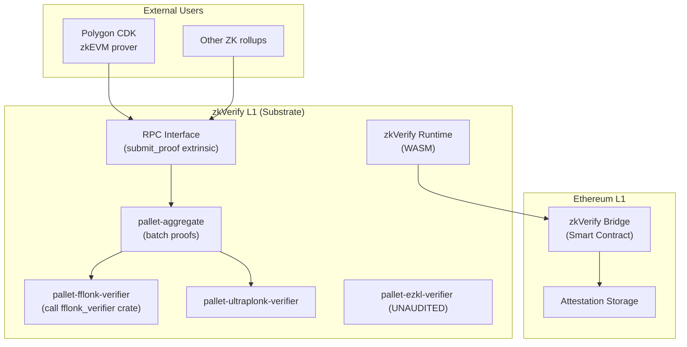

> **Prerequisites**: [[06-fflonk-verifier|06. FFLONK Verifier Algorithm]], [[09-security-analysis|09. Security Analysis]]  
> **Objectives**:  
> - Nắm architecture của zkVerify: Substrate blockchain, pallet system, proof flow
> - Hiểu cấu trúc Rust crate `fflonk_verifier` và `pallet-fflonk-verifier`
> - Biết cách đọc và navigate code để tìm verification logic
> - Có đủ context để bắt đầu audit cho bug bounty

---

## 1. zkVerify Architecture Overview

zkVerify là **L1 blockchain** chuyên dụng cho ZK proof verification, xây dựng trên **Substrate** (Rust framework của Polkadot).



**Key fact**: zkVerify mainnet đã live từ tháng 9/2025. Proofs được verify on-chain → attestation được published lên Ethereum → L2 bridge dùng attestation để verify funds.

---

## 2. Repository Structure

### 2.1 `fflonk_verifier` crate (core logic)

```text
github.com/zkVerify/fflonk_verifier
├── src/
│   ├── lib.rs              ← Entry: verify(vk, proof, pubs)
│   ├── verifier.rs         ← Core verification steps
│   ├── key.rs              ← VerificationKey struct
│   ├── proof.rs            ← Proof deserialization + range checks
│   ├── transcript.rs       ← Fiat-Shamir transcript
│   ├── field.rs            ← Fr field operations
│   └── pairing.rs          ← BN254 pairing check
├── tests/
│   └── integration.rs      ← Test vectors from Polygon
└── benches/
    └── verify.rs           ← Performance benchmarks
```

### 2.2 `pallet-fflonk-verifier` (Substrate integration)

```text
github.com/zkVerify/zkVerify/pallets/fflonk/
├── src/
│   ├── lib.rs              ← Pallet definition, extrinsics
│   ├── weight.rs           ← Weight computation (gas analogue)
│   └── benchmarking.rs     ← Benchmark for weight
└── Cargo.toml
```

---

## 3. Proof Submission Flow

```mermaid
sequenceDiagram
    participant User
    participant RPC as zkVerify RPC
    participant PA as pallet-aggregate
    participant PF as pallet-fflonk
    participant FC as fflonk_verifier crate
    participant ETH as Ethereum

    User->>RPC: submit_proof(proof: [u8; 768], pubs: [u8; 32])
    RPC->>PA: dispatch extrinsic
    PA->>PF: verify_proof(vk, proof, pubs)
    PF->>FC: verify(&vk, &proof, &pubs)
    FC->>FC: 1. Deserialize + range check
    FC->>FC: 2. Fiat-Shamir challenges
    FC->>FC: 3. Algebraic constraint checks
    FC->>FC: 4. Rebuild F, E points
    FC->>FC: 5. Pairing check
    FC-->>PF: Ok(()) or Err(VerifyError)
    PF-->>PA: verified
    PA->>PA: Batch attestation
    PA->>ETH: publish_attestation(merkle_root)
```

---

## 4. Key Rust Types và API

> [!definition] Definition 4.1 — Core Types
>
> ```rust
> // From fflonk_verifier/src/lib.rs
>
> pub struct VerificationKey {
>     pub power: u8,           // log2(n), circuit size = 2^power
>     pub k1: Fr,              // coset shift k1
>     pub k2: Fr,              // coset shift k2
>     pub qm: G1Affine,        // [qM(tau)]_1
>     pub ql: G1Affine,        // [qL(tau)]_1
>     pub qr: G1Affine,        // [qR(tau)]_1
>     pub qo: G1Affine,        // [qO(tau)]_1
>     pub qc: G1Affine,        // [qC(tau)]_1
>     pub s1: G1Affine,        // [S_sigma1(tau)]_1
>     pub s2: G1Affine,        // [S_sigma2(tau)]_1
>     pub s3: G1Affine,        // [S_sigma3(tau)]_1
>     pub x2: G2Affine,        // [tau]_2 (from SRS)
>     pub omega: Fr,           // primitive n-th root of unity
> }
>
> pub struct Proof {
>     pub c1: G1Affine,        // Combined commitment C1
>     pub c2: G1Affine,        // Combined commitment C2
>     pub w1: G1Affine,        // KZG opening proof W1
>     pub w2: G1Affine,        // KZG opening proof W2
>     pub eval_ql: Fr,         // qL(zeta)
>     pub eval_qr: Fr,         // qR(zeta)
>     pub eval_qm: Fr,         // qM(zeta)
>     pub eval_qo: Fr,         // qO(zeta)
>     pub eval_qc: Fr,         // qC(zeta)
>     pub eval_s1: Fr,         // S_sigma1(zeta)
>     pub eval_s2: Fr,         // S_sigma2(zeta)
>     pub eval_s3: Fr,         // S_sigma3(zeta)
>     pub eval_a: Fr,          // a(zeta)
>     pub eval_b: Fr,          // b(zeta)
>     pub eval_c: Fr,          // c(zeta)
>     pub eval_z_omega: Fr,    // z(zeta*omega)
>     pub eval_t1w: Fr,        // t1(zeta*omega)
>     pub eval_t2w: Fr,        // t2(zeta*omega)
>     pub eval_inv: Fr,        // auxiliary inverse field element
> }
>
> pub fn verify(
>     vk: &VerificationKey,
>     proof: &Proof,
>     public_inputs: &[u8; 32],
> ) -> Result<(), VerifyError>
> ```

---

## 5. Audit Guide: Đọc Code theo Step

### 5.1 Bắt đầu từ `lib.rs`

```rust
// Pattern đọc code: follow verify() function
pub fn verify(vk: &VerificationKey, proof: &Proof, pubs: &PublicInput)
    -> Result<(), VerifyError>
{
    // Step 1: xem field/subgroup checks ở đây
    check_proof_points(proof)?;       // ← LOOK: is_in_subgroup called?
    
    // Step 2: Fiat-Shamir
    let challenges = compute_challenges(vk, proof, pubs)?;  // ← LOOK: transcript completeness
    
    // Step 3: algebraic checks  
    check_algebraic(proof, &challenges, vk)?;
    
    // Step 4-5: pairing
    check_pairing(proof, &challenges, vk)   // ← LOOK: pairing equation
}
```

### 5.2 Checklist Code Review

```python
# Audit checklist dưới dạng questions
audit_questions = {
    "Q1": "is_in_correct_subgroup_assuming_on_curve() được gọi cho C1, C2, W1, W2?",
    "Q2": "Proof fields range-checked < r (scalar field order)?",
    "Q3": "G1 point at infinity (is_zero()) được reject không?",
    "Q4": "vk.x2 (G2 from SRS) được validate không?",
    "Q5": "pub_input được hash vào transcript trước β?",
    "Q6": "C1 (cả x,y) được hash trước β và γ?",
    "Q7": "C2 được hash trước α?",
    "Q8": "TẤT CẢ 15 evaluations được hash trước υ?",
    "Q9": "Z_H(ζ) != 0 được check không?",
    "Q10": "L1(ζ) tính đúng công thức: (ζ^n-1)/(n*(ζ-1))?",
    "Q11": "Pairing equation dùng đúng vk.x2 từ SRS?",
    "Q12": "Fr arithmetic dùng checked_add/checked_mul, không phải wrapping?",
    "Q13": "VK default() có phải VK của Polygon CDK circuit không?",
    "Q14": "Proof deserialization check đúng byte order (big-endian)?",
}

print("=== FFLONK Audit Checklist ===")
for q, text in audit_questions.items():
    print(f"[ ] {q}: {text}")
```

---

## 6. Weight System (Substrate Gas Analogue)

Trong Substrate, mỗi extrinsic có **weight** — giới hạn computational cost. Nếu weight bị tính sai:

> [!danger] Bug Class — Weight Underestimation
> Nếu `pallet-fflonk-verifier` khai báo weight thấp hơn thực tế:
> - Attacker có thể submit nhiều proofs trong một block → block time tăng → network DoS
> - Block production slows down → L2 attestations delayed → liveness failure
>
> **Check**: `weight.rs` phải reflect thực tế pairing cost (~2 pairings × ~1ms mỗi = ~2ms) trong ref hardware.

---

## 7. Default VK và Test Vectors

zkVerify dùng VK cố định từ **Polygon CDK fork-id 6**:

```rust
// Từ VerificationKey::default() trong lib.rs
// Values hardcoded từ:
// https://github.com/0xPolygon/cdk-validium-contracts/blob/...FflonkVerifier.sol

impl Default for VerificationKey {
    fn default() -> Self {
        // n = 2^24 = 16,777,216 gates
        // power = 24
        // Các giá trị G1Affine được hardcode từ Polygon ceremony
        ...
    }
}
```

**Test vector từ README**:
```text
Proof (hex): 283e3f25323d02...0fdf8244018ce57b...
Public input: 0d69b94acdfaca5bacc248a60b35b925a2374644ce0c1205db68228c8921d9d9
Expected: verify OK
```

Dùng test vector này để verify implementation của mình:

```python
# Verify test vector parsing (không chạy actual BN254 pairing)
# Polygon CDK FFLONK proof: 768 bytes = 24 × 32 bytes (big-endian uint256)
proof_hex = (
    "283e3f25323d02dabdb94a897dc2697a3b930d8781381ec574af89a201a91d5a"  # C1.x
    "2c2808c59f5c736ff728eedfea58effc2443722e78b2eb4e6759a278e9246d60"  # C1.y
    "5f5898af6a7effea51620d22e4fdd5d8a5800e29a74c94b1ff9b9609276f2bbd"  # C2.x
    "dac5dab5abe967981fe71bdd1d5521cdbcdff3dd1c002d633f01060ba5446ad3"  # C2.y
    "42907b8abbe4ccdc95b8d163d3b6ad080e91ebf9fa5d9b7890f97de8a9e2c6be"  # W1.x
    "583baf106006ab9231212f8397efaaf2b39d11619abe63efbab93e0a49b46cf6"  # W1.y
    "d4ed5fb06315c1bbe74844fbeb4d9ba66d66d29d4493f219a39416fcc3284b38"  # W2.x
    "2abb6c9223dcb3699a9ffea1dbb3fadc0c23aa0cae01b4c3d104f267a3072bdb"  # W2.y
    "c241ec9da1bdc76460bdeff49ecfb32de11f5cbf60a40f7fa2cb1562bc7378dc"  # a(ζ)
    "8b8110303cbabf7f4088dea10c6bbb2aa487885f73fdaaa80cf640586afe9560"  # b(ζ)
    "05b51f47a98f9fd9d2437f747a908522900f62a9d747e7f4e3c6418bfb55ec2b"  # c(ζ)
    "0a5e6b09340b7e3dcfc740ea34f5a3ce26ecc798518eb6f919081f1433e64b6f"  # s1(ζ)
    "9fa0255657250956d95e62038d5092d52211dee00d4c1c548bb66c44b468a0fa"  # s2(ζ)
    "b5418b554cca5b8779d03df8eb716443e9543bb261b1a8a382c46e6a6a8151b7"  # a(ζω)
    "b1df66074dddebf3efa029481204f18e1cd9db11c64435587dab63eaabfa3093"  # b(ζω)
    "32f319c2fb8400959ad18d95e63b090b69e8af39f91a9efce76d2263d6fef792"  # c(ζω)
    "a2b5a44b9889c8eeba5354a253867fd8451ee4ae0ddd51380b7c75973e272e34"  # z(ζω)
    "e75cb45db24498d661a912035cf0553dec1716ee06192d98461e6729a880ed1a"  # t1(ζ)
    "e2f0e113e9f5a2c6e6215dd8eea0f3cb6ac48557bad566d3f908128155f93c91"  # t2(ζ)
    "36437d673566b3162cf65512ab1e1c7179b839c1ae71610ecf1573e85ce9f36c"  # t3(ζ)
    "fd542f37c0baeed5ee2f22996a5647af630f4062b1977ffaff54a628c5a0ae27"  # ql(ζ)
    "6900c3e6908e35ecec792b586e13466623a6eb63d783c09b9dd1d286a621d589"  # qr(ζ)
    "d8a5c0b2cba8ec878e66fb319eee8b862ad27c2c14067cc24e348d67e8066270"  # qm(ζ)
    "86d0f1220ece409541ccd9458ca620c5db63b6f2002edb3dc118cebf9d605d15"  # qo(ζ)
)

pubs_hex = "0d69b94acdfaca5bacc248a60b35b925a2374644ce0c1205db68228c8921d9d9"

# Parse proof as 24 big-endian uint256
proof_bytes = bytes.fromhex(proof_hex)
n_elements = len(proof_bytes) // 32
print(f"Proof: {len(proof_bytes)} bytes = {n_elements} elements")
assert n_elements == 24, f"Expected 24 elements, got {n_elements}"

# First element is C1.x
c1_x = int.from_bytes(proof_bytes[:32], 'big')
print(f"C1.x = 0x{c1_x:064x}")

p = 0x30644e72e131a029b85045b68181585d97816a916871ca8d3c208c16d87cfd47
r = 0x30644e72e131a029b85045b68181585d2833e84879b9709143e1f593f0000001

pubs = int.from_bytes(bytes.fromhex(pubs_hex), 'big')
print(f"public_input = 0x{pubs:064x}")
print(f"public_input < r: {pubs < r}")
print("Proof parsing verified ✓")
```

---

## 8. Tương tác với Immunefi Scope

> [!definition] Definition 8.1 — Immunefi Scope cho zkVerify
>
> Theo Immunefi listing (2025–2026):
> - **Max reward**: $50,000 (Critical)
> - **Min reward**: $15,000 (Critical, low impact)
> - **In scope**: pallet-fflonk-verifier, fflonk_verifier crate, pallet-aggregate, zkVerify runtime
> - **Out of scope**: third-party dependencies, known issues, off-chain infrastructure
>
> **PoC required**: tất cả submissions phải có working proof-of-concept.

**Ưu tiên tìm kiếm** (dựa trên L09 analysis):
1. Subgroup check completeness trong `proof.rs` / `key.rs`
2. Transcript completeness trong `transcript.rs`  
3. Field arithmetic overflow trong `field.rs`
4. VK validation khi load từ governance
5. Weight miscalculation trong `weight.rs`

---

## Summary

- **zkVerify** = Substrate-based L1 blockchain chuyên verify ZK proofs, mainnet từ 9/2025
- **Architecture**: `fflonk_verifier` crate (pure Rust, no_std) → `pallet-fflonk-verifier` → zkVerify runtime
- **Proof flow**: submit extrinsic → pallet-aggregate → pallet-fflonk-verifier → crate → attestation
- **VK**: hardcoded từ Polygon CDK fork-id 6 ceremony (24M gates)
- **Audit guide**: 14 questions checklist, start from `lib.rs` → `transcript.rs` → `proof.rs`
- **Bug bounty**: max $50k, PoC required

---

## References

- zkVerify GitHub — `github.com/zkVerify/zkVerify`, `github.com/zkVerify/fflonk_verifier`
- Polygon CDK — `github.com/0xPolygon/cdk-validium-contracts`
- Immunefi — zkVerify Bug Bounty Program
- Trail of Bits — zkVerify Security Review, Feb 2025
- SRLabs — zkVerify Baseline Assurance, Sep 2025
- dev.to/theauroraai — audit experience notes, Mar 2026
