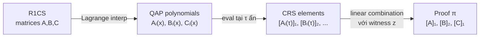

> **Prerequisites**: [[01-r1cs-groth16-bridge|01. R1CS → Groth16 Bridge]], biết QAP và Lagrange interpolation cơ bản, Schwartz-Zippel lemma  
> **Objectives**:  
> - Hiểu tại sao Groth16 cần evaluate polynomials tại điểm $\tau$ ẩn (không phải tại random point từ verifier)
> - Biết QAP polynomials được bố trí thế nào trong CRS
> - Hiểu vai trò của $t(\tau)$ và $h(\tau)$ trong proving equation
> - Hiểu tại sao Schwartz-Zippel đảm bảo soundness từ polynomial identity

---

## Tại sao bài này tồn tại

Bài trước đã thiết lập: R1CS thỏa mãn $\Leftrightarrow$ $A(x)B(x) - C(x) = h(x)t(x)$. Nhưng làm thế nào verifier kiểm tra đẳng thức polynomial này mà **không nhận polynomials từ prover** (vì đó sẽ là bộ dữ liệu khổng lồ)?

Câu trả lời của Groth16: **evaluate tất cả tại một điểm $\tau$ ẩn** — điểm được "đốt" vào CRS và không ai biết ngoại trừ người setup. Bài này giải thích tại sao cách này hoạt động và polynomials nào của QAP trực tiếp xuất hiện trong CRS.

---

## QAP nhắc lại nhanh (dưới góc nhìn Groth16)

Từ R1CS với ma trận $A, B, C \in \mathbb{F}_p^{m \times n}$ và $m$ constraints, $n$ wires:

> [!definition] Definition 2.1 — QAP Polynomials
> Chọn $m$ điểm evaluation phân biệt $r_1, \ldots, r_m \in \mathbb{F}_p$ (thường là roots of unity).
>
> Với mỗi index $i \in \{0, \ldots, n-1\}$, định nghĩa:
>
> $$A_i(x) = \text{lagrange\_interp}\bigl(\{(r_k, A_{k,i})\}_{k=1}^{m}\bigr)$$
>
> tương tự cho $B_i(x)$ và $C_i(x)$.
>
> **Target polynomial** (vanishing polynomial):
>
> $$t(x) = \prod_{k=1}^{m}(x - r_k)$$
>
> $t(x)$ có degree $m$ (bằng số constraints). Mỗi $A_i(x), B_i(x), C_i(x)$ có degree $\leq m-1$. Như vậy $A(x) \cdot B(x)$ có degree $\leq 2(m-1)$, và quotient $h(x) = (AB - C)/t$ có degree $\leq m-2$.

Ký hiệu "tổng hợp" khi prover có witness $\mathbf{z}$:

$$A(x) = \sum_{i=0}^{n-1} z_i A_i(x), \quad B(x) = \sum_{i=0}^{n-1} z_i B_i(x), \quad C(x) = \sum_{i=0}^{n-1} z_i C_i(x)$$

---

## Evaluation tại điểm $\tau$ ẩn

### Vấn đề: verifier không thể kiểm tra polynomial identity trực tiếp

Nếu prover gửi coefficients của $h(x)$, verifier cần $O(m)$ operations để verify $A \cdot B - C = h \cdot t$. Quan trọng hơn, **prover phải lộ polynomials** → lộ witness.

### Giải pháp: Schwartz-Zippel + Homomorphic Hiding

> [!theorem] Theorem 2.2 — Schwartz-Zippel Lemma
> Với polynomial $P(x)$ bậc $d$ không phải đa thức zero, và điểm $\tau$ chọn ngẫu nhiên từ $\mathbb{F}_p$:
>
> $$\Pr[P(\tau) = 0] \leq \frac{d}{p}$$
>
> Với $p$ lớn (BN254: $p \approx 2^{254}$), xác suất này negligible.

**Kết luận thực tiễn**: Nếu $A(\tau) \cdot B(\tau) - C(\tau) = h(\tau) \cdot t(\tau)$ tại một điểm $\tau$ random, thì với xác suất áp đảo đây là polynomial identity thực sự, tức là R1CS thỏa mãn.

Nhưng để không ai có thể "cheat" (đặc biệt là chọn $\tau$ sau khi biết polynomials), **$\tau$ phải được chọn trước và ẩn**. Đây là nhiệm vụ của Trusted Setup.

### Cách CRS encode evaluation tại $\tau$

Trusted Setup chọn $\tau$ bí mật và compute:

$$[\tau^0]_1, [\tau^1]_1, \ldots, [\tau^{n-1}]_1 \in \mathbb{G}_1$$

Prover muốn tính $[h(\tau)]_1 = [h_0 + h_1\tau + \cdots + h_{n-2}\tau^{n-2}]_1$. Làm thế nào? Linear combination:

$$[h(\tau)]_1 = h_0 \cdot [\tau^0]_1 + h_1 \cdot [\tau^1]_1 + \cdots + h_{n-2} \cdot [\tau^{n-2}]_1$$

**Prover biết coefficients $h_i$** (tính từ $\mathbf{z}$), **nhưng không biết $\tau$**. Họ chỉ dùng CRS elements để compute group element.

---

## Bố trí QAP Polynomials trong CRS

Đây là phần quan trọng nhất của bài: **CRS chứa những gì liên quan đến QAP?**

> [!definition] Definition 2.3 — QAP Elements trong Proving Key
> Với $i = 0, \ldots, n-1$:
>
> $$[A_i(\tau)]_1, \quad [B_i(\tau)]_1, \quad [B_i(\tau)]_2, \quad [C_i(\tau)]_1$$
>
> Ngoài ra còn có các elements "shifted":
>
> $$\left[\frac{\beta A_i(\tau) + \alpha B_i(\tau) + C_i(\tau)}{\delta}\right]_1 \quad \text{cho } i = \ell+1, \ldots, n-1 \quad \text{(private wires)}$$
>
> $$\left[\frac{\beta A_i(\tau) + \alpha B_i(\tau) + C_i(\tau)}{\gamma}\right]_1 \quad \text{cho } i = 1, \ldots, \ell \quad \text{(public inputs)}$$
>
> $$\left[\frac{\tau^k \cdot t(\tau)}{\delta}\right]_1 \quad \text{cho } k = 0, \ldots, n-2 \quad \text{(để tính } [h(\tau) t(\tau)]_1\text{)}$$

*Tại sao lại chia cho $\gamma$ và $\delta$?* — Bài 04 và 05 sẽ giải thích đầy đủ. Ngắn gọn: đây là cách Groth16 **force** public inputs và private witness phải được dùng đúng cách, không thể swap hay lẫn lộn.

### Tóm tắt dạng sơ đồ

---

## Vai trò của $t(\tau)$ và $h(\tau)$ trong Proving Equation

Khi prover tính proof, một trong những kiểm tra phải pass là:

$$[A(\tau)]_1 \cdot [B(\tau)]_2 = [C(\tau)]_1 \cdot [\delta]_2 + [\alpha]_1 \cdot [\beta]_2 + \ldots$$

Bên trong $[C]_1$ có chứa term $[h(\tau) \cdot t(\tau)]_1$. Prover tính:

$$[h(\tau) t(\tau)]_1 = \sum_{k=0}^{n-2} h_k \cdot \left[\tau^k t(\tau) / \delta\right]_1 \cdot \delta$$

Để điều này pass, $h(x)$ phải thực sự là quotient của $A(x)B(x) - C(x)$ chia $t(x)$. Nếu R1CS không thỏa mãn, $t(x) \nmid A(x)B(x) - C(x)$, và $h(\tau) t(\tau) \neq A(\tau)B(\tau) - C(\tau)$ với xác suất $1 - \text{negl}$.

> [!important] Key Insight
> $t(\tau)$ là "công cụ kiểm tra" chính. Nó encode rằng **tất cả $m$ constraints phải thỏa mãn đồng thời** (vì $t(x)$ có tất cả $r_1, \ldots, r_m$ là roots). Một constraint fail $\Rightarrow$ $t(x) \nmid A(x)B(x) - C(x)$ $\Rightarrow$ $h(x)$ không tồn tại (hợp lệ) $\Rightarrow$ proof sẽ bị verify fail.

---

## Degree của $h(x)$ và kích thước CRS

Vì $A(x), B(x)$ mỗi cái có degree $m-1$, tích $A(x)B(x)$ có degree $2(m-1)$. $t(x)$ có degree $m$. Do đó:

$$\deg(h) = \deg\frac{A \cdot B - C}{t} = 2(m-1) - m = m - 2$$

Prover cần CRS elements $[\tau^k t(\tau)/\delta]_1$ cho $k = 0, \ldots, m-2$. Điều này có nghĩa là **kích thước CRS tỷ lệ tuyến tính với số constraints $m$**. Đây là một trong những trade-off của Groth16 so với universal SNARKs.

---

## Polynomial Identity Checking vs Interactive Proof

Groth16 là **non-interactive** nhờ trusted setup. So sánh với cách interactive:

| Approach | Cách làm | Nhược điểm |
|----------|---------|------------|
| Interactive | Verifier gửi random $\tau$; prover trả về $A(\tau), B(\tau), C(\tau), h(\tau)$ | Lộ thông tin về witness |
| Groth16 | $\tau$ ẩn trong CRS; prover gửi group elements | Non-interactive, ZK |

Sự khác biệt: trong interactive protocol, prover biết $\tau$ khi compute → có thể "craft" polynomials trả về giá trị đúng dù QAP sai. Trong Groth16, **prover không biết $\tau$** → không thể cheat.

---

## Summary

- QAP polynomials $A_i(x), B_i(x), C_i(x)$ được interpolate từ columns của R1CS matrices
- Schwartz-Zippel cho phép kiểm tra polynomial identity bằng cách evaluate tại **một điểm ẩn $\tau$**
- CRS chứa evaluations $[A_i(\tau)]_1, [B_i(\tau)]_2, [\tau^k t(\tau)/\delta]_1$ — prover tính group commitments từ đây
- $h(x) = (A(x)B(x) - C(x)) / t(x)$ phải là polynomial nguyên — đây là "chứng cứ" R1CS thỏa mãn
- Kích thước CRS là $O(m)$ với $m$ = số constraints — circuit càng lớn, CRS càng lớn

---

## References

- Jens Groth — *On the Size of Pairing-based Non-interactive Arguments* (ePrint 2016/260), Section 3.2
- LambdaClass — *An overview of the Groth16 proof system* (blog.lambdaclass.com/groth16)
- RisenCrypto — *Groth16* (risencrypto.github.io/Groth16)
- ZeroKnowledge Blog — *Groth16* (zeroknowledgeblog.com/index.php/groth16)
