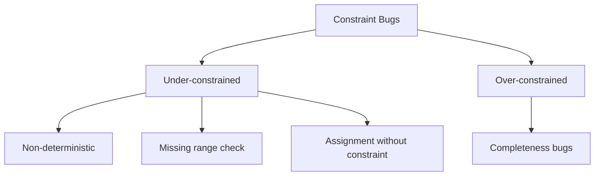

> **Prerequisites**: [[08-circom-snarkjs-workflow|08. Circom + snarkjs Workflow]]  
> **Objectives**:  
> - Phân loại đầy đủ các loại constraint bugs: under-constrained, over-constrained, non-deterministic
> - Hiểu cơ chế: signal assignment vs constraint — tại sao nhầm gây lỗi
> - Phân tích real-world bugs trong Tornado Cash, Aztec, Light Protocol
> - Biết tools và patterns để detect và prevent

---

## Phân loại Constraint Bugs

Đây là class lỗi phổ biến nhất trong ZK circuits theo nghiên cứu học thuật ("Under-constrained bugs pose a significant threat to SNARK deployments" — SoK 2024).



---

## Under-Constrained Circuits

> [!definition] Definition 11.1 — Under-Constrained Circuit
> Một circuit là **under-constrained** nếu có nhiều witness vectors $\mathbf{z}$ thỏa mãn tất cả constraints với cùng public inputs. Tức là: constraints không đủ để pin down duy nhất một valid witness.

**Hậu quả**: Malicious prover có thể prove false statements bằng cách chọn witness giả mà vẫn thỏa mãn constraints.

### Lỗi phổ biến nhất: Assignment không có Constraint

```circom
// VULNERABLE: under-constrained
template DivisionBug() {
    signal input a;
    signal input b;
    signal output c;

    // Chỉ assign, KHÔNG có constraint
    c <-- a / b;  // prover có thể đặt c = bất cứ gì!
}
```

Vì `<--` chỉ là assignment hint (để witness calculator biết gán gì), **không phải constraint**. Prover có thể override `c` với giá trị khác trong witness mà không vi phạm bất kỳ constraint nào.

**Fix**:
```circom
template DivisionFixed() {
    signal input a;
    signal input b;
    signal output c;

    c <-- a / b;
    // Thêm constraint: b * c === a
    b * c === a;  // Verify division
}
```

---

## Non-Deterministic Circuits

Subclass của under-constrained — circuit cho phép nhiều valid outputs cho cùng một input.

### Case Study: Zcash (BCTV-14) Double-Spend

Trong Zcash (trước Sapling), circuit tính nullifier cho UTXO. Do under-constrained, prover có thể generate **nhiều nullifiers khác nhau** cho cùng một UTXO:

```
UTXO commitment C
→ Nullifier N₁ (hợp lệ)
→ Nullifier N₂ (hợp lệ, khác N₁!)
```

Contract check `N not in used_set` — nếu prover dùng N₁ lần 1 và N₂ lần 2, cả hai đều pass → double-spending.

**Fix (Sapling)**: Groth16 + circuit redesign đảm bảo nullifier là deterministic function của UTXO secret.

---

## Missing Range Check

Field arithmetic trong Circom hoạt động trên $\mathbb{F}_p$ ($p \approx 2^{254}$). Nếu không check range, giá trị có thể "wrap around":

```circom
// BUG: Không check range
template AgeCheck() {
    signal input age;
    signal input min_age;

    // Naive check: age - min_age >= 0
    signal diff;
    diff <== age - min_age;
    // PROBLEM: nếu age = 5, min_age = 18
    // diff = 5 - 18 = -13 ≡ p - 13 (rất lớn, positive trong F_p!)
    // "diff >= 0" không có nghĩa trong F_p
}
```

**Fix**: Dùng `GreaterEqThan(n)` từ circomlib — nó decompose thành bits và check properly.

### Lỗi Integer Overflow trong Field

```circom
// BUG: 64-bit overflow
template Add64() {
    signal input a;  // supposed to be 64-bit
    signal input b;  // supposed to be 64-bit
    signal output c;

    c <== a + b;
    // Không check: a < 2^64, b < 2^64, c < 2^64
    // Prover có thể dùng a = 2^64 + 1 → circuit không detect
}
```

**Fix**: Thêm range constraints:
```circom
component rangeA = Bits2Num(64);
rangeA.in <== a;  // Forces a to be exactly 64 bits
```

---

## Real-World Case Study: Tornado Cash

Tornado Cash sử dụng Groth16 cho privacy-preserving withdrawals. Mặc dù core circuit đúng, nhiều **fork/rebuild** mắc lỗi under-constrained.

Pattern lỗi trong TC-style circuits:

```circom
// Circuit tính merkle path để prove membership
template MerkleTreeChecker(levels) {
    signal input leaf;
    signal input pathElements[levels];
    signal input pathIndices[levels];  // 0 hoặc 1

    signal output root;

    // BUG phổ biến: không constrain pathIndices[i] là bit
    // Prover có thể đặt pathIndices[i] = 5 (không phải 0 hoặc 1)
    // → hash computation khác → có thể forge merkle path
}
```

**Fix**: Thêm bit check:
```circom
for (var i = 0; i < levels; i++) {
    pathIndices[i] * (pathIndices[i] - 1) === 0;  // Must be 0 or 1
}
```

---

## Real-World Case Study: Light Protocol (Solana)

Light Protocol dùng Groth16 cho private token transfers. Lỗi: circuit tính Merkle tree commitment nhưng **không constrain** relationship giữa các intermediate nodes đúng cách → prover có thể forge membership proof.

> [!danger] Pattern: Under-constrained Merkle Tree
> Đây là lỗi cực kỳ phổ biến. Mọi Merkle tree circuit phải:
> 1. Constrain path indices là bits
> 2. Constrain intermediate hashes được tính đúng
> 3. Constrain leaf hash từ actual leaf value

---

## Over-Constrained Circuits (Completeness Bugs)

Over-constrained ít nguy hiểm hơn về security nhưng phá vỡ **completeness** — honest prover không thể generate proof.

```circom
// OVER-CONSTRAINED: quá chặt
template IsZero() {
    signal input in;
    signal output out;

    // Đúng logic nhưng thêm constraint thừa:
    out <== 1 - in;
    out * in === 0;  // Redundant — đã implied bởi out = 1 - in
    // Nhưng nếu thêm constraint SAI:
    in === 0;  // Hard-code in = 0 → circuit chỉ work khi in = 0!
}
```

**Hậu quả**: Honest users với valid inputs không generate được proof → DoS chính hệ thống.

---

## Arithmetic Over/Underflow

```circom
// BUG: Subtraction underflow
template Sub() {
    signal input a;
    signal input b;
    signal output c;

    c <== a - b;
    // Nếu a < b trong integers, c = a - b + p (wrap around trong F_p)
    // Không phải lỗi của Circom — đúng trong F_p — nhưng sai về semantic
}
```

---

## Detection Tools

| Tool | Approach | Detect |
|------|---------|--------|
| `circom --inspect` | Static analysis | Unconstrained signals (warning) |
| `PICUS` | Symbolic execution | Under-constrained witnesses |
| `Ecne` | Constraint analysis | Missing constraints |
| `Halo2 analyzer` | For Halo2 circuits | Similar issues |
| Manual audit | Human review | Logic errors |

```bash
# Circom warning về unconstrained signals
circom circuit.circom --r1cs --wasm --inspect
# WARNING: signal x is not constrained
```

---

## Audit Checklist: Constraint Bugs

> [!important] Audit Checklist — Constraint Bugs
>
> **1. Identify all `<--` operators**
> Mỗi `<--` phải có corresponding `===` constraint. Không có exception.
>
> **2. Check range constraints**
> Mọi signal được treat như integer phải có range check (`Bits2Num` hoặc `LessThan`).
>
> **3. Check bit decomposition**
> Mọi signal được treat như bit phải có `s * (s - 1) === 0`.
>
> **4. Check Merkle path indices**
> `pathIndices[i] * (pathIndices[i] - 1) === 0` cho mọi level.
>
> **5. Verify completeness**
> Test với borderline valid inputs (ví dụ: age = min_age exactly).
>
> **6. Run `circom --inspect`**
> Không có "signal not constrained" warnings.

---

## Summary

- **Under-constrained**: constraints không đủ → prover có thể fake witness → soundness broken
- **Nguyên nhân số 1**: dùng `<--` mà không có `===` constraint
- **Range checks**: F_p arithmetic không tự handle ranges — phải thêm bit decomposition
- **Non-deterministic**: subclass của under-constrained → double-spend risk
- **Over-constrained**: completeness broken → honest users bị blocked
- **Tools**: `circom --inspect`, PICUS, Ecne; nhưng manual audit vẫn cần thiết

---

## References

- 0xPARC — *zk-bug-tracker* (github.com/0xPARC/zk-bug-tracker)
- Chaliasos et al. — *SoK: What don't we know? Understanding Security Vulnerabilities in SNARKs* (arXiv 2402.15293, 2024)
- Oxorio — *Common Vulnerabilities in ZK Proof* (blog.oxor.io)
- circomlib source — https://github.com/iden3/circomlib
