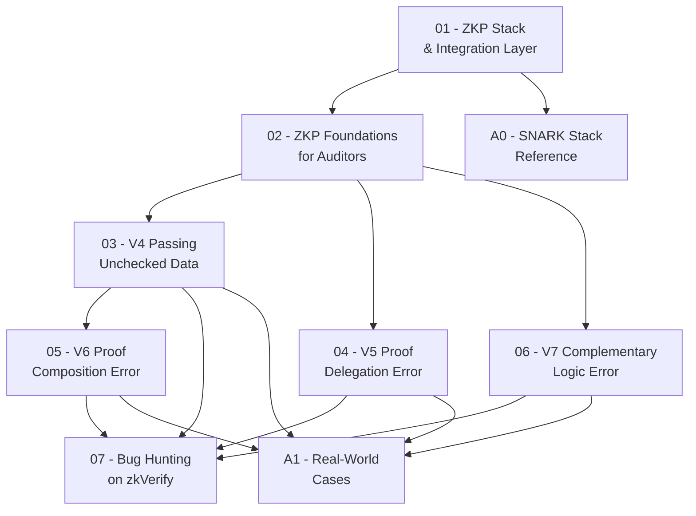

> **Topic**: Integration Layer Vulnerabilities in ZKP/SNARK Systems  
> **Domain**: Cryptography × Web Security (Security Audit / Bug Bounty)  
> **Level**: Intermediate  
> **Background giả định**: Hiểu circuit, witness, public input; Solidity & smart contract security cơ bản; Cryptography cơ bản (hash, modular arithmetic)
> **Tools / Code**: Python (scripting PoC), Solidity (integration contracts), Rust (đọc zkVerify source), snarkjs/circom (end-to-end flow)  
> **Mục tiêu cuối**: Săn bug trên Immunefi zkVerify program (max $50,000 Critical)
> **Nguồn học thuật chính**: Chaliasos et al. — *SoK: What Don't We Know? Understanding Security Vulnerabilities in SNARKs* (USENIX Security 2024, arXiv:2402.15293); zkSecurity blog; Cantina ZKP audit reports

---

## Lessons

| # | Title | Key Concepts | Prerequisites | Difficulty |
|---|-------|-------------|---------------|------------|
| 01 | ZKP Stack & Integration Layer | SNARK layers, on-chain verifier, public input flow, zkVerify architecture | ZKP cơ bản | ★★☆☆☆ |
| 02 | ZKP Foundations for Auditors | Completeness, Soundness, ZK properties; Groth16/PLONK verify flow; Threat model | 01 | ★★★☆☆ |
| 03 | V4 — Passing Unchecked Data | Implicit constraints, unchecked public input, soundness/completeness impact | 01, 02 | ★★★☆☆ |
| 04 | V5 — Proof Delegation Error | Untrusted prover, data leakage, decentralized proving services | 01, 02 | ★★★☆☆ |
| 05 | V6 — Proof Composition Error | Multi-proof systems, verifier gluing, recursive proof risks | 01, 02, 03 | ★★★★☆ |
| 06 | V7 — ZKP Complementary Logic Error | Nullifier mismanagement, replay attack, auxiliary mechanism flaws | 01, 02 | ★★★★☆ |
| 07 | Bug Hunting on zkVerify (Immunefi) | zkVerify pallets, Immunefi scope, PoC writing, report checklist | 01–06 | ★★★★★ |

## Appendix Candidates

| ID | Content | Related Lesson | Notes |
|----|---------|----------------|-------|
| A0 | SNARK Stack Reference Sheet | 01, 02 | Groth16/PLONK/STARK comparison; layer taxonomy |
| A1 | Real-World Case Studies | 03–06 | Tornado Cash, Semaphore, audit findings |

---

## Dependency Graph

---

## Progress Tracker

- [ ] [[00-roadmap|00. Roadmap]]
- [ ] [[01-zkp-stack-and-integration-layer|01. ZKP Stack & Integration Layer]]
- [ ] [[02-zkp-foundations-for-auditors|02. ZKP Foundations for Auditors]]
- [ ] [[03-v4-passing-unchecked-data|03. V4 — Passing Unchecked Data]]
- [ ] [[04-v5-proof-delegation-error|04. V5 — Proof Delegation Error]]
- [ ] [[05-v6-proof-composition-error|05. V6 — Proof Composition Error]]
- [ ] [[06-v7-zkp-complementary-logic-error|06. V7 — ZKP Complementary Logic Error]]
- [ ] [[07-bug-hunting-on-zkverify|07. Bug Hunting on zkVerify (Immunefi)]]
- [ ] [[a0-snark-stack-reference|A0. SNARK Stack Reference Sheet]]
- [ ] [[a1-real-world-cases|A1. Real-World Case Studies]]
