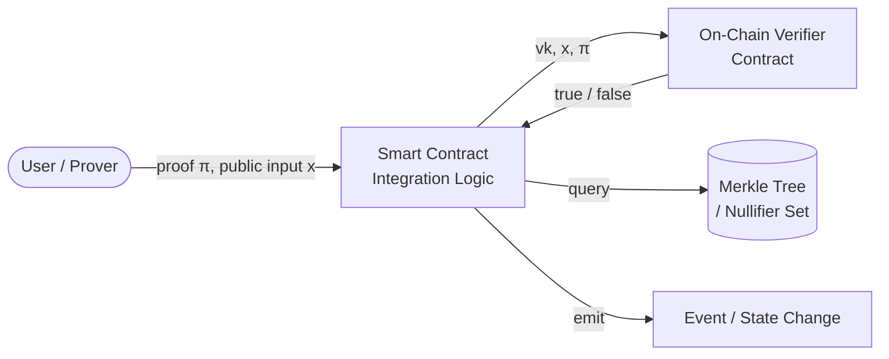
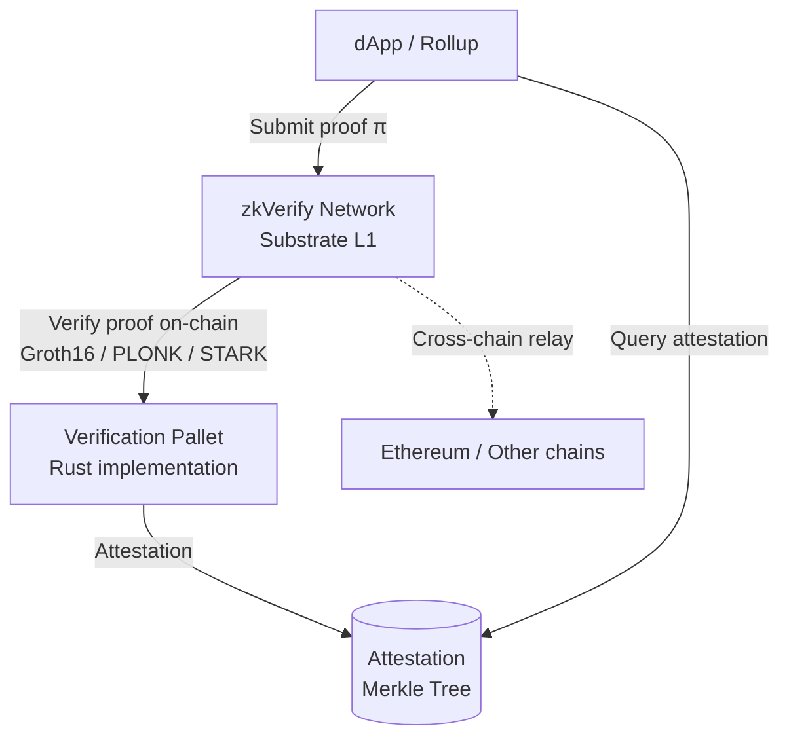

> **Prerequisites**: Biết ZKP là gì (prover, verifier, proof); Solidity smart contract cơ bản  
> **Objectives**:  
> - Hiểu toàn bộ kiến trúc 4 lớp của hệ thống SNARK
> - Xác định chính xác vị trí và vai trò của Integration Layer
> - Mô tả các thành phần cụ thể trong Integration Layer
> - Hiểu zkVerify đặt vào stack này ở đâu và tại sao nó là attack surface quan trọng

---

## Tại sao cần hiểu kiến trúc?

Phần lớn người học ZKP tập trung vào circuit — nơi logic số học được viết ra. Nhưng một hệ thống ZKP thực tế không chỉ là circuit. Nó là một *stack* gồm nhiều lớp, và **mỗi lớp đều có thể bị khai thác độc lập**, dù các lớp khác hoàn toàn đúng.

Một nghiên cứu năm 2024 phân tích 141 lỗ hổng thực tế trong các hệ thống SNARK (Chaliasos et al., USENIX Security 2024) cho thấy: các lỗi **không** chỉ nằm ở circuit — chúng xuất hiện ở tất cả các lớp, bao gồm lớp mà nhiều auditor bỏ qua nhất: **Integration Layer**.

Đây là lớp mà bài học này tập trung vào.

---

## SNARK Stack — 4 lớp kiến trúc

> [!definition] Definition 1.1 — SNARK System Layers
> Một hệ thống sử dụng SNARK được phân thành 4 lớp chính:
>
> 1. **Circuit Layer** — lớp viết mạch số học (arithmetic circuit)
> 2. **Backend Layer** — lớp proof system và trusted setup
> 3. **Frontend Layer** — lớp DSL compiler và witness generation
> 4. **Integration Layer** — lớp kết nối SNARK với ứng dụng thực tế

```text
┌─────────────────────────────────────────────────────────┐
│                   APPLICATION / DAPP                    │
├─────────────────────────────────────────────────────────┤
│            INTEGRATION LAYER  ← focus của bài học       │
│   (smart contracts, on-chain verifier, aux logic)       │
├─────────────────────────────────────────────────────────┤
│                   FRONTEND LAYER                        │
│    (DSL: Circom, Noir, Halo2 → witness generation)      │
├─────────────────────────────────────────────────────────┤
│                    BACKEND LAYER                        │
│  (proof system: Groth16, PLONK, STARK → prove/verify)  │
├─────────────────────────────────────────────────────────┤
│                    CIRCUIT LAYER                        │
│    (arithmetic constraints: R1CS, PLONKish gates)       │
└─────────────────────────────────────────────────────────┘
```

### Circuit Layer

Lớp dưới cùng. Lập trình viên viết logic ứng dụng dưới dạng *các ràng buộc số học* (arithmetic constraints) sử dụng một ngôn ngữ chuyên dụng (DSL — domain-specific language).

Ví dụ với Circom (DSL phổ biến):

```circom
// Chứng minh rằng tôi biết x sao cho x^2 = y (không tiết lộ x)
template Square() {
    signal input x;   // private witness
    signal input y;   // public input
    signal output out;

    out <== x * x;
    out === y;
}
```

Circuit có **hai mục đích**:
- **Prover job**: Tính toán các giá trị trong witness
- **Verifier logic**: Kiểm tra (assert) rằng witness thỏa mãn ràng buộc

### Backend Layer

Lớp proof system. Nhận circuit đã biên dịch và:
- **Trusted setup** (nếu cần): Sinh proving key (pk) và verification key (vk)
- **Prove**: `pk, x, w → π` (sinh proof từ public input và private witness)
- **Verify**: `vk, x, π → {true, false}` (xác minh proof)

Các proof system phổ biến: Groth16, PLONK, STARK, Halo2, Plonky2.

### Frontend Layer

Compiler và witness generator. Dịch code circuit từ DSL sang biểu diễn cấp thấp (R1CS, PLONKish) mà backend có thể xử lý. Bao gồm:
- Circom compiler → R1CS + WASM witness generator
- Noir → ACIR → backend prover
- Halo2 (eDSL trong Rust)

### Integration Layer

> [!definition] Definition 1.2 — Integration Layer
> Integration Layer là tập hợp code **bổ trợ** (auxiliary code) nằm giữa các thành phần SNARK và ứng dụng thực tế. Lớp này:
>
> - **Gọi on-chain verifier** để xác minh proof do người dùng nộp
> - **Thực thi logic ứng dụng** tùy theo kết quả xác minh
> - **Enforce các ràng buộc bổ sung** mà circuit không capture được
> - **Quản lý cơ chế phụ trợ** như nullifier, Merkle tree, access control

Đây là lớp mà *smart contract* tương tác với SNARK. Ví dụ điển hình: smart contract `semaphore.sol` gọi verifier contract, kiểm tra nullifier, rồi cho phép hành động.

---

## Các thành phần của Integration Layer



### On-Chain Verifier (Verifier Contract)

Contract được tự động sinh ra từ verification key. Ví dụ với Groth16 qua snarkjs:

```bash
# Sinh verifier contract từ verification key
snarkjs zkey export solidityverifier circuit_final.zkey verifier.sol
```

Contract này export một hàm duy nhất:

```solidity
// Hàm được sinh tự động — KHÔNG chỉnh sửa thủ công
function verifyProof(
    uint[2] memory a,
    uint[2][2] memory b,
    uint[2] memory c,
    uint[N] memory input  // public inputs
) public view returns (bool)
```

**Quan trọng**: Verifier contract **chỉ** kiểm tra tính hợp lệ toán học của proof. Nó **không** kiểm tra:
- Input có nằm trong range hợp lệ không
- Proof có bị replay lại không
- Nullifier đã dùng chưa
- Logic ứng dụng sau khi verify

Đó là trách nhiệm của Integration Layer bao quanh nó.

### Application Logic Contract

Đây là smart contract chính mà developer viết. Nó:
1. Nhận proof và public inputs từ user
2. Gọi verifier contract
3. **Thực hiện các kiểm tra bổ sung** (auxiliary checks)
4. Cập nhật state dựa trên kết quả

```solidity
contract PrivateVoting {
    IVerifier public verifier;
    mapping(bytes32 => bool) public nullifierUsed;
    bytes32 public merkleRoot;

    function castVote(
        uint[2] memory a, uint[2][2] memory b, uint[2] memory c,
        uint256 nullifierHash,
        uint256 voteChoice,
        uint256 root
    ) external {
        // Bước 1: Verify proof
        uint[3] memory inputs = [nullifierHash, voteChoice, root];
        require(verifier.verifyProof(a, b, c, inputs), "Invalid proof");

        // Bước 2: Auxiliary checks — do Integration Layer thực hiện
        require(!nullifierUsed[bytes32(nullifierHash)], "Nullifier reused");
        require(root == merkleRoot, "Invalid Merkle root");

        // Bước 3: Update state
        nullifierUsed[bytes32(nullifierHash)] = true;
        // ... record vote
    }
}
```

### Auxiliary Mechanisms — Nullifier

Cơ chế phụ trợ (auxiliary mechanism) quan trọng nhất là **nullifier** — một giá trị dùng một lần ngăn chặn replay attack.

> [!definition] Definition 1.3 — Nullifier
> Nullifier $N$ là một giá trị có thể tính từ private witness $w$ nhưng **không tiết lộ** $w$. Khi user thực hiện một hành động (rút tiền, bỏ phiếu), họ công bố $N$. Hệ thống lưu $N$ vào nullifier set và **từ chối** mọi proof dùng cùng $N$ lần sau.
>
> Nullifier phải được định nghĩa trong circuit VÀ được kiểm tra trong Integration Layer.

---

## zkVerify trong SNARK Stack

zkVerify là một blockchain L1 chuyên biệt (Substrate-based, viết bằng Rust) có mục đích duy nhất: **cung cấp dịch vụ xác minh ZKP** với chi phí thấp hơn Ethereum đến 90%.



Thay vì mỗi dApp tự chạy verifier contract tốn gas trên Ethereum, họ nộp proof lên zkVerify. zkVerify xác minh và sinh ra **attestation** (chứng nhận xác minh) được lưu vào một Merkle tree. dApp có thể query attestation này.

**Tại sao zkVerify là attack surface của Integration Layer?**

zkVerify có các thành phần Integration Layer của riêng nó:
- **Verification pallets** (Rust) — các module xử lý từng loại proof system
- **Aggregate pallet** — tổng hợp nhiều proof
- **EZKL verifier adapter** — adapter cho zkML proofs
- **ParaVerifier pallet** — xác minh proof từ parachain
- **XCM integration** — cross-chain message passing

Mỗi thành phần này có thể mang theo các lỗi Integration Layer (V4–V7) mà bài học sau sẽ phân tích chi tiết.

---

## Tóm tắt — Key Takeaways

- SNARK stack có 4 lớp: Circuit → Backend → Frontend → Integration.
- **Integration Layer** là lớp "keo dán" giữa SNARK và ứng dụng thực tế.
- Verifier contract chỉ kiểm tra *toán học*; mọi logic ứng dụng (nullifier, range check, replay protection) đều thuộc Integration Layer.
- zkVerify là một hệ thống Integration Layer chuyên biệt, có thể bị tấn công tại các verification pallets, aggregate pallet, adapter layers.
- **Một lỗi trong Integration Layer có thể phá vỡ toàn bộ bảo mật dù circuit hoàn toàn đúng.**

---

## References

- Chaliasos et al. — *SoK: What Don't We Know? Understanding Security Vulnerabilities in SNARKs* (arXiv:2402.15293, USENIX Security 2024)
- zkSecurity — *The State of Security Tools for ZKPs* (blog.zksecurity.xyz, 2024)
- zkVerify GitHub — github.com/zkVerify/zkVerify
- Cantina — *ZKP Security Flaws Auditors Commonly Overlook* (cantina.xyz/blog, 2024)
