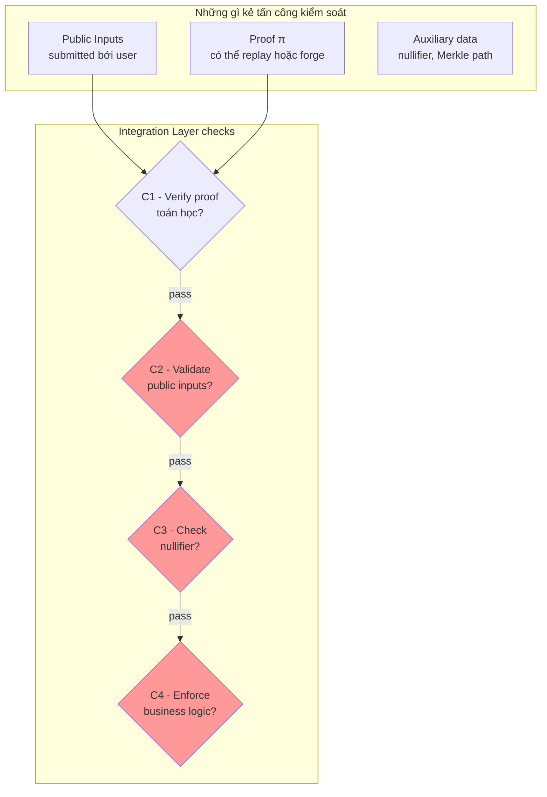

> **Prerequisites**: [[01-zkp-stack-and-integration-layer|01. ZKP Stack & Integration Layer]]  
> **Objectives**:  
> - Định nghĩa chính xác 3 thuộc tính bảo mật của ZKP và hiểu cái nào bị vi phạm khi nào
> - Phân biệt public input vs. private witness và hiểu tại sao ranh giới này quan trọng với auditor
> - Nắm quy trình verify của Groth16 ở mức đủ để đọc code verifier
> - Xây dựng threat model cụ thể cho Integration Layer

---

## Ba Thuộc Tính Bảo Mật của ZKP

Mọi lỗ hổng trong hệ thống ZKP đều quy về việc vi phạm một hoặc nhiều trong 3 thuộc tính này. Là auditor, nhiệm vụ của bạn là xác định *thuộc tính nào* bị ảnh hưởng và *trong hoàn cảnh nào*.

> [!definition] Definition 2.1 — Completeness (Đầy đủ)
> Nếu statement $x$ là **đúng** và prover biết witness $w$ hợp lệ, thì prover **luôn** có thể thuyết phục verifier chấp nhận.
>
> Nói cách khác: *honest prover không bị từ chối sai*.
>
> Vi phạm completeness: Người dùng hợp lệ không thể sử dụng hệ thống (DoS, griefing).

> [!definition] Definition 2.2 — Soundness (Nhất quán)
> Nếu statement $x$ là **sai**, thì không có prover nào (kể cả malicious) có thể thuyết phục verifier chấp nhận, ngoại trừ với xác suất negligible.
>
> Nói cách khác: *không thể forge một proof hợp lệ cho statement sai*.
>
> Vi phạm soundness: Attacker chứng minh điều gì đó sai → **critical**, thường dẫn đến mất tiền.

> [!definition] Definition 2.3 — Zero-Knowledge (Không lộ thông tin)
> Verifier không học được bất kỳ thông tin nào về $w$ ngoài việc $w$ tồn tại và thỏa mãn ràng buộc.
>
> Nói cách khác: *proof không tiết lộ witness*.
>
> Vi phạm zero-knowledge: Privacy bị phá vỡ, không nhất thiết mất tiền ngay nhưng có thể dẫn đến de-anonymization.

### Tác động theo loại vi phạm

| Vi phạm | Kẻ tấn công | Hậu quả điển hình | Severity |
|---------|------------|------------------|----------|
| Soundness | Malicious prover | Forge proof → drain funds | Critical |
| Completeness | Malicious environment | Legitimate user bị từ chối | Medium–High |
| Zero-Knowledge | Verifier hoặc observer | Privacy leak, de-anonymization | Medium (context-dependent) |

> [!warning] Lưu ý cho Bug Bounty
> Immunefi và hầu hết các chương trình ZKP bug bounty **ưu tiên soundness bugs** vì chúng dẫn trực tiếp đến mất quỹ. Vi phạm completeness thường được đánh giá ở mức Medium/High. Vi phạm zero-knowledge phụ thuộc nặng vào context — đôi khi không trong scope.

---

## Public Input vs. Private Witness

Đây là ranh giới quan trọng nhất cho auditor Integration Layer.

> [!definition] Definition 2.4 — Public Input và Private Witness
> - **Public input** $x$: Được biết bởi cả prover lẫn verifier. Là phần của statement được chứng minh. Xuất hiện trong proof verification call.
> - **Private witness** $w$: Chỉ prover biết. Là bí mật mà prover "biết" mà không tiết lộ.
>
> Circuit định nghĩa một relation $\mathcal{R}(x, w) = \text{true/false}$.
> Proof $\pi$ chứng minh: *"Tôi biết $w$ sao cho $\mathcal{R}(x, w) = \text{true}$"* mà không tiết lộ $w$.

Ví dụ cụ thể (Semaphore — anonymous voting):

```text
Public inputs (x):
  - nullifierHash: hash của nullifier (biết để verifier kiểm tra replay)
  - merkleRoot:    root của Merkle tree thành viên
  - signalHash:    hash của vote signal

Private witness (w):
  - identitySecret:  bí mật định danh của user
  - identityNullifier: nullifier chưa hash
  - treeSiblings[]:   đường dẫn Merkle (Merkle path)
  - treePathIndices[]: chỉ số trong Merkle path
```

**Câu hỏi auditor phải hỏi**:
1. Public input có bị validate ở Integration Layer trước khi gọi verifier không?
2. Circuit có enforce mọi ràng buộc cần thiết lên public input không?
3. Có implicit constraint nào trên public input mà circuit giả định nhưng không enforce không?

---

## Groth16 Verification Flow — Đủ để Đọc Code

Groth16 là proof system phổ biến nhất trong blockchain (Zcash, Tornado Cash, Semaphore). Hiểu flow verify ở mức cao giúp bạn đọc verifier contract và tìm lỗi.

### Trusted Setup

Groth16 yêu cầu trusted setup (ceremony) để sinh:
- **Proving key (pk)** — prover dùng để sinh proof
- **Verification key (vk)** — verifier dùng để verify, được hardcode trong verifier contract

### Cấu trúc Proof Groth16

Một Groth16 proof $\pi = (A, B, C)$ gồm 3 elliptic curve points:
- $A \in \mathbb{G}_1$
- $B \in \mathbb{G}_2$
- $C \in \mathbb{G}_1$

### Verification Equation

> [!definition] Definition 2.5 — Groth16 Verification
> Verifier chấp nhận proof nếu bilinear pairing equation sau thỏa mãn:
>
> $$e(A, B) = e(\alpha, \beta) \cdot e\!\left(\sum_{i=0}^{l} x_i \cdot \gamma_i, \gamma\right) \cdot e(C, \delta)$$
>
> Trong đó:
> - $(\alpha, \beta, \gamma, \delta)$: các element của verification key (vk)
> - $(x_0, x_1, \ldots, x_l)$: public inputs (với $x_0 = 1$)
> - $(\gamma_0, \gamma_1, \ldots, \gamma_l)$: IC (input commitments) trong vk — đây là ký hiệu rút gọn; trong code thực thường gọi là `vk.IC[i]`. Tổng $\sum x_i \cdot \gamma_i$ được tính thành `vk_x = IC[0] + Σ(pub[i] * IC[i+1])`
> - $e(\cdot, \cdot)$: bilinear pairing

**Điểm quan trọng cho auditor**: Phương trình trên chỉ kiểm tra $x_i$ có match với commitment trong vk không. Nó **không** kiểm tra:
- $x_i$ có nằm trong field $\mathbb{F}_p$ không (non-native field issue)
- $x_i$ có thuộc range hợp lệ không
- Mối quan hệ semantic giữa các $x_i$

### Verifier Contract (Groth16) — Đọc Code Thực Tế

```solidity
// File được sinh bởi snarkjs — verifier.sol (simplified)
contract Groth16Verifier {
    // Verification key elements (hardcoded từ ceremony)
    uint256 constant alphax = 0x...;
    uint256 constant alphay = 0x...;
    // ... beta, gamma, delta, IC[]

    function verifyProof(
        uint[2] memory a,       // Point A (G1)
        uint[2][2] memory b,    // Point B (G2)
        uint[2] memory c,       // Point C (G1)
        uint[N] memory input    // Public inputs x[1..N]
                                // NOTE: x[0] = 1 được thêm tự động
    ) public view returns (bool r) {
        // 1. Kiểm tra các point nằm trên curve (một số verifier BỎ QUA bước này!)
        // 2. Tính vk_x = IC[0] + Σ(input[i] * IC[i+1])
        // 3. Kiểm tra pairing equation
        // 4. Return true/false
    }
}
```

> [!warning] Attack Surface — Missing Subgroup Check
> Một số verifier contract được sinh ra không kiểm tra xem point A, B, C có thuộc đúng subgroup của elliptic curve không (subgroup check). Nếu thiếu, attacker có thể submit malformed proof points.

---

## Threat Model của Integration Layer

> [!definition] Definition 2.6 — Threat Model (Mô hình đe dọa)
> Threat model xác định:
> - **Ai** là adversary
> - **Họ biết gì** (knowledge)
> - **Họ muốn đạt gì** (goal)
> - **Họ có thể làm gì** (capabilities)

### Adversarial Roles trong SNARK System

| Role | Định nghĩa | Khả năng tấn công |
|------|-----------|-------------------|
| **Malicious Prover** | Prover cố tình nộp proof sai | Forge proof, manipulate public inputs |
| **Malicious Verifier** | Verifier cố tình từ chối hoặc accept sai | DoS honest prover, accept invalid proof |
| **External Attacker** | Không tham gia protocol | Replay attack, front-running, exploit aux logic |
| **Compromised Trusted Setup** | Biết toxic waste từ ceremony | Forge bất kỳ proof nào (catastrophic) |

### Integration Layer — Threat Surface Cụ Thể



Màu đỏ = các bước thường bị bỏ qua hoặc implement sai trong Integration Layer.

### Câu hỏi auditor phải đặt ra

Với mỗi Integration Layer contract/pallet, hỏi:

1. **V4 — Unchecked Data**: *"Verifier có enforce mọi implicit constraint trên public inputs không?"*
2. **V5 — Delegation**: *"Nếu proof generation được delegate, secret có bị lộ không?"*
3. **V6 — Composition**: *"Nếu có nhiều proofs, verifier có đảm bảo chúng consistent với nhau không?"*
4. **V7 — Complementary Logic**: *"Logic phụ trợ (nullifier, Merkle root, access control) có đồng bộ với circuit logic không?"*

---

## Tóm tắt — Key Takeaways

- Ba thuộc tính ZKP: **Completeness** (honest user không bị từ chối), **Soundness** (không forge proof sai), **Zero-Knowledge** (không lộ witness). Soundness bugs là critical nhất.
- **Public input** xuất hiện trong `verifyProof()` call — đây là nơi attacker có thể thao túng.
- **Private witness** không bao giờ đưa lên chain — nhưng nếu delegate proof generation, witness có thể bị lộ.
- Groth16 verifier chỉ kiểm tra pairing equation — không kiểm tra semantic của public inputs.
- Threat model Integration Layer: adversary kiểm soát public inputs, proof, và auxiliary data.

---

## References

- Chaliasos et al. — *SoK: What Don't We Know?* (arXiv:2402.15293), Section 3 (Threat Model), Section 4 (Vulnerability Taxonomy)
- Boneh & Shoup — *A Graduate Course in Applied Cryptography*, Ch. 20 (zk-SNARKs) — toc.cryptobook.us
- SnarkJS documentation — github.com/iden3/snarkjs
- Groth16 original paper — *On the Size of Pairing-based Non-interactive Arguments* (Groth 2016, EUROCRYPT)
