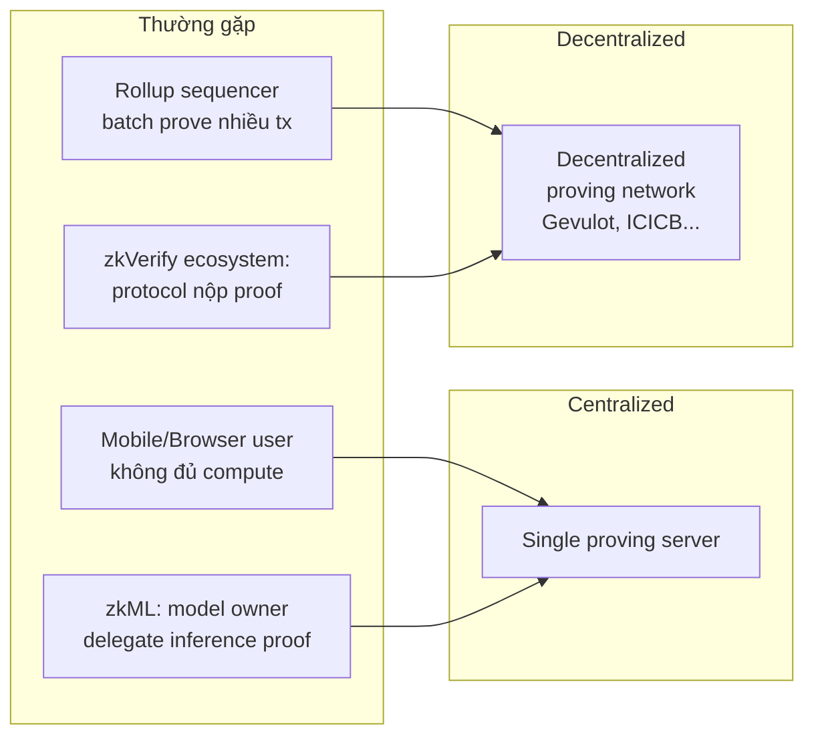
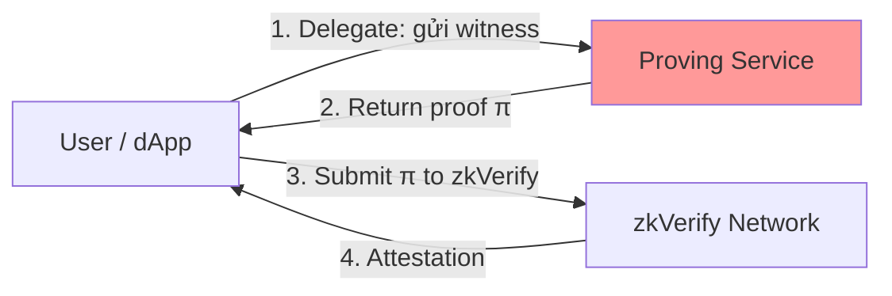

> **Prerequisites**: [[01-zkp-stack-and-integration-layer|01. ZKP Stack & Integration Layer]], [[02-zkp-foundations-for-auditors|02. ZKP Foundations for Auditors]]  
> **Objectives**:  
> - Hiểu tại sao proof generation cần được delegate và khi nào nó xảy ra
> - Phân tích 3 loại rủi ro trong proof delegation: data leakage, witness manipulation, và service DoS
> - Nhận diện các design pattern không an toàn trong decentralized proving services
> - Áp dụng vào context của zkVerify (dedicated verification layer)

---

## Proof Delegation Là Gì?

Trong hệ thống ZKP tiêu chuẩn, prover tự tính toán proof. Nhưng trong thực tế, proof generation cực kỳ tốn tài nguyên. Một Groth16 proof cho circuit ~1M constraints có thể mất vài phút và cần GB RAM. Mobile device hoặc browser không thể làm điều này.

Giải pháp: **Proof delegation** — giao việc sinh proof cho một bên thứ ba (third party).

> [!definition] Definition 4.1 — Proof Delegation (Ủy thác sinh proof)
> Proof delegation xảy ra khi **owner của witness** $w$ không tự sinh proof mà gửi thông tin cần thiết cho một **untrusted prover** để sinh proof $\pi$ thay mình.
>
> - **Delegator**: Người sở hữu witness $w$, cần proof nhưng không đủ compute
> - **Delegated Prover (Proving Service)**: Nhận input từ delegator, sinh proof
> - **Risk**: Proving service có thể thấy (một phần hoặc toàn bộ) witness $w$

### Khi nào Delegation xảy ra?



---

## Ba Loại Rủi Ro V5

### Rủi Ro 1 — Witness Leakage (Lộ Private Witness)

Đây là rủi ro cơ bản nhất của proof delegation.

> [!definition] Definition 4.2 — Witness Leakage
> Khi delegator gửi witness $w$ (hoặc thông tin có thể derive ra $w$) cho proving service, proving service học được $w$ — phá vỡ zero-knowledge property.

**Bad Design Pattern**:

```text
Delegator              Proving Service
    |                        |
    |--- send witness w ---→|   ← DANGER: w bị expose
    |                        |  (tính proof từ w)
    |←--- proof π -----------|
    |                        |
    | submit π on-chain      |
```

Ví dụ: User có `identitySecret = 0xABCD1234` (witness của Semaphore). Thay vì tự generate proof, user gửi `identitySecret` cho cloud proving service. Proving service biết secret này và có thể đánh cắp identity.

**Better Design Pattern — Witness Splitting**:

Một số protocol chia witness thành phần công khai và bí mật:

```text
Delegator:
  Private part: giữ lại (identitySecret)
  Public part: gửi cho prover (Merkle path, signal)

Proving Service:
  Chỉ nhận public part
  Không biết identitySecret
```

Nhưng không phải lúc nào cũng có thể tách được — phụ thuộc vào circuit design.

### Rủi Ro 2 — Witness Manipulation (Thao túng Witness)

Proving service nhận witness từ delegator nhưng **sửa đổi** trước khi prove, tạo proof hợp lệ cho một *statement khác*.

> [!definition] Definition 4.3 — Witness Manipulation
> Malicious proving service nhận witness $w$ của delegator, thay $w$ bằng $w'$ khác nhau về semantic nhưng vẫn satisfy circuit constraints, tạo proof $\pi'$ cho public input $x'$ khác với ý định của delegator.

**Scenario cụ thể (zkML)**:

```text
Delegator (model owner) muốn prove:
  "Model inference trên input X cho output Y=1 (approve loan)"
  Gửi: model weights + input X cho proving service

Malicious proving service:
  Thay input X → X' (modify một vài pixel)
  Circuit vẫn thỏa mãn (model vẫn chạy đúng)
  Nhưng output Y' = 0 (deny loan)
  Sinh proof π' cho public claim: "output = 0"

Kết quả:
  Proof hợp lệ về mặt toán học
  Nhưng prove sai điều mà delegator muốn prove!
```

Đây là V5 kết hợp với V7: malicious prover không chỉ làm lộ witness mà còn thao túng kết quả.

### Rủi Ro 3 — Selective Denial (Từ chối có chọn lọc)

Proving service từ chối sinh proof cho một số user cụ thể — phá vỡ completeness.

> [!definition] Definition 4.4 — Selective Denial (Censorship)
> Proving service có thể nhận diện danh tính của delegator (qua IP, địa chỉ ví, etc.) và từ chối sinh proof cho họ, dù witness hợp lệ. Đây là completeness failure do censorship.

Đây đặc biệt nguy hiểm trong các hệ thống nơi proving service là centralized (single point of failure).

---

## Design Flaws Dẫn Đến V5

### Flaw 1 — Không Có Authentication Của Prover

Protocol không verify rằng prover là trustworthy trước khi gửi sensitive witness.

```solidity
// ❌ VULNERABLE — bất kỳ proving service nào cũng được accept
contract PrivateLoan {
    address public provingService; // Ai cũng có thể claim là service này!

    function requestProof(bytes memory witness) external {
        // Gửi witness cho proving service (off-chain)
        emit ProofRequested(msg.sender, witness); // witness PUBLIC trên chain!
    }
}
```

### Flaw 2 — Không Có Commitment Scheme

Delegator không có cách để verify rằng proof được generate từ witness *đúng* của mình.

**Thiếu commitment**:
```text
Delegator → gửi witness → Prover
Delegator ← nhận proof ← Prover
Delegator không thể verify: "Proof này có thực sự từ witness của mình không?"
```

**Với commitment**:
```text
Delegator → C = Commit(witness) → Prover (gửi commitment trước)
Delegator → witness (sau khi prover commit về service)
Prover → proof + decommitment → Delegator
Delegator verify: Commit(witness) == C, proof valid for witness
```

### Flaw 3 — Trust Model Sai

Hệ thống assume proving service là trusted nhưng không có mechanism nào đảm bảo điều này.

```text
Sai assumption:  "Proving service sẽ generate đúng proof"
Đúng assumption: "Proving service là untrusted và có thể malicious"
```

---

## V5 trong Context zkVerify

zkVerify là dedicated verification layer — nó **verify** proof, không **generate** proof. Nhưng các protocol **sử dụng** zkVerify có thể có V5 bugs trong flow của họ:



Bước 1-2 là nơi V5 xảy ra — hoàn toàn off-chain và ngoài tầm kiểm soát của zkVerify. Khi audit zkVerify ecosystem:

- **Audit zkVerify protocol itself**: Kiểm tra các verification pallets có leak proof-generation data không
- **Audit protocols sử dụng zkVerify**: Kiểm tra flow từ user → proving service có an toàn không

**Cụ thể cho zkVerify pallets** — các thành phần cần check:

| Pallet | V5 Risk |
|--------|---------|
| `pallet-aggregate` | Aggregate nhiều proof — nếu aggregate operation expose witness của từng proof |
| `EZKL verifier adapter` | zkML proofs — model weights có thể là private witness bị expose qua adapter |
| `ParaVerifier pallet` | Cross-chain proof — parachain có thể be malicious proving service |

---

## Detection Checklist — V5

```text
□ Protocol có hỗ trợ hoặc require proof delegation không?
□ Witness hoặc secret data có được gửi cho third-party service không?
□ Nếu có: proving service có được authenticate không?
□ Delegator có cách verify proof được generate đúng từ witness của mình không?
□ Có commitment scheme nào bảo vệ delegator không?
□ Proving service có thể selectively deny proof không? Hậu quả gì?
□ Nếu proving service centralized: single point of failure risk?
□ Protocol documentation có rõ trust assumption về proving service không?
□ Witness splitting có được áp dụng để minimize exposure không?
```

---

## Tóm tắt — Key Takeaways

- **Proof delegation** tất yếu xảy ra khi proof generation quá nặng cho end-user.
- Ba rủi ro chính: **witness leakage** (lộ secret), **witness manipulation** (forge statement), **selective denial** (censorship).
- Design flaw gốc rễ: **thiếu authentication** và **thiếu commitment scheme**.
- zkVerify ecosystem: V5 xảy ra ở layer protocol → proving service, không phải trong zkVerify itself.
- Khi audit: trace toàn bộ lifecycle của witness, từ generation đến proof submission.

---

## References

- Chaliasos et al. — *SoK* (arXiv:2402.15293), V5 — Proof Delegation Error
- Gevulot — *Decentralized Proving Network* (gevulot.com/docs) — ví dụ về trustless proving
- Cantina — *ZKP Security Flaws Auditors Commonly Overlook* — Misunderstood Primitives section
- zkSecurity blog — *zkVM Security* (2024) — delegation risks in zkVM context
