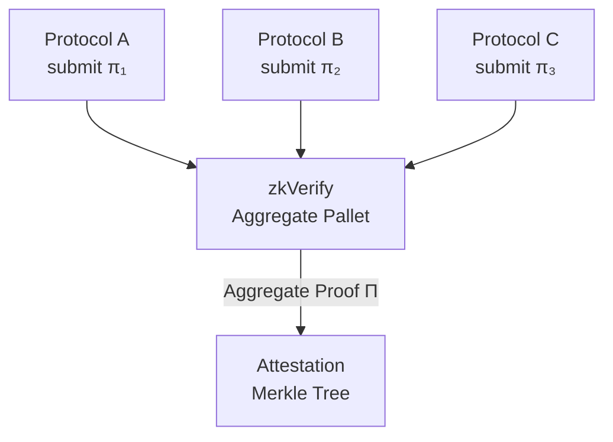

> **Prerequisites**: [[02-zkp-foundations-for-auditors|02. ZKP Foundations for Auditors]], [[03-v4-passing-unchecked-data|03. V4 — Passing Unchecked Data]]  
> **Objectives**:  
> - Hiểu tại sao hệ thống phân phối logic trên nhiều proofs và rủi ro khi làm vậy
> - Phân tích 3 pattern V6: missing linkage, inconsistent public inputs, recursive composition bug
> - Hiểu vai trò của "verifier gluing" và tại sao nó hay bị sai
> - Nhận diện V6 trong các hệ thống zkRollup và recursive proof circuits

---

## Proof Composition Là Gì?

Thay vì dùng một proof duy nhất để chứng minh toàn bộ statement, nhiều hệ thống phân phối logic thành nhiều proofs riêng lẻ rồi **compose** (ghép) chúng lại.

> [!definition] Definition 5.1 — Proof Composition (Tổng hợp proof)
> Proof composition là khi logic ứng dụng được **phân phối** trên nhiều ZKP proofs $\pi_1, \pi_2, \ldots, \pi_n$, và một verifier phải **glue** (kết nối) các proofs này lại để xác nhận toàn bộ statement.

**Tại sao cần composition?**

- Circuit quá lớn để prove một lần (chia nhỏ để parallel prove)
- Các phần của statement có lifecycle khác nhau (một phần prove off-chain, một phần prove on-chain)
- Recursive ZKP: prove rằng bạn đã verify một proof khác
- Batch proving trong rollups: nhiều transactions → một proof cuối

### Ví dụ — zkRollup Batch

```text
Transaction 1: prove tx1 valid → π₁
Transaction 2: prove tx2 valid → π₂
Transaction 3: prove tx3 valid → π₃
                     ↓
          Aggregation circuit:
          prove "π₁ AND π₂ AND π₃ all valid"
                     ↓
               Final proof π_batch
                     ↓
              Submit π_batch on-chain
```

Verifier on-chain chỉ verify $\pi_{batch}$. Nhưng nếu aggregation circuit không enforce đúng mối quan hệ giữa $\pi_1, \pi_2, \pi_3$, toàn bộ security có thể bị phá vỡ.

---

## V6 — Định Nghĩa Chính Thức

> [!definition] Definition 5.2 — V6: Proof Composition Error
> V6 xảy ra khi:
> 1. Logic được phân phối trên nhiều proofs $\pi_1, \ldots, \pi_n$
> 2. Verifier (Integration Layer) phải "glue" các proofs này
> 3. **Gluing bị thiếu hoặc sai** → proofs không nhất quán với nhau → undefined behavior

Ba pattern chính của V6:

| Pattern | Mô tả | Hậu quả |
|---------|-------|---------|
| Missing Linkage | Không có ràng buộc nối output của $\pi_i$ với input của $\pi_{i+1}$ | Chứng minh A → B và B → C riêng lẻ, nhưng thực tế B không nhất quán |
| Inconsistent Public Inputs | $\pi_i$ và $\pi_j$ share một public input nhưng không enforce chúng bằng nhau | State mismatch giữa hai proofs |
| Recursive Composition Bug | Proof trong một proof — vk không match, field không match | Accept proof sai hệ thống |

---

## Pattern 1 — Missing Linkage

Logic cần proof: A → B → C (A implies B, B implies C, therefore A implies C).

Nếu chứng minh riêng lẻ:
- $\pi_1$: "Tôi biết A và A → B" với public output B
- $\pi_2$: "Tôi biết B và B → C" với public output C

Verifier phải **enforce** rằng B trong $\pi_2$ là **cùng giá trị** B được output từ $\pi_1$. Nếu không, attacker có thể:
- Dùng $\pi_1$ hợp lệ với $A_1 \to B_1$
- Dùng $\pi_2$ hợp lệ với $B_2 \to C$ (với $B_2 \neq B_1$)
- Chain chúng lại → claim A → C dù B không consistent

```solidity
// ❌ VULNERABLE — Không enforce linkage giữa hai proof
contract TwoStepVerifier {
    IVerifier1 public verifier1; // proves A → B, public output: B
    IVerifier2 public verifier2; // proves B → C, public output: C

    function verifyChain(
        // Proof 1
        uint[2] memory a1, uint[2][2] memory b1, uint[2] memory c1,
        uint256 outputB1,   // public output của proof 1
        // Proof 2
        uint[2] memory a2, uint[2][2] memory b2, uint[2] memory c2,
        uint256 inputB2,    // public input của proof 2
        uint256 outputC
    ) external {
        require(verifier1.verifyProof(a1, b1, c1, [outputB1]), "Proof 1 invalid");
        require(verifier2.verifyProof(a2, b2, c2, [inputB2, outputC]), "Proof 2 invalid");
        // ❌ Không kiểm tra outputB1 == inputB2!
        // Attacker có thể dùng outputB1 từ valid proof 1
        // và inputB2 hoàn toàn khác trong proof 2
        executeAction(outputC);
    }
}

// ✅ FIXED — Enforce linkage
contract TwoStepVerifierFixed {
    function verifyChain(
        ..., uint256 outputB1, uint256 inputB2, uint256 outputC
    ) external {
        require(verifier1.verifyProof(a1, b1, c1, [outputB1]), "Proof 1 invalid");
        require(verifier2.verifyProof(a2, b2, c2, [inputB2, outputC]), "Proof 2 invalid");
        // ✅ Enforce linkage: output của proof 1 phải là input của proof 2
        require(outputB1 == inputB2, "Proof linkage broken");
        executeAction(outputC);
    }
}
```

---

## Pattern 2 — Inconsistent Public Inputs (Shared State Mismatch)

Hai proofs share một state (ví dụ: Merkle root, block number) nhưng Integration Layer không enforce chúng bằng nhau.

**Scenario — zkRollup với 2-phase proof**:

```text
Phase 1 proof π₁:
  "State root sau batch A là R₁"
  Public inputs: [prev_root, batch_A, new_root = R₁]

Phase 2 proof π₂:
  "State root sau batch B là R₂"
  Public inputs: [prev_root', batch_B, new_root = R₂]
```

Verifier phải enforce: `π₂.prev_root == π₁.new_root`.

```solidity
// ❌ VULNERABLE — State root không được chained đúng
contract RollupVerifier {
    bytes32 public currentStateRoot;
    IVerifier public verifier;

    function submitBatch(
        uint[2] memory a, uint[2][2] memory b, uint[2] memory c,
        bytes32 prevRoot,
        bytes32 newRoot,
        bytes32 batchData
    ) external {
        uint[3] memory inputs = [
            uint256(prevRoot),
            uint256(newRoot),
            uint256(batchData)
        ];
        require(verifier.verifyProof(a, b, c, inputs), "Invalid proof");
        // ❌ Không kiểm tra prevRoot == currentStateRoot!
        // Attacker có thể submit proof với prevRoot tùy ý
        currentStateRoot = newRoot;
    }
}

// ✅ FIXED
contract RollupVerifierFixed {
    function submitBatch(..., bytes32 prevRoot, bytes32 newRoot, ...) external {
        // ✅ Enforce chain continuity
        require(prevRoot == currentStateRoot, "Invalid prev root");
        require(verifier.verifyProof(a, b, c, inputs), "Invalid proof");
        currentStateRoot = newRoot;
    }
}
```

---

## Pattern 3 — Recursive Composition Bug

Recursive proof: circuit A verify circuit B's proof inside itself. Đây là kỹ thuật mạnh nhưng phức tạp.

> [!definition] Definition 5.3 — Recursive ZKP
> Recursive ZKP là khi một circuit (outer circuit) chứa logic verify một proof (inner proof) từ circuit khác. Kết quả là proof của outer circuit chứng minh: "Tôi đã verify inner proof và nó hợp lệ."

**Rủi ro V6 trong recursive proof**:

1. **Verification Key Mismatch**: Outer circuit verify inner proof bằng vk hardcoded. Nếu inner circuit thay đổi nhưng vk trong outer circuit không update → verify sai circuit.

2. **Field Mismatch**: Inner proof hệ số trên field $\mathbb{F}_p$, outer circuit hệ số trên field $\mathbb{F}_q$ khác. Conversion sai → silent error.

3. **Public Input Routing Error**: Inner proof có $n$ public inputs, outer circuit chỉ forward $m < n$ vào constraint. Phần còn lại không được constrain → attacker modify tự do.

```text
Ví dụ Field Mismatch:

Inner proof (Groth16 trên BN254):
  Field p = 21888242871839275222246405745257275088548364400416034343698204186575808495617

Outer circuit (Halo2 trên Pasta):
  Field q (khác p)

Nếu convert public input của inner proof sang outer field sai:
  inner_public_input = X (trong F_p)
  sau convert: X mod q ≠ X mod p (nếu X > q)
  → Outer circuit verify wrong statement về inner proof
```

---

## V6 trong zkVerify

zkVerify **aggregate** nhiều proofs từ nhiều protocols khác nhau. Đây là đất màu mỡ cho V6:



**V6 risks trong zkVerify aggregate pallet**:

- Khi aggregate $\pi_1, \pi_2, \pi_3$, pallet có enforce shared state consistency không?
- Các proofs từ different protocols có thể có incompatible public input formats — conversion có đúng không?
- Nếu một proof trong batch invalid, toàn bộ batch bị reject hay chỉ proof đó?

Các pallets cốt lõi đã được audit bởi Trail of Bits (2025-02) và SRLabs (2025-09). Attack surface chưa có audit nằm ở `EZKL verifier adapter` và `ParaVerifier pallet` — nơi V6 có khả năng cao hơn vì proof composition logic phức tạp hơn.

---

## Detection Checklist — V6

```text
□ Hệ thống có sử dụng nhiều hơn một proof không?
□ Nếu có: liệt kê mối quan hệ giữa các proofs (output của proof này là input của proof kia?)
□ Verifier có enforce linkage giữa output proof A và input proof B không?
□ Có state (Merkle root, block number, counter) được share giữa nhiều proofs không?
□ State đó có được enforce consistent trong cả hai proofs không?
□ Nếu có recursive proof: vk có được hardcode đúng không?
□ Nếu cross-field: conversion giữa các finite fields có đúng không?
□ Public inputs của inner proof có được fully forwarded và constrained trong outer circuit không?
□ Aggregate pallet: nếu một proof invalid, isolation có đúng không?
□ Batch proof: có thể thay thế một proof trong batch bằng proof valid khác không?
```

---

## Tóm tắt — Key Takeaways

- **Proof composition** phân phối logic trên nhiều proofs — mỗi điểm kết nối là một attack surface.
- **Verifier gluing** = enforcement của linkage giữa các proofs — thường bị bỏ qua.
- Ba pattern: **missing linkage** (output ≠ input tiếp theo), **shared state mismatch** (Merkle root không chained), **recursive composition bug** (vk/field mismatch).
- zkVerify aggregate pallet là nơi V6 đặc biệt nguy hiểm do handle nhiều proofs từ nhiều protocols.
- Fix: explicit linkage check trong Integration Layer sau mỗi individual proof verification.

---

## References

- Chaliasos et al. — *SoK* (arXiv:2402.15293), V6 — Proof Composition Error
- zkSecurity — *zkVM Security* (blog.zksecurity.xyz, 2024) — recursive proof risks
- zkTree paper (eprint.iacr.org/2023/208) — recursive composition for on-chain verification
- Trail of Bits — *zkVerify Security Review* (2025-02) — aggregate pallet analysis
