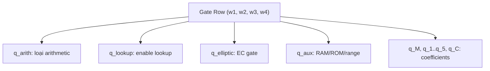
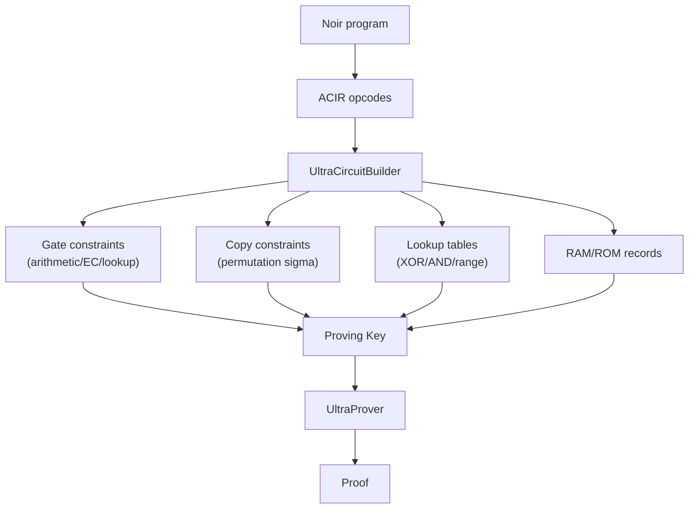

> **Prerequisites**: [[06-turboplonk-custom-gates|06. TurboPlonk and Custom Gates]], [[07-plookup|07. Plookup]]  
> **Objectives**:  
> - Hiểu Ultra arithmetization: 4-wire system và cấu trúc gate mở rộng
> - Nắm cách UltraPlonk tích hợp custom gates + Plookup trong một constraint system
> - Hiểu RAM/ROM abstraction và memory argument
> - Phân tích Barretenberg UltraCircuitBuilder — nơi bug bounty thực tế nhắm vào

---

## Motivation

TurboPlonk giải quyết custom gates. Plookup giải quyết lookup tables. UltraPlonk **hợp nhất cả hai** vào một constraint system nhất quán, đồng thời thêm **RAM/ROM abstraction** để handle memory access trong programs phức tạp.

Đây là constraint system mà Barretenberg (backend của Noir/Aztec) hiện dùng, và là target của zkVerify bug bounty.

---

## Ultra Arithmetization

> [!definition] Definition 8.1 — Ultra Circuit Matrix
> Ultra circuit dùng **4 wires** mỗi gate: $w_1, w_2, w_3, w_4$ (thay vì $a, b, c$ trong standard).
>
> Gate equation tổng quát:
>
> $$q_M w_1 w_2 + q_1 w_1 + q_2 w_2 + q_3 w_3 + q_4 w_4 + q_5 w_4^2 + q_C + q_{\text{arith}} \cdot f_{\text{arith}}(w_1, w_2, w_3, w_4) = 0$$
>
> trong đó $q_{\text{arith}} \in \{0, 1, 2\}$ switch giữa các modes: 0 = custom gate, 1 = standard arithmetic, 2 = tính toán mở rộng.

**Các loại gate trong Ultra arithmetization:**

| Gate type | Selectors active | Constraint |
|-----------|-----------------|------------|
| Standard arith | $q_{\text{arith}} = 1$ | $q_M w_1 w_2 + q_1 w_1 + \ldots + q_C = 0$ |
| Extended arith | $q_{\text{arith}} = 2$ | Thêm term $q_5 w_4^2$ |
| Lookup gate | $q_{\text{lookup}} = 1$ | $(w_1, w_2, w_3)$ thuộc lookup table |
| Elliptic curve | $q_{\text{elliptic}} = 1$ | EC point addition/doubling |
| Aux | $q_{\text{aux}} = 1$ | Range checks, ROM/RAM access |

### Selector Layout



---

## Plookup Integration trong UltraPlonk

Trong Ultra arithmetization, lookup gate dùng tất cả 4 wires:
- $(w_1, w_2, w_3)$: tuple cần lookup
- $w_4$: index vào lookup table (optional, một số implementations)

> [!definition] Definition 8.2 — Lookup Gate
> Khi $q_{\text{lookup}} = 1$ tại row $i$:
>
> $$(w_{1,i}, w_{2,i}, w_{3,i}) \in \mathcal{T}$$
>
> trong đó $\mathcal{T}$ là một trong các **predefined tables** (XOR, AND, range, custom).

**Predefined tables trong Barretenberg**:
- `uint_xor_table`: $(a, b, a \oplus b)$ cho $a, b \in [0, 2^{14})$
- `uint_and_table`: $(a, b, a \wedge b)$
- Range tables: $(v, 0, 0)$ cho $v \in [0, 2^k)$

---

## RAM/ROM Abstraction

> [!definition] Definition 8.3 — ROM (Read-Only Memory) Argument
> ROM cho phép circuit đọc từ một array $T[0..d-1]$ tại arbitrary index $i$.
>
> **Cách encode**: Mỗi read access $(i, T[i])$ là một lookup trong bảng $(j, T[j])_{j=0}^{d-1}$.
>
> Vì index $i$ là witness (không cố định), đây là **dynamic index lookup** — khó hơn static lookup.

> [!definition] Definition 8.4 — RAM (Read-Write Memory) Argument
> RAM cho phép circuit đọc **và ghi** vào memory.
>
> **Challenge**: Read-after-write phải consistent: nếu $\text{write}(i, v)$ rồi $\text{read}(i)$, phải return $v$.
>
> **Giải pháp UltraPlonk**: Memory argument dùng **sorted access log** — sort tất cả (read/write) theo địa chỉ, rồi kiểm tra consistency bằng permutation argument.

```python
def verify_ram_consistency(access_log, p):
    """
    Kiểm tra tính nhất quán của RAM access log.
    access_log: list of (address, value, is_write, timestamp)
    Sort by (address, timestamp), check: nếu read tại addr,
    value phải khớp với write gần nhất cùng addr.
    """
    # Sort by (address, timestamp)
    sorted_log = sorted(access_log, key=lambda x: (x[0], x[3]))

    last_write = {}  # addr -> last written value
    errors = []

    for addr, value, is_write, ts in sorted_log:
        if is_write:
            last_write[addr] = value
        else:
            expected = last_write.get(addr)
            if expected is None:
                errors.append(f"Read uninit addr {addr}")
            elif value != expected:
                errors.append(f"Read addr {addr}: got {value}, expected {expected}")

    return len(errors) == 0, errors

# Demo: write 42 to addr 5, then read
log = [
    (5, 42, True,  0),   # write 42 to addr 5 at t=0
    (3, 10, True,  1),   # write 10 to addr 3 at t=1
    (5, 42, False, 2),   # read addr 5 at t=2 -> expect 42
    (3, 10, False, 3),   # read addr 3 at t=3 -> expect 10
]
ok, errs = verify_ram_consistency(log, p=337)
print(f"RAM consistency: {ok}, errors: {errs}")

# Bad: read wrong value
log_bad = [
    (5, 42, True,  0),
    (5, 99, False, 1),   # read addr 5 -> got 99, but wrote 42
]
ok_bad, errs_bad = verify_ram_consistency(log_bad, p=337)
print(f"RAM consistency (bad): {ok_bad}, errors: {errs_bad}")
```

---

## UltraCircuitBuilder — Barretenberg

UltraPlonk trong Barretenberg được implement qua `UltraCircuitBuilder` (C++). Đây là target chính của zkVerify bug bounty.

**Kiến trúc tổng quan:**



**Key files trong Barretenberg:**
- `ultra_circuit_builder.hpp` — builder chính
- `ultra_prover.hpp/cpp` — 5 rounds
- `ultra_verifier.hpp/cpp` — verification
- `plookup_tables/` — predefined tables
- `dsl/acir_format/` — ACIR → circuit translation

---

## Verifier Key Structure

> [!definition] Definition 8.5 — UltraPlonk Verification Key (VK)
> VK chứa tất cả **committed selector polynomials** và **permutation polynomials**:
>
> $$\text{VK} = \{[q_M]_1, [q_1]_1, \ldots, [q_C]_1, [q_{\text{arith}}]_1, [q_{\text{lookup}}]_1, [q_{\text{elliptic}}]_1, [q_{\text{aux}}]_1, [S_{\sigma 1}]_1, [S_{\sigma 2}]_1, [S_{\sigma 3}]_1, [S_{\sigma 4}]_1, \ldots\}$$
>
> Trong zkVerify, VK được parse từ binary format (output của Barretenberg `bb` tool) và verified on-chain.

**zkVerify `ultraplonk_verifier`** (Rust): reimplements UltraPlonk verification từ Noir's Solidity verifier. Bug bounty target.

---

## Bug Bounty: UltraPlonk Attack Surface

> [!danger] Vulnerability 8.6 — Lookup Table Completeness
> Nếu lookup table không chứa đủ entries (ví dụ: XOR table chỉ cover $[0, 2^8)$ nhưng input có thể $\geq 2^8$), prover có thể use invalid witness mà không bị caught nếu range check bị bỏ sót.

> [!danger] Vulnerability 8.7 — RAM Timestamp Overflow
> Trong RAM argument, timestamps phải unique và strictly increasing. Nếu timestamp field không có range constraint, prover có thể dùng $\text{ts} = 0$ cho tất cả accesses, làm sort order không deterministic → consistency check pass dù read/write order sai.

> [!danger] Vulnerability 8.8 — ACIR → UltraPlonk Translation Bug
> ACIR opcodes được dịch sang Ultra constraints bởi `acir_format/`. Nếu một opcode bị dịch sai (ví dụ: range constraint bị drop, hay copy constraint thiếu), toàn bộ proof system bị under-constrained.
>
> **Đây là attack class quan trọng nhất cho zkVerify**: verifier Rust reimplements logic từ Solidity verifier — bất kỳ discrepancy nào giữa hai implementations đều là potential bug.

> [!danger] Vulnerability 8.9 — Point at Infinity trong EC Gate
> EC custom gate giả định inputs là valid non-infinity points. Nếu input là điểm $O$ (point at infinity), computation undefined trong affine coordinates → có thể tạo ra commitment đúng cho output sai.
>
> Đây chính là **"Aztec 0 Bug"**: đặt hai elements về 0 → verifier accept proof tùy ý.

---

## So sánh Standard → Turbo → Ultra

| Feature | Standard PLONK | TurboPlonk | UltraPlonk |
|---------|---------------|------------|------------|
| Wires/gate | 3 | 4–5 | 4 |
| Custom gates | Không | Có | Có (nhiều hơn) |
| Lookup tables | Không | Không | Có (Plookup) |
| RAM/ROM | Không | Không | Có |
| Selector count | 5 | ~10 | ~15 |
| Proof size | ~400B | ~500B | ~600–700B |
| EC ops | Nhiều gates | Custom gate | Custom gate |

---

## Summary

- **Ultra arithmetization**: 4 wires, selectors phân loại gate type, tích hợp lookup + EC + RAM.
- **Lookup integration**: `q_lookup` enable Plookup cho row; predefined tables trong Barretenberg.
- **RAM/ROM**: sorted access log + consistency check bằng permutation argument.
- **Barretenberg UltraCircuitBuilder**: target thực tế; ACIR → Ultra constraints.
- **Bug bounty**: table completeness, timestamp overflow, ACIR translation bugs, point-at-infinity.

---

## References

- Aztec — *UltraPlonk* (docs.aztec.network/protocol-specs/cryptography)
- Barretenberg source — `ultra_circuit_builder.hpp`, `ultra_prover.cpp`
- 0xPARC ZK Bug Tracker — "Aztec Plonk Verifier: 0 Bug"
- zkVerify — `ultraplonk_verifier` Rust (github.com/zkVerify/ultraplonk_verifier)
- Benchmarking paper — *Benchmarking the Plonk, TurboPlonk, and UltraPlonk Proving Systems*
