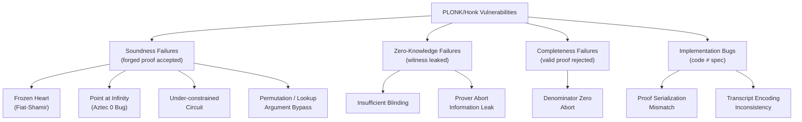

> **Prerequisites**: [[05-fiat-shamir-security-model|05. Fiat-Shamir and Security Model]], [[08-ultraplonk|08. UltraPlonk]], [[10-ultrahonk|10. UltraHonk]]  
> **Objectives**:  
> - Nắm toàn bộ các vulnerability class trong PLONK family theo taxonomy rõ ràng
> - Hiểu cơ chế khai thác chi tiết cho từng loại: Frozen Heart, Point at Infinity, under-constrained, lookup bypass
> - Biết cách phân biệt soundness failure vs ZK failure vs completeness failure
> - Có thể identify vulnerability pattern trong source code Barretenberg và zkVerify

---

## Taxonomy Lỗi



---

## V1 — Frozen Heart (Fiat-Shamir Vulnerability)

**Severity**: Critical — cho phép forge proof cho **bất kỳ public input nào**.

**Lý do gốc rễ**: Fiat-Shamir hash không gồm đủ public data → Prover kiểm soát challenge.

> [!definition] Definition 11.1 — Frozen Heart Attack trên PLONK
> **Điều kiện**: Public inputs **không** được hash vào transcript khi tính $\beta, \gamma, \alpha, \zeta$.
>
> **Khai thác step-by-step**:
>
> 1. Attacker chọn public inputs giả $\text{PI}' \neq \text{PI}$.
> 2. Tạo **ngẫu nhiên** polynomials $a'(X), b'(X), c'(X)$ — không liên quan đến witness.
> 3. Commit chúng: $[a']_1, [b']_1, [c']_1$ → hash → lấy $\beta, \gamma$ (giống Prover hợp lệ vì PI không trong hash).
> 4. Tạo $z'(X)$ ngẫu nhiên thỏa init condition $z'(1) = 1$ nhưng không thỏa accumulation.
> 5. Tính $t'(X)$ sao cho $t'(X) Z_H(X) = [\text{gate constraint}(a',b',c')] + \ldots + \alpha^2(z'-1)L_1$ — tính được vì $a',b',c'$ đã chọn ngẫu nhiên.
> 6. Điều chỉnh $\text{PI}'$ (constant trong gate equation) sao cho **gate constraint thỏa mãn** với polynomials random đã chọn.
> 7. Gửi proof — Verifier accept vì tất cả checks pass.

```python
def check_transcript_includes_pi(transcript_inputs):
    """
    Kiểm tra transcript có public inputs không.
    transcript_inputs: list of (label, value) đưa vào hash.
    """
    required = {'vk', 'public_inputs', 'commitment_a', 'commitment_b', 'commitment_c'}
    present = {label for label, _ in transcript_inputs}
    missing = required - present
    if missing:
        return False, f"MISSING from transcript: {missing}"
    return True, "Transcript OK"

# Ví dụ transcript BỊ LỖI (thiếu public_inputs)
bad_transcript = [
    ('vk', 'verifier_key_bytes'),
    ('commitment_a', 'com_a_bytes'),
    ('commitment_b', 'com_b_bytes'),
    ('commitment_c', 'com_c_bytes'),
    # public_inputs bị thiếu!
]
ok, msg = check_transcript_includes_pi(bad_transcript)
print(f"Bad transcript: {ok} — {msg}")

# Transcript đúng
good_transcript = [
    ('vk', 'verifier_key_bytes'),
    ('public_inputs', 'pi_bytes'),
    ('commitment_a', 'com_a_bytes'),
    ('commitment_b', 'com_b_bytes'),
    ('commitment_c', 'com_c_bytes'),
]
ok2, msg2 = check_transcript_includes_pi(good_transcript)
print(f"Good transcript: {ok2} — {msg2}")
```

**Các implementation thực tế đã bị:** Dusk Network plonk, Iden3 SnarkJS, ConsenSys gnark (đã fix 2022).

**Cách phòng**: Rule vàng: *mọi public value đã biết tại thời điểm hash đều phải vào transcript*, bao gồm VK, PI, **theo đúng thứ tự** từng round.

---

## V2 — Point at Infinity (Aztec "0 Bug")

**Severity**: Critical — chấp nhận proof với hai elements là điểm `0` bất kể các elements khác.

**Lý do gốc rễ**: Elliptic curve có điểm đặc biệt $\mathcal{O}$ (identity, "point at infinity"). Trong một số representation, `0` trong $\mathbb{F}^2$ **không phải** $\mathcal{O}$ nhưng code treat như vậy.

> [!definition] Definition 11.2 — Point at Infinity Attack
> **Setup**: PLONK verifier (C++) kiểm tra commitment $[f]_1 \in \mathbb{G}_1$. Nếu input là `(0, 0)` trong affine coordinates, code treat như $\mathcal{O}$ (identity element).
>
> **Thuộc tính của $\mathcal{O}$**: $e(\mathcal{O}, Q) = 1$ trong $\mathbb{G}_T$ với mọi $Q$.
>
> **Khai thác**: Đặt $[W_\zeta]_1 = \mathcal{O}$ và $[W_{\zeta\omega}]_1 = \mathcal{O}$. Pairing verification:
>
> $$e(\mathcal{O} + u\mathcal{O}, [\tau]_2) = e(\ldots, G_2) \implies 1 = 1 \quad \checkmark$$
>
> Verification pass dù proof hoàn toàn không hợp lệ!

**Ai phát hiện**: Nguyen Thoi Minh Quan (bug bounty Aztec 2.0).

**Cách phòng**: Trước khi dùng group element, **reject nếu là $\mathcal{O}$** và **kiểm tra điểm nằm trên curve**.

```python
def is_valid_g1_point(x, y, p, curve_a, curve_b):
    """
    Kiểm tra (x, y) là điểm hợp lệ trên y^2 = x^3 + ax + b (mod p).
    Reject point at infinity và điểm không nằm trên curve.
    """
    # Reject (0, 0) nếu đó không phải là điểm trên curve
    if x == 0 and y == 0:
        return False, "Point at infinity (0,0) — REJECT"
    # Kiểm tra điểm nằm trên curve
    lhs = (y * y) % p
    rhs = (pow(x, 3, p) + curve_a * x + curve_b) % p
    if lhs != rhs:
        return False, f"Not on curve: y^2={lhs}, x^3+ax+b={rhs}"
    return True, "Valid point"

# BN254 params (simplified demo)
p_demo = 1000003
curve_a, curve_b = 0, 7

# Point at infinity
ok, msg = is_valid_g1_point(0, 0, p_demo, curve_a, curve_b)
print(f"(0,0): {ok} — {msg}")

# Valid point
x_val = 2
y_sq = (pow(x_val, 3, p_demo) + curve_b) % p_demo
if pow(y_sq, (p_demo-1)//2, p_demo) == 1:
    y_val = pow(y_sq, (p_demo+1)//4, p_demo)
    ok2, msg2 = is_valid_g1_point(x_val, y_val, p_demo, curve_a, curve_b)
    print(f"({x_val},{y_val}): {ok2} — {msg2}")
```

---

## V3 — Under-Constrained Circuit

**Severity**: Critical — Prover chứng minh điều sai (ví dụ: biết hash preimage không tồn tại).

**Lý do**: Circuit thiếu constraint → witness tự do → Prover chọn giá trị tùy ý.

**Các pattern phổ biến:**

> [!warning] Pattern 11.3 — Missing Boolean Check
> ```
> // Circuit mong muốn: b ∈ {0,1}
> // THIẾU: b * (b - 1) = 0
> // Nếu thiếu, Prover dùng b = 5 và circuit vẫn pass
> ```

> [!warning] Pattern 11.4 — Missing Range Check
> ```
> // Circuit muốn 0 <= x < 256 (byte)
> // Nếu không có range gate, x = 1000 vẫn thỏa mãn
> ```

> [!warning] Pattern 11.5 — Unconnected Output Wire
> ```
> // Gate 1: a * b = c (output c)
> // Gate 2 input: a' phải bằng c từ Gate 1
> // Nếu copy constraint a'=c bị thiếu, a' có thể là bất kỳ giá trị
> ```

> [!warning] Pattern 11.6 — Nondeterministic Witness
> Một số computation không deterministic (ví dụ: ECDSA signature — nhiều signatures hợp lệ cho một message). Nếu dùng signature như nullifier, attacker tạo nhiều signatures khác nhau để bypass nullifier check.

**Cách audit**:
1. Với mỗi wire, trace xem nó bị constraint bởi gate nào.
2. Kiểm tra tất cả "logical invariants" có tương ứng gate constraint.
3. Trace copy constraints: mỗi "output" có được copy đến đúng "input" không?

---

## V4 — Permutation / Lookup Argument Bypass

**Severity**: Critical khi bypass được; thường khó khai thác trực tiếp.

> [!danger] Vulnerability 11.7 — Wrong Coset Parameters
> Nếu $k_1$ hoặc $k_2$ trong permutation argument **thuộc** subgroup $H$ (thay vì cosets), các column bị overlap trong identity permutation. Prover có thể swap values giữa columns mà không bị phát hiện.

> [!danger] Vulnerability 11.8 — Lookup Table Not Committed
> Nếu lookup table $t$ không được commit vào VK (hoặc commit nhưng không đưa vào Fiat-Shamir transcript), Prover có thể dùng table khác tại prove time.
>
> **Kết quả**: Circuit chứng minh "đầu vào nằm trong table X" nhưng thực ra dùng table Y.

> [!danger] Vulnerability 11.9 — Multiplicity Undercount
> Trong log-derivative lookup (UltraHonk), Prover phải cung cấp **multiplicity** $m_j$ — số lần $t_j$ được lookup. Nếu $m_j$ bị undercount và Verifier không enforce $\sum m_j = n$ (tổng số lookups), Prover có thể "fake" một số lookup values.

---

## V5 — Insufficient Blinding (ZK Failure)

**Severity**: Medium (privacy leak, không ảnh hưởng soundness).

**Lý do**: Wire polynomials không được randomize đủ → Verifier học được thông tin về witness.

> [!definition] Definition 11.10 — Blinding Requirement
> Polynomial $a(X)$ được "mở" tại 2 điểm ($\zeta$ và có thể $\zeta\omega$) → cần **2 random scalars** để blinding.
>
> $z(X)$ được mở tại $\zeta$ và $\zeta\omega$ → cần **3 random scalars**.
>
> Nếu dùng **1 scalar** cho $a(X)$: với commitment $[a]_1$ và evaluation $\bar{a} = a(\zeta)$, Verifier biết 2 constraints → có thể recover $a$ nếu degree đủ thấp.

---

## V6 — Prover Abort / Denominator Zero

**Severity**: Low–Medium (statistical ZK leak, không ảnh hưởng soundness).

Trong PLONK permutation argument, Prover tính:

$$z(\omega^{i+1}) = z(\omega^i) \cdot \frac{\text{numerator}_i}{\text{denominator}_i}$$

Nếu $\text{denominator}_i = 0$ (xảy ra khi $a_i + \beta S_{\sigma 1}(\omega^i) + \gamma = 0$ — tức là $a_i = -\beta S_{\sigma 1}(\omega^i) - \gamma$ với $\beta, \gamma$ random), Prover **abort**.

Abort leak thông tin: Verifier biết rằng "witness thỏa mãn một linear relation liên quan đến $\beta, \gamma$". Đây là lý do PLONK chỉ đạt **statistical** zero-knowledge.

**Trong code**: tần suất abort là $O(1/p) \approx 2^{-256}$ — negligible trong thực tế.

---

## V7 — Proof Serialization Mismatch

**Severity**: High khi bypass verification; Medium khi chỉ crash.

Proof elements phải được serialize/deserialize nhất quán giữa Prover (Barretenberg C++) và Verifier (Rust/Solidity).

**Các nguồn lỗi phổ biến:**

```text
Field element encoding:
- Little-endian vs big-endian (256-bit integers)
- Compressed vs uncompressed G1 points (33 vs 65 bytes)
- BN254 field modulus: 0x30644e72e131a029b85045b68181585d2833e84879b9709143e1f593f0000001

Proof length:
- UltraPlonk: fixed-size (số commitments cố định)
- UltraHonk: variable-size (sumcheck messages phụ thuộc vào k = log n)
  → nếu parser không đọc đúng k, toàn bộ proof bị misparse
```

```python
def parse_ultraplonk_proof(proof_bytes):
    """
    Parse UltraPlonk proof (simplified structure).
    Mỗi G1 point = 64 bytes (uncompressed, BN254).
    Mỗi field element = 32 bytes.
    """
    G1_SIZE = 64
    FR_SIZE = 32

    expected_structure = [
        ('comm_a',         G1_SIZE),
        ('comm_b',         G1_SIZE),
        ('comm_c',         G1_SIZE),
        ('comm_z',         G1_SIZE),
        ('comm_t_lo',      G1_SIZE),
        ('comm_t_mid',     G1_SIZE),
        ('comm_t_hi',      G1_SIZE),
        ('eval_a',         FR_SIZE),
        ('eval_b',         FR_SIZE),
        ('eval_c',         FR_SIZE),
        ('eval_s_sigma1',  FR_SIZE),
        ('eval_s_sigma2',  FR_SIZE),
        ('eval_z_omega',   FR_SIZE),
        ('comm_W_zeta',    G1_SIZE),
        ('comm_W_zeta_omega', G1_SIZE),
    ]

    parsed = {}
    offset = 0
    for name, size in expected_structure:
        if offset + size > len(proof_bytes):
            raise ValueError(f"Proof too short at field '{name}': "
                             f"need {offset+size}, have {len(proof_bytes)}")
        parsed[name] = proof_bytes[offset:offset+size]
        offset += size

    if offset != len(proof_bytes):
        raise ValueError(f"Proof has trailing bytes: {len(proof_bytes)-offset} extra")

    return parsed

# Test: đúng kích thước
G1_SIZE, FR_SIZE = 64, 32
expected_len = 7*G1_SIZE + 6*FR_SIZE + 2*G1_SIZE  # 9 G1 + 6 FR = 768 bytes
proof_ok = bytes(expected_len)  # zero bytes, just for size test
try:
    p = parse_ultraplonk_proof(proof_ok)
    print(f"Proof parse OK: {len(p)} elements")
except ValueError as e:
    print(f"Parse error: {e}")

# Test: proof ngắn hơn
proof_short = bytes(expected_len - 1)
try:
    parse_ultraplonk_proof(proof_short)
except ValueError as e:
    print(f"Short proof rejected: {e}")
```

---

## Bảng Tổng Hợp

| ID | Vulnerability | Ảnh hưởng | Layer | Độ khó khai thác | Đã thấy ngoài thực tế |
|----|--------------|-----------|-------|-----------------|----------------------|
| V1 | Frozen Heart (Fiat-Shamir) | Soundness | Proof system | Medium | ✅ Nhiều impl 2022 |
| V2 | Point at Infinity | Soundness | Verifier code | Low | ✅ Aztec bounty |
| V3 | Under-constrained | Soundness | Circuit design | High (circuit-specific) | ✅ Nhiều CTF/bounty |
| V4 | Lookup bypass | Soundness | Lookup argument | High | ⚠️ Lý thuyết |
| V5 | Insufficient blinding | ZK | Prover impl | High | ✅ Một số impl |
| V6 | Denominator zero abort | ZK (statistical) | Prover protocol | N/A (by design) | ✅ Documented |
| V7 | Proof serialization | Soundness/DoS | Format parsing | Low | ⚠️ Risk cao |
| V8 | Wrong coset params | Soundness | Permutation | Medium | ⚠️ Lý thuyết |
| V9 | Missing multiplicity | Soundness | Lookup (Honk) | Medium | ⚠️ Mới |

---

## Summary

- **Soundness failures** (V1–V4, V7–V9) cho phép forge proof → nguy hiểm nhất.
- **ZK failures** (V5–V6) leak witness → ảnh hưởng privacy.
- **Frozen Heart** là bug class phổ biến nhất trong thực tế: luôn audit Fiat-Shamir transcript đầu tiên.
- **Point at Infinity** là bug implementation: luôn validate group elements trước khi dùng.
- **Under-constrained** là bug design: phổ biến trong circuit code, cần trace wire-by-wire.

---

## References

- Trail of Bits — *Coordinated Disclosure: Frozen Heart* (blog.trailofbits.com, April 2022)
- 0xPARC — ZK Bug Tracker (github.com/0xPARC/zk-bug-tracker)
- Nguyen Thoi Minh Quan — Aztec Plonk Verifier 0-bug writeup (HackMD)
- teddav — *Halo2 Soundness Bugs* (github.com/teddav/halo2-soundness-bugs)
- Gabizon, Williamson, Ciobotaru — *PLONK* (ePrint 2019/953), footnote 11 (abort leak)
