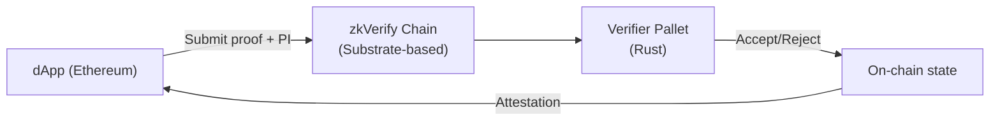

> **Prerequisites**: [[11-security-vulnerabilities|11. Security Vulnerabilities]] — full vulnerability taxonomy; [[10-ultrahonk|10. UltraHonk]] — architecture; [[08-ultraplonk|08. UltraPlonk]] — UltraCircuitBuilder  
> **Objectives**:  
> - Hiểu kiến trúc zkVerify on-chain và Rust verifier codebase
> - Biết cách trace proof verification flow từ submission đến accept/reject
> - Có methodology cụ thể để hunt bug trong `ultraplonk_verifier` và `ultrahonk_verifier`
> - Có PoC template để report vulnerability có giá trị bounty

---

## zkVerify là gì?

**zkVerify** (Horizen Labs) là một **proof verification blockchain** — chain chuyên biệt nhận ZK proofs, verify on-chain, và publish kết quả. Các dApps có thể outsource proof verification đến zkVerify thay vì verify on Ethereum (tốn kém hơn).



**Stack kỹ thuật:**
- Chain: Substrate (Rust)
- Verifiers: Rust, implemented as pallets
- Supported: UltraPlonk (Barretenberg), UltraHonk, Groth16, FFLONK, Risc0, ...
- Repo: `HorizenLabs/ultraplonk_verifier`, `AztecProtocol/aztec-packages` (Barretenberg)

**Bug bounty**: Immunefi — severity từ $1,000 đến $250,000+. Critical = soundness failure (forged proof accepted).

---

## Codebase Map — Rust Verifier

```text
ultraplonk_verifier/
├── src/
│   ├── lib.rs               ← entry point: verify(vk, proof, public_inputs)
│   ├── transcript.rs        ← Fiat-Shamir (Keccak256)
│   ├── key.rs               ← VerificationKey parsing & validation
│   ├── proof.rs             ← Proof parsing & deserialization
│   ├── verifier.rs          ← Main verification logic
│   ├── arithmetic.rs        ← Field arithmetic helpers
│   └── types.rs             ← G1, G2, Fr type wrappers
└── tests/
    ├── integration_tests.rs ← Known-good proof test vectors
    └── fuzzing/             ← Fuzz targets (nếu có)

Key files để audit:
  transcript.rs  → Frozen Heart
  proof.rs       → Serialization mismatch, Point at Infinity
  verifier.rs    → Missing checks, wrong logic
```

---

## Verification Flow chi tiết

> [!definition] Definition 12.1 — UltraPlonk Verifier (Rust) — Step-by-Step
>
> **Bước 1 — Parse VK**: Đọc selector commitments, permutation commitments, domain size $n$, public input size.
>
> **Bước 2 — Parse proof**: Đọc wire commitments $[a]_1, [b]_1, [c]_1, [d]_1$, permutation commitment $[z]_1$, quotient parts $[t_{\text{lo}}]_1, [t_{\text{mid}}]_1, [t_{\text{hi}}]_1$, evaluations $\bar{a}, \bar{b}, \bar{c}, \bar{d}, \bar{z}_\omega, \bar{S}_{\sigma 1..3}$, opening proofs $[W_\zeta]_1, [W_{\zeta\omega}]_1$.
>
> **Bước 3 — Transcript**: Hash (VK ∥ PI ∥ commitments theo round) → lấy $\beta, \gamma, \alpha, \zeta, v, u$.
>
> **Bước 4 — Compute quotient commitment**: Tái tạo $[t(\zeta)]_1$ từ $[t_{\text{lo}}]_1, [t_{\text{mid}}]_1, [t_{\text{hi}}]_1$ và $\zeta^n$.
>
> **Bước 5 — Compute linearisation commitment**: Tính $[r]_1$ từ VK commitments, evaluations, và challenges.
>
> **Bước 6 — KZG batch opening**: Verify $[W_\zeta]_1$ và $[W_{\zeta\omega}]_1$ bằng 2 pairing equations.
>
> **Checklist audit**: Mỗi bước trên đều là nơi có thể có bug.

---

## Audit Checklist — Fiat-Shamir (transcript.rs)

```python
TRANSCRIPT_AUDIT_CHECKLIST = [
    # (check_id, description, how_to_verify, severity_if_fail)
    ("T01", "VK hash vào transcript trước PI",
     "Tìm dòng transcript.append(vk) trước transcript.append(pi)",
     "Critical — Frozen Heart partial"),

    ("T02", "PI hash vào transcript sau VK nhưng trước challenges",
     "Đảm bảo public_inputs được hashed trước khi gọi get_challenge(beta/gamma)",
     "Critical — Frozen Heart"),

    ("T03", "Wire commitments hash theo đúng thứ tự round",
     "Round 1: [a,b,c,d]; Round 2: [z]; Round 3: [t_lo,t_mid,t_hi]",
     "High — challenge reuse nếu sai order"),

    ("T04", "Domain separator giữa các round",
     "Transcript có reset hoặc dùng counter giữa các round không?",
     "Medium — nếu không có separator, collision có thể xảy ra"),

    ("T05", "Evaluations hash vào transcript trước challenge v, u",
     "Evaluations a_bar, b_bar, ... phải được hash trước khi squeeze v",
     "High — Verifier không commit trên evaluations"),

    ("T06", "Không có extra data không mong muốn trong transcript",
     "Kiểm tra xem có internal state bị hash không (nondeterminism)",
     "Low — reproducibility issue"),
]

def audit_transcript(source_code_lines):
    """Tìm các pattern cần kiểm tra trong source code verifier."""
    issues = []
    code = '\n'.join(source_code_lines)

    # T02: public_inputs phải xuất hiện trước beta/gamma challenge
    pi_pos   = code.find('public_inputs')
    beta_pos = code.find('get_challenge')
    if pi_pos == -1:
        issues.append(('T02', 'CRITICAL', 'public_inputs không tìm thấy trong transcript code'))
    elif pi_pos > beta_pos and beta_pos != -1:
        issues.append(('T02', 'CRITICAL', f'public_inputs (pos {pi_pos}) sau get_challenge (pos {beta_pos})'))

    return issues

# Demo: simulate kiểm tra source code có bug
buggy_code = [
    "transcript.append(vk_bytes);",
    "transcript.append(comm_a); transcript.append(comm_b);",
    "let beta = transcript.get_challenge();",  # challenge TRƯỚC pi
    "transcript.append(public_inputs);",       # pi SAU challenge — BUG!
    "let gamma = transcript.get_challenge();",
]
issues = audit_transcript(buggy_code)
print(f"Audit found {len(issues)} issue(s):")
for issue in issues:
    print(f"  [{issue[1]}] {issue[0]}: {issue[2]}")

good_code = [
    "transcript.append(vk_bytes);",
    "transcript.append(public_inputs);",       # pi TRƯỚC challenge — OK
    "transcript.append(comm_a); transcript.append(comm_b);",
    "let beta = transcript.get_challenge();",
]
issues_good = audit_transcript(good_code)
print(f"Good code issues: {len(issues_good)}")
```

---

## Audit Checklist — Proof Parsing (proof.rs)

```python
def audit_proof_parsing(proof_bytes, expected_n_gates):
    """
    Kiểm tra proof parsing cho UltraPlonk.
    Trả về list issues.
    """
    issues = []
    G1 = 64   # uncompressed BN254 G1 point
    Fr = 32   # BN254 field element

    # UltraPlonk fixed structure:
    # 4 wire + 1 z + 3 t_parts + 4 evals_wire + 3 evals_sigma + 1 eval_z_omega
    # + 2 opening proofs
    FIXED_SIZE = (4+1+3+2)*G1 + (4+3+1)*Fr
    # = 10*64 + 8*32 = 640 + 256 = 896

    if len(proof_bytes) != FIXED_SIZE:
        issues.append(('P01', 'HIGH',
            f'Proof size {len(proof_bytes)} != expected {FIXED_SIZE}'))

    # Check G1 points không phải point at infinity
    offset = 0
    point_names = ['comm_a','comm_b','comm_c','comm_d',
                   'comm_z','comm_t_lo','comm_t_mid','comm_t_hi',
                   'comm_W_zeta','comm_W_zeta_omega']
    for name in point_names:
        if offset + G1 > len(proof_bytes):
            break
        pt = proof_bytes[offset:offset+G1]
        if pt == bytes(G1):  # all zeros = point at infinity
            issues.append(('P02', 'CRITICAL',
                f'{name} is point at infinity (all zeros)'))
        offset += G1

    return issues

# Test: proof với point at infinity
G1, Fr = 64, 32
FIXED_SIZE = 10*G1 + 8*Fr  # 896

proof_infinity = bytearray(FIXED_SIZE)
# comm_a = 0 (point at infinity)
issues = audit_proof_parsing(bytes(proof_infinity), 1024)
print(f"Point-at-infinity proof issues: {len(issues)}")
for iss in issues:
    print(f"  [{iss[1]}] {iss[0]}: {iss[2]}")

# Test: proof với kích thước đúng và không có zero points
import os
proof_valid = os.urandom(FIXED_SIZE)
# Make sure no G1 point is all zeros
proof_valid = bytearray(proof_valid)
for i in range(10):
    if proof_valid[i*G1:(i+1)*G1] == bytes(G1):
        proof_valid[i*G1] = 1  # fix it
issues2 = audit_proof_parsing(bytes(proof_valid), 1024)
print(f"Non-zero proof issues: {len(issues2)}")
```

---

## PoC Template — Soundness Vulnerability

```python
REPORT_TEMPLATE = (
    "# [SEVERITY] Vulnerability Title\n\n"
    "## Summary\n"
    "[Một câu mô tả vulnerability]\n\n"
    "## Impact\n"
    "- Severity: Critical / High / Medium / Low\n"
    "- Type: Soundness / ZK failure / DoS\n"
    "- Affected component: transcript.rs / proof.rs / verifier.rs / circuit\n\n"
    "## Root Cause\n"
    "[Mô tả kỹ thuật: dòng code nào, tại sao sai, tại sao nguy hiểm]\n\n"
    "## Proof of Concept\n\n"
    "### Setup\n"
    "    Environment: Rust 1.78, ultraplonk_verifier v0.x.y\n"
    "    Test vector: attached or generated below\n\n"
    "### Steps to Reproduce\n"
    "1. Build verifier with: cargo build --release\n"
    "2. Load forged proof bytes from PoC\n"
    "3. Call verify(vk, forged_proof, target_pi) -> should REJECT but ACCEPTS\n\n"
    "### Expected Result\n"
    "Verifier returns Err / false.\n\n"
    "### Actual Result\n"
    "Verifier returns Ok / true.\n\n"
    "## Fix Recommendation\n"
    "[Cụ thể: dòng code cần sửa, patch suggestion]\n\n"
    "## References\n"
    "- Trail of Bits Frozen Heart: https://blog.trailofbits.com/2022/04/13/...\n"
    "- PLONK paper Section X: ...\n"
)


def generate_poc_report(title, severity, component, root_cause, fix, reference):
    return (REPORT_TEMPLATE
            .replace("[SEVERITY]", severity)
            .replace("Vulnerability Title", title)
            .replace("[Mô tả kỹ thuật: dòng code nào, tại sao sai, tại sao nguy hiểm]", root_cause)
            .replace("[Cụ thể: dòng code cần sửa, patch suggestion]", fix)
            .replace("- Trail of Bits Frozen Heart: https://blog.trailofbits.com/2022/04/13/...", f"- {reference}"))


report = generate_poc_report(
    title       = "Missing Public Input in Fiat-Shamir Transcript",
    severity    = "Critical",
    component   = "transcript.rs",
    root_cause  = "public_inputs not appended before beta/gamma challenge extraction (line 42)",
    fix         = "Add transcript.append(encode(public_inputs)) before get_challenge('beta')",
    reference   = "blog.trailofbits.com/2022/04/13/frozen-heart"
)
print(report[:400])
print("PoC template: OK")
```

---

## Methodology: Bug Hunting Session

Quy trình có hệ thống để hunt bug trong zkVerify:

**Bước 1 — Setup môi trường**

```bash
git clone https://github.com/HorizenLabs/ultraplonk_verifier
cd ultraplonk_verifier
cargo test                    # baseline: tất cả tests pass
cargo build --release
```

**Bước 2 — Audit Fiat-Shamir (ưu tiên cao nhất)**

Đọc `transcript.rs`:
- Tìm tất cả `append()` / `hash_into()` / `absorb()` calls
- Map từng call vào protocol round (Round 1..5)
- Verify: VK → PI → commitments → [squeeze β,γ] → commitments → [squeeze α] → ...
- So sánh với PLONK paper Section 8.3 (challenge schedule)

**Bước 3 — Audit Proof Parsing**

Đọc `proof.rs`:
- Kiểm tra mọi G1 point có validate `is_on_curve()` và `!is_infinity()` không
- Kiểm tra field elements có reduce modulo BN254 $p$ không
- Kiểm tra tổng độ dài proof với expected size

**Bước 4 — Audit Verifier Logic**

Đọc `verifier.rs`:
- Trace từng equation trong PLONK paper, check từng term có mặt không
- Đặc biệt: linearisation polynomial $r(X)$ — nhiều terms, dễ thiếu
- Kiểm tra pairing check: lhs và rhs có đúng không

**Bước 5 — Differential Testing**

Dùng Barretenberg C++ prover tạo proof hợp lệ → verify bằng Rust verifier → phải pass.
Thay đổi một byte ngẫu nhiên trong proof → Rust verifier phải reject.

```python
def differential_test_sketch(proof_bytes, verifier_fn):
    """
    Sketch differential testing: flip từng byte và expect rejection.
    """
    import copy
    accepted_mutations = []
    for i in range(min(len(proof_bytes), 100)):  # sample 100 bytes
        mutated = bytearray(proof_bytes)
        mutated[i] ^= 0xFF  # flip all bits
        result = verifier_fn(bytes(mutated))
        if result == "ACCEPT":
            accepted_mutations.append(i)
    return accepted_mutations

# Với verifier đúng: accepted_mutations phải là [] (mọi mutation đều reject)
# Nếu accepted_mutations != []: có soundness issue tại byte positions đó
print("Differential testing methodology: OK")
```

---

## Các Target Cụ thể Cho zkVerify (2025–2026)

| Target | File | Vuln Class | Priority |
|--------|------|-----------|----------|
| Fiat-Shamir transcript | `transcript.rs` | Frozen Heart | 🔴 Cao nhất |
| Proof G1 validation | `proof.rs` | Point at Infinity | 🔴 Cao |
| Linearisation polynomial | `verifier.rs` | Missing term | 🟠 Cao |
| Lookup inverse check | `verifier.rs` | Lookup bypass | 🟠 Trung bình |
| ZeroMorph shift commit | `zeromorph.rs` | MLE eval forgery | 🟠 Trung bình |
| Field element encoding | `proof.rs` | Serialization | 🟡 Trung bình |
| UltraHonk sumcheck rounds | `verifier.rs` | Sumcheck skip | 🔴 Cao |

---

## Summary

- **zkVerify** là proof verification chain — verifier Rust là target chính.
- **Audit priority**: transcript.rs (Frozen Heart) → proof.rs (Point at Infinity) → verifier.rs (logic).
- **Checklist**: T01–T06 cho transcript, P01–P02 cho proof parsing, differential testing cho soundness.
- **PoC template**: cung cấp exact steps to reproduce + expected vs actual + fix recommendation.
- **Severity**: soundness failure (forged proof accepted) = Critical = highest bounty.

---

## References

- HorizenLabs — *zkVerify* (github.com/HorizenLabs/ultraplonk_verifier)
- Immunefi — *zkVerify Bug Bounty Program* (immunefi.com/bug-bounty/zkverify)
- Aztec — *Barretenberg* (github.com/AztecProtocol/aztec-packages/barretenberg)
- Trail of Bits — *Frozen Heart: Forging Signatures in ZK* (blog.trailofbits.com, 2022)
- Nguyen Thoi Minh Quan — *Aztec Plonk Verifier Bug* (HackMD writeup, 2021)
- PLONK paper — Section 8.3: Verification algorithm (ePrint 2019/953)
