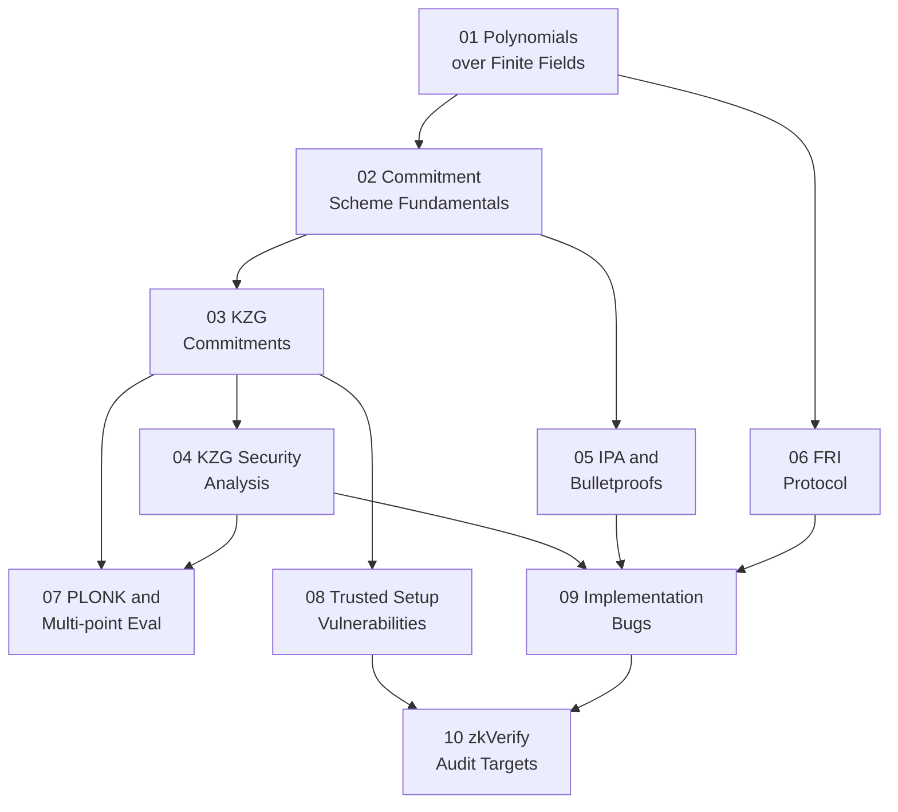

> **Topic**: Polynomial Commitments  
> **Domain**: Cryptography (ZK)  
> **Level**: Advanced  
> **Background**: Modular arithmetic, group theory, elliptic curves cơ bản, Python  
> **Tools / Code**: SageMath, Python (py_ecc), Rust (arkworks)  
> **Context**: Bug bounty trên zkVerify — nắm sâu để audit verifier pallets  
> **Sources**: KZG original paper (Kate et al. 2010), Dankrad Feist's blog, ZKDocs (ToB), ZKP MOOC Berkeley, 0xPARC zk-bug-tracker  

---

## Lessons

| # | Title | Key Concepts | Prerequisites | Difficulty |
|---|-------|-------------|---------------|------------|
| 01 | Polynomials over Finite Fields | Đa thức, evaluation, Lagrange interpolation, FFT domains, Reed-Solomon | — | ★★☆☆☆ |
| 02 | Commitment Scheme Fundamentals | Binding/hiding/correctness, vector commitments, Pedersen, formal definitions | 01 | ★★★☆☆ |
| 03 | KZG Commitments | Trusted setup, SRS, commit, open, verify, batch opening | 02, pairing basics | ★★★★☆ |
| 04 | KZG Security Analysis | t-SDH, evaluation binding proof, knowledge soundness, known attacks | 03 | ★★★★★ |
| 05 | IPA & Bulletproofs-style | Inner Product Argument, Pedersen vector, log-size proof, no trusted setup | 02 | ★★★★☆ |
| 06 | FRI Protocol | Reed-Solomon proximity, commit/query phases, soundness, STARK foundation | 01, IOP concept | ★★★★★ |
| 07 | PLONK & Multi-point Evaluation | PLONK + KZG, linearization, batch multi-poly multi-point proofs | 03, 04 | ★★★★★ |
| 08 | Trusted Setup Vulnerabilities | Toxic waste, Powers of Tau, subgroup attacks, rogue key | 03 | ★★★★☆ |
| 09 | Common Implementation Bugs | Soundness bugs, subgroup check, Fiat-Shamir, transcript, blinding | 03–07 | ★★★★★ |
| 10 | zkVerify Audit Targets | Attack surface zkVerify, verifier pallets, bug patterns, PoC | 08, 09 | ★★★★★ |

## Appendix Candidates

| ID | Content | Related Lesson | Notes |
|----|---------|----------------|-------|
| A0 | Pairing Cheatsheet | 03, 04, 07 | BLS12-381, BN254, tính toán nhanh |
| A1 | Bug Checklist | 08, 09, 10 | Checklist đầy đủ dùng khi audit |

---

## Dependency Graph

---

## Progress Tracker

- [ ] [[00-roadmap|00. Roadmap]]
- [ ] [[01-polynomials-over-finite-fields|01. Polynomials over Finite Fields]]
- [ ] [[02-commitment-scheme-fundamentals|02. Commitment Scheme Fundamentals]]
- [ ] [[03-kzg-commitments|03. KZG Commitments]]
- [ ] [[04-kzg-security-analysis|04. KZG Security Analysis]]
- [ ] [[05-ipa-bulletproofs|05. IPA & Bulletproofs-style]]
- [ ] [[06-fri-protocol|06. FRI Protocol]]
- [ ] [[07-plonk-multi-point-evaluation|07. PLONK & Multi-point Evaluation]]
- [ ] [[08-trusted-setup-vulnerabilities|08. Trusted Setup Vulnerabilities]]
- [ ] [[09-implementation-bugs|09. Common Implementation Bugs]]
- [ ] [[10-zkverify-audit-targets|10. zkVerify Audit Targets]]
- [ ] [[a0-pairing-cheatsheet|A0. Pairing Cheatsheet]]
- [ ] [[a1-bug-checklist|A1. Bug Checklist]]
