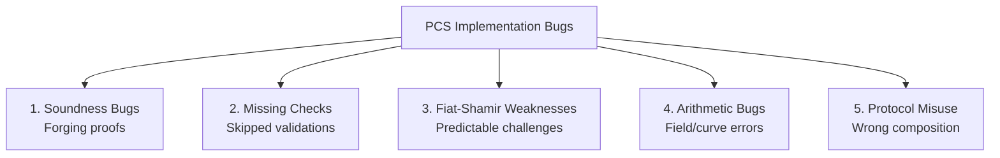

> **Prerequisites**: Bài 03–08 toàn bộ  
> **Objectives**:  
> - Nắm toàn bộ taxonomy các lỗi trong polynomial commitment implementations
> - Hiểu root cause và exploit scenario của từng loại lỗi
> - Biết cách detect mỗi lỗi khi audit
> - Có ví dụ real-world cho mỗi bug class

---

## Taxonomy Lỗi trong PCS

Tất cả bugs trong polynomial commitment implementations thuộc một trong 5 nhóm:



---

## 1. Soundness Bugs

### 1a. Under-constrained Circuits

> [!danger] Bug 9.1 — Under-constrained Circuit (Most Common)
> Circuit không có đủ constraints → prover có thể assign witness sai mà vẫn pass.
>
> **Root cause**: Developer quên thêm một constraint, hoặc viết constraint không hoàn toàn xác định biến.
>
> **Example (Circom)**:
> ```circom
> // BUG: thiếu constraint cho out
> template Multiply() {
>     signal input a;
>     signal input b;
>     signal output out;
>     // Chỉ có: a * b = out  →  OK
>     // Nhưng nếu thêm biến intermediate không constrained:
>     signal intermediate;
>     intermediate <-- a * b;  // assignment không phải constraint!
>     out <-- intermediate;    // BUG: intermediate và out không bị constrained
> }
> // Fix: dùng <== thay vì <--
> ```
>
> **Detect**: Tìm `<--` (assignment) mà không có constraint tương ứng.

### 1b. Missing Polynomial Normalization

> [!danger] Bug 9.2 — Missing Polynomial Normalization (Zendoo)
> Sau phép cộng hay nhân đa thức, bậc thực tế có thể nhỏ hơn bậc khai báo. Nếu verifier check `deg(f) ≤ d` không nghiêm ngặt, prover có thể cheat.
>
> **Real-world**: Zendoo — *Missing Polynomial Normalization after Arithmetic Operations* (0xPARC zk-bug-tracker)

### 1c. FRI Soundness Parameter Quá Nhỏ

> [!danger] Bug 9.3 — Insufficient FRI Security Parameter
> Số queries $t$ trong FRI không đủ để đạt $\lambda$ bits security:
>
> $$t \cdot \log_2\!\left(\frac{1}{1 - \delta}\right) < \lambda$$
>
> **Detect**: Tính lại từ rate $\rho$ và số queries. Nếu rate = 1/2 ($\delta \approx 0.5$), cần $t \geq \lambda$ queries.

---

## 2. Missing Checks

### 2a. Missing Subgroup Check (Critical)

> [!danger] Bug 9.4 — Missing Point-on-Curve / Subgroup Check
> Verifier nhận proof elements $\pi \in \mathbb{G}_1$ mà không verify:
> 1. Điểm nằm trên đường cong (on-curve check)
> 2. Điểm thuộc đúng prime-order subgroup
>
> **Exploit**: Gửi small-order point → pairing cho kết quả cố định → forge verification.
>
> **Detect**: Tìm trong code verify xem có gọi `is_on_curve()` và `multiply(P, r) == infinity` không.

### 2b. Missing Pairing Result Check (Solidity)

> [!danger] Bug 9.5 — Missing Pairing Return Value Check
> Trong Solidity, pairing precompile (address `0x08`) được gọi qua `staticcall`. Nếu không check return value:
>
> ```solidity
> // BUG: không check success
> (bool success, bytes memory result) = address(0x08).staticcall(input);
> bool valid = abi.decode(result, (bool));  // Nếu success=false, result có thể garbage
>
> // FIX:
> (bool success, bytes memory result) = address(0x08).staticcall(input);
> require(success, "Pairing call failed");
> bool valid = abi.decode(result, (bool));
> require(valid, "Pairing check failed");
> ```
>
> **Real-world**: Tìm thấy trong Plonk verifier contract audit (Consensys Diligence).

### 2c. Missing Proof Length Check

> [!danger] Bug 9.6 — Missing Proof Length Validation
> Nếu verifier không check length của proof array, adversary có thể:
> - Gửi proof ngắn hơn → verifier đọc ngoài bounds (revert hoặc dùng giá trị 0)
> - Forge proof bằng cách set một số elements = 0
>
> **Detect**: Tìm `require(proof.length == EXPECTED_LENGTH)` ở đầu hàm verify.

### 2d. Missing ERC20 Approve Check in Circuit

> [!danger] Bug 9.7 — Missing Asset Check in SNARK Circuit
> Circuit prove "tôi đã transfer token" nhưng không check approval/balance trong circuit.
> Smart contract verify proof nhưng không kiểm tra lại on-chain state → double-spend.
>
> **Pattern**: Circuit prove off-chain computation, contract giả định kết quả đúng mà không verify on-chain state.

---

## 3. Fiat-Shamir Weaknesses

### 3a. Frozen Heart — Thiếu Transcript

> [!danger] Bug 9.8 — Frozen Heart Vulnerability (Trail of Bits 2022)
> Fiat-Shamir transform không hash đầy đủ public inputs.
>
> **Protocol**: Interactive proof (commit, challenge, response).
>
> **Attack**: Adversary chọn commit **sau** khi biết challenge (vì challenge không phụ thuộc commit đủ).
>
> **Ví dụ Bulletproofs**:
> - Bình thường: $x = H(\text{com}, \mathbf{G}, \mathbf{H}, C)$
> - Buggy: $x = H(\mathbf{G}, \mathbf{H})$ — commit $C$ không được hash
> - Attack: chọn $C$ sau khi biết $x$, forge inner product proof
>
> **Detect**: Tìm transcript hash function. Verify tất cả commitments, public params, evaluation points đều được hash vào.

### 3b. Predictable Challenge trong Plonk (Weak Fiat-Shamir)

> [!danger] Bug 9.9 — Predictable Plonk Challenge (gamma, beta, alpha, zeta)
> Challenges trong PLONK ($\gamma, \beta, \alpha, \zeta$) phải hash toàn bộ transcript. Nếu một commitment bị bỏ sót:
>
> - Prover có thể fix $\gamma$ và adjust commitments để satisfy constraints sai.
> - Permutation argument collapse.
>
> **Real-world**: Consensys audit — "Predictable random challenge in Plonk verification".

---

## 4. Arithmetic Bugs

### 4a. Wrong Field Arithmetic

> [!danger] Bug 9.10 — Arithmetic over Wrong Field
> KZG hoạt động trên scalar field $\mathbb{F}_r$ của curve (không phải base field $\mathbb{F}_p$). Nhầm lẫn hai trường:
>
> - Modulus $p$ (base field) ≠ modulus $r$ (scalar field / curve order)
> - Dùng sai modulus khi tính hệ số đa thức → commitment sai
>
> **Example**: BLS12-381 có $p \approx 2^{381}$ nhưng $r \approx 2^{255}$ — rất khác nhau.

### 4b. Overflow/Underflow trong Native Arithmetic

> [!danger] Bug 9.11 — Integer Overflow trong Verifier
> Nếu verifier tính $a + b$ trong $\mathbb{Z}$ thay vì $\mathbb{F}_p$ và sau đó reduce mod $p$:
> - Overflow → sai giá trị → reject proof hợp lệ hoặc accept proof sai.
>
> **Detect**: Tìm arithmetic operations không có explicit `% p` hoặc `mod p`.

### 4c. Bit Length Mismatch

> [!danger] Bug 9.12 — Bit Length Mismatch in Range Proofs
> Circuit chứng minh $0 \leq x < 2^n$ nhưng bit decomposition không check đủ bits:
>
> ```circom
> // BUG: chỉ check n-1 bits, bits[n-1] tự do
> for (var i = 0; i < n-1; i++) {
>     bits[i] * (bits[i] - 1) === 0;  // bits[n-1] không bị constrained!
> }
> ```

---

## 5. Protocol Misuse

### 5a. Missing Blinding Factors (Zero-knowledge Break)

> [!danger] Bug 9.13 — Missing Blinding Factors (Dusk Plonk)
> Trong PLONK, prover polynomials phải được "blinded" bằng random terms để preserve zero-knowledge. Thiếu blinding → witness có thể extract từ proof.
>
> **Real-world**: Dusk Network's Plonk implementation thiếu blinding factors trên một số wire polynomials — private inputs có thể leak.
>
> **Detect**: Tìm trong prover code nơi $a(X), b(X), c(X)$ được build — có random terms được thêm vào không?

### 5b. Non-Committing Encryption trong Circuit

> [!danger] Bug 9.14 — Non-Committing Encryption (Aleo)
> Circuit dùng encryption scheme không commit cứng (malleable) — adversary có thể swap ciphertext sau khi tạo proof mà proof vẫn valid.
>
> **Real-world**: Aleo — *Non-Committing Encryption Used in InputID::Private* (0xPARC zk-bug-tracker).

### 5c. SRS Degree Too Small

> [!danger] Bug 9.15 — SRS Degree Insufficient
> KZG setup chỉ hỗ trợ đa thức đến bậc $d$, nhưng circuit/witness cần bậc $> d$.
>
> - Nếu code không check: prover tính sai (dùng SRS elements ngoài range → undefined behavior).
> - Nếu code check và throw: DoS trên verifier.
>
> **Detect**: Verify $d_\text{circuit} \leq d_\text{SRS}$ với margin.

---

## Audit Checklist Tổng hợp

Khi audit một polynomial commitment implementation:

```
SOUNDNESS
[ ] Tất cả circuit signals có constraints? (không có <-- không có <==)
[ ] Polynomial degree checks đúng?
[ ] FRI security parameter đủ?

MISSING CHECKS  
[ ] Point-on-curve check cho tất cả curve inputs?
[ ] Subgroup membership check?
[ ] Proof length/format validation?
[ ] Pairing precompile return value checked?

FIAT-SHAMIR
[ ] Tất cả commitments trong hash?
[ ] Tất cả public inputs trong hash?
[ ] Evaluation points trong hash?
[ ] Domain separator / unique tags?

ARITHMETIC
[ ] Đúng field (scalar vs base)?
[ ] Overflow protection?
[ ] Bit decomposition đầy đủ?

PROTOCOL
[ ] Blinding factors có trong prover polynomials?
[ ] SRS degree đủ cho circuit?
[ ] Commitment scheme phù hợp use case (binding vs hiding)?
```

---

## Tóm tắt

Năm nhóm lỗi chính:

1. **Soundness bugs**: under-constrained circuits, thiếu polynomial degree check, FRI parameter yếu.
2. **Missing checks**: subgroup membership, on-curve, pairing return value, proof length.
3. **Fiat-Shamir weaknesses**: Frozen Heart (thiếu transcript), predictable challenge.
4. **Arithmetic bugs**: wrong field, overflow, bit length mismatch.
5. **Protocol misuse**: thiếu blinding, non-committing encryption, SRS quá nhỏ.

---

## References

- 0xPARC — *ZK Bug Tracker* — https://github.com/0xPARC/zk-bug-tracker
- ZKSecurity — *zkbugs repo with PoC* — https://github.com/zksecurity/zkbugs
- Trail of Bits — *Frozen Heart: Bulletproofs* — https://blog.trailofbits.com/2022/04/15/the-frozen-heart-vulnerability-in-bulletproofs/
- Consensys Diligence — *Plonk verifier audit findings*
- HackMD — *Vulnerability in ZKP* — https://hackmd.io/@3o3SyLkdRHyclM6GoUbn6g/H1UNISeac
- CertiK — *Advanced Formal Verification of ZKP: A Tale of Two Bugs*
