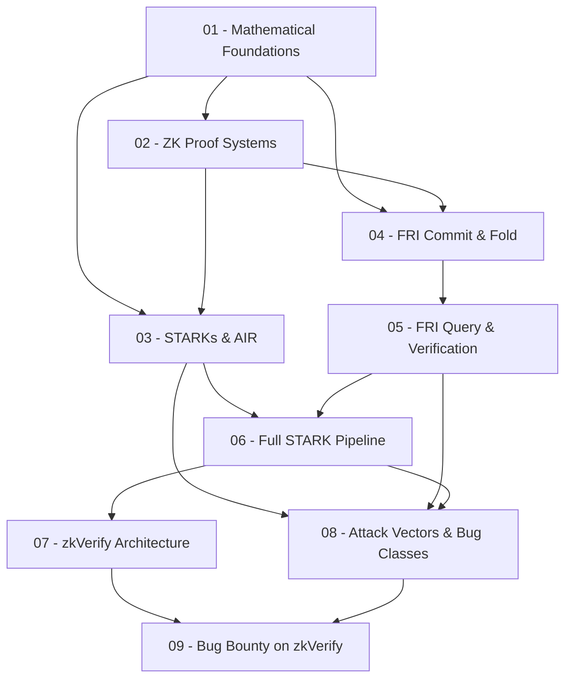

> **Topic**: STARKs & FRI Protocol — Bug Bounty trên zkVerify  
> **Domain**: Cryptography (ZK Proof Systems)  
> **Level**: Intermediate → Advanced (CTF / Audit focused)  
> **Background**: Số học modular, polynomial arithmetic  
> **Tools / Code**: Python (lý thuyết) + Rust (thực chiến, winterfell / zkVerify codebase)  
> **Sources**: aszepieniec/stark-anatomy, eprint.iacr.org/2018/046, LambdaClass FRI blog, SRL audit report, Immunefi zkVerify, SoK ZKP vulnerabilities  

---

## Lessons

| # | Title | Key Concepts | Prerequisites | Difficulty |
|---|-------|-------------|---------------|------------|
| 01 | Mathematical Foundations | Finite fields $\mathbb{F}_p$, polynomial rings, roots of unity, FFT/NTT, Reed-Solomon codes, Schwartz-Zippel lemma | Số học modular | ★★☆☆☆ |
| 02 | Zero-Knowledge Proof Systems | Completeness, soundness, zero-knowledge, Interactive Proofs, IOP model, Fiat-Shamir transform | 01 | ★★★☆☆ |
| 03 | STARKs Overview & Arithmetization (AIR) | Execution trace, boundary constraints, transition constraints, AIR, quotient polynomials, zerofiers | 01, 02 | ★★★☆☆ |
| 04 | FRI Protocol — Commit & Fold | Low-degree testing, Reed-Solomon IOPP, commit phase, folding mechanism (split-and-fold), domain halving | 01, 02 | ★★★★☆ |
| 05 | FRI Protocol — Query & Verification | Query phase, decommitment, Merkle authentication paths, batching FRI, soundness error analysis | 04 | ★★★★☆ |
| 06 | Full STARK Pipeline | STARK IOP end-to-end, prover/verifier flow, non-interactive via Fiat-Shamir, proof size & complexity | 03, 04, 05 | ★★★★☆ |
| 07 | zkVerify Architecture | zkVerify node architecture, supported proof systems (STARK, PLONK, Groth16), on-chain verifier design, Substrate pallets | 06 | ★★★☆☆ |
| 08 | Attack Vectors & Bug Classes | Soundness bugs, under/over-constrained AIR, Fiat-Shamir weaknesses, Merkle tree attacks, field arithmetic bugs, implementation flaws | 03–06 | ★★★★★ |
| 09 | Bug Bounty Mindset on zkVerify | Audit methodology, reading Rust ZK code, fuzzing strategies, PoC construction, scope & reporting | 07, 08 | ★★★★★ |

## Appendix Candidates

| ID | Content | Related Lesson | Notes |
|----|---------|----------------|-------|
| A0 | Mathematical Reference Sheet | 01 | Finite field formulas, FFT butterfly diagram, Schwartz-Zippel bound |
| A1 | FRI Full Pseudocode & Parameter Guide | 04, 05 | Complete prover/verifier pseudocode, blowup factor, security bit calculation |
| A2 | STARK/FRI Bug Cheatsheet | 08, 09 | Categorized vulnerability patterns, audit checklist cho zkVerify |

---

## Dependency Graph

---

## Progress Tracker

- [ ] [[00-roadmap|00. Roadmap]]
- [ ] [[01-mathematical-foundations|01. Mathematical Foundations]]
- [ ] [[02-zero-knowledge-proof-systems|02. Zero-Knowledge Proof Systems]]
- [ ] [[03-starks-air-arithmetization|03. STARKs Overview & Arithmetization (AIR)]]
- [ ] [[04-fri-commit-fold|04. FRI Protocol — Commit & Fold]]
- [ ] [[05-fri-query-verification|05. FRI Protocol — Query & Verification]]
- [ ] [[06-full-stark-pipeline|06. Full STARK Pipeline]]
- [ ] [[07-zkverify-architecture|07. zkVerify Architecture]]
- [ ] [[08-attack-vectors-bug-classes|08. Attack Vectors & Bug Classes]]
- [ ] [[09-bug-bounty-mindset|09. Bug Bounty Mindset on zkVerify]]
- [ ] [[A0-math-reference|A0. Mathematical Reference Sheet]]
- [ ] [[A1-fri-pseudocode|A1. FRI Full Pseudocode & Parameter Guide]]
- [ ] [[A2-bug-cheatsheet|A2. STARK/FRI Bug Cheatsheet]]
