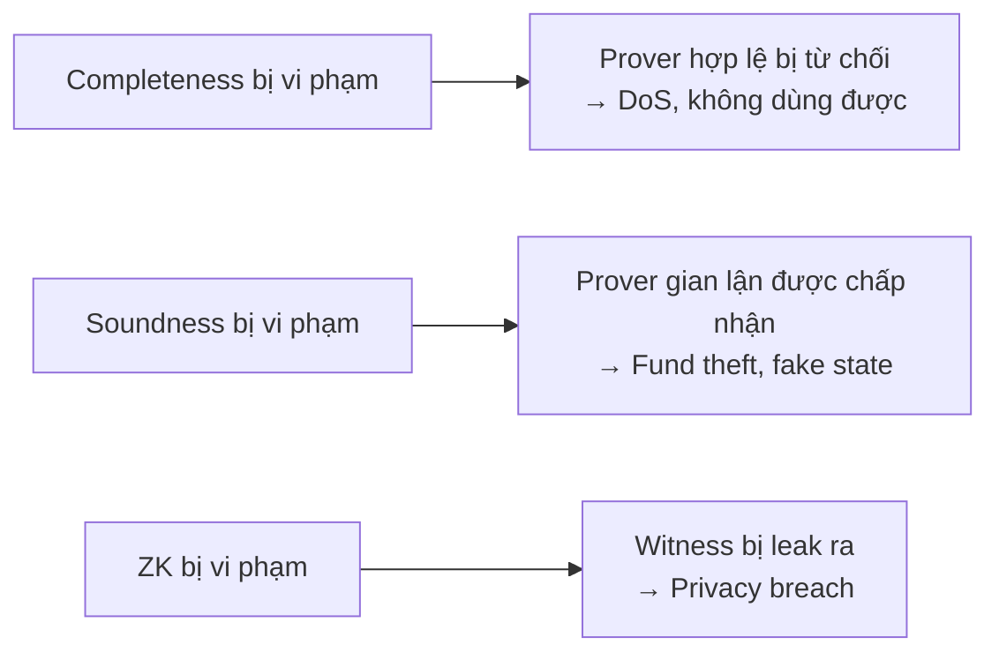
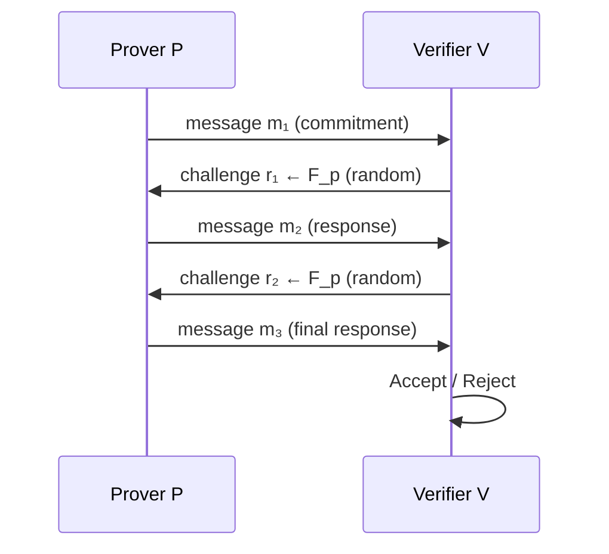
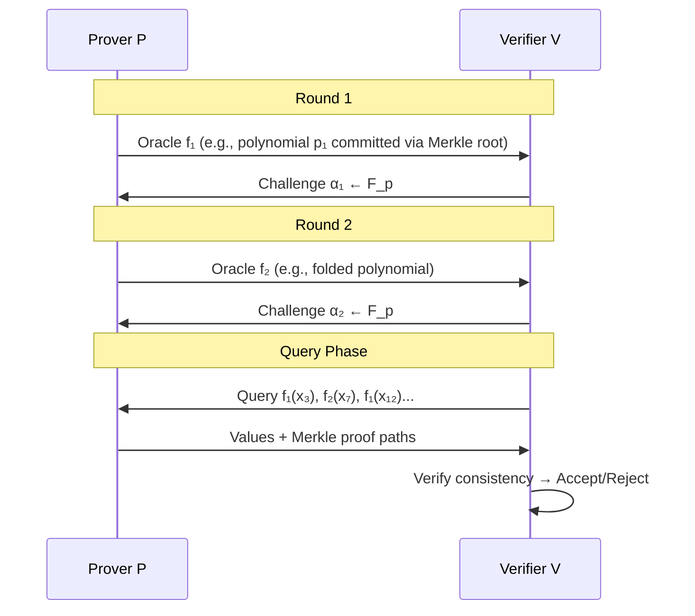
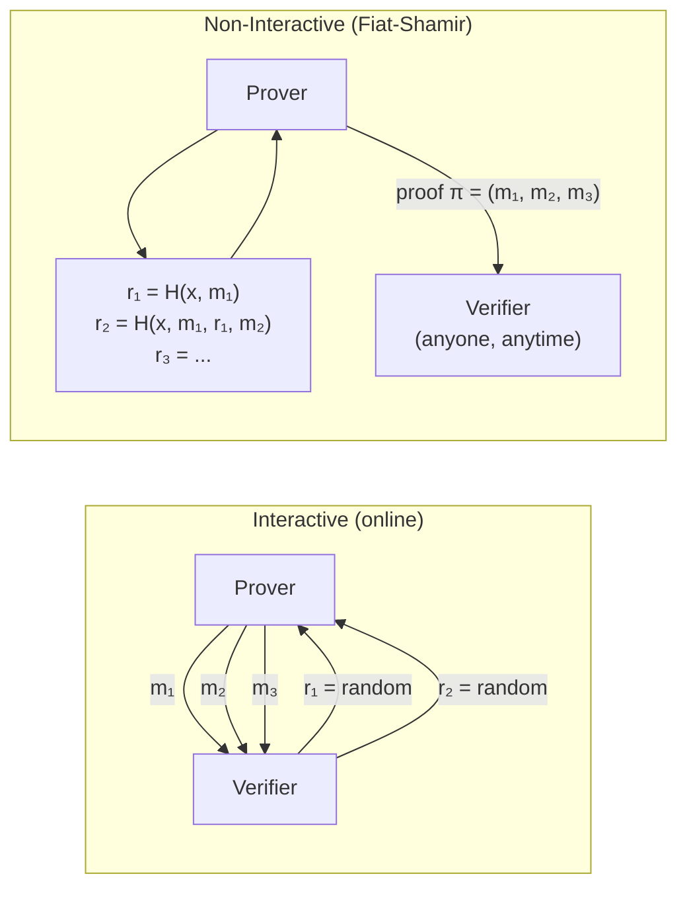
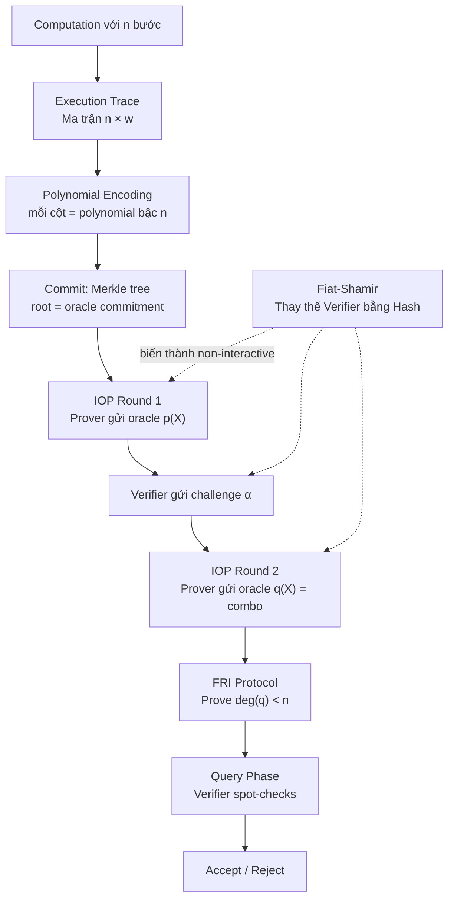
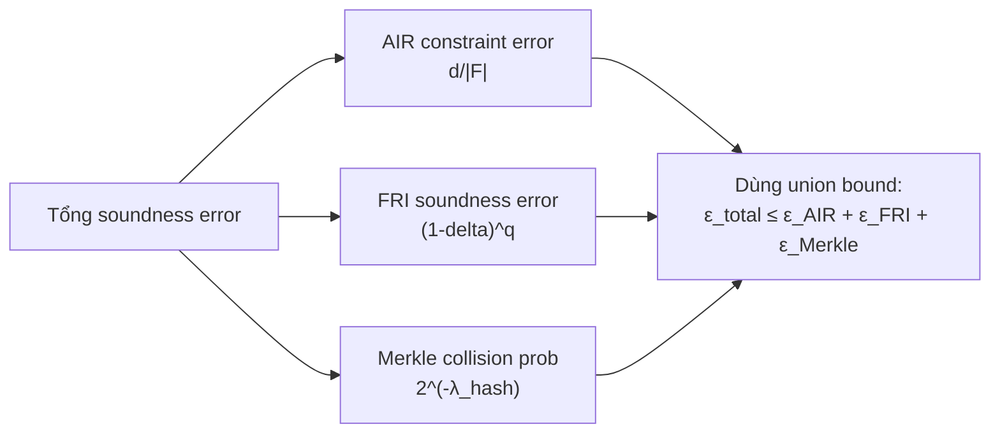
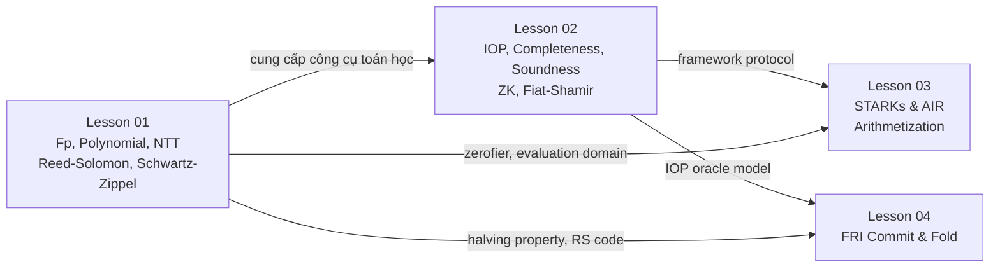

> **Prerequisites**: [[01-mathematical-foundations|Lesson 01]] — Trường hữu hạn, Schwartz-Zippel Lemma, polynomial  
> **Objectives**:  
> - Hiểu ba tính chất cốt lõi: Completeness, Soundness, Zero-Knowledge
> - Phân biệt các loại proof system: IP, PCP, IOP
> - Nắm IOP model — nền tảng trực tiếp của STARK
> - Hiểu Fiat-Shamir transform: biến interactive proof thành non-interactive
> - Nhận ra các attack vector liên quan đến Fiat-Shamir trong thực tế

---

## Motivation

Bài 01 đã cho ta nền toán học. Bài này trả lời câu hỏi cao hơn: **ZK proof là gì, và STARK nằm ở đâu trong bức tranh lớn?**

Có một câu hỏi cơ bản mà mọi proof system phải trả lời:

> *Prover có thể thuyết phục Verifier rằng một câu lệnh là đúng — mà không tiết lộ lý do tại sao nó đúng?*

Câu trả lời là có, và hệ thống để làm điều đó gọi là **Zero-Knowledge Proof**. STARK là một loại ZK proof cụ thể, được xây dựng trên nền tảng gọi là **Interactive Oracle Proof (IOP)**.

---

## Ba Tính Chất Cốt Lõi

Mọi ZK proof system đều phải thỏa mãn ba tính chất. Hiểu chúng chính xác là rất quan trọng khi audit — bug nào cũng vi phạm ít nhất một trong ba.

> [!definition] Definition 2.1 — Proof System
> Một **proof system** cho ngôn ngữ $L$ là một cặp thuật toán $(P, V)$ (Prover và Verifier), trong đó:
> - $P$ nhận vào **statement** $x$ và **witness** $w$ (bằng chứng bí mật)
> - $V$ nhận vào $x$ và kết quả tương tác với $P$
> - Kết quả: $V$ output **accept** hoặc **reject**

> [!definition] Definition 2.2 — Completeness (Tính Đầy Đủ)
> Nếu statement là **đúng** (tức là $(x, w) \in R$ với một witness $w$ hợp lệ), thì honest prover có thể thuyết phục honest verifier với xác suất rất cao:
>
> $$\Pr[V \text{ accepts} \mid (x, w) \in R,\ P \text{ honest}] \geq 1 - \text{negl}(\lambda)$$
>
> *Hiểu nôm na*: "Người nói thật luôn thắng."

> [!definition] Definition 2.3 — Soundness (Tính Vững Chắc)
> Nếu statement là **sai** (không có witness hợp lệ nào tồn tại), thì không có prover nào (kể cả malicious) có thể thuyết phục verifier chấp nhận, ngoại trừ với xác suất rất nhỏ:
>
> $$\Pr[V \text{ accepts} \mid x \notin L,\ P^* \text{ arbitrary}] \leq \epsilon_{\text{sound}}(\lambda)$$
>
> Ở đây $\epsilon_{\text{sound}}$ là **soundness error** — càng nhỏ càng tốt.
>
> *Hiểu nôm na*: "Kẻ nói dối không thể qua mặt."

> [!definition] Definition 2.4 — Zero-Knowledge (Không Tiết Lộ Gì Thêm)
> Những gì verifier học được từ tương tác với honest prover không nhiều hơn việc biết "statement đúng". Chính xác hơn: tồn tại một **simulator** $S$ chỉ biết $x$ (không biết $w$) mà output một "transcript" không thể phân biệt được với transcript thật:
>
> $$\{(P(x, w), V(x))\} \approx_c \{S(x)\}$$
>
> *Hiểu nôm na*: "Verifier không học được gì bí mật từ proof."

### Tại sao ba tính chất này quan trọng với bug bounty?



> [!danger] Bug Hunter Insight
> **Soundness bug là nguy hiểm nhất** với tiền thưởng cao nhất. Nó cho phép prover tạo proof "hợp lệ" cho một câu lệnh **sai** — ví dụ: chứng minh mint token không có backing, hoặc double-spend.
>
> Trong zkVerify context: một soundness bug = attacker có thể submit proof giả cho verification pallet, khiến chain chấp nhận transaction không hợp lệ.

---

## Các Loại Proof System: Lộ Trình Đến STARK

### Interactive Proof (IP)

> [!definition] Definition 2.5 — Interactive Proof (IP)
> Prover và Verifier **trao đổi nhiều message** qua lại. Verifier gửi **challenges ngẫu nhiên**, Prover trả lời. Cuối cùng Verifier accept/reject.
>
> Ký hiệu: $(P \leftrightarrow V)(x)$



*Bất kỳ STARK proof nào cũng bắt đầu từ dạng này trước khi áp dụng Fiat-Shamir.*

**Hạn chế của IP**: cần interactive — prover và verifier phải online cùng lúc. Không thể post proof lên blockchain một lần cho ai cũng verify được.

### Probabilistically Checkable Proof (PCP)

> [!definition] Definition 2.6 — PCP (Probabilistically Checkable Proof)
> Prover viết một **proof string** dài $\pi$. Verifier chỉ **đọc một số vị trí ngẫu nhiên** của $\pi$ (không đọc hết), rồi accept/reject.
>
> **PCP Theorem** (1992): Mọi ngôn ngữ NP đều có PCP trong đó verifier chỉ cần đọc $O(1)$ bits!

**Hạn chế của PCP**: proof string phải được "commit" trước, rồi verifier query — nhưng nếu gửi toàn bộ proof string thì quá lớn.

### Interactive Oracle Proof (IOP) — Nền tảng của STARK

IOP kết hợp điểm mạnh của cả IP và PCP:

> [!definition] Definition 2.7 — Interactive Oracle Proof (IOP)
> Giống IP: Prover và Verifier **tương tác nhiều rounds**. Mỗi round, prover gửi một **oracle** $f_i$ (một hàm). Verifier có thể **query oracle tại bất kỳ điểm nào** — nhưng chỉ được query **một số nhỏ** điểm tổng cộng.
>
> Formal: Sau round $i$, verifier có query access tới $f_1, f_2, \ldots, f_i$ nhưng chỉ tại những điểm mà verifier tự chọn.



*IOP là mô hình chính xác mà FRI và STARK sử dụng. Prover "commit" polynomial qua Merkle root, verifier query tại điểm ngẫu nhiên.*

**Tại sao IOP cho phép sublinear verification?**

Verifier không cần đọc toàn bộ proof. Verifier chỉ query $O(\log n)$ hoặc $O(\lambda)$ điểm ngẫu nhiên. Nếu proof sai tại bất kỳ điểm nào, Schwartz-Zippel đảm bảo rằng query ngẫu nhiên sẽ phát hiện ra với xác suất cao.

---

## Public-Coin vs Private-Coin

> [!definition] Definition 2.8 — Public-Coin Protocol
> Verifier chỉ gửi **random coins** (thực sự ngẫu nhiên và công khai). Không có logic phức tạp phía verifier — mọi thông tin verifier gửi đều là randomness thuần túy.
>
> STARK là **public-coin**: mọi challenge của verifier đều là random field elements.

Tính chất public-coin rất quan trọng vì nó cho phép áp dụng Fiat-Shamir transform.

---

## SNARK vs STARK: Phân Loại Nhanh

Trước khi đi sâu vào IOP, cần đặt STARK trong bức tranh lớn:

| Tính chất | SNARK | STARK |
|-----------|-------|-------|
| Trusted setup | Cần (toxic waste) | Không cần (transparent) |
| Proof size | Nhỏ (O(1)) | Lớn hơn (O(log² n)) |
| Verifier time | O(1) | O(log² n) |
| Post-quantum | Không (pairing-based) | Có (hash-based) |
| Mô hình | Linear PCP / Poly commit | IOP + FRI |
| Ví dụ | Groth16, PlonK | StarkWare, zkVerify |

> [!note] Tại sao zkVerify dùng STARK?
> zkVerify là một **proof aggregation network** — nó verify nhiều loại proof. Không cần trusted setup (transparent) là ưu điểm quan trọng cho decentralization. Tuy nhiên proof size lớn hơn SNARK là đánh đổi cần chấp nhận.

---

## Fiat-Shamir Transform

Đây là kỹ thuật then chốt biến **interactive proof → non-interactive proof** (NARK/STARK).

### Ý tưởng cốt lõi

Trong IP, verifier gửi random challenges $r_1, r_2, \ldots$. Prover phải chờ để nhận từng challenge.

Fiat-Shamir nói: **thay thế verifier bằng một hash function**. Prover tự tính challenge bằng cách hash toàn bộ transcript trước đó:

$$r_i = H(\text{context} \| m_1 \| m_2 \| \ldots \| m_{i-1})$$

> [!definition] Definition 2.9 — Fiat-Shamir Transform
> Cho một public-coin interactive proof $(P, V)$ với rounds $(m_1, r_1, m_2, r_2, \ldots, m_k)$:
>
> **Fiat-Shamir non-interactive version**: Prover tự tính mọi challenge bằng hash:
>
> $$r_i = H(\text{instance} \| m_1 \| r_1 \| m_2 \| r_2 \| \ldots \| m_i)$$
>
> Proof $\pi = (m_1, m_2, \ldots, m_k)$. Verifier chỉ cần kiểm tra rằng mỗi $r_i$ được tính đúng từ hash, rồi verify acceptance condition.



*Sau Fiat-Shamir: prover tạo proof offline, bất kỳ verifier nào cũng có thể verify bất cứ lúc nào — lý tưởng cho blockchain.*

### Security model: Random Oracle Model (ROM)

Fiat-Shamir chỉ provably secure trong **Random Oracle Model** — coi hash function $H$ là một hàm ngẫu nhiên lý tưởng.

> [!theorem] Theorem 2.10 — Fiat-Shamir Security (informal)
> Nếu IP ban đầu có soundness error $\epsilon$ và $k$ rounds, thì Fiat-Shamir non-interactive version có soundness error $\approx \epsilon \cdot q_H$ trong Random Oracle Model, với $q_H$ là số queries tới random oracle.
>
> Trong thực tế: dùng SHA-256, BLAKE3, hoặc Poseidon (ZK-friendly) làm hash function.

---

## Fiat-Shamir Attack Vectors — Quan Trọng cho Bug Bounty

Đây là phần **quan trọng nhất** trong Lesson 02 từ góc độ bug hunting.

### Attack 1: Weak Fiat-Shamir (thiếu domain separation)

> [!danger] Bug Class: Weak Fiat-Shamir
> **Vấn đề**: Khi tính challenge, prover không hash đủ context — ví dụ bỏ qua `instance` hoặc một số `mᵢ` trước đó.
>
> **Hậu quả**: Prover có thể **replay proof** từ context khác, hoặc **grind challenges** để tạo proof giả.
>
> **Ví dụ cụ thể**:
> ```
> // ĐÚNG: hash toàn bộ transcript + instance
> r_i = H(instance || m_1 || r_1 || ... || m_i)
>
> // SAI: thiếu instance
> r_i = H(m_1 || r_1 || ... || m_i)
> // → Proof của statement A có thể reuse cho statement B
> ```

### Attack 2: Challenge không cover đủ messages

> [!danger] Bug Class: Incomplete Transcript Hashing
> **Vấn đề**: Challenge $r_i$ không bao gồm một số message $m_j$ trong transcript.
>
> **Hậu quả**: Prover có thể **chọn $m_j$ sau khi biết challenge** — phá vỡ tính ngẫu nhiên.
>
> Đây là lỗi phổ biến nhất khi implement Fiat-Shamir thủ công.

### Attack 3: Transcript malleability

> [!danger] Bug Class: Transcript Malleability
> **Vấn đề**: Proof $\pi = (m_1, \ldots, m_k)$ không ràng buộc với một **specific statement/instance**. Attacker có thể modify $\pi$ để tạo valid proof cho statement khác.
>
> **Fix**: Luôn include statement $x$ (instance) vào hash đầu tiên:
> ```
> r_1 = H(domain_separator || instance || m_1)
> ```

### Attack 4: Grinding Attack

> [!danger] Bug Class: Insufficient Soundness → Grinding
> **Vấn đề**: Soundness error $\epsilon$ quá lớn cho một Fiat-Shamir proof (so với interactive version).
>
> **Cơ chế**: Trong interactive proof, prover không thể "thử lại" vì verifier chọn random challenge. Nhưng trong Fiat-Shamir, prover có thể chạy hash function $2^{1/\epsilon}$ lần để tìm transcript "may mắn" pass verification.
>
> **Ví dụ**: Nếu soundness error $\epsilon = 2^{-20}$, prover cần thử $\approx 2^{20} = 1M$ lần — hoàn toàn feasible!
>
> **Fix**: Cần soundness error $\epsilon \leq 2^{-\lambda}$ với $\lambda$ là security parameter (thường $\geq 128$).

```python
# Demo: Grinding attack simulation
import hashlib
import struct

def simulate_grinding_attack(soundness_bits: int, max_attempts: int = 100_000):
    """
    Minh họa: nếu soundness error = 2^(-soundness_bits),
    attacker cần bao nhiêu lần thử để "tìm" được challenge thỏa mãn?
    
    Đây là demo giáo dục — không phải real attack.
    """
    target_prefix_bits = soundness_bits  # "challenge phải có prefix 0^k"
    target_mask = (1 << target_prefix_bits) - 1  # mask cho k bits đầu
    
    for attempt in range(1, max_attempts + 1):
        # Prover thử các "nonce" khác nhau
        nonce = struct.pack(">Q", attempt)
        challenge_bytes = hashlib.sha256(b"fake_transcript" + nonce).digest()
        challenge_int = int.from_bytes(challenge_bytes[:4], 'big')
        
        # Kiểm tra xem challenge có "thuận lợi" cho attacker không
        if (challenge_int & target_mask) == 0:
            return attempt
    
    return None

print("=== Grinding Attack Demo ===")
print("(Số lần thử trung bình để tìm 'favorable' challenge)\n")

for bits in [8, 16, 20]:
    successes = []
    for trial in range(50):
        attempts = simulate_grinding_attack(bits, max_attempts=10**6)
        if attempts:
            successes.append(attempts)
    
    avg = sum(successes) / len(successes) if successes else float('inf')
    theoretical = 2 ** bits
    print(f"Soundness = 2^(-{bits}): avg attempts = {avg:.0f} (theoretical ≈ {theoretical})")

print("\nKết luận: soundness 2^(-20) là KHÔNG AN TOÀN — cần ≥ 2^(-128)")
```

---

## IOP Formal Definition — STARK Ready

Giờ ta đã có đủ background để định nghĩa IOP chính xác cho STARK:

> [!definition] Definition 2.11 — IOP for Relation $R$
> Một **$k$-round IOP** cho relation $R$ là protocol $(P, V)$ trong đó:
>
> - **Round $i$**: Prover gửi oracle $f_i : D_i \to \mathbb{F}$. Verifier gửi challenge $\alpha_i \leftarrow \mathbb{F}$ (ngẫu nhiên).
> - **Query phase**: Verifier query tổng cộng $q$ điểm (tổng cộng qua mọi oracle).
> - **Decision**: Verifier accept iff mọi consistency check pass.
>
> **Complexity**: Prover chạy trong $O(n \log n)$, Verifier chạy trong $O(q \cdot \log n)$ với $q = O(\lambda)$.
>
> **STARK = IOP (polynomial oracles) + FRI (low-degree testing) + Fiat-Shamir (non-interactive)**

### STARK như một IOP: Overview sơ bộ



*Lesson 06 sẽ đi chi tiết toàn bộ pipeline này. Ở đây chỉ cần hiểu STARK = IOP + FRI + FS.*

---

## Completeness và Soundness trong IOP

Với STARK cụ thể, hai tính chất này có dạng:

> [!definition] Definition 2.12 — Completeness của STARK IOP
> Nếu prover **có** witness hợp lệ (execution trace đúng), thì prover **luôn** pass tất cả IOP checks:
>
> $$\Pr[\text{STARK verify passes} \mid \text{valid witness}] = 1$$

> [!definition] Definition 2.13 — Soundness của STARK IOP
> Nếu prover **không có** witness hợp lệ (computation sai), thì:
>
> $$\Pr[\text{STARK verify passes} \mid \text{no valid witness}] \leq \epsilon_{\text{sound}}$$
>
> Với STARK: $\epsilon_{\text{sound}} \approx \frac{\text{deg}}{|\mathbb{F}|} \times \frac{\text{num queries}}{|D|}$

### Cách tính soundness budget trong STARK

Soundness tổng hợp của STARK đến từ nhiều nguồn:



> [!danger] Bug Hunter Note — Soundness Budget Miscalculation
> Một lỗi tinh tế khi audit STARK: implementation **cộng sai soundness budget** — ví dụ quên tính soundness của một phase, hoặc dùng tham số FRI không đủ để đạt $\lambda = 128$ bits security.
>
> Khi đọc code zkVerify, luôn kiểm tra:
> - `num_queries` trong FRI có đủ không?
> - Hash function có đủ bit output không? (SHA-256: 256 bits, Poseidon: thường 254 bits)
> - Challenge domain có đủ lớn không?

---

## Zero-Knowledge trong STARK

STARK thông thường chỉ là **argument of knowledge** (không phải zero-knowledge đầy đủ). Để thêm ZK:

> [!note] Remark — ZK-STARK vs Argument-STARK
> - **STARK không có ZK**: Prover commit toàn bộ execution trace. Verifier query trace trực tiếp → có thể learn witness.
> - **ZK-STARK**: Thêm **randomization**: pad trace với random values, commit masked polynomial. Verifier vẫn verify correctness nhưng không learn witness.
>
> Trong zkVerify context: mục tiêu chính là **succinctness** (proof nhỏ, verify nhanh), không phải privacy. ZK là bonus.

---

## Proof of Knowledge (PoK)

> [!definition] Definition 2.14 — Proof of Knowledge
> Một proof system là **Proof of Knowledge** nếu tồn tại một **extractor** $E$ sao cho: bất kỳ prover $P^*$ nào pass verification với xác suất $> \epsilon$ đều có thể bị $E$ "extract" witness từ đó.
>
> Formal: $\Pr[E^{P^*}(x) \in R(x)] \geq \Pr[P^*(x) \text{ accepts}] - \epsilon$

STARK là một **Argument of Knowledge** (thay vì Proof of Knowledge) vì nó dựa trên cryptographic assumptions (collision-resistant hash). Nếu hash bị break, extractor không hoạt động.

---

## Implementation: Mô phỏng Fiat-Shamir Transcript

```python
# =============================================================
# Fiat-Shamir Transform — Python Implementation
# =============================================================
import hashlib
import struct
from typing import List, Tuple, Any

class FiatShamirTranscript:
    """
    Một transcript object quản lý Fiat-Shamir challenges.
    Thiết kế theo pattern trong nhiều STARK implementation thực tế
    (winterfell, lambdaworks, etc.)
    """
    
    def __init__(self, domain_separator: bytes, instance: bytes):
        """
        domain_separator: identifier cho proof system (tránh cross-protocol attack)
        instance: public statement x (PHẢI include để tránh transcript malleability)
        """
        self._state = hashlib.sha256()
        # QUAN TRỌNG: include domain separator và instance ngay từ đầu
        self._state.update(domain_separator)
        self._state.update(instance)
        self._transcript: List[bytes] = []
    
    def append_message(self, label: bytes, message: bytes):
        """Thêm message vào transcript (prover gửi oracle/commitment)"""
        # Include label để tránh type confusion giữa các messages
        self._state.update(label)
        self._state.update(len(message).to_bytes(4, 'big'))
        self._state.update(message)
        self._transcript.append((label, message))
    
    def get_challenge(self, label: bytes, field_modulus: int) -> int:
        """
        Lấy challenge ngẫu nhiên từ transcript (Fiat-Shamir).
        Challenge = H(current_state || label) mod p
        """
        h = self._state.copy()
        h.update(label)
        digest = h.digest()
        # Convert hash to field element
        challenge_int = int.from_bytes(digest, 'big') % field_modulus
        # Append challenge vào state để future challenges phụ thuộc vào nó
        self._state.update(label)
        self._state.update(digest)
        return challenge_int
    
    def get_challenge_bits(self, label: bytes, n_bits: int) -> int:
        """Lấy n_bits ngẫu nhiên (cho index sampling trong FRI query phase)"""
        h = self._state.copy()
        h.update(label)
        digest = h.digest()
        result = int.from_bytes(digest, 'big') & ((1 << n_bits) - 1)
        self._state.update(label)
        self._state.update(digest)
        return result

# -------------------------------------------------------
# Demo: Non-interactive proof simulation với Fiat-Shamir
# -------------------------------------------------------
def demo_fiat_shamir_protocol():
    """
    Mô phỏng một interactive proof 3-round đơn giản:
    Prover muốn prove: "Tôi biết x sao cho x^2 ≡ y (mod p)"
    (Ví dụ đơn giản, không phải STARK thực sự)
    """
    p = 10**9 + 7  # prime
    
    # Statement (public): y
    # Witness (bí mật): x
    x_witness = 12345
    y_statement = pow(x_witness, 2, p)
    
    print(f"Statement: y = {y_statement} = {x_witness}^2 mod {p}")
    print(f"Witness: x = {x_witness} (bí mật — prover biết)\n")
    
    # ---- Prover: tạo proof ----
    import random
    
    instance_bytes = y_statement.to_bytes(8, 'big')
    transcript = FiatShamirTranscript(
        domain_separator=b"demo_squareroot_v1",
        instance=instance_bytes
    )
    
    # Round 1: Prover commit tới r ngẫu nhiên
    r = random.randint(1, p - 1)
    commitment_t = pow(r, 2, p)   # t = r^2 mod p
    transcript.append_message(b"commitment", commitment_t.to_bytes(8, 'big'))
    
    # Fiat-Shamir: lấy challenge từ hash thay vì từ verifier
    challenge_c = transcript.get_challenge(b"challenge_1", p)
    
    # Round 2: Prover tính response
    # s = r * x^c mod p (multiplicative form for square root)
    response_s = (r * pow(x_witness, challenge_c, p)) % p
    transcript.append_message(b"response", response_s.to_bytes(8, 'big'))
    
    proof = {
        "commitment_t": commitment_t,
        "response_s": response_s,
        "y_statement": y_statement
    }
    
    print(f"Proof: t = {commitment_t}, s = {response_s}")
    
    # ---- Verifier: verify proof ----
    instance_bytes_v = proof["y_statement"].to_bytes(8, 'big')
    transcript_v = FiatShamirTranscript(
        domain_separator=b"demo_squareroot_v1",  # phải dùng đúng domain separator
        instance=instance_bytes_v
    )
    
    transcript_v.append_message(b"commitment", proof["commitment_t"].to_bytes(8, 'big'))
    challenge_c_v = transcript_v.get_challenge(b"challenge_1", p)
    
    # Verify: s^2 ≡ t * y^c (mod p)
    lhs = pow(response_s, 2, p)
    rhs = (commitment_t * pow(y_statement, challenge_c_v, p)) % p
    
    print(f"\nVerifier recomputes challenge: c = {challenge_c_v}")
    print(f"Check: s^2 = {lhs}")
    print(f"Check: t * y^c = {rhs}")
    print(f"Verify: {'PASS ✓' if lhs == rhs else 'FAIL ✗'}")
    
    return lhs == rhs

demo_fiat_shamir_protocol()
```

---

## Implementation: Rust — Transcript Pattern (winterfell style)

```rust
// =============================================================
// Fiat-Shamir Transcript — Rust Pattern (như winterfell)
// Đây là sketch API, không compile standalone
// =============================================================

// winterfell dùng struct Transcript với pattern tương tự:
// use winter_crypto::{hashers::Blake3_256, Hasher};
// use winter_prover::Transcript;

// Pattern điển hình trong STARK implementation:

// struct ProofTranscript<H: Hasher> {
//     state: H::Digest,
//     channel: Vec<u8>,
// }
//
// impl<H: Hasher> ProofTranscript<H> {
//     pub fn new(context: &[u8]) -> Self { ... }
//
//     // Prover gửi oracle commitment (Merkle root)
//     pub fn commit_poly(&mut self, root: H::Digest) {
//         self.channel.extend_from_slice(root.as_bytes());
//         self.state = H::merge(&[self.state, root]);
//     }
//
//     // Fiat-Shamir: lấy verifier challenge
//     pub fn draw_challenge(&mut self) -> FieldElement {
//         let hash = H::hash(self.state.as_bytes());
//         self.state = hash;
//         FieldElement::from_raw_unchecked(u64::from_le_bytes(...))
//     }
//
//     // Lấy query positions (cho FRI query phase)
//     pub fn draw_query_positions(&mut self, count: usize, domain_size: usize) -> Vec<usize> {
//         (0..count).map(|i| {
//             let hash = H::hash_many(&[self.state.as_bytes(), &i.to_le_bytes()]);
//             usize::from(hash) % domain_size
//         }).collect()
//     }
// }

// ---- Common Bug: Weak Transcript ----
// WRONG — thiếu instance trong hash:
// fn draw_challenge_wrong(messages: &[u8]) -> u64 {
//     let hash = sha256(messages);  // không include instance!
//     u64::from_be_bytes(hash[..8].try_into().unwrap())
// }

// CORRECT — include instance:
// fn draw_challenge_correct(instance: &[u8], messages: &[u8]) -> u64 {
//     let mut hasher = Sha256::new();
//     hasher.update(b"domain_sep_v1");  // domain separator
//     hasher.update(instance);          // PHẢI có
//     hasher.update(messages);
//     let hash = hasher.finalize();
//     u64::from_be_bytes(hash[..8].try_into().unwrap())
// }

fn compute_fiat_shamir_challenge(
    domain_sep: &[u8],
    instance: &[u8],
    transcript_so_far: &[u8],
    round_label: &[u8],
    field_size: u64,
) -> u64 {
    use std::collections::hash_map::DefaultHasher;
    use std::hash::{Hash, Hasher};
    
    // Simplified demo - production dùng cryptographic hash (SHA3, Blake3, Poseidon)
    let mut h = DefaultHasher::new();
    domain_sep.hash(&mut h);
    instance.hash(&mut h);
    transcript_so_far.hash(&mut h);
    round_label.hash(&mut h);
    let raw = h.finish();
    raw % field_size
}
```

---

## Liên hệ giữa Lesson 01 và 02: Tổng hợp



*Mọi khái niệm trong L01 và L02 sẽ xuất hiện lại trong L03–L06. Đây không phải abstract theory — đây là công cụ cụ thể bạn sẽ dùng khi đọc zkVerify source code.*

---

## Key Takeaways

- **Ba tính chất**: Completeness (honest prover luôn pass), Soundness (dishonest prover không pass), Zero-Knowledge (không leak witness). Soundness bug = nguy hiểm nhất trong bug bounty.
- **IP → PCP → IOP**: progression hướng đến STARK. IOP kết hợp interaction (nhiều rounds) với oracle access (chỉ query một số điểm).
- **Public-coin**: mọi challenge là random — điều kiện cần để áp dụng Fiat-Shamir.
- **Fiat-Shamir**: thay challenge ngẫu nhiên bằng hash. Biến interactive → non-interactive. An toàn trong Random Oracle Model.
- **4 Fiat-Shamir attack vectors**: weak FS (thiếu instance), incomplete hashing, transcript malleability, grinding attack do soundness error quá lớn.
- **STARK = IOP + FRI + Fiat-Shamir**: ba layers rõ ràng, mỗi layer có attack surface riêng.

---

## Self-Check

1. Một proof system có completeness error $10^{-3}$. Điều này có nghĩa là gì trong thực tế? Tại sao đây là vấn đề nghiêm trọng?
2. Phân biệt "soundness" và "proof of knowledge" — chúng khác nhau như thế nào? Tại sao STARK là "argument" chứ không phải "proof"?
3. Tại sao public-coin là điều kiện cần thiết để áp dụng Fiat-Shamir? Điều gì xảy ra nếu verifier có "state bí mật"?
4. Giải thích grinding attack: nếu soundness error = $2^{-40}$, attacker cần bao nhiêu công sức để forge proof? Con số này có feasible không?
5. *(Bug Bounty)* Đọc đoạn pseudo-code sau và xác định lỗi Fiat-Shamir:
   ```
   def get_challenge(m1, m2):
       return H(m1 + m2) % p   # challenge sau round 2
   ```
   Đây là lỗi gì? Tấn công như thế nào?

---

## References

- Goldwasser, Micali, Rackoff — *The Knowledge Complexity of Interactive Proof Systems* (1985) — paper gốc ZK
- Ben-Sasson, Chiesa, Spooner — *Interactive Oracle Proofs* (TCC 2016) — eprint.iacr.org/2016/116.pdf
- Thaler — *Proofs, Arguments, and Zero-Knowledge* — people.cs.georgetown.edu/jthaler/ProofsArgsAndZK.pdf
- Bernhard, Pereira, Warinschi — *How Not to Prove Yourself: Pitfalls of the Fiat-Shamir Heuristic* — eprint.iacr.org/2016/771.pdf
- ZKProof Standards — *ZK Proof from Information-Theoretic Proof Systems* — zkproof.org/2020/08/12/information-theoretic-proof-systems/
