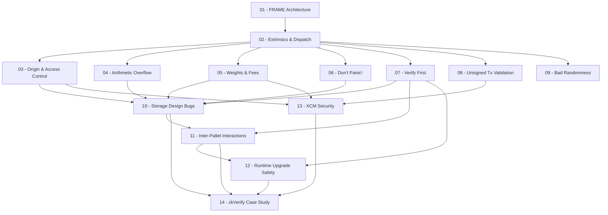

> **Topic**: Substrate FRAME Pallet Security
> **Domain**: Blockchain Security (Web Security + IT hybrid)
> **Level**: Intermediate (Rust cơ bản → audit-ready)
> **Background giả định**: Biết Rust cơ bản, chưa biết Substrate/FRAME
> **Tools / Code**: Rust, `cargo`, `pallet-verifier`, `try-runtime`
> **Mục tiêu thực chiến**: Hunt bug bounty trên zkVerify (Immunefi, max $50,000)
> **Sources chính**: Trail of Bits "Not So Smart Pallets", MixBytes audit guide, zkVerify audit reports (Trail of Bits 2025, SRLabs 2025)

---

## Lessons

| # | Title | Key Concepts | Prerequisites | Difficulty |
|---|-------|-------------|---------------|------------|
| 01 | FRAME Architecture | Pallet anatomy, `#[pallet]` macro, Config, Storage, Call, Event, Error. Runtime composition | — | ★★☆☆☆ |
| 02 | Extrinsics & Dispatch | Signed / Unsigned / Inherent extrinsics. Dispatch flow, `DispatchResult`, `DispatchError` | 01 | ★★☆☆☆ |
| 03 | Origin & Access Control | `ensure_signed`, `ensure_root`, `ensure_none`, Custom Origins. Bad Origin vulnerability class | 01, 02 | ★★★☆☆ |
| 04 | Arithmetic Overflow | Integer overflow trong WASM no-std. `checked_*`, `saturating_*`, `U256`. Acala incident 2022 | 01, 02 | ★★★☆☆ |
| 05 | Weights & Fees | Weight system (ref_time + proof_size), benchmarking, incorrect weights → DoS / economic attack | 01, 02 | ★★★☆☆ |
| 06 | Don't Panic! | `unwrap()`, `expect()`, array indexing, `panic!` trong runtime → node crash / chain halt | 01, 02 | ★★★☆☆ |
| 07 | Verify First | Check-Effects-Interactions pattern, `#[transactional]`, partial state corruption, storage rollback | 01, 02 | ★★★☆☆ |
| 08 | Unsigned Tx Validation | `validate_unsigned`, `ValidTransaction`, priority/longevity. Bỏ qua validate → spam / replay | 01, 02 | ★★★★☆ |
| 09 | Bad Randomness | On-chain randomness: `block_hash`, `pallet_babe`. Manipulable randomness → exploit | 01, 02 | ★★★☆☆ |
| 10 | Storage Design Bugs | Unbounded storage, missing cleanup, double-spend pattern, StorageMap iteration abuse | 01-04 | ★★★★☆ |
| 11 | Inter-Pallet Interactions | Tight vs loose coupling, unintended storage overwrites, callback anti-patterns, cross-pallet bugs | 01-07 | ★★★★☆ |
| 12 | Runtime Upgrade Safety | `on_runtime_upgrade`, storage migration, version mismatch, `try-runtime` | 01-07 | ★★★★☆ |
| 13 | XCM Security | XCM message format, origin manipulation qua XCM, weight misconfiguration, XCM filter bypass | 01-05, 08 | ★★★★★ |
| 14 | zkVerify Pallets — Case Study | Áp dụng toàn bộ framework vào pallets thực tế: `aggregate`, `token-claim`, `crl`, `tee-verifier`. Attack surface còn lại: ParaVerifier, EZKL adapter | 01-13 | ★★★★★ |

## Appendix

| ID | Content | Related Lessons | Notes |
|----|---------|----------------|-------|
| A0 | Rust Safety Patterns | 04, 06, 07 | `checked_*`, `saturating_*`, `Option/Result` chaining, `#[transactional]` reference card |
| A1 | Pallet Audit Checklist | Tất cả | Bảng kiểm nhanh khi đọc pallet code mới. Liên kết từng check tới lesson tương ứng |

---

## Dependency Graph

---

## Progress Tracker

- [ ] [[00-roadmap|00. Roadmap]]
- [ ] [[01-frame-architecture|01. FRAME Architecture]]
- [ ] [[02-extrinsics-and-dispatch|02. Extrinsics & Dispatch]]
- [ ] [[03-origin-and-access-control|03. Origin & Access Control]]
- [ ] [[04-arithmetic-overflow|04. Arithmetic Overflow]]
- [ ] [[05-weights-and-fees|05. Weights & Fees]]
- [ ] [[06-dont-panic|06. Don't Panic!]]
- [ ] [[07-verify-first|07. Verify First]]
- [ ] [[08-unsigned-tx-validation|08. Unsigned Tx Validation]]
- [ ] [[09-bad-randomness|09. Bad Randomness]]
- [ ] [[10-storage-design-bugs|10. Storage Design Bugs]]
- [ ] [[11-inter-pallet-interactions|11. Inter-Pallet Interactions]]
- [ ] [[12-runtime-upgrade-safety|12. Runtime Upgrade Safety]]
- [ ] [[13-xcm-security|13. XCM Security]]
- [ ] [[14-zkverify-case-study|14. zkVerify Pallets — Case Study]]
- [ ] [[a0-rust-safety-patterns|A0. Rust Safety Patterns]]
- [ ] [[a1-audit-checklist|A1. Pallet Audit Checklist]]
