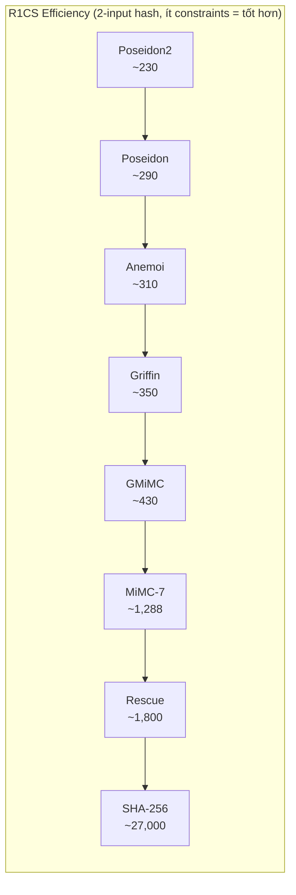
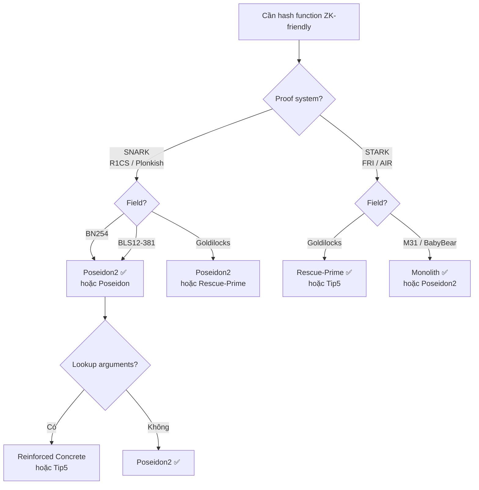

> **Mục đích**: Bảng tra cứu nhanh các ZK-friendly hash functions — tham số kỹ thuật, hiệu suất circuit, field support, và use case phù hợp.
> **Liên quan**: [[04-mimc-gmimc|04. MiMC & GMiMC]], [[05-poseidon-design|05. Poseidon Design]], [[06-poseidon-implementations|06. Poseidon Impl]], [[07-rescue-rescue-prime|07. Rescue]], [[08-next-gen-hashes|08. Next-Gen Hashes]]

---

## Bảng tổng quan nhanh

| Hash | Năm | Tác giả | Construction | S-box | Target |
|------|-----|---------|-------------|-------|--------|
| **MiMC** | 2016 | Albrecht et al. | Feistel | $x^3$ hoặc $x^7$ | SNARKs |
| **GMiMC** | 2019 | Albrecht et al. | Generalized Feistel | $x^\alpha$ | SNARKs |
| **Poseidon** | 2021 | Grassi et al. | SPN (HADES) | $x^\alpha$ ($\alpha=5$) | SNARKs |
| **Poseidon2** | 2023 | Grassi et al. | SPN (HADES v2) | $x^\alpha$ | SNARKs + STARKs |
| **Rescue** | 2020 | Ashur, Dhooghe, Szepieniec | SPN (Marvellous) | $x^\alpha + x^{1/\alpha}$ | STARKs |
| **Rescue-Prime** | 2022 | Szepieniec, Poon, Preneel | SPN (Marvellous) | $x^\alpha + x^{1/\alpha}$ | STARKs |
| **Anemoi** | 2022 | Bouvier, Canteaut et al. | Flystel | CCZ-equiv. | SNARKs + STARKs |
| **Griffin** | 2022 | Grassi, Khovratovich, Rechberger | Custom | Non-uniform | SNARKs |
| **Reinforced Concrete** | 2021 | Grassi et al. | SPN + lookup | Lookup-friendly | Plonkish |
| **Tip5** | 2023 | Ulrich, Haböck et al. | Sponge | Split + lookup | STARKs (Tip5) |
| **Monolith** | 2023 | Grassi et al. | SPN | Lookup bars | M31, BabyBear |

---

## Chi tiết theo hash function

### MiMC & GMiMC

| Tham số | MiMC-7 (BN254) | GMiMC (t=3) |
|---------|---------------|-------------|
| **S-box** | $x^7$ | $x^7$ |
| **Số rounds** | 91 | 91 |
| **State size** | 1 field element | $t$ elements |
| **R1CS constraints (1 input)** | ~644 | ~215 per output |
| **AIR constraints** | Không tối ưu | Không tối ưu |
| **Proof system target** | SNARKs (R1CS/Plonk) | SNARKs |
| **Bảo mật (bits)** | 128 | 128 |
| **Security argument** | Interpolation bound | Interpolation bound |
| **Round constant generation** | SHA3-256 of index | SHA3-256 of index |
| **Invertible?** | Có (Feistel) | Có |

> [!note] Lưu ý BN254
> BN254: $\gcd(3, p-1) = 3 \neq 1$ → $x^3$ không phải permutation → phải dùng $x^7$. BLS12-381 cũng vậy.

---

### Poseidon

| Tham số | Poseidon (t=3, BN254) | Poseidon (t=5, BLS12-381) |
|---------|----------------------|--------------------------|
| **S-box** | $x^5$ | $x^5$ |
| **State size** | 3 field elements | 5 field elements |
| **Full rounds $R_F$** | 8 | 8 |
| **Partial rounds $R_P$** | 57 | 60 |
| **Tổng rounds** | 65 | 68 |
| **R1CS constraints (permutation)** | ~243 | ~~390 |
| **R1CS constraints (2-input hash)** | ~240–290 | ~380–420 |
| **AIR constraints** | Không tối ưu | Không tối ưu |
| **Proof system target** | SNARKs (R1CS, Plonk) | SNARKs |
| **Bảo mật (bits)** | 128 | 128 |
| **Security argument** | HADES strategy | HADES strategy |
| **MDS matrix** | Cauchy matrix | Cauchy matrix |
| **Round constants** | Grain LFSR | Grain LFSR |
| **Production use** | zkSync Era, Filecoin, Zcash | Ethereum L2 |

---

### Poseidon2

Poseidon2 (2023) là bản cải tiến của Poseidon với 3 thay đổi chính:

| Tham số | Poseidon2 (t=3) | Poseidon (t=3) |
|---------|----------------|----------------|
| **Linear layer toàn phần** | $M_\text{int}$ sparse $O(t)$ | Cauchy MDS $O(t^2)$ |
| **Partial round linear** | $M_\text{ext}$ tối ưu | Cauchy full multiply |
| **R1CS constraints** | ~190 (tiết kiệm ~20%) | ~243 |
| **STARK/FRI throughput** | Cải thiện đáng kể | Kém hơn |
| **Compatibility** | Breaking change vs Poseidon | — |
| **Field support** | BN254, Goldilocks, M31 | BN254, BLS12-381 |

---

### Rescue & Rescue-Prime

| Tham số | Rescue (BN254, m=3) | Rescue-Prime (Goldilocks, m=12) |
|---------|--------------------|---------------------------------|
| **S-box forward** | $x^5$ | $x^7$ |
| **S-box backward** | $x^{1/5}$ | $x^{1/7}$ |
| **State size** | 3 field elements | 12 field elements |
| **Số rounds** | ~22 | 7 |
| **R1CS constraints** | ~1600–2000 | Rất cao (inverse S-box costly) |
| **AIR constraints (STARK)** | $O(m \cdot r)$ — hiệu quả | $O(m \cdot r)$ — tốt hơn Poseidon |
| **Proof system target** | STARKs, Winterfell | STARKs (Miden, Boojum) |
| **Bảo mật (bits)** | 128 | 128 |
| **Security argument** | Marvellous strategy | Marvellous strategy (chặt hơn) |
| **Production use** | Winterfell STARK prover | Miden VM, Boojum |

> [!warning] Trade-off Rescue vs Poseidon
> Rescue đắt hơn ~5–8x so với Poseidon trong R1CS/SNARK (do inverse S-box cần nhiều phép nhân). Nhưng trong AIR/STARK, Rescue hiệu quả tương đương hoặc tốt hơn nhờ inverse S-box được biểu diễn tự nhiên bằng degree constraint.

---

### Anemoi

| Tham số | Anemoi (BN254, ℓ=2) |
|---------|---------------------|
| **Construction** | Flystel (CCZ-equiv.) |
| **S-box** | Flystel trên cặp $(x, y)$ |
| **State size** | $2\ell$ elements |
| **Số rounds** | 14 |
| **R1CS constraints** | ~310 (2-input, t=4) |
| **STARK constraints** | ~350 AIR constraints |
| **Proof system target** | SNARKs + STARKs |
| **Security argument** | CCZ-equivalence — chứng minh được |
| **Advantage vs Poseidon** | Security provable, flexible field |
| **Production use** | Experimental, nghiên cứu |

---

### Griffin

| Tham số | Griffin (BN254, t=4) |
|---------|---------------------|
| **Construction** | Custom, non-uniform nonlinearity |
| **S-box** | Hybrid: $x^2$ và $x^{1/\alpha}$ luân phiên |
| **Số rounds** | 9–12 |
| **R1CS constraints** | ~300–400 |
| **Security argument** | Heuristic + partially provable |
| **Known issues** | Một số algebraic attacks cải thiện hơn dự kiến |
| **Production use** | Ít — security concerns 2023–2024 |

> [!danger] Griffin Security Warning
> Năm 2023–2024, một số paper (Bariant et al., Beullens et al.) phát hiện algebraic attacks tốt hơn dự kiến cho Griffin. **Không khuyến nghị dùng Griffin** trong production cho đến khi security được re-evaluate đầy đủ.

---

### Reinforced Concrete

| Tham số | Reinforced Concrete (BN254) |
|---------|----------------------------|
| **Construction** | SPN + lookup table |
| **S-box** | Lookup-friendly (concrete modular reduction) |
| **Số rounds** | 6 |
| **Plonkish constraints** | ~120–150 (với lookup arguments) |
| **R1CS constraints** | Không tối ưu (lookup không hiệu quả trong R1CS) |
| **Proof system target** | Plonkish (với lookup, e.g., Plookup/Halo2) |
| **Security argument** | Hybrid: algebraic + lookup |
| **Production use** | Experimental |

---

### Tip5 (Monolith cho STARKs)

| Tham số | Tip5 (Goldilocks, t=16) |
|---------|------------------------|
| **Construction** | Sponge với split-and-lookup |
| **S-box** | Split field elements + lookup bars |
| **State size** | 16 field elements (Goldilocks) |
| **AIR constraints** | ~100–130 (rất thấp) |
| **Proof system target** | STARKs trên Goldilocks |
| **Security argument** | Algebraic + lookup-based |
| **Production use** | Neptune/Triton VM |

---

## Bảng so sánh R1CS constraints (tổng hợp)

Bảng này so sánh số constraints R1CS xấp xỉ để hash **2 field elements** thành 1 output:

| Hash function | R1CS constraints (approx) | Notes |
|--------------|--------------------------|-------|
| SHA-256 | ~27,000 | Bitwise ops cực kỳ tốn kém trong R1CS |
| Keccak-256 | ~150,000 | Binary XOR, AND — cực kỳ không ZK-friendly |
| **MiMC-7** | ~1,288 | 2 × 91 rounds × 4 constraints + overhead |
| **GMiMC (t=3)** | ~430 | Tốt hơn MiMC nhờ multi-branch |
| **Poseidon (t=3)** | ~290 | Tốt nhất cho SNARKs |
| **Poseidon2 (t=3)** | ~230 | Cải thiện Poseidon ~20% |
| **Rescue (m=3)** | ~1,600–2,000 | Đắt trong R1CS do inverse S-box |
| **Anemoi (ℓ=2)** | ~310 | Gần với Poseidon |
| **Griffin (t=4)** | ~350 | Tương đương Poseidon nhưng ít trust hơn |

*Sắp xếp từ hiệu quả nhất đến kém hiệu quả nhất trong hệ proof R1CS. Số constraints càng nhỏ = circuit càng nhanh.*

---

## Bảng so sánh Field Support

| Hash | BN254 | BLS12-381 | Goldilocks | Pasta | M31 / BabyBear |
|------|-------|-----------|------------|-------|----------------|
| MiMC-7 | ✅ ($x^7$) | ✅ ($x^7$) | ✅ ($x^3$) | ✅ | Không khuyến nghị |
| Poseidon | ✅ ($x^5$) | ✅ ($x^5$) | ✅ ($x^7$) | ✅ | Hạn chế |
| Poseidon2 | ✅ | ✅ | ✅ | ✅ | ✅ |
| Rescue | ✅ | ✅ | ✅ | Hạn chế | Không |
| Rescue-Prime | Hạn chế | Hạn chế | ✅ | Hạn chế | Không |
| Anemoi | ✅ | ✅ | ✅ | ✅ | Hạn chế |
| Reinforced Concrete | ✅ | Hạn chế | Không | Không | Không |
| Tip5 / Monolith | Không | Không | ✅ | Không | ✅ |

> [!note] Chọn alpha theo field
> Với mỗi field $\mathbb{F}_p$, cần chọn $\alpha$ sao cho $\gcd(\alpha, p-1) = 1$:
> - **BN254** ($p-1$ chia hết cho 3): $\alpha = 5$ hoặc $\alpha = 7$
> - **BLS12-381** ($p-1$ chia hết cho 3): $\alpha = 5$ hoặc $\alpha = 7$
> - **Goldilocks** ($p = 2^{64} - 2^{32} + 1$): $\alpha = 7$ (vì $\gcd(7, p-1) = 1$)
> - **Pasta** (Pallas/Vesta): kiểm tra với `gcd(alpha, p-1)`

---

## Bảng so sánh STARK/AIR Efficiency

Số constraints AIR để hash **1 khối** (throughput view):

| Hash | AIR constraints per permutation | STARK target field |
|------|--------------------------------|-------------------|
| Poseidon | ~200–300 (partial rounds không hiệu quả trong AIR) | Goldilocks |
| Rescue-Prime | ~100–150 | Goldilocks |
| Tip5 | ~80–100 | Goldilocks |
| Monolith | ~50–80 | M31, BabyBear |
| Poseidon2 | ~150–200 (cải thiện so với Poseidon) | Đa dạng |

---

## Bảng Known Issues & Security Status

| Hash | Known Attacks | Security Status (2026) | Khuyến nghị |
|------|--------------|----------------------|-------------|
| MiMC-7 | GCD attack (keyed), Invariant subspace nếu constants sai | **An toàn** (hash mode) | ✅ Legacy systems |
| Poseidon | Algebraic degree concerns, Gröbner basis margin | **An toàn** | ✅ Khuyến nghị |
| Poseidon2 | Chưa có attack known | **An toàn** | ✅ Khuyến nghị mới |
| Rescue | Chưa có attack known | **An toàn** | ✅ cho STARKs |
| Rescue-Prime | Chưa có attack known | **An toàn** | ✅ cho STARKs |
| Anemoi | Chưa có attack known | **An toàn** | ✅ (nhưng ít audit thực tế) |
| Griffin | Partial algebraic attacks 2023–2024 | **⚠ Cần re-evaluate** | ❌ Không khuyến nghị production |
| GMiMC | Một số attacks tốt hơn GMiMC so với MiMC | **Cẩn thận** | ⚠ Chỉ dùng khi audit kỹ |
| Reinforced Concrete | Chưa có attack known | **An toàn** | ⚠ Chưa đủ peer review |

---

## Hướng dẫn chọn hash function

*Hướng dẫn chọn ZK-friendly hash function theo proof system và field. Ưu tiên Poseidon2 cho SNARK production; Rescue-Prime cho STARK production.*

### Quyết định nhanh

- **Mặc định SNARK (BN254/BLS12-381)** → **Poseidon** hoặc **Poseidon2**
- **STARK trên Goldilocks** → **Rescue-Prime** hoặc **Tip5**
- **STARK trên M31/BabyBear** → **Monolith**
- **Cần security provable** → **Anemoi** (CCZ-equivalence)
- **Legacy system (Tornado Cash, Semaphore)** → **MiMC-7** (không thay đổi để tránh breaking change)
- **Tránh** → **Griffin** (security concerns), **GMiMC** (ít adoption)

---

## References

- Albrecht et al. — *MiMC: Efficient Encryption and Cryptographic Hashing with Minimal Multiplicative Complexity* (eprint.iacr.org/2016/492)
- Grassi et al. — *Poseidon: A New Hash Function for Zero-Knowledge Proof Systems* (USENIX Security 2021)
- Grassi et al. — *Poseidon2: A Faster Version of the Poseidon Hash Function* (eprint.iacr.org/2023/323)
- Ashur, Dhooghe, Szepieniec — *Rescue: A Sound and Efficient Cryptographic Hash Function* (eprint.iacr.org/2020/107)
- Szepieniec, Poon, Preneel — *Rescue-Prime: A Standard Specification* (eprint.iacr.org/2022/508)
- Bouvier et al. — *New Design Techniques for Efficient Arithmetization-Oriented Hash Functions: Anemoi Permutations and Jive Compression Mode* (CRYPTO 2023)
- Grassi et al. — *Reinforced Concrete: A Fast Hash Function for Verifiable Computation* (eprint.iacr.org/2021/1038)
- Grassi et al. — *Monolith: Circuit-Friendly Hash Functions with New Nonlinear Layers* (eprint.iacr.org/2023/1025)
- Haböck et al. — *Tip5: A Hash Function for Recursive STARKs* (eprint.iacr.org/2023/107)
