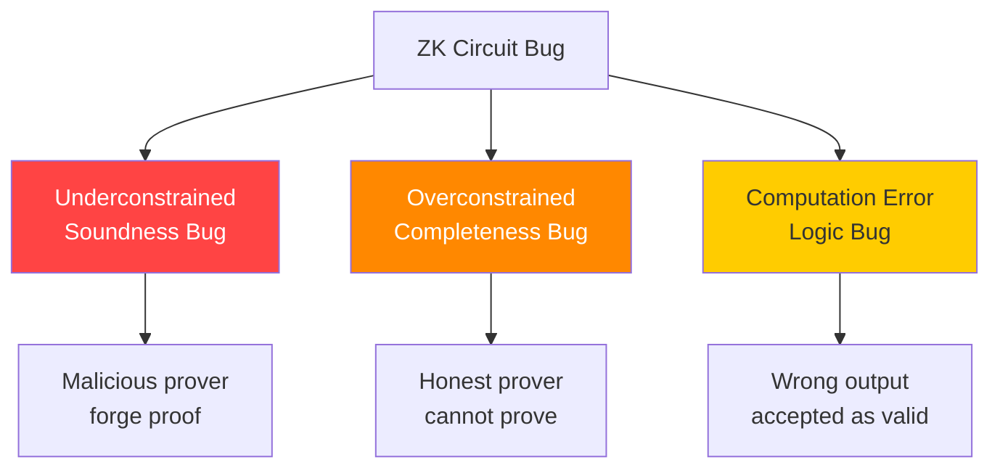

> **Mục đích**: Tài liệu tra cứu nhanh các bug patterns trong Circom và Halo2 circuits. Dùng như checklist khi audit.
> **Liên quan**: [[12-circuit-bugs|12. Circuit-Level Bugs]], [[13-implementation-integration-bugs|13. Integration Bugs]], [[14-bug-bounty-playbook|14. Bug Bounty Playbook]]

---

## Tổng quan: Taxonomy lỗi ZK Circuit



*Taxonomy ba loại lỗi circuit. Underconstrained (soundness) là nguy hiểm nhất — cho phép fake proof.*

---

## Bảng tổng hợp Bug Patterns

| ID | Pattern | Loại | Framework | Severity | Phát hiện bằng |
|----|---------|------|-----------|----------|----------------|
| **C01** | `<--` thay vì `<==` | Underconstrained | Circom | Critical | Circomspect, manual |
| **C02** | Không constrain output component | Underconstrained | Circom | Critical | Manual, Picus |
| **C03** | Hash output convention mismatch | Completeness | Circom | High | Test vectors |
| **C04** | Missing range check | Underconstrained / Logic | Circom | High | Manual, Circomspect |
| **C05** | Số rounds bị giảm | Logic (security) | Circom / Halo2 | Critical | Constraint count |
| **C06** | Assign-without-constrain (Halo2) | Underconstrained | Halo2 | Critical | MockProver |
| **C07** | Missing selector enable (Halo2) | Underconstrained | Halo2 | Critical | MockProver |
| **C08** | Copy_advice thiếu | Underconstrained | Halo2 | High | MockProver |
| **I01** | Fiat-Shamir thiếu component | Forgery | Protocol | Critical | Manual review |
| **I02** | Hash-to-field endianness | Mismatch | Protocol | High | Cross-impl test |
| **I03** | Truncation thay vì reduction | Logic / Bias | Protocol | High | Test vectors |
| **I04** | Domain separation thiếu | Cross-context forgery | Protocol | High | Manual review |
| **I05** | Nullifier không check on-chain | Double-spend | Smart contract | Critical | Manual review |
| **I06** | Spec mismatch (round count, alpha) | Logic (security) | Any | Critical | Test vectors |

---

## C01 — `<--` thay vì `<==` (Circom)

**Loại**: Underconstrained — Soundness Bug
**Severity**: Critical
**Phát hiện**: `circomspect --detect-underconstrained-signals`

### Giải thích

Trong Circom:
- `<==`: Assign giá trị VÀ tạo R1CS constraint (multiplication gate)
- `<--`: Assign giá trị ONLY — không tạo constraint, malicious prover có thể set bất kỳ giá trị
- `===`: Tạo constraint ONLY — không assign

```circom
// ❌ SAI — underconstrained
template BuggyMiMC() {
    signal input x;
    signal output out;
    signal tmp;
    tmp <-- x * x;      // Assign nhưng KHÔNG constrain!
    out <-- tmp * x;    // out có thể là BẤT KỲ GIÁ TRỊ
}

// ✅ ĐÚNG — đầy đủ constraints
template CorrectMiMC() {
    signal input x;
    signal output out;
    signal tmp;
    tmp <== x * x;      // Constrain: tmp = x^2
    out <== tmp * x;    // Constrain: out = tmp * x = x^3
}
```

### Khi nào dùng `<--` hợp lệ?

`<--` hợp lệ khi cần compute hint cho witness generation nhưng constraint được thêm thủ công bằng `===`:

```circom
// Hợp lệ: <-- để tính inverse, === để constrain
template SafeInverse() {
    signal input x;
    signal output x_inv;

    // Tính inverse như "hint" (vì y = 1/x không phải phép toán quadratic)
    x_inv <-- 1 / x;  // Chỉ assign — witness hint

    // Constrain thủ công: x * x_inv == 1
    x * x_inv === 1;   // Đây là constraint thực sự
}
```

### Exploit PoC

```python
# Giả sử circuit: Hash(preimage) == public_hash
# Bug: out <-- hash_value (không constrained)
# Exploit: Prover set out = target_hash với bất kỳ preimage nào

def exploit_c01(target_hash: int, any_preimage: int) -> dict:
    """
    Malicious witness cho underconstrained hash output.
    Circuit accept vì không có constraint liên kết preimage -> hash.
    """
    return {
        "preimage": any_preimage,
        "hash": target_hash,  # Giả mạo — accepted vì không constrained!
    }
```

### Checklist kiểm tra

```
□ Mọi signal trung gian dùng <== (không dùng <--)
□ Nếu dùng <--, ngay sau đó phải có === constraint
□ Output signals của template đều có constraint liên kết với inputs
□ Chạy: circomspect circuit.circom --detect-underconstrained-signals
```

---

## C02 — Không Constrain Component Output

**Loại**: Underconstrained — Soundness Bug
**Severity**: Critical
**Phát hiện**: Code review thủ công

### Giải thích

Khi dùng Circom template (component), **phải explicitly** liên kết output của component với signals khác qua `<==` hoặc `===`.

```circom
// ❌ SAI — component output không được constrain
template BuggyEqualHash() {
    signal input a;
    signal input b;
    signal output isEqual;

    component h1 = Poseidon(1);
    h1.inputs[0] <== a;

    component h2 = Poseidon(1);
    h2.inputs[0] <== b;

    // h1.out và h2.out được compute nhưng KHÔNG constrain isEqual!
    isEqual <-- (a == b) ? 1 : 0;  // Witness hint — không ràng buộc với hashes!
    isEqual * (isEqual - 1) === 0;  // Chỉ check isEqual in {0,1} — KHÔNG kiểm tra hash
    // Malicious: isEqual=1 dù h1.out != h2.out -> proof valid!
}

// ✅ ĐÚNG
template CorrectEqualHash() {
    signal input a;
    signal input b;
    signal output isEqual;

    component h1 = Poseidon(1);
    h1.inputs[0] <== a;

    component h2 = Poseidon(1);
    h2.inputs[0] <== b;

    // Dùng IsEqual component để constrain correctly
    component eq = IsEqual();
    eq.in[0] <== h1.out;   // Constrain input từ hash output
    eq.in[1] <== h2.out;   // Constrain input từ hash output
    isEqual <== eq.out;    // isEqual ràng buộc với hash comparison
}
```

### Pattern phổ biến dễ bỏ sót

```circom
// Tạo component nhưng không dùng output
component hasher = Poseidon(2);
hasher.inputs[0] <== left;
hasher.inputs[1] <== right;
// BUG: hasher.out không được liên kết với bất kỳ signal nào!
// Merkle root constraint sai hoàn toàn

// FIX:
node <== hasher.out;  // Phải constrain output
```

---

## C03 — Hash Output Convention Mismatch

**Loại**: Completeness Bug (honest prover fail) hoặc Logic Bug
**Severity**: High
**Phát hiện**: Test vectors cross-check giữa off-chain và on-chain

### Giải thích

Khi off-chain code (JavaScript prover) và on-chain circuit (Circom verifier) dùng Poseidon với output convention khác nhau:

```javascript
// Off-chain (JavaScript — iden3/poseidon-lite):
// Dùng Poseidon sponge, output = state[0] (capacity element)
const hash = poseidon([a, b]);  // output: state[0]

// On-chain (Circom — circomlib Poseidon template):
// output = state[1] trong một số versions
component h = Poseidon(2);
h.inputs[0] <== a;
h.inputs[1] <== b;
out <== h.out;  // h.out = state[?] — xem source!
```

```python
# Script kiểm tra convention mismatch
def check_poseidon_convention_mismatch(js_hash_value: int, circom_hash_value: int):
    """
    So sánh output của JS library và Circom implementation.
    Nếu không khớp -> convention mismatch.
    """
    if js_hash_value == circom_hash_value:
        print("[OK] Hash values match — convention nhất quán")
        return True
    else:
        print(f"[MISMATCH] JS: {hex(js_hash_value)}")
        print(f"[MISMATCH] Circom: {hex(circom_hash_value)}")
        print("  Kiểm tra: output index (state[0] vs state[1])")
        print("  Kiểm tra: rate/capacity convention")
        print("  Kiểm tra: round constants version")
        return False
```

### Cách phát hiện trong audit

```bash
# 1. Chạy known-input test vector từ cả hai phía
node test_poseidon.js     # JS output
circom_test circuit.circom # Circom output

# 2. So sánh: nếu khác nhau -> mismatch

# 3. Đọc source của Poseidon component trong circomlib
# circomlib/circuits/poseidon.circom: tìm dòng "out <== states[...]"
grep -n "out" node_modules/circomlib/circuits/poseidon.circom
```

---

## C04 — Missing Range Check

**Loại**: Underconstrained hoặc Logic Bug
**Severity**: High
**Phát hiện**: Manual review, tìm tất cả inputs từ user không qua Num2Bits

### Giải thích

ZK circuits làm việc trên $\mathbb{F}_p$. Input "integer" từ user có thể là $p-1 = -1 \pmod p$, bypass range checks.

```circom
// ❌ SAI — không range check
template InsecureWithdraw() {
    signal input balance;   // Giả sử user input
    signal input amount;    // Giả sử user input

    // LessThan chỉ work đúng nếu inputs đã ở trong [0, 2^n)
    component le = LessThan(32);
    le.in[0] <== amount;
    le.in[1] <== balance;
    le.out === 1;
    // BUG: amount = p-1 (= -1 mod p) là valid field element
    // LessThan(32) sẽ fail/revert với 254-bit value p-1
    // Nhưng nếu có bug khác cho phép amount >= p, arithmetic sẽ wrap
}

// ✅ ĐÚNG — range check trước khi dùng
template SecureWithdraw() {
    signal input balance;
    signal input amount;

    // Đảm bảo amount trong [0, 2^32)
    component rangeCheck = Num2Bits(32);
    rangeCheck.in <== amount;  // Tạo 32 constraints, đảm bảo amount < 2^32

    component le = LessThan(32);
    le.in[0] <== amount;
    le.in[1] <== balance;
    le.out === 1;
}
```

### Khi nào cần range check?

```
□ Bất kỳ input nào từ user (không trusted) dùng như integer (không phải field element)
□ Signals dùng trong LessThan, GreaterThan, comparison components
□ Signals biểu diễn timestamps, balances, indices
□ KHÔNG cần: hash outputs (đã trong field), field elements từ trusted source
```

---

## C05 — Số Rounds Bị Giảm

**Loại**: Logic Bug — Security Parameter
**Severity**: Critical
**Phát hiện**: Constraint count comparison vs. spec

### Giải thích

Developer "optimize" circuit bằng cách giảm số rounds, không nhận ra đây là security parameter.

```python
# Kiểm tra số constraints để phát hiện rounds bị giảm
def verify_poseidon_constraint_count(compiled_constraints: int, t: int, R_F: int, R_P: int):
    """
    So sánh số constraints thực tế (từ circom --r1cs) với lý thuyết.
    Nếu actual < expected: có thể rounds bị giảm hoặc optimization sai.
    """
    # x^5 cần 3 constraints
    expected = R_F * t * 3 + R_P * 3
    print(f"Expected constraints: {expected}")
    print(f"Actual constraints:   {compiled_constraints}")

    if compiled_constraints < expected * 0.9:  # 10% tolerance
        print("[WARNING] Số constraints thấp hơn expected!")
        print("  Nguyên nhân có thể:")
        print("  1. Số rounds bị giảm -> SECURITY BUG")
        print("  2. Optimization không đúng -> cần verify")
        return False
    print("[OK] Constraint count trong expected range")
    return True


# Cách kiểm tra trong thực tế:
# 1. Compile circuit: circom poseidon.circom --r1cs
# 2. Xem constraints: snarkjs r1cs info poseidon.r1cs
# 3. So sánh với expected
```

```bash
# Kiểm tra từ command line
circom poseidon_circuit.circom --r1cs --output ./build
snarkjs r1cs info ./build/poseidon_circuit.r1cs
# Output: "# of Constraints: XXX"
# So sánh với expected từ spec
```

---

## C06 & C07 — Halo2 Assign Without Constrain

**Loại**: Underconstrained — Soundness Bug
**Severity**: Critical
**Phát hiện**: MockProver verify với wrong output

### Giải thích

Halo2 tách biệt assignment (điền witness) và constraining (tạo polynomial gate).

```rust
// ❌ C06: Assign nhưng không enable selector
fn assign_buggy_c06(
    &self,
    mut layouter: impl Layouter<F>,
    input: AssignedCell<F, F>,
) -> Result<AssignedCell<F, F>, Error> {
    layouter.assign_region(|| "hash", |mut region| {
        let output = region.assign_advice(
            || "hash output",
            self.config.col_output,
            0,
            || input.value().map(|x| compute_hash(*x)),
        )?;
        // BUG: Không enable selector -> custom gate KHÔNG active!
        // self.config.s_hash.enable(&mut region, 0)?;  // THIẾU
        Ok(output)
    })
}

// ❌ C07: Enable selector nhưng thiếu copy_advice
fn assign_buggy_c07(
    &self,
    mut layouter: impl Layouter<F>,
    input: AssignedCell<F, F>,
) -> Result<AssignedCell<F, F>, Error> {
    layouter.assign_region(|| "hash", |mut region| {
        let output = region.assign_advice(
            || "hash output",
            self.config.col_output,
            0,
            || input.value().map(|x| compute_hash(*x)),
        )?;
        self.config.s_hash.enable(&mut region, 0)?;  // Selector OK
        // BUG: Không copy input -> input column và "input" cell KHÔNG liên kết!
        // Malicious prover có thể set input cell khác với "input" argument
        Ok(output)
    })
}

// ✅ ĐÚNG: Assign + Enable + Copy
fn assign_correct(
    &self,
    mut layouter: impl Layouter<F>,
    input: AssignedCell<F, F>,
) -> Result<AssignedCell<F, F>, Error> {
    layouter.assign_region(|| "hash", |mut region| {
        // Copy input vào cell của region (tạo equality constraint)
        input.copy_advice(
            || "hash input",
            &mut region,
            self.config.col_input,
            0,
        )?;
        let output = region.assign_advice(
            || "hash output",
            self.config.col_output,
            0,
            || input.value().map(|x| compute_hash(*x)),
        )?;
        // Enable selector -> activate custom gate
        self.config.s_hash.enable(&mut region, 0)?;
        Ok(output)
    })
}
```

### MockProver Test — Phát hiện Underconstrained

```rust
#[cfg(test)]
mod tests {
    use halo2_proofs::dev::MockProver;

    #[test]
    fn test_hash_circuit_soundness() {
        let k = 10;
        let input = Fp::from(42u64);
        let correct_output = poseidon_native(input);
        let wrong_output = Fp::from(999u64);  // Sai giá trị

        // Test 1: Circuit accept correct output?
        let circuit = HashCircuit { input };
        let prover = MockProver::run(k, &circuit, vec![vec![correct_output]]).unwrap();
        assert!(prover.verify().is_ok(), "Should accept correct output");

        // Test 2: Circuit REJECT wrong output?
        let prover_wrong = MockProver::run(k, &circuit, vec![vec![wrong_output]]).unwrap();
        assert!(
            prover_wrong.verify().is_err(),
            "UNDERCONSTRAINED BUG: circuit accepted wrong output!"
        );
    }
}
```

---

## I01 — Fiat-Shamir Thiếu Component (Frozen Heart)

**Loại**: Forgery — Proof Soundness Bug
**Severity**: Critical
**Phát hiện**: Manual protocol review — đối chiếu với interactive protocol transcript

### Giải thích

Fiat-Shamir challenge phải hash **tất cả** public inputs và commitments. Bỏ sót bất kỳ phần nào cho phép prover manipulate challenge.

```python
# ❌ Frozen Heart bug pattern
def fiat_shamir_challenge_buggy(
    public_params: bytes,
    commitment_A: bytes,
    commitment_S: bytes,
    # BUG: Thiếu Pedersen commitment 'com'!
) -> int:
    transcript = public_params + commitment_A + commitment_S
    return int(hashlib.sha256(transcript).hexdigest(), 16)
    # Prover có thể chọn A, S independently of com -> forge proof!

# ✅ Fiat-Shamir đúng
def fiat_shamir_challenge_correct(
    public_params: bytes,
    com: bytes,         # Pedersen commitment — PHẢI include!
    commitment_A: bytes,
    commitment_S: bytes,
) -> int:
    # Tất cả public values được hash, theo thứ tự nhất quán
    transcript = public_params + com + commitment_A + commitment_S
    return int(hashlib.sha256(transcript).hexdigest(), 16)
```

### Checklist Fiat-Shamir

```
□ List TẤT CẢ messages trong interactive proof protocol
□ Mỗi verifier challenge phụ thuộc vào TẤT CẢ prior messages
□ Message CUỐI CÙNG cũng được hash trước challenge cuối (Last Challenge Attack)
□ Public inputs được hash — không chỉ commitments
□ Ordering transcript nhất quán giữa prover và verifier
□ Không có "free" variables không được hash
```

---

## I02 — Hash-to-Field Endianness Mismatch

**Loại**: Cross-implementation Mismatch
**Severity**: High
**Phát hiện**: Test cross-language (JS + Rust + Circom)

### Giải thích

```python
import hashlib

data = b"test_input"
sha_digest = hashlib.sha256(data).digest()

# Big-endian (Circomlib convention, most Ethereum libs)
be = int.from_bytes(sha_digest, 'big')

# Little-endian (một số Rust crates, Windows default)
le = int.from_bytes(sha_digest, 'little')

print(f"BE: {hex(be)}")
print(f"LE: {hex(le)}")
print(f"Khác nhau: {be != le}")  # True!

# FIX: Document rõ ràng convention và enforce nhất quán
# Convention chuẩn cho ZK Ethereum: Big-endian, reduce mod p
```

### Checklist Endianness

```
□ Document rõ convention: big-endian hay little-endian?
□ Test cross-language: JS output == Rust output == Circom output?
□ Khi đọc bytes từ Ethereum calldata: keccak256 output là big-endian
□ Reduction phải sau khi interpret bytes, không trước
```

---

## I03 — Truncation thay vì Reduction

**Loại**: Logic Bug — Statistical Bias
**Severity**: High
**Phát hiện**: So sánh output với và không có reduction

### Giải thích

```python
import hashlib

P = 21888242871839275222246405745257275088548364400416034343698204186575808495617

sha = int(hashlib.sha256(b"data").hexdigest(), 16)  # 256-bit value

# ❌ TRUNCATION — statistical bias, KHÔNG uniform mod p
truncated = sha & ((1 << 254) - 1)  # Lấy 254 bit thấp

# ✅ REDUCTION — uniform mod p (đúng)
reduced = sha % P

print(f"Truncated: {hex(truncated)[:20]}...")
print(f"Reduced:   {hex(reduced)[:20]}...")
print(f"Different: {truncated != reduced}")

# Tại sao truncation sai?
# Không uniform: các giá trị trong [0, 2^254 - p) xuất hiện 2x thường hơn!
# Reduction: distribution uniform trên [0, p)
```

---

## I04 — Thiếu Domain Separation

**Loại**: Cross-context Forgery
**Severity**: High
**Phát hiện**: Kiểm tra xem cùng hash function dùng cho nhiều contexts không

### Giải thích

```python
# ❌ SAI: Cùng hash function cho nhiều contexts
def hash_commitment(value, randomness):
    return poseidon([value, randomness])  # domain tag?

def hash_merkle_node(left, right):
    return poseidon([left, right])  # CÙNG signature!

# Attack: Nếu value=left, randomness=right:
# hash_commitment(left, right) == hash_merkle_node(left, right)
# -> Dùng Merkle proof như commitment proof -> cross-context forgery!

# ✅ ĐÚNG: Domain separation
DOMAIN_COMMITMENT = 1
DOMAIN_MERKLE = 2
DOMAIN_NULLIFIER = 3

def hash_commitment(value, randomness):
    return poseidon([value, randomness, DOMAIN_COMMITMENT])

def hash_merkle_node(left, right):
    return poseidon([left, right, DOMAIN_MERKLE])

def hash_nullifier(secret):
    return poseidon([secret, DOMAIN_NULLIFIER])
```

### Checklist Domain Separation

```
□ Mỗi use case có domain tag phân biệt?
□ Domain tag đủ distinguish: commitment != merkle != nullifier != signature
□ Domain tag không thể bị "moved" sang context khác
□ Hash(x || domain_A) != Hash(x || domain_B) với mọi x?
```

---

## I05 — Nullifier Không Được Check On-Chain

**Loại**: Double-spend — Protocol Logic Bug
**Severity**: Critical
**Phát hiện**: Kiểm tra smart contract xem có spent set không

### Giải thích

```solidity
// ❌ SAI — Smart contract thiếu nullifier check
function withdraw(bytes calldata proof, uint256 nullifierHash, address recipient) external {
    require(verifyProof(proof, nullifierHash, merkleRoot), "Invalid proof");
    // BUG: Không check nullifier đã used!
    // Không update spent set!
    payable(recipient).transfer(DENOMINATION);
    // -> User submit cùng proof vô số lần, rút hết contract!
}

// ✅ ĐÚNG — với nullifier spent set
mapping(uint256 => bool) public nullifierHashes;

function withdraw(bytes calldata proof, uint256 nullifierHash, address recipient) external {
    require(!nullifierHashes[nullifierHash], "Nullifier already spent");
    require(verifyProof(proof, nullifierHash, merkleRoot), "Invalid proof");
    nullifierHashes[nullifierHash] = true;  // Mark as spent TRƯỚC khi transfer
    payable(recipient).transfer(DENOMINATION);
}
```

---

## I06 — Spec Mismatch (Round Count, Alpha)

**Loại**: Security Parameter Bug
**Severity**: Critical
**Phát hiện**: Test vectors, parameter audit script

### Giải thích

```python
# Kiểm tra tham số MiMC-7 và Poseidon
from math import gcd, ceil, log

def verify_mimc7_params(p: int, num_rounds: int, alpha: int):
    """Kiểm tra tham số MiMC-7 theo spec."""
    # 1. Alpha phải là permutation
    assert gcd(alpha, p - 1) == 1, f"FAIL: alpha={alpha} không phải permutation trên p"

    # 2. Số rounds đủ cho interpolation security
    min_rounds = ceil(log(p, alpha))
    if num_rounds < min_rounds:
        print(f"WARNING: {num_rounds} rounds < {min_rounds} min (interpolation)")
    else:
        print(f"OK: {num_rounds} rounds >= {min_rounds} min")

def verify_poseidon_params(p: int, t: int, R_F: int, R_P: int, alpha: int):
    """Kiểm tra tham số Poseidon theo spec."""
    # 1. Alpha valid
    assert gcd(alpha, p - 1) == 1, f"FAIL: alpha={alpha} invalid"

    # 2. R_F chẵn (đối xứng)
    assert R_F % 2 == 0, f"FAIL: R_F={R_F} phải chẵn"

    # 3. R_F >= 6 (minimum theo Poseidon paper)
    if R_F < 6:
        print(f"WARNING: R_F={R_F} < 6 minimum")

    print(f"OK: Poseidon params valid (t={t}, R_F={R_F}, R_P={R_P}, alpha={alpha})")

# Test
P_BN254 = 21888242871839275222246405745257275088548364400416034343698204186575808495617
verify_mimc7_params(P_BN254, 91, 7)
verify_poseidon_params(P_BN254, 3, 8, 57, 5)
```

---

## Công cụ Static Analysis

```bash
# ─── Circom ──────────────────────────────────────────────────────────────────

# 1. Circomspect (Trail of Bits) — detector chính cho Circom
cargo install circomspect
circomspect circuit.circom
# Tìm: underconstrained signals, unused outputs, non-quadratic constraints

# 2. Compile để xem số constraints
circom circuit.circom --r1cs --wasm --sym --output ./build
snarkjs r1cs info ./build/circuit.r1cs
# "# of Constraints: N" — so sánh với expected

# 3. Picus — formal verification (chứng minh/disprove underconstrained)
# github.com/Veridise/Picus

# ─── Halo2 ───────────────────────────────────────────────────────────────────

# 4. MockProver — debug underconstrained trong development
# (dùng trong Rust test — xem C06/C07 pattern ở trên)

# 5. halo2-analyzer (Korrekt, Quantstamp)
# Tự động phát hiện underconstrained circuits
# cargo add halo2_analyzer

# ─── General ─────────────────────────────────────────────────────────────────

# 6. ZKAP — pattern detector
# github.com/whbjzzwjxxzwh/ZKAP

# 7. Manual test vector verification
# Luôn test với known inputs so với reference implementation
```

---

## Quick Reference Card

| Khi thấy... | Kiểm tra... | Bug có thể là... |
|-------------|------------|-----------------|
| `<--` trong Circom | Signal có `===` sau không? | C01 |
| Component được tạo | Output được dùng trong `<==`? | C02 |
| Proof luôn fail với valid inputs | Convention off-chain vs on-chain? | C03 |
| Input từ user trong comparison | Có Num2Bits range check không? | C04 |
| Constraints ít hơn expected | Rounds bị giảm? optimization sai? | C05 |
| Halo2 assign_advice | selector.enable() và copy_advice có không? | C06, C07 |
| Hash dùng cho nhiều purposes | Domain tag được thêm vào không? | I04 |
| Withdrawal/nullifier | Smart contract check spent set không? | I05 |
| Cross-language integration | Test vectors match không? Endianness? | I02, I03 |
| Protocol với Fiat-Shamir | Tất cả messages được hash không? | I01 |

---

## References

- Trail of Bits — *Circomspect: A Static Analyzer for Circom* (blog.trailofbits.com)
- Trail of Bits — *Disclosing Frozen Heart Vulnerabilities* (2022)
- 0xPARC — *ZK Bug Tracker* (github.com/0xPARC/zk-bug-tracker)
- zksecurity — *zkbugs repository* (github.com/zksecurity/zkbugs)
- Chaliasos et al. — *SoK: What don't we know? Understanding Security Vulnerabilities in SNARKs* (arXiv 2402.15293)
- Pailoor et al. — *Automated Detection of Under-Constrained Circuits in ZKPs* (PLDI 2023)
- Bernhard Mueller — *A Practical Guide to Finding Soundness Bugs in ZK Circuits* (medium.com, 2026)
