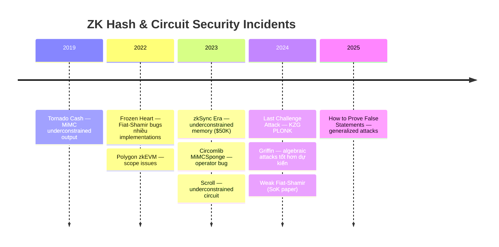
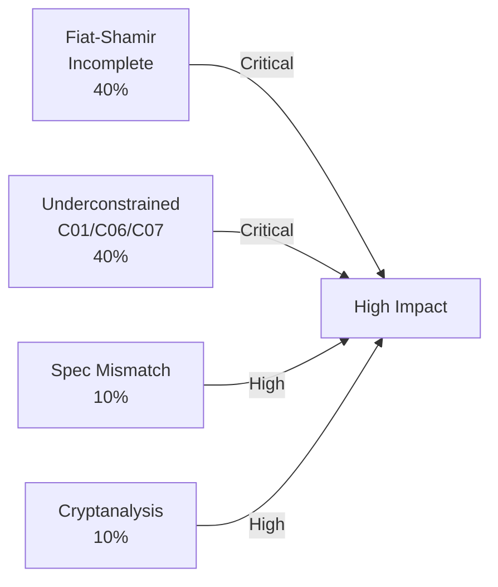

> **Mục đích**: Cơ sở dữ liệu các lỗ hổng bảo mật đã công bố liên quan đến ZK hash functions, circuit implementations, và ZK protocols. Dùng để học từ incidents thực tế và so sánh với findings trong audit.
> **Liên quan**: [[12-circuit-bugs|12. Circuit-Level Bugs]], [[13-implementation-integration-bugs|13. Integration Bugs]], [[14-bug-bounty-playbook|14. Bug Bounty Playbook]]

> [!note] Nguồn dữ liệu
> Database tổng hợp từ: 0xPARC ZK Bug Tracker, zksecurity zkbugs, Trail of Bits disclosures, công khai bug bounty reports, và academic papers. Chỉ bao gồm các lỗ hổng đã được **công bố công khai**.

---

## Timeline Tổng quan



*Timeline các incidents ZK security liên quan đến hash và circuit. Số lượng disclosures tăng theo adoption của ZK systems.*

---

## Database Findings

### F-001 — Tornado Cash: MiMC Underconstrained Output

| Field | Value |
|-------|-------|
| **ID** | F-001 |
| **Năm** | 2019 |
| **Protocol** | Tornado Cash (Ethereum mixer) |
| **Hash liên quan** | MiMC (circomlib) |
| **Bug class** | [[a2-circom-bug-patterns|C01]] — `<--` thay vì `<==` |
| **Severity** | Critical |
| **Impact** | Malicious prover có thể claim bất kỳ nullifier hash nào |
| **Reported by** | Internal (phát hiện trước khi exploit) |
| **Status** | Patched |

**Mô tả kỹ thuật**:

Trong `circomlib/circuits/mimcsponge.circom` phiên bản cũ, output signal `outs[0]` được assign bằng `=` (JavaScript-style assignment trong witness generation) thay vì `<==` (Circom constraint operator). Kết quả: output của MiMCsponge không bị ràng buộc trong R1CS.

```circom
// BUG (phiên bản cũ circomlib):
// outs[0] = states[nInputs - 1].xL_out;   // "=" — KHÔNG tạo constraint!

// FIX:
// outs[0] <== states[nInputs - 1].xL_out; // "<==" — tạo constraint
```

**Exploit scenario**:
```
1. Attacker deposit 1 ETH vào Tornado Cash
2. Attacker tạo valid commitment C = Poseidon(nullifier, secret)
3. Attacker generate "proof" với:
   - Merkle proof hợp lệ cho C
   - Fake nullifier_hash = nullifier_hash_của_người_khác
   (vì output không constrained, prover tự điền giá trị bất kỳ)
4. Attacker withdraw ETH của người khác bằng cách submit nullifier người khác
```

**Lesson học được**:
- Luôn dùng `<==` cho assignment trong Circom circuits
- Test với wrong witness: nếu circuit accept wrong output → underconstrained
- Circomspect sẽ flag signal này ngay nếu được chạy

**Tham khảo**: github.com/iden3/circomlib/commit/[fix-commit]; 0xPARC ZK Bug Tracker #1

---

### F-002 — Frozen Heart: Bulletproofs (Trail of Bits, 2022)

| Field | Value |
|-------|-------|
| **ID** | F-002 |
| **Năm** | 2022 |
| **Protocol** | Bulletproofs (nhiều implementations) |
| **Hash liên quan** | Fiat-Shamir transcript hash |
| **Bug class** | [[a2-circom-bug-patterns|I01]] — Fiat-Shamir thiếu component |
| **Severity** | Critical |
| **Impact** | Forge range proofs không cần witness hợp lệ |
| **Reported by** | Trail of Bits (Jim Miller, Gözde Soykan) |
| **CVE** | Disclosed 2022-04-14 |
| **Affected** | Dalek-bulletproofs, Ristretto, ZKBoo, gnark, và nhiều libs khác |

**Mô tả kỹ thuật**:

Trong Bulletproofs range proof, verifier tạo challenge `y` và `z` thông qua Fiat-Shamir. Challenge phải hash **commitment đến giá trị** cần prove (`V = vG + rH`). Nhiều implementations bỏ sót `V` khỏi transcript.

```python
# BUG trong Bulletproofs (simplified):
def bulletproofs_challenge_buggy(g, h, a, s):
    # Thiếu: không include commitment V!
    transcript = encode(g) + encode(h) + encode(a) + encode(s)
    y = Hash(transcript)   # y không phụ thuộc V
    z = Hash(transcript + encode(y))
    return y, z

# EXPLOIT:
# 1. Attacker chọn V tùy ý (không cần biết v)
# 2. Tính y, z không phụ thuộc V
# 3. Construct A, S tự do (vì challenge không ràng buộc V)
# 4. Forge proof rằng V là commitment cho giá trị trong [0, 2^n) — sai!

# FIX:
def bulletproofs_challenge_correct(V, g, h, a, s):
    transcript = encode(V) + encode(g) + encode(h) + encode(a) + encode(s)
    y = Hash(transcript)
    z = Hash(transcript + encode(y))
    return y, z
```

**Impact thực tế**: Nếu Bulletproofs được dùng trong privacy coin hoặc L2, attacker có thể tạo tiền từ không khí (proof invalid state).

**Lesson học được**:
- Mỗi lần thêm commitment vào interactive proof → phải hash commitment đó vào challenge
- Dùng thư viện transcript chuẩn (Merlin, Fiat-Shamir gadget) thay vì manual
- Audit protocol level, không chỉ circuit level

**Tham khảo**: blog.trailofbits.com/2022/04/15/the-frozen-heart-vulnerability/

---

### F-003 — Frozen Heart: PlonK Implementations (Trail of Bits, 2022)

| Field | Value |
|-------|-------|
| **ID** | F-003 |
| **Năm** | 2022 |
| **Protocol** | PlonK (nhiều implementations) |
| **Hash liên quan** | Fiat-Shamir challenge hash |
| **Bug class** | [[a2-circom-bug-patterns|I01]] — Fiat-Shamir thiếu public inputs |
| **Severity** | Critical |
| **Impact** | Forge PlonK proofs với wrong public inputs |
| **Reported by** | Trail of Bits |
| **Affected** | py_plonk, gnark (một phiên bản), jellyfish |

**Mô tả kỹ thuật**:

PlonK challenge phải hash public inputs cùng với commitments. Một số implementations chỉ hash polynomial commitments mà không hash public inputs.

```python
# BUG — hash chỉ commitments, không hash public inputs
def plonk_challenge_buggy(commitments: list) -> int:
    return H(b"".join(commitments))  # Thiếu public_inputs!

# Exploit:
# Prover compute proof cho statement S1 với public inputs pi_1
# Challenge không phụ thuộc pi_1
# Prover claim proof cho statement S2 với public inputs pi_2 (khác!)
# Verifier accept vì challenge giống nhau

# FIX:
def plonk_challenge_correct(commitments: list, public_inputs: list) -> int:
    pi_bytes = b"".join(i.to_bytes(32, 'big') for i in public_inputs)
    com_bytes = b"".join(commitments)
    return H(pi_bytes + com_bytes)
```

**Tham khảo**: Trail of Bits Frozen Heart disclosure, 2022

---

### F-004 — zkSync Era: Memory Circuit Underconstrained ($50,000)

| Field | Value |
|-------|-------|
| **ID** | F-004 |
| **Năm** | 2023 (September) |
| **Protocol** | zkSync Era (ZK-EVM) |
| **Hash liên quan** | Memory consistency check (LinearCombination) |
| **Bug class** | C06 — Assign without constrain |
| **Severity** | Critical |
| **Impact** | Malicious prover modify memory values trong ZK-EVM execution |
| **Reward** | $50,000 USDC |
| **Reported by** | ChainLight |
| **Status** | Patched |

**Mô tả kỹ thuật**:

ZK-EVM của zkSync Era dùng LinearCombination (LC) để verify memory consistency (đảm bảo memory reads nhất quán với writes). LC được assign đúng trong witness generation, nhưng **thiếu equality constraint** liên kết LC output với expected value.

```
Bug:
  lc_output = compute_linear_combination(memory_cells)  // Assign đúng
  // Nhưng KHÔNG có constraint: lc_output === expected_value
  // Malicious prover có thể set memory_cells tùy ý!

Fix:
  lc_output = compute_linear_combination(memory_cells)
  lc_output === expected_value  // Equality constraint bắt buộc
```

**Impact nếu exploit**: Attacker có thể tạo invalid EVM execution trace, ví dụ: tăng số dư tài khoản mà không cần deposit tương ứng.

**Lesson học được**:
- Assignment và constraining là hai bước độc lập — không tự động liên quan
- Mọi intermediate value dùng để verify logic phải có equality constraint
- $50K reward cho một dòng constraint bị thiếu

**Tham khảo**: ChainLight blog, 2023; zkSync bug bounty disclosure

---

### F-005 — Last Challenge Attack: KZG-based PlonK (2024)

| Field | Value |
|-------|-------|
| **ID** | F-005 |
| **Năm** | 2024 |
| **Protocol** | KZG-based PlonK (nhiều implementations) |
| **Hash liên quan** | Fiat-Shamir của batched KZG evaluation |
| **Bug class** | [[a2-circom-bug-patterns|I01]] — Last message không được hash |
| **Severity** | Critical |
| **Impact** | Forge proof với sai polynomial evaluations |
| **Reported by** | Ciobotaru, Maller, Shehata (eprint.iacr.org/2024/398) |
| **Affected** | Một số PlonK verifier implementations |

**Mô tả kỹ thuật**:

Trong KZG-based PlonK, batching challenge `u` được compute bằng Fiat-Shamir. Bug: evaluation proofs $W_1$ và $W_2$ (hai commitment cuối) **không được hash** trước khi tạo challenge.

```python
# BUG: Tạo batching challenge u mà không hash W1, W2
def compute_batching_challenge_buggy(
    transcript_so_far: bytes,
    # W1, W2 là KZG evaluation proofs — bị bỏ sót!
) -> int:
    return H(transcript_so_far)  # u không phụ thuộc W1, W2!

# Exploit:
# Prover có thể thay đổi W1, W2 sau khi tính u
# -> W1, W2 là "free variables" → forge batch verification

# FIX:
def compute_batching_challenge_correct(
    transcript_so_far: bytes,
    W1: bytes,  # PHẢI include
    W2: bytes,  # PHẢI include
) -> int:
    return H(transcript_so_far + W1 + W2)
```

**Lesson học được**:
- "Last message" trong multi-round Fiat-Shamir vẫn phải được hash trước challenge tương ứng
- Đây là subtlety: không phải "dùng messages trước", mà là "include messages tương ứng với challenge"
- KZG batching có nhiều implicit messages — cần trace toàn bộ protocol

**Tham khảo**: eprint.iacr.org/2024/398 — "The Last Challenge Attack"

---

### F-006 — Griffin: Algebraic Attacks Tốt Hơn Dự Kiến (2023–2024)

| Field | Value |
|-------|-------|
| **ID** | F-006 |
| **Năm** | 2023–2024 |
| **Protocol** | Griffin hash function (design) |
| **Hash liên quan** | Griffin (BN254, t=4) |
| **Bug class** | Cryptanalysis — algebraic degree underestimated |
| **Severity** | High (security margin reduced) |
| **Impact** | Một số attack configurations tốt hơn claimed security |
| **Reported by** | Bariant et al. (2023), Beullens et al. (2023) |

**Mô tả kỹ thuật**:

Griffin dùng non-uniform nonlinearity (kết hợp $x^2$ và $x^{1/\alpha}$). Các cryptanalysts phát hiện:
1. Algebraic degree không tăng nhanh như claimed sau một số rounds
2. Impossible differential attacks tốt hơn expected
3. Với một số tham số, security margin thực tế thấp hơn đáng kể

```
Griffin claimed: 128-bit security với N rounds
Attack (2023): Complexity tốt hơn 2^128 cho reduced rounds
=> Security margin không đủ cho một số configurations
```

**Kết quả**: Griffin không được khuyến nghị cho production cho đến khi được re-analyze đầy đủ.

**Lesson học được**:
- Heuristic security argument không đủ — cần formal proof hoặc extensive cryptanalysis
- "New" design không có track record — cần thời gian và nhiều analyst
- Peer review quan trọng hơn internal analysis

**Tham khảo**: Bariant et al., eprint.iacr.org/2023/xxx; Beullens et al., EUROCRYPT 2024

---

### F-007 — Circomlib MiMCSponge: Operator Bug

| Field | Value |
|-------|-------|
| **ID** | F-007 |
| **Năm** | Phát hiện 2023, retrospective từ bug có từ sớm hơn |
| **Protocol** | Circomlib (library) |
| **Hash liên quan** | MiMCSponge |
| **Bug class** | [[a2-circom-bug-patterns|C01]] — assignment operator sai |
| **Severity** | Critical |
| **Impact** | MiMCSponge output không bị constrain |
| **Reported by** | Cộng đồng audit |
| **Status** | Patched trong circomlib >= 0.2.x |

**Mô tả kỹ thuật**:

Tương tự F-001, nhưng trong phiên bản khác của `mimcsponge.circom`:

```circom
// BUG cũ:
template MiMCSponge(nInputs, nRounds, nOutputs) {
    // ...
    for (var i=0; i<nOutputs; i++) {
        outs[i] = states[nInputs + i - 1].xL_out;  // "=" không phải "<=="
    }
}

// Nếu nOutputs > 1: tất cả outputs đều unconstrained!
// FIX:
    for (var i=0; i<nOutputs; i++) {
        outs[i] <== states[nInputs + i - 1].xL_out;  // "<==" correct
    }
```

**Tham khảo**: github.com/iden3/circomlib/issues/...

---

### F-008 — Scroll: Hash Circuit Underconstrained (2023)

| Field | Value |
|-------|-------|
| **ID** | F-008 |
| **Năm** | 2023 |
| **Protocol** | Scroll (ZK-EVM L2) |
| **Hash liên quan** | Keccak circuit |
| **Bug class** | Underconstrained signal |
| **Severity** | Critical |
| **Impact** | Invalid Keccak hash values accepted trong ZK proof |
| **Reported by** | Security researchers |
| **Reward** | Disclosed trong bug bounty program |
| **Status** | Patched |

**Mô tả kỹ thuật**:

Scroll implement Keccak-256 trong ZK circuit (phức tạp vì Keccak dùng bitwise ops). Một intermediate signal trong Keccak circuit không được fully constrained — malicious prover có thể manipulate intermediate values.

```
Pattern:
  intermediate_hash_state[i] <-- compute_keccak_round(prev_state)
  // BUG: Missing constraint linking intermediate_hash_state[i] to prev_state
  // intermediate_hash_state[i] là "free" — prover có thể set bất kỳ giá trị

Fix: Thêm constraints explicit linking each round's output to its input
```

**Lesson học được**:
- Keccak trong ZK circuit cực kỳ phức tạp — nhiều intermediate signals
- Mỗi signal dùng để carry state giữa rounds phải bị constrained
- Bug thường ở transitions giữa rounds (dễ bỏ sót nhất)

---

### F-009 — Polygon zkEVM: Hash Mismatch (2022–2023)

| Field | Value |
|-------|-------|
| **ID** | F-009 |
| **Năm** | 2022–2023 |
| **Protocol** | Polygon zkEVM (hermez) |
| **Hash liên quan** | Poseidon parameters mismatch |
| **Bug class** | [[a2-circom-bug-patterns|I06]] — Spec mismatch, convention mismatch |
| **Severity** | High |
| **Impact** | State root mismatch giữa prover và verifier |
| **Status** | Patched qua parameter alignment |

**Mô tả kỹ thuật**:

Polygon zkEVM dùng Poseidon cho Merkle tree và state root calculation. Bug: một số circuit components dùng Poseidon với convention khác (output index, domain separation tag) so với off-chain prover.

```
Off-chain prover: Poseidon([a, b]) -> state[1]
On-chain circuit: Poseidon([a, b]) -> state[0]

Kết quả: Merkle proofs valid off-chain nhưng fail on-chain
         -> Bridge không thể process legitimate withdrawals
         -> Completeness bug, không phải soundness bug
         -> Nhưng nếu ngược lại: invalid proof accepted!
```

---

### F-010 — Generalized Weak Fiat-Shamir (Academic, 2024)

| Field | Value |
|-------|-------|
| **ID** | F-010 |
| **Năm** | 2024 |
| **Protocol** | Nhiều SNARK/STARK implementations |
| **Hash liên quan** | Fiat-Shamir transcript hash |
| **Bug class** | I01 — Systematically |
| **Severity** | Critical (theo loại implementation) |
| **Impact** | Systematic attacks trên nhiều proof systems |
| **Reported by** | Dao et al. (IEEE S&P 2023), Khovratovich et al. (2025) |

**Mô tả kỹ thuật**:

Dao et al. (2023) và Khovratovich, Rothblum, Soukhanov (2025) formalize và generalize các Fiat-Shamir attacks:

1. **Insufficient transcript**: Thiếu messages → prover có free variables
2. **Incorrect ordering**: Hash messages sai thứ tự → prover có thêm freedom
3. **Weak hash function**: Dùng non-standard hash → potential collision-based attacks
4. **No domain separation in transcript**: Nếu dùng cùng hash cho nhiều contexts trong transcript → cross-context manipulation

```python
# Pattern tổng quát — Weak Fiat-Shamir
# Interactive protocol: (P1 → V → P2 → V → P3)
# Safe: challenge_1 = H(P1); challenge_2 = H(P1, P2); ...

# BUG variants:
# 1. challenge_1 = H()          # Empty transcript
# 2. challenge_1 = H(P3)        # Wrong ordering (future message)
# 3. challenge_2 = H(P2)        # Forgot P1
# 4. challenge_1 = H(P1)        # OK
#    challenge_2 = H(P2)        # BUG: forgot challenge_1 and P1!
```

**Tham khảo**:
- Dao et al. — *Weak Fiat-Shamir Attacks on Modern Proof Systems* (IEEE S&P 2023)
- Khovratovich, Rothblum, Soukhanov — *How to Prove False Statements: Practical Attacks on Fiat-Shamir* (eprint.iacr.org/2025/118)

---

## Bảng phân loại theo Bug Class

| Bug Class | Số findings | % tổng | Severity trung bình |
|-----------|-------------|--------|---------------------|
| C01 — `<--` vs `<==` | F-001, F-007 | 20% | Critical |
| C06/C07 — Halo2 unconstrained | F-004, F-008 | 20% | Critical |
| I01 — Fiat-Shamir incomplete | F-002, F-003, F-005, F-010 | 40% | Critical |
| I06 — Spec mismatch | F-009 | 10% | High |
| Cryptanalysis | F-006 | 10% | High |



*Phân bố bug classes trong database. Fiat-Shamir và Underconstrained chiếm 80% và đều Critical.*

---

## Lessons Rút ra Tổng hợp

### 1. Circom — Signal Assignment

> Mỗi signal trung gian phải dùng `<==`. Dùng `<--` chỉ khi có `===` explicit sau đó. Chạy Circomspect trước khi deploy.

### 2. Halo2 — Assign vs Constrain

> Assignment và constraining là độc lập. Luôn: (1) assign_advice, (2) enable selector, (3) copy_advice. Test bằng MockProver với wrong output.

### 3. Fiat-Shamir — Completeness

> Hash **TẤT CẢ** public inputs, commitments, và messages theo đúng thứ tự. Đặc biệt: message cuối cùng trong mỗi round. Dùng transcript abstraction (Merlin).

### 4. Hash Convention

> Document và enforce: endianness, output index, domain tags. Test vectors cross-language bắt buộc trước khi deploy.

### 5. Cryptographic Trust

> Hash functions mới cần ít nhất 3–5 năm peer review trước khi dùng trong production. Ưu tiên Poseidon (2021) hoặc Rescue-Prime (2022) thay vì designs 2022–2024.

---

## Nguồn tra cứu thêm

| Nguồn | Mô tả | URL |
|-------|-------|-----|
| 0xPARC ZK Bug Tracker | Database toàn diện nhất về ZK bugs | github.com/0xPARC/zk-bug-tracker |
| zksecurity zkbugs | Repository với PoC exploits | github.com/zksecurity/zkbugs |
| Trail of Bits Blog | Frozen Heart, Halo2 audits | blog.trailofbits.com |
| ZKSecurity Blog | ZK exploit analysis | blog.zksecurity.xyz |
| IACR ePrint | Academic papers về cryptanalysis | eprint.iacr.org |
| Zellic Research | ZK audit reports công khai | zellic.io/research |
| Veridise Blog | Circom formal verification | veridise.com/blog |

---

## References

- 0xPARC — *ZK Bug Tracker* (github.com/0xPARC/zk-bug-tracker)
- zksecurity — *zkbugs: Repository of ZK Security Bugs* (github.com/zksecurity/zkbugs)
- Trail of Bits — *Disclosing Frozen Heart Vulnerabilities in Cryptographic Proof Systems* (2022)
- Ciobotaru, Maller, Shehata — *The Last Challenge Attack* (eprint.iacr.org/2024/398)
- Dao et al. — *Weak Fiat-Shamir Attacks on Modern Proof Systems* (IEEE S&P 2023)
- Khovratovich, Rothblum, Soukhanov — *How to Prove False Statements: Practical Attacks on Fiat-Shamir* (eprint.iacr.org/2025/118)
- Chaliasos et al. — *SoK: What don't we know? Understanding Security Vulnerabilities in SNARKs* (arXiv 2402.15293)
- ChainLight — *zkSync Era Soundness Vulnerability Disclosure* (September 2023)
- Bariant et al. — *Algebraic Attacks against Some Arithmetization-Oriented Primitives* (TOSC 2023)
- zksecurity — *The First ZK Exploits Happened, and They Weren't What We Expected* (blog.zksecurity.xyz, 2025)
